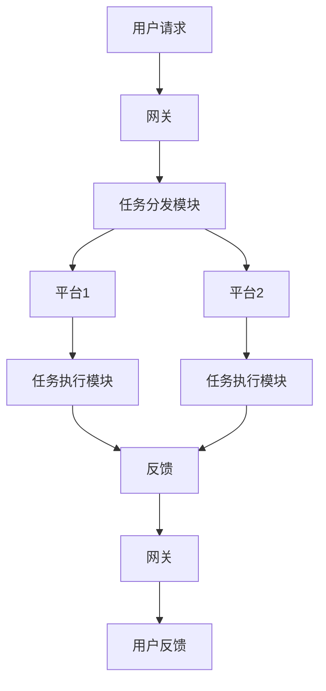
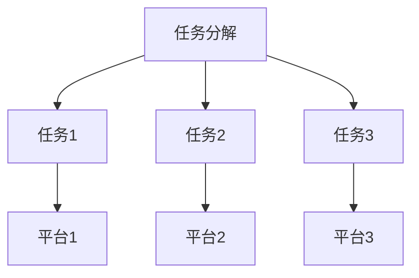
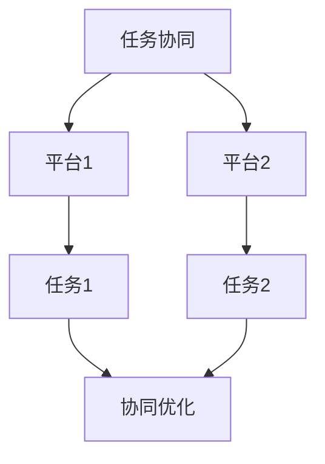
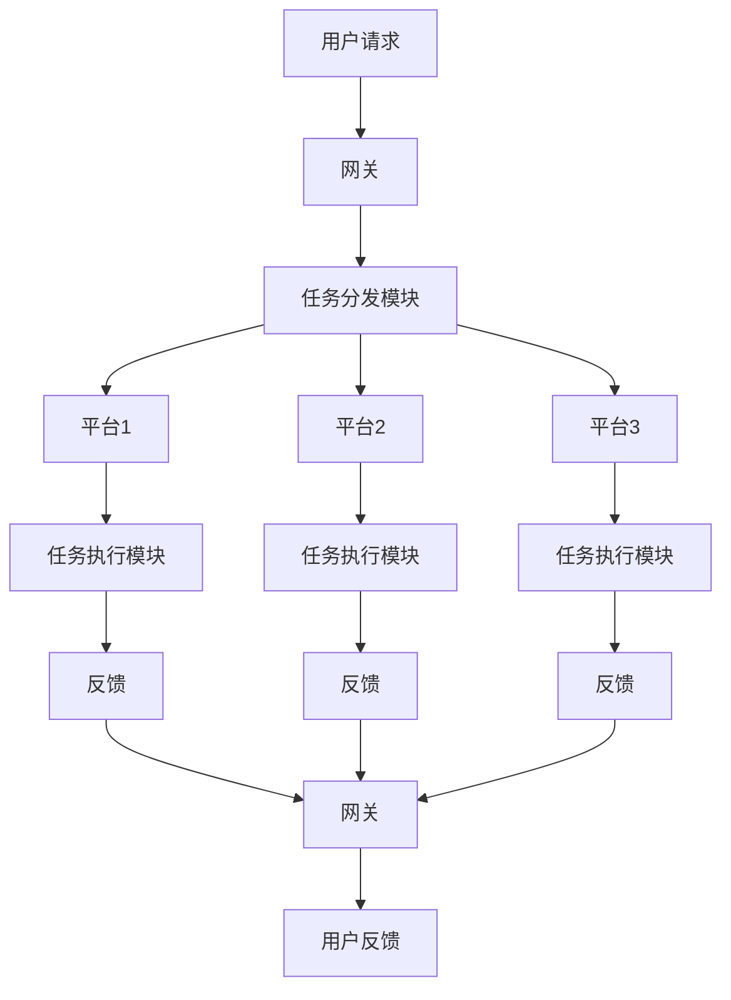

                 


# 《构建跨平台AI Agent的技术挑战》

---

## 关键词  
跨平台、AI Agent、技术挑战、系统架构、算法原理、项目实战

---

## 摘要  
随着人工智能技术的快速发展，跨平台AI Agent的应用场景越来越广泛。本文从技术挑战的角度出发，系统性地分析了构建跨平台AI Agent的核心问题，并提出了解决方案。通过详细讲解算法原理、系统架构设计和项目实战，本文为读者提供了从理论到实践的全面指导。

---

## 第一部分: 跨平台AI Agent的背景与核心概念

### 第1章: 跨平台AI Agent的背景与问题背景

#### 1.1 跨平台AI Agent的定义与特点

##### 1.1.1 跨平台AI Agent的定义  
跨平台AI Agent（Cross-Platform AI Agent）是指能够在多个不同平台（如移动设备、PC、物联网设备等）上运行，并能够协同工作以完成特定任务的智能代理系统。

##### 1.1.2 跨平台AI Agent的核心特点  
跨平台AI Agent具有以下核心特点：  
- **跨平台性**：能够在多种平台上运行，支持不同操作系统的兼容性。  
- **任务协同性**：能够协调多个平台上的任务，实现无缝协同。  
- **智能化**：具备自主学习和决策能力，能够根据环境变化调整行为。  
- **实时性**：能够快速响应用户请求，并在多个平台之间进行实时通信。  

##### 1.1.3 跨平台AI Agent与传统AI Agent的区别  
跨平台AI Agent与传统AI Agent的主要区别在于其跨平台能力。传统AI Agent通常局限于单一平台，而跨平台AI Agent能够跨越多个平台，实现更复杂和多样化的功能。

---

#### 1.2 跨平台AI Agent的背景与问题背景

##### 1.2.1 跨平台AI Agent的背景介绍  
随着智能设备的普及和物联网技术的发展，用户对跨平台AI Agent的需求日益增加。例如，用户希望智能助手能够在手机、平板和电脑之间无缝协同工作，完成任务分配、信息同步等操作。

##### 1.2.2 跨平台AI Agent的核心问题  
跨平台AI Agent的构建面临以下核心问题：  
1. **平台兼容性问题**：不同平台之间的API接口和通信协议差异较大，如何实现跨平台兼容性是一个技术挑战。  
2. **任务协同问题**：如何在多个平台之间协调任务，确保任务的高效执行。  
3. **性能优化问题**：跨平台通信和任务调度可能会引入额外的延迟，如何优化系统性能是一个关键问题。  

##### 1.2.3 跨平台AI Agent的边界与外延  
跨平台AI Agent的边界在于其跨平台能力，外延则包括其在各个平台上的具体实现和应用。例如，一个跨平台AI Agent可能需要同时支持Android、iOS、Windows和Linux等多种操作系统。

##### 1.2.4 跨平台AI Agent的概念结构与核心要素组成  
跨平台AI Agent的概念结构包括以下几个核心要素：  
1. **跨平台通信机制**：实现不同平台之间的信息传递和交互。  
2. **任务分解与协同算法**：将任务分解为多个子任务，并在不同平台之间进行协同。  
3. **多平台兼容性设计**：确保系统在不同平台上都能正常运行。  
4. **性能优化策略**：优化跨平台通信和任务调度的效率。  

---

### 第2章: 跨平台AI Agent的核心概念与联系

#### 2.1 跨平台AI Agent的核心概念  
跨平台AI Agent的核心概念包括以下几点：  
- **跨平台通信**：通过API或消息队列实现不同平台之间的通信。  
- **任务分解**：将复杂任务分解为多个子任务，并分配到不同平台执行。  
- **协同优化**：通过算法优化任务协同过程，确保系统高效运行。  

#### 2.2 跨平台AI Agent的核心概念对比  
以下是不同平台的特点对比：

| 平台类型 | 特点 | 优势 | 劣势 |
|----------|------|------|------|
| 移动平台 | 轻量级、移动性高 | 适合实时任务处理 | 资源有限，计算能力较弱 |
| PC平台 | 资源丰富、计算能力强 | 适合复杂任务处理 | 移动性差 |
| 物联网设备 | 数据采集能力强 | 适合环境感知任务 | 计算能力有限 |

#### 2.3 跨平台AI Agent的通信机制  
跨平台AI Agent的通信机制可以通过以下两种方式实现：  
1. **API调用**：通过标准API接口实现不同平台之间的通信。  
2. **消息队列**：通过消息队列（如Kafka、RabbitMQ）实现异步通信。  

以下是跨平台AI Agent通信机制的Mermaid流程图：



---

## 第二部分: 跨平台AI Agent的算法原理

### 第3章: 跨平台AI Agent的核心算法原理

#### 3.1 跨平台AI Agent的任务分解算法  
任务分解算法的目标是将复杂任务分解为多个子任务，并分配到不同的平台执行。以下是任务分解算法的Mermaid流程图：



以下是任务分解算法的Python代码示例：

```python
def decompose_task(main_task):
    sub_tasks = []
    # 分解任务
    for task in main_task:
        sub_tasks.append(task)
    return sub_tasks

# 示例用法
main_task = ["数据采集", "数据分析", "数据可视化"]
sub_tasks = decompose_task(main_task)
print(sub_tasks)
```

---

#### 3.2 跨平台AI Agent的任务协同优化算法  
任务协同优化算法的目标是通过优化任务协同过程，提高系统的整体性能。以下是任务协同优化算法的Mermaid流程图：



以下是任务协同优化算法的Python代码示例：

```python
import heapq

def dijkstra(start, end):
    graph = {
        'start': {'platform1': 1, 'platform2': 2},
        'platform1': {'end': 3},
        'platform2': {'end': 4}
    }
    # 使用Dijkstra算法计算最短路径
    distances = {node: float('infinity') for node in graph}
    distances['start'] = 0
    visited = set()
    
    while visited != graph.keys():
        current_node = min(distances, key=lambda k: distances[k])
        visited.add(current_node)
        for neighbor in graph[current_node]:
            new_distance = distances[current_node] + graph[current_node][neighbor]
            if new_distance < distances[neighbor]:
                distances[neighbor] = new_distance
    return distances[end]

# 示例用法
start = 'start'
end = 'end'
print(dijkstra(start, end))
```

---

## 第三部分: 跨平台AI Agent的系统分析与架构设计

### 第4章: 跨平台AI Agent的系统分析

#### 4.1 跨平台AI Agent的系统分析  
跨平台AI Agent的系统分析包括以下内容：  
1. **问题场景分析**：分析跨平台AI Agent的应用场景和用户需求。  
2. **系统功能设计**：设计系统的功能模块，包括用户请求分发、任务处理、反馈返回等。  
3. **系统架构设计**：设计系统的架构，包括前端、后端和中间件等部分。  

---

### 第5章: 跨平台AI Agent的系统架构设计

#### 5.1 跨平台AI Agent的系统架构设计  
以下是跨平台AI Agent的系统架构设计的Mermaid图：



#### 5.2 跨平台AI Agent的系统功能设计  
跨平台AI Agent的系统功能设计包括以下模块：  
1. **用户请求分发模块**：接收用户请求并分发到相应的平台。  
2. **任务执行模块**：在目标平台上执行任务。  
3. **反馈模块**：将任务执行结果反馈给用户。  

---

## 第四部分: 跨平台AI Agent的项目实战

### 第6章: 跨平台AI Agent的项目实战

#### 6.1 跨平台AI Agent的环境安装  
以下是环境安装步骤：  
1. 安装Python和必要的库（如requests、pymqtt）。  
2. 安装跨平台开发工具（如React Native、Flutter）。  

#### 6.2 跨平台AI Agent的核心实现  
以下是核心实现代码示例：

```python
import requests
import paho.mqtt.client as mqtt

# 示例代码：跨平台AI Agent的核心实现
def on_connect(client, userdata, flags, rc):
    print("连接到MQTT Broker，返回码：", rc)

def on_message(client, userdata, message):
    print("收到消息：", message.payload.decode())

client = mqtt.Client()
client.on_connect = on_connect
client.on_message = on_message

client.connect("mqtt.eclipse.org", 1883, 60)
client.loop_start()

# 发布消息
client.publish("test/topic", "Hello, 这是跨平台AI Agent的消息！", 0, False)
```

#### 6.3 跨平台AI Agent的功能测试  
以下是功能测试步骤：  
1. 测试跨平台通信功能。  
2. 测试任务分解与协同功能。  
3. 测试系统性能优化功能。  

---

## 第五部分: 跨平台AI Agent的最佳实践

### 第7章: 跨平台AI Agent的最佳实践

#### 7.1 跨平台AI Agent的最佳实践  
以下是最佳实践总结：  
1. **选择合适的开发平台**：根据需求选择适合的开发平台和工具。  
2. **注重性能优化**：在跨平台通信和任务调度中，优化系统性能。  
3. **测试与调试**：进行全面的测试和调试，确保系统稳定运行。  

---

## 结语  
构建跨平台AI Agent是一项具有挑战性的任务，需要综合考虑技术实现、系统架构和项目管理等多个方面。通过本文的系统性分析和实践，读者可以更好地理解和掌握跨平台AI Agent的构建方法。

---

# END

