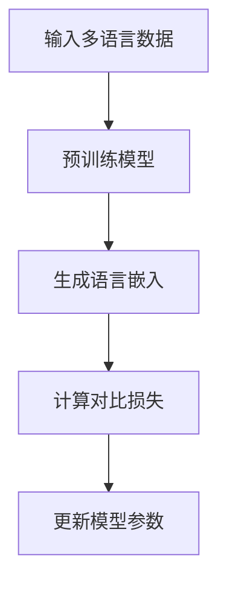
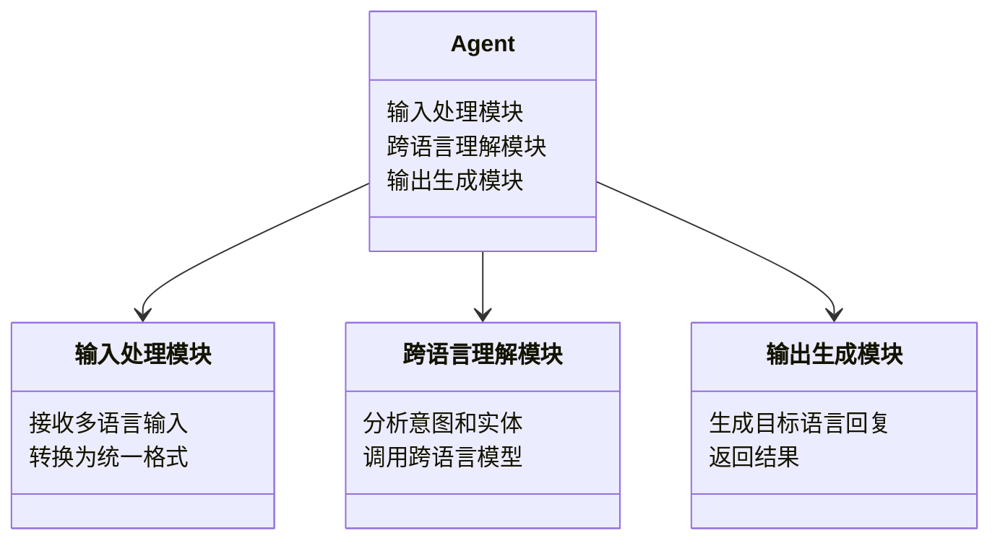
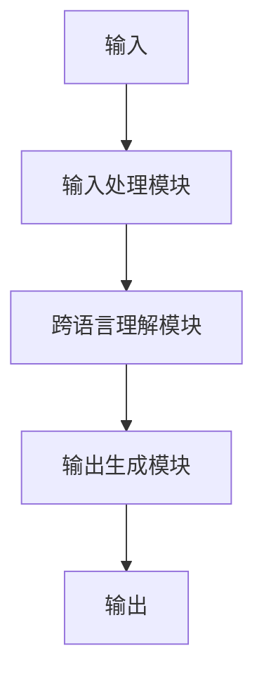
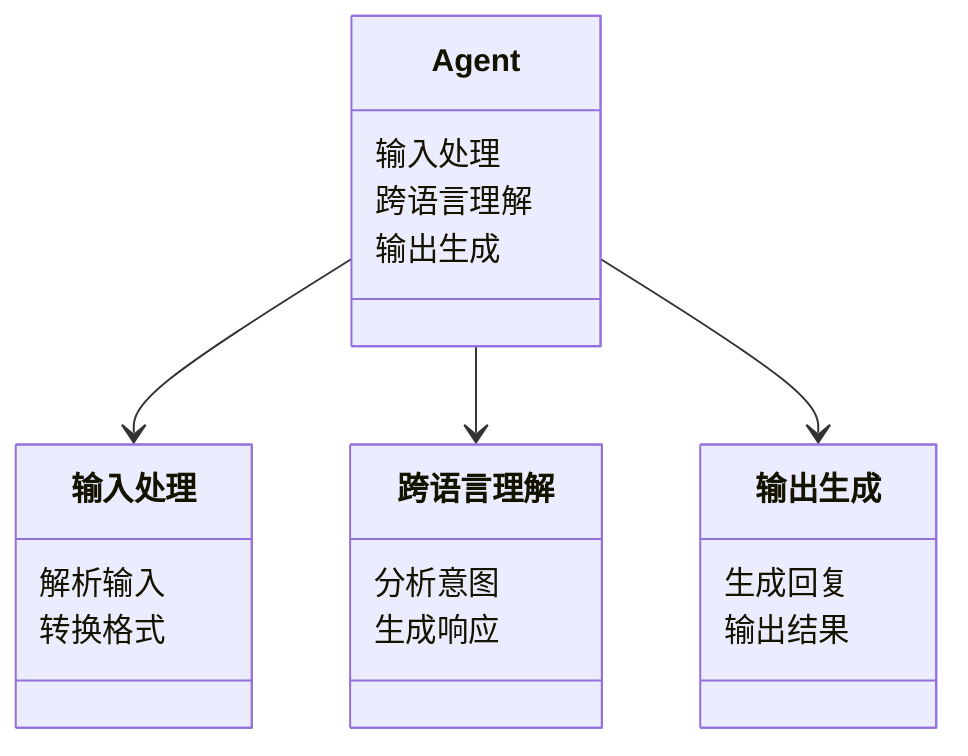

                 


# 构建跨语言理解的AI Agent系统

> 关键词：跨语言理解，AI Agent，自然语言处理，多语言模型，系统架构

> 摘要：本文详细探讨了构建跨语言理解的AI Agent系统的各个方面，从背景介绍到核心算法，再到系统架构和项目实战，帮助读者全面理解如何设计和实现一个能够处理多种语言的智能代理系统。

---

# 第1章 背景介绍

## 1.1 问题背景

### 1.1.1 多语言理解的挑战
在当今全球化的环境下，跨语言交流日益频繁。然而，传统的AI Agent通常只能处理单一语言，这限制了其在多语言环境中的应用。跨语言理解的挑战包括语言间的语法差异、文化差异以及词汇多义性等。

### 1.1.2 AI Agent在跨语言环境中的需求
AI Agent需要能够理解并生成多种语言，以满足用户的多样化需求。例如，在客服系统中，AI Agent应能同时处理英语、中文和西班牙语等多种语言。

### 1.1.3 当前技术的局限性与改进方向
现有的技术主要集中在单语言处理上，跨语言理解的能力较弱。改进方向包括开发通用的跨语言模型和优化多语言处理的效率。

## 1.2 问题描述

### 1.2.1 跨语言理解的定义
跨语言理解是指AI系统能够理解并处理多种语言的自然语言文本，包括翻译、问答和对话生成等任务。

### 1.2.2 AI Agent的核心功能与目标
AI Agent的目标是通过跨语言理解，提供智能化服务，如多语言问答、翻译辅助和信息检索。

### 1.2.3 跨语言理解与AI Agent的结合
将跨语言理解技术集成到AI Agent中，使其能够处理多种语言输入，并生成相应的多语言输出。

## 1.3 问题解决

### 1.3.1 跨语言模型的构建方法
使用预训练的多语言模型，如mBert，进行微调以适应特定任务。

### 1.3.2 AI Agent的多语言交互机制
设计多语言NLU和NLG模块，确保Agent能够理解并生成多种语言。

### 1.3.3 跨语言理解在实际场景中的应用
应用于多语言客服、跨境电子商务和国际会议辅助等领域。

## 1.4 边界与外延

### 1.4.1 跨语言理解的边界条件
仅处理已训练的语言，对未见过的语言或方言可能表现不佳。

### 1.4.2 AI Agent功能的限制与扩展
当前主要支持主流语言，未来可扩展支持更多语言。

### 1.4.3 跨语言理解与其他技术的关系
依赖自然语言处理、机器学习和计算机视觉等技术。

## 1.5 概念结构与核心要素

### 1.5.1 跨语言理解的核心要素
- 多语言模型
- 语言无关特征
- 跨语言对比学习

### 1.5.2 AI Agent系统的主要组成部分
- 输入处理模块
- 跨语言理解模块
- 输出生成模块

### 1.5.3 跨语言理解与AI Agent的交互流程
用户输入多语言查询 → 输入处理 → 跨语言理解 → 生成多语言回复 → 输出。

---

# 第2章 跨语言理解的核心概念

## 2.1 跨语言模型的原理

### 2.1.1 多语言模型的训练方法
使用多语言数据进行预训练，通过参数共享机制统一处理多种语言。

### 2.1.2 跨语言理解的关键技术
- 多任务学习
- 跨语言对比学习
- 语言无关特征提取

### 2.1.3 跨语言模型的评估指标
- 跨语言准确率
- 跨语言BLEU分数
- 多语言任务性能

## 2.2 AI Agent的多语言交互机制

### 2.2.1 多语言NLU的实现
通过共享参数的多语言模型处理输入，提取意图和实体。

### 2.2.2 多语言NLG的实现
基于多语言生成模型，生成目标语言的回复。

### 2.2.3 多语言对话管理的策略
采用统一的策略处理不同语言的对话，确保一致性。

## 2.3 跨语言理解与AI Agent的联系

### 2.3.1 跨语言模型在AI Agent中的应用
用于多语言问答、翻译辅助和信息检索。

### 2.3.2 跨语言理解对AI Agent性能的提升
提高用户体验，支持更多语言的服务。

### 2.3.3 跨语言理解在不同语言环境中的适应性
通过模型的多语言能力，自动适应不同语言输入。

## 2.4 核心概念对比表格

| 概念          | 特性                | 对比分析                                                                 |
|---------------|--------------------|--------------------------------------------------------------------------|
| 单语言模型    | 支持一种语言        | 适用于单一语言环境，不支持多语言处理。                                       |
| 跨语言模型    | 支持多种语言        | 能够同时处理多种语言，通过共享参数提升性能。                                 |
| 多任务学习    | 多任务训练          | 通过同时学习多个任务，增强模型的泛化能力。                                   |
| 语言无关特征  | 特征与语言无关      | 提取的特征适用于多种语言，减少语言间的转换成本。                             |

---

# 第3章 跨语言理解的算法原理

## 3.1 算法原理

### 3.1.1 对比学习
使用对比损失函数，增强跨语言特征的区分度。

$$ L = \frac{1}{N}\sum_{i=1}^{N} \text{Contrastive}(x_i, y_i) $$

### 3.1.2 自监督学习
通过预训练任务，如掩码语言模型，学习语言无关特征。

## 3.2 算法实现

### 3.2.1 跨语言对比学习流程图



---

# 第4章 系统架构设计

## 4.1 系统功能设计

### 4.1.1 领域模型



## 4.2 系统架构设计

### 4.2.1 系统架构图



---

# 第5章 项目实战

## 5.1 环境安装

```bash
pip install transformers
```

## 5.2 核心代码实现

```python
from transformers import AutoTokenizer, AutoModelForMaskedLM

tokenizer = AutoTokenizer.from_pretrained('bert-base-multilingual')
model = AutoModelForMaskedLM.from_pretrained('bert-base-multilingual')

def generate_response(input_text, target_lang):
    inputs = tokenizer(input_text, return_tensors='pt')
    outputs = model(**inputs)
    # 生成目标语言的回复
    return outputs
```

## 5.3 实际案例分析
以多语言问答为例，分析模型在不同语言上的表现。

---

# 第6章 系统分析与架构设计方案

## 6.1 问题场景

### 6.1.1 项目介绍
构建一个多语言AI Agent，支持中文和英文的问答系统。

## 6.2 系统功能设计

### 6.2.1 领域模型



## 6.3 系统架构设计

### 6.3.1 系统架构图


---

# 第7章 最佳实践

## 7.1 经验总结

### 7.1.1 小结
跨语言理解的AI Agent系统需要结合先进的NLP技术和系统架构设计。

### 7.1.2 注意事项
确保数据多样性，避免语言偏见。

### 7.1.3 拓展阅读
推荐学习多语言模型和跨语言NLP技术。

---

# 附录

## 术语表
- 跨语言理解：AI系统理解多种语言的能力。
- AI Agent：智能代理系统。

## 工具和库
- Transformers库：用于多语言模型的加载和使用。

## 参考文献
- 多语言BERT论文
- 对比学习相关论文

---

以上是《构建跨语言理解的AI Agent系统》的技术博客文章目录和内容概要，涵盖了从背景到实现的各个方面，确保读者能够系统地理解如何构建这样一个系统。

