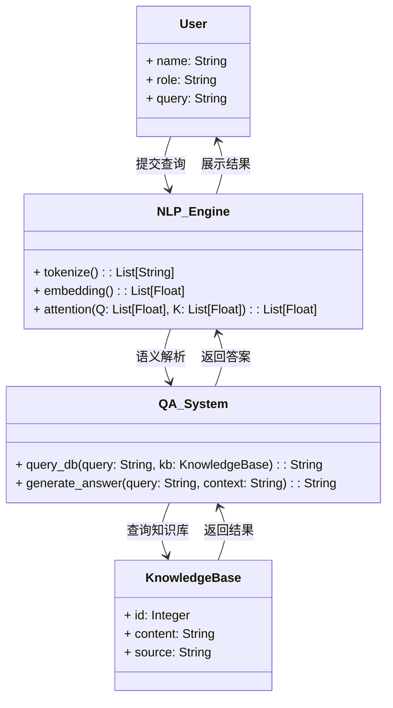

                 


# 构建高效准确的金融知识自动问答系统

> 关键词：金融知识问答系统，自然语言处理，深度学习，知识库，问答系统

> 摘要：本文系统地探讨了构建高效准确的金融知识自动问答系统的全过程。从背景需求分析到系统架构设计，从算法原理到项目实战，全面解析了该系统的核心技术和实现细节。文章通过丰富的案例分析和具体的代码实现，深入浅出地展示了如何利用自然语言处理和深度学习技术，结合金融领域的知识库，构建一个高效准确的问答系统。通过本文的分析，读者可以全面了解该系统的设计思路和实现方法，为后续的金融智能应用开发提供参考。

---

## 第一部分: 金融知识自动问答系统概述

## 第2章: 金融知识问答系统的背景与需求

### 2.1 问题背景

#### 2.1.1 金融领域的知识问答需求

金融领域的复杂性和专业性决定了其对问答系统的需求尤为强烈。金融机构、投资者以及普通用户在日常业务中常常需要快速获取准确的金融知识和信息。传统的依赖人工的知识问答方式效率低下，且容易出错，难以满足现代金融业务的需求。因此，构建一个高效准确的金融知识自动问答系统具有重要的现实意义。

#### 2.1.2 传统问答系统与自动问答系统的区别

传统的问答系统通常依赖于规则引擎或简单的关键词匹配，难以应对复杂的金融场景。而自动问答系统基于自然语言处理和深度学习技术，能够理解上下文，推理问题，并提供准确的答案。这种区别使得自动问答系统在金融领域的应用更加广泛和实用。

#### 2.1.3 金融知识问答系统的独特性与挑战

金融知识问答系统具有以下独特性：
- **领域专业性**：金融领域的术语和知识体系具有高度的专业性，需要系统具备深度的金融知识储备。
- **数据多样性**：金融数据包括股票、基金、债券等多种类型，且数据更新频繁，系统需要具备快速适应变化的能力。
- **准确性要求高**：金融决策对准确性要求极高，系统需要确保答案的精准性，避免因错误信息导致的损失。

### 2.2 问题描述

#### 2.2.1 金融知识问答的核心问题

金融知识问答的核心问题可以归结为：如何通过自然语言处理技术，准确理解用户的问题意图，并基于金融知识库提供最优答案。这一过程需要结合语义理解、知识表示和推理能力，确保系统能够应对复杂多样的用户查询。

#### 2.2.2 金融知识问答系统的功能需求

金融知识问答系统需要具备以下核心功能：
- **用户查询解析**：能够准确解析用户的自然语言查询，识别其意图和关键词。
- **知识库检索**：基于解析的结果，在金融知识库中快速检索相关知识。
- **答案生成**：根据检索结果，生成符合用户需求的准确答案，并以自然语言形式呈现。
- **结果优化**：根据用户反馈，不断优化答案的质量和相关性。

#### 2.2.3 用户需求与系统目标的匹配

用户需求多样，包括普通投资者的简单查询、专业机构的复杂问题解答等。系统的目标是通过高效准确的回答满足不同用户的需求，提升用户体验和满意度。

---

## 第3章: 核心概念与系统架构

### 3.1 核心概念原理

#### 3.1.1 金融知识问答系统的核心要素

金融知识问答系统的核心要素包括：
- **用户查询**：用户输入的自然语言查询。
- **知识库**：存储金融领域的结构化知识和非结构化数据。
- **自然语言处理引擎**：负责理解和解析用户查询。
- **问答系统**：基于解析结果，从知识库中检索并生成答案。

#### 3.1.2 系统的关键属性与特征对比

| 属性 | 描述 |
|------|------|
| 输入方式 | 自然语言输入 |
| 知识库 | 金融领域的结构化和非结构化数据 |
| 处理能力 | 支持复杂语义理解和知识推理 |
| 输出形式 | 自然语言答案，支持多种格式 |

#### 3.1.3 ER实体关系图架构

```mermaid
er
actor: 用户
actor --> knowledge_base: 查询知识库
actor --> nlp_engine: 自然语言处理引擎
actor --> qa_system: 问答系统
knowledge_base --> qa_system: 提供知识支持
nlp_engine --> qa_system: 提供语义解析支持
```

### 3.2 系统架构设计

#### 3.2.1 系统功能模块设计

系统主要功能模块包括：
- **用户交互模块**：负责接收用户输入和展示结果。
- **自然语言处理模块**：负责解析用户查询。
- **知识库模块**：存储和管理金融知识库。
- **问答模块**：基于解析结果检索知识库并生成答案。

#### 3.2.2 系统架构图

```mermaid
graph TD
    User --> NLP_Engine: 提交查询
    NLP_Engine --> QA_System: 语义解析
    QA_System --> Knowledge_Base: 查询知识库
    Knowledge_Base --> QA_System: 返回结果
    QA_System --> NLP_Engine: 返回答案
    NLP_Engine --> User: 展示结果
```

#### 3.2.3 接口设计与交互流程

系统接口设计包括：
- **用户接口**：提供查询输入和结果展示界面。
- **API接口**：供其他系统调用问答功能。

交互流程如下：
1. 用户提交查询请求。
2. 自然语言处理引擎解析查询意图。
3. 问答系统基于解析结果从知识库中检索相关信息。
4. 系统生成并返回答案。

---

## 第4章: 算法原理与数学模型

### 4.1 算法原理

#### 4.1.1 基于深度学习的问答模型

问答模型通常采用Transformer架构，通过自注意力机制捕捉上下文信息，实现对用户查询的语义理解。

#### 4.1.2 Transformer架构在问答系统中的应用

```mermaid
graph TD
    Input --> Tokenizer: 分词
    Tokenizer --> Embedding_Layer: 词嵌入
    Embedding_Layer --> Multihead_Attention: 多头注意力
    Multihead_Attention --> Feedforward_Network: 前馈网络
    Feedforward_Network --> Output: 输出结果
```

#### 4.1.3 预训练语言模型的微调策略

在金融领域，通常采用预训练语言模型（如BERT）进行微调，以适应金融知识问答的特定需求。

### 4.2 数学模型与公式

#### 4.2.1 Transformer模型的注意力机制

注意力机制公式：

$$
\text{Attention}(Q, K, V) = \text{softmax}\left(\frac{QK^T}{\sqrt{d_k}}\right)V
$$

其中：
- $Q$：查询向量
- $K$：键向量
- $V$：值向量
- $d_k$：键的维度

#### 4.2.2 模型训练的损失函数

交叉熵损失函数公式：

$$
\text{Loss} = -\sum_{i=1}^{n} \text{log}(P(y_i|X_i))
$$

---

## 第5章: 系统分析与架构设计

### 5.1 系统分析

#### 5.1.1 问题场景介绍

金融知识问答系统需要处理多种场景，例如股票查询、基金分析等。每个场景都有其特定的知识需求和语义理解要求。

#### 5.1.2 项目介绍与目标

项目目标是构建一个高效准确的金融知识问答系统，满足用户多样化的查询需求。

### 5.2 系统功能设计

#### 5.2.1 领域模型设计



#### 5.2.2 系统架构图

```mermaid
graph TD
    User --> NLP_Engine: 提交查询
    NLP_Engine --> QA_System: 语义解析
    QA_System --> Knowledge_Base: 查询知识库
    Knowledge_Base --> QA_System: 返回结果
    QA_System --> NLP_Engine: 返回答案
    NLP_Engine --> User: 展示结果
```

---

## 第6章: 项目实战

### 6.1 环境安装

项目实战部分需要安装以下环境：
- Python 3.8+
- PyTorch或TensorFlow
- NLTK或spaCy
- Jupyter Notebook

### 6.2 核心代码实现

以下是问答系统的核心代码示例：

```python
import torch
import torch.nn as nn
import torch.optim as optim

class Transformer(nn.Module):
    def __init__(self, embed_dim, num_heads):
        super(Transformer, self).__init__()
        self.embed_dim = embed_dim
        self.num_heads = num_heads
        self.heads = nn.ModuleList([
            nn.Linear(embed_dim, embed_dim, bias=False) for _ in range(num_heads)
        ])
    
    def forward(self, x):
        # x: (batch_size, seq_len, embed_dim)
        queries = [head(x) for head in self.heads]
        keys = [head(x) for head in self.heads]
        values = [head(x) for head in self.heads]
        
        # 计算注意力权重
        attn_weights = []
        for q, k in zip(queries, keys):
            attn_weights.append(torch.softmax((q @ k.transpose(-2, -1)) / self.embed_dim**0.5, dim=-1))
        
        # 加权求和
        outputs = []
        for q, k, v, attn in zip(queries, keys, values, attn_weights):
            outputs.append(q @ (attn @ v))
        
        return torch.cat(outputs, dim=-1)
    
# 初始化模型
embed_dim = 512
num_heads = 8
model = Transformer(embed_dim, num_heads)
optimizer = optim.Adam(model.parameters(), lr=0.001)
criterion = nn.CrossEntropyLoss()

# 训练过程
def train_step(model, optimizer, criterion, inputs, labels):
    optimizer.zero_grad()
    outputs = model(inputs)
    loss = criterion(outputs, labels)
    loss.backward()
    optimizer.step()
    return loss.item()
```

### 6.3 案例分析与详细解读

案例：用户查询“如何投资股票市场？”

1. 用户提交查询：“如何投资股票市场？”
2. NLP引擎解析查询，生成关键词“投资”、“股票市场”。
3. 问答系统基于关键词在知识库中检索相关知识。
4. 系统生成答案：“投资股票市场需要考虑以下几点：选择优质企业、分散投资、长期持有。”

### 6.4 小结

项目实战部分通过具体实现和案例分析，展示了如何将理论应用于实际。代码实现部分详细解读了模型的训练和优化过程，案例分析部分则具体展示了系统的运行流程和效果。

---

## 第7章: 最佳实践与总结

### 7.1 小结

本文详细探讨了构建高效准确的金融知识问答系统的全过程，包括背景分析、核心概念、算法原理、系统架构设计和项目实战。通过理论与实践的结合，展示了如何利用自然语言处理和深度学习技术，构建一个高效的金融问答系统。

### 7.2 注意事项

- 数据质量是系统准确性的关键，需要确保知识库的完整性和准确性。
- 系统的可扩展性设计，以应对金融领域的快速变化。
- 用户反馈的及时处理，以不断优化系统性能。

### 7.3 拓展阅读

- 《深度学习入门：基于Python和Keras的实践》
- 《自然语言处理实战：基于Python的中文分词与信息提取》
- 《金融数据分析与建模：从入门到精通》

---

通过本文的系统分析和详细解读，读者可以全面了解如何构建高效准确的金融知识问答系统。希望本文对相关领域的研究和实践提供有价值的参考和指导。

