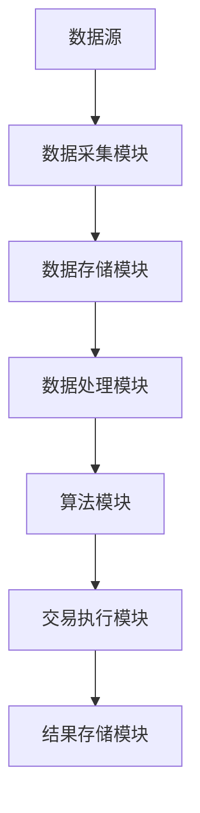

                 


# 契约型封闭基金套利的数学建模与算法实现

> 关键词：契约型封闭基金，套利，金融建模，算法优化，风险管理

> 摘要：本文详细探讨了查尔斯·布兰德的契约型封闭基金套利理论，从数学建模的角度分析其原理，并通过Python实现套利算法，结合实际案例进行分析，提出风险管理策略，为读者提供系统化的知识框架。

---

## 第一部分: 契约型封闭基金套利的背景与基础

### 第1章: 契约型封闭基金套利概述

#### 1.1 契约型封闭基金的基本概念

- **1.1.1 什么是契约型封闭基金**
  - 契约型封闭基金是一种通过信托契约设立的基金，投资者作为受益人，管理人负责运作资金。
  - 与公司型基金相比，契约型基金的法律结构更灵活，运作效率更高。

- **1.1.2 契约型基金与公司型基金的区别**
  - 法律结构：契约型基金基于信托契约，公司型基金通过股份公司形式。
  - 税务处理：契约型基金通常享受更优惠的税收政策。

- **1.1.3 封闭基金的特点**
  - 封闭基金的份额在存续期内固定，不开放申购赎回。
  - 通过二级市场交易，基金份额价格受市场供需影响。

#### 1.2 套利的基本原理

- **1.2.1 套利的定义**
  - 套利是指在不同市场或资产之间利用价格差异，以无风险或低风险的方式获取利润。
  - 套利基于市场的不完全有效假设，利用短期价格波动。

- **1.2.2 套利的基本类型**
  - 跨市场套利：利用不同市场间的价格差异。
  - 跨期套利：利用同一资产在不同时间段的价格差异。
  - 股权套利：利用同一公司不同股票（如A股和H股）的价格差异。

- **1.2.3 套利在金融市场的角色**
  - 提高市场效率，减少价格差异。
  - 增加市场流动性，促进价格发现。

### 第2章: 契约型封闭基金套利的背景与现状

#### 2.1 金融市场的套利机会

- **2.1.1 金融市场中的套利机会**
  - 利率差异套利：通过不同期限或市场的利率差异进行套利。
  - 汇率差异套利：利用不同货币间的汇率差异。
  - 股票套利：利用同一股票在不同市场的价格差异。

- **2.1.2 不同市场环境下的套利策略**
  - 升息周期：倾向于短期限套利。
  - 降息周期：倾向于长期限套利。

#### 2.2 契约型封闭基金套利的发展历程

- **2.2.1 套利的历史演变**
  - 早期套利：19世纪末，利用不同市场的价格差异。
  - 现代套利：量化交易技术的应用，算法套利的兴起。

- **2.2.2 套利策略的演变**
  - 从简单的跨市场套利到复杂的算法套利。
  - 利用大数据、高频交易技术提升套利效率。

#### 2.3 当前契约型封闭基金套利的现状

- **2.3.1 市场环境分析**
  - 全球化背景下的市场联动，套利机会减少。
  - 量化交易技术的应用，套利机会迅速被捕捉。

- **2.3.2 套利策略的多样性**
  - 利用算法交易技术，捕捉短期价格波动。
  - 结合期权、期货等衍生品，构造无风险套利组合。

---

## 第二部分: 契约型封闭基金套利的核心概念与原理

### 第3章: 套利的核心要素

#### 3.1 套利的三要素

- **价格差异**：不同市场、资产或时间的价格差异是套利的基础。
- **无风险或低风险**：套利追求在较低风险下的收益。
- **可操作性**：套利机会需具有可操作性，能够在短时间内完成交易。

#### 3.2 套利的数学模型

- **无套利定价理论**
  - 在无套利情况下，资产的合理价格应等于其未来现金流的现值。
  - 数学表达式：$$P = \sum_{t=1}^{n} \frac{CF_t}{(1 + r)^t}$$
  - 其中，$P$ 是当前价格，$CF_t$ 是第 $t$ 期的现金流，$r$ 是无风险利率。

### 第4章: 套利策略与契约型封闭基金的结合

#### 4.1 套利策略的分类

- **跨市场套利**：利用不同市场间的价格差异，例如A股和H股之间的价差。
- **跨期套利**：利用同一资产在不同时间点的价格差异，例如期货与现货的价差。
- **股权套利**：利用同一公司不同股票的价格差异，例如A股和红筹股的价差。

#### 4.2 套利策略的数学模型

- **价差套利模型**
  - 股票A在市场1的价格为$P1$，在市场2的价格为$P2$。
  - 套利机会存在于$P1$和$P2$之间的差异。
  - 数学表达式：$$\text{价差} = P1 - P2$$
  - 当价差超过交易成本时，存在套利机会。

#### 4.3 套利风险与风险管理

- **主要风险**：市场风险、流动性风险、信用风险。
- **风险管理措施**：分散投资、设置止损、监控市场变化。

---

## 第三部分: 套利算法与数学模型

### 第5章: 套利算法的实现

#### 5.1 套利机会识别算法

- **算法步骤**
  - 数据获取：收集不同市场或资产的价格数据。
  - 价格差异计算：计算同一资产在不同市场或时间的价格差异。
  - 交易成本比较：判断价格差异是否大于交易成本。

- **Python实现代码**
  ```python
  def calculate_arbitrage_opportunity(prices):
      market1 = prices['market1']
      market2 = prices['market2']
      difference = market1 - market2
      if abs(difference) > transaction_cost:
          return True
      else:
          return False
  ```

#### 5.2 套利策略优化算法

- **算法步骤**
  - 数据预处理：清洗和标准化数据。
  - 模型训练：使用机器学习算法预测价格差异。
  - 策略优化：调整参数以最大化收益并最小化风险。

- **Python实现代码**
  ```python
  from sklearn.linear_model import LinearRegression
  model = LinearRegression()
  model.fit(X, y)
  predictions = model.predict(X_test)
  ```

### 第6章: 套利算法的优化与实现

#### 6.1 算法优化原则

- **效率优化**：减少计算时间，提高处理速度。
- **稳定性优化**：确保算法在不同市场条件下稳定运行。

#### 6.2 套利算法的数学模型

- **时间序列分析模型**
  - 使用ARIMA模型预测未来价格。
  - 数学表达式：$$ARIMA(p, d, q)$$
  - 参数解释：$p$ 是自回归阶数，$d$ 是差分阶数，$q$ 是移动平均阶数。

---

## 第四部分: 系统分析与架构设计

### 第7章: 系统架构设计

#### 7.1 项目介绍

- **项目目标**：构建一个基于契约型封闭基金的套利系统，实现自动化套利机会识别和交易执行。

#### 7.2 系统功能设计

- **模块划分**
  - 数据采集模块：收集不同市场数据。
  - 数据处理模块：清洗和转换数据。
  - 算法模块：识别套利机会并生成交易信号。
  - 执行模块：下单交易并记录结果。

#### 7.3 系统架构图



---

## 第五部分: 项目实战

### 第8章: 项目实战

#### 8.1 环境安装

- **安装Python和必要的库**
  - 安装numpy、pandas、scikit-learn、matplotlib等库。

#### 8.2 核心代码实现

- **数据采集代码**
  ```python
  import pandas as pd
  data = pd.read_csv('market_data.csv')
  ```

- **套利机会识别代码**
  ```python
  def identify_arbitrage_opportunity(data):
      difference = data['market1'] - data['market2']
      if difference > transaction_cost:
          return True
      else:
          return False
  ```

#### 8.3 案例分析

- **案例背景**：假设A股和H股的价格差异超过交易成本。
- **分析过程**：识别套利机会，计算潜在收益。
- **结果展示**：输出套利交易的详细信息和收益情况。

---

## 第六部分: 总结与最佳实践

### 第9章: 总结

- **全文总结**：查尔斯·布兰德的理论为契约型封闭基金套利提供了理论基础，结合算法和系统设计，能够有效识别套利机会。
- **未来展望**：随着技术进步，套利策略将更加智能化和自动化。

### 第10章: 最佳实践与注意事项

- **风险管理**：严格监控市场变化，设置止损点。
- **技术实现**：优化算法，提升计算效率。
- **合规性**：确保交易符合相关法律法规。

### 第11章: 拓展阅读

- 推荐阅读《算法交易：数学模型与实践》和《金融工程中的定量方法》。

---

通过以上步骤，本文系统地介绍了查尔斯·布兰德的契约型封闭基金套利理论，并结合数学建模和算法实现，提供了详细的实战案例和系统设计。读者可以从中掌握套利的核心原理和实际应用方法，为金融投资和风险管理提供参考。

