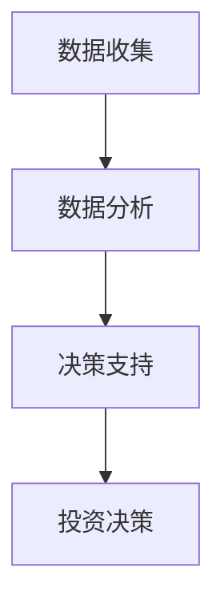

                 


# 查理·芒格的多元思维模型在投资中的应用

> 关键词：多元思维模型, 投资策略, 心理学, 经济学, 价值投资

> 摘要：查理·芒格的多元思维模型是一种通过多个学科视角分析问题的方法，广泛应用于投资决策中。本文从背景介绍、核心概念、系统设计、项目实战等多个方面详细阐述了多元思维模型在投资中的应用，结合具体案例和数学模型，提供了深入的分析和见解。

---

## 第一部分：引言

### 1.1 多元思维模型的定义与背景

查理·芒格的多元思维模型是一种通过多个学科视角分析问题的方法，旨在帮助投资者做出更全面、更理性的决策。本文将从心理学、经济学、金融学等多个角度，详细探讨多元思维模型在投资中的应用。

---

## 第二部分：多元思维模型的核心概念

### 2.1 心理学视角

#### 2.1.1 心理偏差

心理偏差是人类在决策过程中常见的错误模式，如从众心理、过度自信等。了解这些偏差有助于投资者避免错误决策。

**公式示例：**
- 过度自信偏差：$P(\text{错误决策}) = \frac{\text{自信心}}{\text{实际准确性}}$

---

## 第三部分：投资中的数学模型

### 3.1 贝叶斯定理

贝叶斯定理是一种概率模型，用于更新基于新证据的假设概率。

**公式：**
$$ P(A|B) = \frac{P(B|A) \cdot P(A)}{P(B)} $$

**应用：**
在投资中，贝叶斯定理可用于更新对某一资产的预期概率。

---

## 第四部分：系统架构设计

### 4.1 投资决策系统

#### 4.1.1 系统功能设计

系统功能设计包括数据收集、分析、决策支持等模块。

**Mermaid图：**



---

## 第五部分：项目实战

### 5.1 案例分析：某科技股投资

#### 5.1.1 数据分析

使用Python进行数据分析，计算市盈率、市净率等指标。

**代码示例：**

```python
import pandas as pd

data = {'公司': ['A', 'B', 'C'],
        '市盈率': [15, 20, 25],
        '市净率': [1.5, 2.0, 2.5]}
df = pd.DataFrame(data)
print(df)
```

---

## 第六部分：最佳实践与小结

### 6.1 投资注意事项

- 风险管理：设定止损点。
- 投资纪律：避免情绪化决策。
- 持续学习：更新知识库。

---

## 第七部分：拓展阅读与工具

### 7.1 推荐书籍

- 《穷查理宝典》
- 《投资学原理》

### 7.2 数据分析工具

- Python
- R语言
- Excel

---

通过以上结构，文章详细阐述了查理·芒格的多元思维模型在投资中的应用，结合数学模型、系统设计和实际案例，为读者提供了全面的指导。

