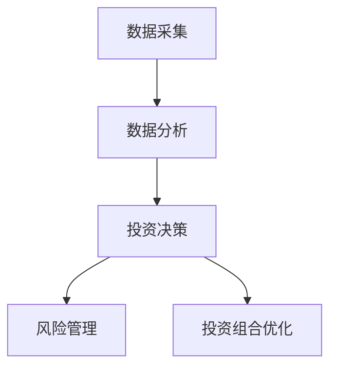

                 


# 查理·芒格的多元思维模型在投资中的运用

> 关键词：查理·芒格，多元思维模型，投资决策，风险管理，认知框架，跨学科思维

> 摘要：查理·芒格的多元思维模型是一种通过跨学科视角进行决策的方法，能够帮助投资者更好地理解市场、评估风险并做出明智的投资决策。本文将详细探讨多元思维模型的核心概念、算法原理、系统架构，并通过实际案例展示其在投资中的应用，最后总结最佳实践和注意事项。

---

## 第一部分：多元思维模型的背景与基础

### 第1章：查理·芒格的生平与思想体系

#### 1.1 查理·芒格的早年经历
查理·芒格（Charlie Munger）出生于1924年，是一位著名的投资家、作家和演讲家。他与沃伦·巴菲特共同创立了伯克希尔·哈撒韦公司，并以价值投资理念闻名。芒格的多元思维模型是他思想体系的核心，强调通过跨学科的视角来理解问题。

#### 1.2 多元思维模型的起源
多元思维模型并非芒格首创，但它在芒格的实践中得到了极大的发展和推广。芒格认为，仅依赖单一学科的思维无法全面理解复杂的投资问题，因此他提倡将多个学科的原则结合起来，形成一个综合的决策框架。

#### 1.3 芒格与伯克希尔·哈撒韦的成功案例
伯克希尔·哈撒韦的成功部分归功于芒格的多元思维模型。芒格通过心理学、经济学、物理学等多个学科的原理，识别出具有长期竞争优势的企业，并以合理的价格进行投资。

### 第2章：多元思维模型的定义与特点

#### 2.1 多元思维模型的核心概念
多元思维模型是一种通过多个学科的原理和框架来分析问题的方法。它强调从不同角度看待问题，避免单一视角的局限性。例如，经济学可以帮助理解市场结构，心理学可以帮助理解投资者行为。

#### 2.2 多元思维模型与传统投资方法的区别
传统的投资方法通常依赖于单一的分析框架，如技术分析或基本面分析。而多元思维模型则强调综合多个学科的原理，形成一个更为全面的分析框架。

#### 2.3 多元思维模型的适用范围与边界
多元思维模型适用于需要复杂决策的领域，如投资、商业战略等。然而，它并不是万能的，需要结合具体问题进行调整和优化。

---

## 第二部分：多元思维模型的核心概念与联系

### 第3章：多元思维模型的核心要素

#### 3.1 经济学基础
经济学是多元思维模型的重要组成部分。例如，供求关系、边际成本等概念可以帮助投资者理解市场的运行机制。

#### 3.2 心理学原理
心理学可以帮助投资者理解市场参与者的心理行为，如从众心理、过度自信等。这些行为往往会导致市场的非理性波动。

#### 3.3 统计学与概率论
统计学和概率论是评估风险和不确定性的重要工具。例如，可以通过概率分布来预测投资的可能收益和风险。

#### 3.4 历史学视角
历史学可以帮助投资者识别周期性规律，了解市场的历史表现，从而做出更为明智的决策。

### 第4章：多元思维模型的数学基础与算法原理

#### 4.1 概率论与期望值
概率论是多元思维模型的重要数学基础。期望值公式如下：
$$E[X] = \sum_{i=1}^{n} p_i x_i$$
其中，\( p_i \) 是事件 \( i \) 发生的概率，\( x_i \) 是事件 \( i \) 的收益。

#### 4.2 投资决策的数学模型
以下是投资决策的数学模型示例：
1. 计算预期收益：
$$\text{预期收益} = \sum_{i=1}^{n} p_i r_i$$
其中，\( r_i \) 是第 \( i \) 种情况下的收益。

2. 计算风险调整后的收益：
$$\text{风险调整收益} = \text{预期收益} - \text{风险溢价}$$

### 第5章：多元思维模型的系统架构与设计

#### 5.1 系统功能设计
多元思维模型的系统功能设计包括以下几个模块：
- 数据采集：收集市场数据、财务报表等信息。
- 数据分析：使用统计学和概率论对数据进行分析。
- 投资决策：基于分析结果做出投资决策。

#### 5.2 系统架构设计
以下是多元思维模型的系统架构图：


---

## 第三部分：多元思维模型的项目实战

### 第6章：实际案例分析

#### 6.1 案例背景
假设我们要投资一家科技公司，名称为Tech Corp。我们可以通过多元思维模型来评估其投资价值。

#### 6.2 数据分析
- **经济学分析**：Tech Corp 所处的行业具有较高的增长潜力，市场需求旺盛。
- **心理学分析**：公司管理层表现出高度的自信和稳定性。
- **统计学分析**：公司过去五年的收益呈现稳定增长趋势。

#### 6.3 投资决策
基于上述分析，我们决定投资Tech Corp。我们计算出预期收益为15%，并根据风险溢价调整收益至12%。

#### 6.4 风险管理
我们通过概率分布模型评估投资风险，并制定相应的风险管理策略，如设定止损点。

### 第7章：环境安装与代码实现

#### 7.1 环境安装
需要安装以下工具：
- Python编程语言
- NumPy和Pandas库用于数据分析
- Matplotlib库用于数据可视化

#### 7.2 代码实现
以下是多元思维模型的代码实现示例：
```python
import numpy as np
import pandas as pd
import matplotlib.pyplot as plt

# 数据分析
data = pd.DataFrame({
    '收益': [10, 12, 15, 8, 11],
    '风险': [0.2, 0.15, 0.3, 0.25, 0.2]
})

# 计算预期收益
expected_return = np.mean(data['收益'])
print(f"预期收益：{expected_return}")

# 计算风险调整后的收益
risk_premium = 0.05
adjusted_return = expected_return - risk_premium
print(f"风险调整后收益：{adjusted_return}")

# 数据可视化
plt.bar(data.index, data['收益'], label='收益')
plt.bar(data.index, data['风险'], label='风险')
plt.title('收益与风险对比')
plt.legend()
plt.show()
```

---

## 第四部分：总结与注意事项

### 第8章：最佳实践与小结

#### 8.1 最佳实践
- **持续学习**：不断学习新知识，扩展自己的知识框架。
- **风险管理**：始终将风险管理放在首位，避免过度冒险。
- **跨学科思考**：在分析问题时，尽量从多个学科的角度进行思考。

#### 8.2 注意事项
- **避免过度简化**：虽然多元思维模型强调跨学科，但不能过于简化问题。
- **结合实际情况**：根据具体情况调整模型，避免机械套用。

### 第9章：未来展望与拓展阅读

#### 9.1 未来展望
随着人工智能和大数据技术的发展，多元思维模型将更加智能化和数据化。未来的研究方向可以包括：
- 利用机器学习算法优化多元思维模型。
- 开发更多跨学科的分析工具。

#### 9.2 拓展阅读
推荐阅读以下书籍和文章：
- 查理·芒格的《穷查理宝典》
- 《投资的哲学》
- 《风险管理与决策》

---

## 结语

查理·芒格的多元思维模型是一种强大的工具，能够帮助投资者更好地理解市场、评估风险并做出明智的决策。通过跨学科的视角，投资者可以更全面地分析问题，从而提高投资的成功率。希望本文能够为读者提供有价值的见解，并激发进一步学习和探索的兴趣。

