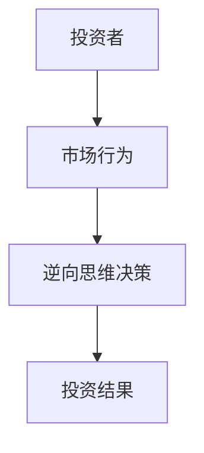
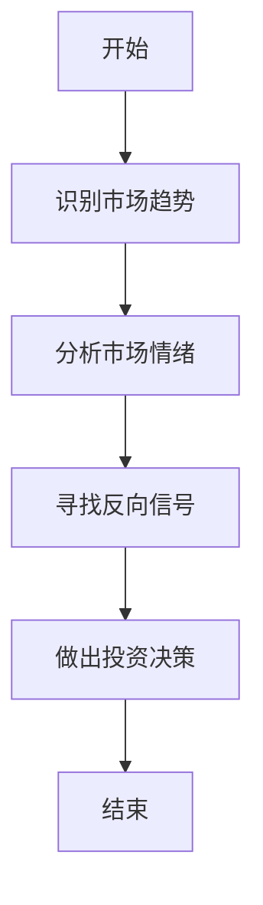
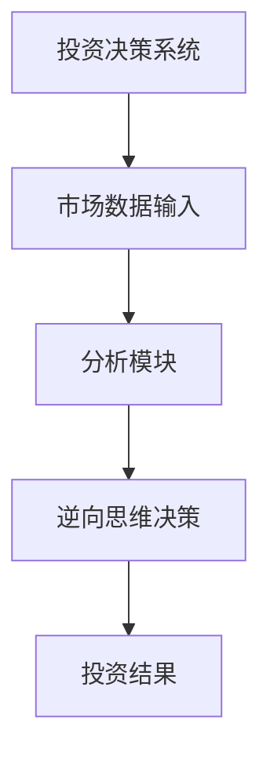

                 

# 查理·芒格的逆向思维在投资中的应用

## 关键词：逆向思维，投资决策，查理·芒格，格栅理论，风险管理

## 摘要：  
查理·芒格的逆向思维是一种独特的投资策略，通过反向思考市场行为和决策，避免传统投资中的误区。本文详细分析了逆向思维的定义、核心概念、算法原理、数学模型、系统架构设计以及实际案例，帮助投资者理解和应用这种思维方式。

---

## 第一部分：查理·芒格的逆向思维概述

### 第1章：逆向思维的定义与背景

#### 1.1 逆向思维的定义  
逆向思维是指从反方向思考问题，寻找市场的非共识观点。与传统从众思维不同，逆向思维强调独立思考，寻找被市场忽视的机会。

#### 1.2 投资中的常见问题与误区  
传统投资容易陷入从众和情绪化决策，导致错误选择。逆向思维帮助投资者避免这些误区，寻找市场低估的机会。

### 第2章：查理·芒格的逆向思维理论

#### 2.1 芒格的思维框架  
芒格的格栅理论将知识分成多个学科，帮助投资者全面分析问题。他的决策过程强调独立性和批判性思考。

#### 2.2 逆向思维的核心原则  
包括避免从众心理、寻找市场非共识观点和风险管理中的逆向思维。成功案例包括巴菲特定价收购。

### 第3章：逆向思维在投资决策中的应用

#### 3.1 应用场景  
包括判断市场顶部和底部、寻找低估机会和风险管理。逆向思维帮助投资者在市场低谷时买入，高点卖出。

#### 3.2 具体策略  
买入被市场抛弃的股票，卖出被热捧的股票，调整投资组合。成功案例包括伯克希尔哈撒韦的投资策略。

---

## 第二部分：核心概念与联系

### 第4章：核心概念原理

#### 4.1 哲学、心理学和经济学基础  
逆向思维基于独立思考的哲学，认知偏差的心理学和市场无效的经济学。

#### 4.2 概念属性对比  
| 概念 | 特征 |
|------|------|
| 逆向思维 | 独立性、批判性、预见性 |
| 传统思维 | 从众性、跟随性、反应性 |

#### 4.3 ER实体关系图  

---

## 第三部分：算法原理讲解

### 第5章：算法流程

#### 5.1 决策流程图  

#### 5.2 数学模型与公式  
预测市场反转概率：$$ P = \frac{N_{reverse}}{N_{total}} \times 100 $$

---

## 第四部分：数学模型与公式

### 第6章：数学模型

#### 6.1 预测市场反转概率  
$$ P = \frac{N_{reverse}}{N_{total}} \times 100 $$

#### 6.2 风险调整后收益  
$$ R = R_{market} - \text{风险调整} $$

---

## 第五部分：系统分析与架构设计

### 第7章：系统设计

#### 7.1 系统架构图  

---

## 第六部分：项目实战

### 第8章：实际案例分析

#### 8.1 环境安装  
安装数据分析工具，收集市场数据。

#### 8.2 代码实现  
实现数据分析和决策逻辑，展示逆向思维的应用。

#### 8.3 案例分析  
分析具体案例，展示如何应用逆向思维做出投资决策。

---

## 第七部分：总结

### 第9章：总结与最佳实践

#### 9.1 最佳实践  
保持独立思考，避免情绪化决策，持续学习。

#### 9.2 小结  
逆向思维帮助投资者在市场中找到低估机会，提高投资成功率。

#### 9.3 注意事项  
谨慎评估市场情况，结合多种策略。

#### 9.4 拓展阅读  
推荐相关书籍和资源，深入理解逆向思维。

---

通过以上结构，文章详细分析了逆向思维在投资中的应用，结合理论和实践，帮助投资者掌握这一策略。

