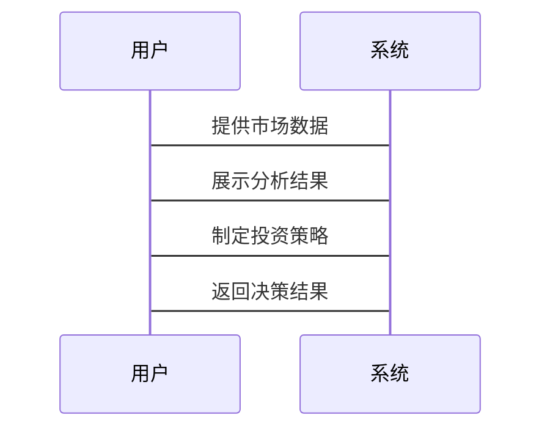

                 


```markdown
# 查理·芒格的逆向思维：远离人群的投资智慧

> 关键词：逆向思维，投资智慧，查理·芒格，多元思维模型，风险管理

> 摘要：本文深入探讨了查理·芒格的逆向思维在投资中的应用，分析了其背后的多元思维模型，结合实际案例和数学模型，揭示了如何通过逆向思维远离人群，做出更明智的投资决策。

---

## 第1章: 逆向思维的定义与特点

### 1.1 逆向思维的定义

逆向思维是一种与传统正向思维相反的思维方式，它通过反向思考问题，寻找解决问题的新角度。在投资领域，逆向思维尤其重要，因为它可以帮助投资者避免随大流的错误决策。

#### 1.1.1 逆向思维的起源与背景

逆向思维并非芒格首创，但他在投资领域将其发扬光大。芒格认为，市场参与者往往倾向于跟随 crowd-following 的方式，而这种行为往往会导致错误的决策。

#### 1.1.2 逆向思维的核心概念

逆向思维的核心在于“反其道而行之”。在投资中，这意味着寻找被市场低估的机会，避免拥挤的交易。

#### 1.1.3 逆向思维与传统正向思维的区别

传统正向思维是“从问题到解决方案”，而逆向思维则是“从解决方案到问题”。在投资中，这意味着先分析市场现状，再寻找被低估的机会。

### 1.2 逆向思维的特点

#### 1.2.1 逆向思维的独特优势

- **独特视角**：逆向思维可以帮助投资者发现市场中的价值洼地。
- **降低风险**：通过避免拥挤交易，减少市场波动带来的风险。
- **长期收益**：逆向思维注重长期价值，而非短期波动。

#### 1.2.2 逆向思维的局限性

- **信息不对称**：逆向思维依赖于对市场的深刻理解，这需要投资者具备较高的专业素养。
- **市场反应滞后**：逆向思维的投资机会往往需要时间才能被市场发现。

#### 1.2.3 逆向思维在投资中的应用前景

随着市场的发展，逆向思维的应用前景越来越广阔。投资者需要不断学习和实践，才能在复杂多变的市场中运用逆向思维。

---

## 第2章: 查理·芒格的多元思维模型

### 2.1 多元思维模型的定义

多元思维模型是芒格提出的一种投资分析方法，通过多个学科的视角来分析问题，从而做出更全面的决策。

#### 2.1.1 多元思维模型的核心要素

- **心理学**：理解市场参与者的心理行为。
- **经济学**：分析市场供需关系。
- **物理学**：理解市场运作的规律。

#### 2.1.2 多元思维模型的构成与特点

多元思维模型的特点是多维度、多层次，能够帮助投资者全面分析问题。

#### 2.1.3 多元思维模型与逆向思维的关系

逆向思维是多元思维模型的一种应用，通过反向思考问题，寻找解决方案。

### 2.2 多元思维模型的分类与分析

#### 2.2.1 心理学思维模型

- **贪婪与恐惧**：理解市场参与者的心理行为。
- **认知偏差**：避免决策中的认知偏差。

#### 2.2.2 经济学思维模型

- **供需关系**：分析市场供需关系。
- **边际成本**：理解生产成本的变化对价格的影响。

#### 2.2.3 物理学思维模型

- **杠杆原理**：分析财务杠杆对投资的影响。
- **能量守恒**：理解市场的内在规律。

### 2.3 多元思维模型的相互关系

#### 2.3.1 多元思维模型的相互关联

- **相互补充**：不同学科的思维模型相互补充，形成全面的分析框架。
- **协同效应**：多个思维模型共同作用，提高决策的准确性。

#### 2.3.2 多元思维模型的协同效应

通过多元思维模型的协同效应，投资者可以更好地理解市场的复杂性，做出更明智的决策。

#### 2.3.3 多元思维模型的综合应用

综合应用多元思维模型，可以帮助投资者从多个角度分析问题，避免单一视角的局限性。

---

## 第3章: 逆向思维与人性的弱点

### 3.1 人性的弱点与投资决策

#### 3.1.1 人性的贪婪与恐惧

- **贪婪**：投资者往往倾向于追求高收益，忽视风险。
- **恐惧**：市场下跌时，投资者容易做出恐慌性决策。

#### 3.1.2 人性的短视与急躁

- **短视**：投资者往往关注短期收益，忽视长期价值。
- **急躁**：市场波动时，投资者容易急于做出决策。

#### 3.1.3 人性的过度自信

- **过度自信**：投资者往往高估自己的判断能力，忽视市场变化。

### 3.2 逆向思维如何克服人性弱点

#### 3.2.1 逆向思维与理性决策

- **理性分析**：通过逆向思维，投资者可以更理性地分析市场，避免情绪化决策。
- **长期视角**：逆向思维强调长期价值，帮助投资者克服短视。

#### 3.2.2 逆向思维与情绪控制

- **情绪管理**：通过逆向思维，投资者可以更好地控制情绪，避免贪婪和恐惧的干扰。
- **耐心等待**：逆向思维强调耐心，避免急躁决策。

#### 3.2.3 逆向思维与长期主义

- **长期价值**：逆向思维关注长期价值，帮助投资者做出更明智的决策。
- **持续学习**：逆向思维需要投资者不断学习，提升自己的专业素养。

---

## 第4章: 逆向思维在投资中的应用

### 4.1 逆向思维与投资机会识别

#### 4.1.1 逆向思维在市场分析中的应用

- **市场底部**：通过逆向思维，识别市场的底部区域，寻找投资机会。
- **行业困境**：分析行业的困境，寻找被低估的企业。

#### 4.1.2 逆向思维在行业分析中的应用

- **行业周期**：通过逆向思维，分析行业的周期性变化，寻找投资机会。
- **行业竞争**：分析行业的竞争格局，寻找具有竞争优势的企业。

#### 4.1.3 逆向思维在个股分析中的应用

- **估值分析**：通过逆向思维，分析个股的估值，寻找被低估的投资标的。
- **财务分析**：分析企业的财务状况，识别潜在的风险和机会。

### 4.2 逆向思维与风险管理

#### 4.2.1 逆向思维与风险评估

- **风险识别**：通过逆向思维，识别投资中的潜在风险。
- **风险量化**：分析风险的大小，量化其对投资组合的影响。

#### 4.2.2 逆向思维与风险控制

- **风险分散**：通过逆向思维，分散投资风险，避免过度集中。
- **风险对冲**：利用衍生工具对冲风险，降低投资组合的波动性。

### 4.3 逆向思维与投资组合管理

#### 4.3.1 逆向思维与资产配置

- **资产配置**：通过逆向思维，优化资产配置，提高投资收益。
- **动态调整**：根据市场变化，动态调整投资组合。

#### 4.3.2 逆向思维与投资策略

- **长期策略**：逆向思维强调长期投资，避免短期波动的干扰。
- **逆向策略**：制定逆向投资策略，寻找市场中的价值洼地。

---

## 第5章: 逆向思维的数学模型与算法原理

### 5.1 逆向思维的数学模型

#### 5.1.1 概率论与逆向思维

- **概率分析**：通过概率论，分析投资中的不确定性。
- **期望值计算**：计算投资的期望值，评估其潜在收益。

#### 5.1.2 风险评估模型

- **VaR模型**：计算投资的风险价值，评估潜在损失。
- **CVaR模型**：计算条件风险价值，进一步量化风险。

### 5.2 逆向思维的算法原理

#### 5.2.1 逆向思维的算法流程

- **数据收集**：收集市场数据，分析市场现状。
- **逆向分析**：从反方向思考问题，寻找投资机会。
- **模型构建**：构建数学模型，量化分析结果。
- **决策制定**：根据分析结果，制定投资策略。

#### 5.2.2 算法实现

```python
def inverse_thinking_analysis(data):
    # 数据预处理
    processed_data = preprocess(data)
    # 逆向思维分析
    inverse_analysis = analyze_inverse(processed_data)
    # 风险评估
    risk_assessment = assess_risk(inverse_analysis)
    # 决策制定
    decision = make_decision(risk_assessment)
    return decision

# 示例数据
data = {
    'market': 'down',
    'valuation': 'undervalued',
    'risk': 'low'
}

# 调用函数
decision = inverse_thinking_analysis(data)
print(decision)
```

### 5.3 数学公式与案例分析

#### 5.3.1 概率论公式

$$ P(A) = \frac{\text{事件A发生的次数}}{\text{总事件数}} $$

#### 5.3.2 风险评估公式

$$ \text{VaR} = \text{损失的第α分位数} $$

---

## 第6章: 系统分析与架构设计

### 6.1 问题场景介绍

- **市场分析**：分析当前市场状况，寻找投资机会。
- **风险评估**：评估投资中的潜在风险。
- **投资决策**：制定投资策略，优化投资组合。

### 6.2 系统功能设计

- **市场分析模块**：收集和分析市场数据，识别投资机会。
- **风险评估模块**：评估投资风险，量化潜在损失。
- **投资决策模块**：制定投资策略，优化投资组合。

### 6.3 系统架构设计


### 6.4 系统接口设计

- **数据接口**：与数据源对接，获取市场数据。
- **用户接口**：提供用户交互界面，展示分析结果。

### 6.5 系统交互设计



---

## 第7章: 项目实战与案例分析

### 7.1 项目环境安装

- **工具安装**：安装数据分析工具，如Python、Pandas、NumPy。
- **数据源获取**：获取市场数据，如股票价格、财务报表。

### 7.2 核心实现源代码

```python
import pandas as pd
import numpy as np

def preprocess(data):
    # 数据预处理
    processed_data = data.copy()
    processed_data['valuation'] = processed_data['valuation'].apply(lambda x: x if x == 'undervalued' else None)
    return processed_data

def analyze_inverse(data):
    # 逆向思维分析
    inverse_analysis = data[data['valuation'] == 'undervalued']
    return inverse_analysis

def assess_risk(inverse_analysis):
    # 风险评估
    risk_assessment = inverse_analysis['risk'].apply(lambda x: 1 if x == 'high' else 0)
    return risk_assessment.sum()

def make_decision(risk_assessment):
    # 决策制定
    if risk_assessment == 0:
        return 'Invest'
    else:
        return 'Avoid'

# 示例数据
data = pd.DataFrame({
    'market': ['down', 'up', 'down'],
    'valuation': ['undervalued', 'overvalued', 'undervalued'],
    'risk': ['low', 'high', 'medium']
})

# 调用函数
processed_data = preprocess(data)
inverse_analysis = analyze_inverse(processed_data)
risk_assessment = assess_risk(inverse_analysis)
decision = make_decision(risk_assessment)
print(decision)
```

### 7.3 实际案例分析

- **案例背景**：假设市场整体下跌，寻找被低估的股票。
- **数据分析**：通过逆向思维分析，筛选出估值低、风险低的股票。
- **决策制定**：根据分析结果，决定是否投资。

### 7.4 项目小结

通过逆向思维的应用，投资者可以在市场中找到被低估的机会，制定合理的投资策略，实现长期收益。

---

## 第8章: 最佳实践与小结

### 8.1 最佳实践 tips

- **持续学习**：不断提升自己的知识储备，完善多元思维模型。
- **耐心等待**：逆向思维需要时间，耐心等待市场反应。
- **风险管理**：合理分散投资，降低整体风险。

### 8.2 小结

查理·芒格的逆向思维是一种独特的投资方法，通过反向思考问题，寻找市场中的价值洼地，帮助投资者远离人群，实现长期收益。

### 8.3 注意事项

- **信息不对称**：逆向思维需要投资者具备较高的专业素养。
- **市场反应滞后**：逆向思维的投资机会往往需要时间才能被市场发现。

### 8.4 拓展阅读

- **《芒格的十大股东》**：深入理解芒格的投资者思维。
- **《逆向思维的投资策略》**：学习更多逆向思维的应用案例。

---

## 附录: 参考文献与工具

- **参考文献**：芒格的经典著作，如《穷查理宝典》。
- **工具推荐**：数据分析工具（Python、Pandas）、思维导图工具（MindMap）、项目管理工具（JIRA）。

---

## 结语

通过本文的深入分析，读者可以全面理解查理·芒格的逆向思维，并在实际投资中加以应用。希望本文能为投资者提供有价值的参考，帮助他们在复杂的市场中做出更明智的决策。
```

