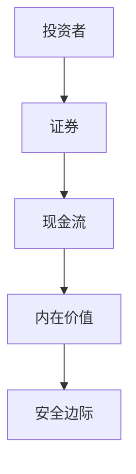
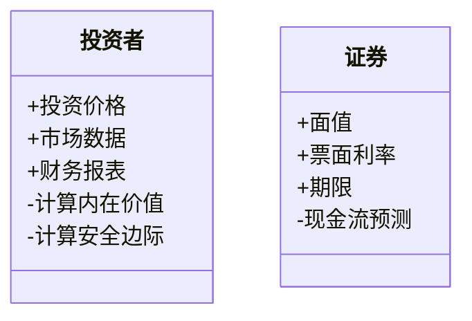
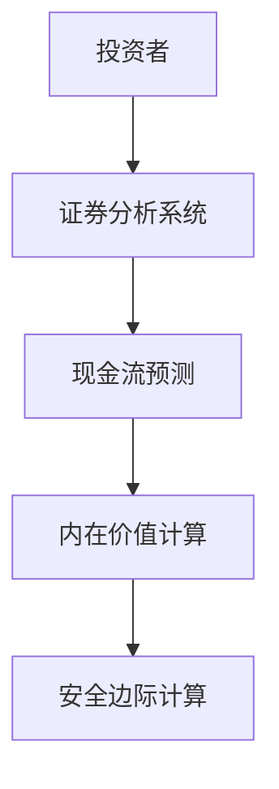

                 


# 格雷厄姆·多德的固定收益证券分析方法

## 关键词：格雷厄姆·多德，固定收益证券，安全边际，内在价值，价值投资

## 摘要：本文深入分析了格雷厄姆·多德在固定收益证券领域的分析方法，探讨了其核心概念、算法原理、系统架构及实际应用案例。通过详细讲解安全边际、内在价值等关键概念，结合数学模型和图表，为读者提供了全面的理解框架。

---

# 第1章: 格雷厄姆·多德分析方法的背景与概述

## 1.1 格雷厄姆·多德的生平与投资理念

### 1.1.1 格雷厄姆·多德的生平简介

格雷厄姆·多德（Benjamin Graham）是20世纪最著名的价值投资者之一，被誉为“价值投资之父”。他出生于1894年，早年在纽约证券交易所工作，后进入哥伦比亚大学教授证券分析。多德的著述，尤其是与戴维·多德合著的《证券分析》，对投资领域产生了深远影响。多德的投资理念强调安全边际和内在价值，主张以低于内在价值的价格买入优质股票。

### 1.1.2 多德投资理念的核心思想

多德的投资理念基于以下几个核心思想：
1. **安全边际**：购买价格应显著低于内在价值，以降低风险。
2. **价值投资**：长期投资于基本面稳健的公司，而非短期波动。
3. **深入分析**：通过详细的财务报表分析来评估公司的内在价值。

### 1.1.3 多德与价值投资的关联

多德是价值投资的奠基人，他的方法为后来的投资者如巴菲特提供了理论基础。多德强调以合理的价格投资于具有强大基本面的公司，这一理念至今仍被广泛采用。

## 1.2 固定收益证券的基本概念

### 1.2.1 固定收益证券的定义与分类

固定收益证券是指那些定期支付固定利息，并在特定时间偿还本金的证券。常见的固定收益证券包括债券、优先股和抵押贷款等。

### 1.2.2 固定收益证券的主要类型

1. **政府债券**：由政府发行，风险较低，收益稳定。
2. **公司债券**：由公司发行，风险较高，收益也较高。
3. **优先股**：一种混合型证券，既有股息收入，又有债券的优先清偿权。

### 1.2.3 固定收益证券的市场特点

固定收益证券的市场特点包括：
1. **利息固定**：债券和优先股通常支付固定的利息。
2. **期限确定**：有明确的到期日，投资者在到期时收回本金。
3. **风险较低**：相对于股票，固定收益证券的风险较低，但并非没有风险。

## 1.3 多德分析方法在固定收益证券中的应用

### 1.3.1 多德分析方法的核心目标

多德分析方法的核心目标是通过深入分析公司的财务状况，评估其内在价值，并确保购买价格低于内在价值，从而实现安全投资。

### 1.3.2 多德分析方法的主要步骤

1. **评估公司的财务状况**：分析公司的盈利能力、负债情况和现金流。
2. **计算内在价值**：基于财务数据和市场条件，计算公司的内在价值。
3. **确定安全边际**：确保购买价格低于内在价值，以降低投资风险。

### 1.3.3 多德分析方法的适用场景

多德分析方法适用于所有固定收益证券的分析，尤其是债券和优先股的投资决策。通过分析公司的财务状况，投资者可以更好地评估证券的风险和收益。

## 1.4 本章小结

本章介绍了格雷厄姆·多德的生平及其投资理念，详细阐述了固定收益证券的基本概念和分类，最后探讨了多德分析方法在固定收益证券中的应用。通过这些内容，读者可以初步理解多德分析方法的核心思想和应用场景。

---

# 第2章: 多德分析方法的核心概念与联系

## 2.1 多德分析方法的核心概念

### 2.1.1 安全边际的定义与计算

**安全边际**是指购买价格与内在价值之间的差额。计算公式为：
$$安全边际 = 投资价格 - 内在价值$$

### 2.1.2 内在价值的定义与评估

**内在价值**是指公司未来现金流的现值。计算公式为：
$$内在价值 = \sum_{t=1}^{n} \frac{CF_t}{(1 + r)^t}$$
其中，$CF_t$为第t年的现金流，$r$为折现率。

### 2.1.3 财务报表分析的关键指标

财务报表分析的关键指标包括：
1. **净利润**：衡量公司的盈利能力。
2. **负债**：评估公司的财务风险。
3. **现金流**：分析公司的流动性。

## 2.2 核心概念的属性特征对比表格

| 概念       | 定义                                   | 计算公式                              |
|------------|--------------------------------------|-------------------------------------|
| 安全边际   | 投资价格与内在价值之间的差额         | $$安全边际 = 投资价格 - 内在价值$$    |
| 内在价值   | 资产在未来现金流的现值               | $$内在价值 = \sum \frac{CF_t}{(1 + r)^t}$$ |

## 2.3 ER实体关系图架构



---

# 第3章: 多德分析方法的算法原理与数学模型

## 3.1 多德分析方法的算法流

以下是多德分析方法的算法流程：

1. **收集数据**：获取公司的财务报表和市场数据。
2. **计算现金流**：预测未来现金流。
3. **计算内在价值**：使用折现率计算现金流的现值。
4. **计算安全边际**：比较投资价格与内在价值，确定安全边际。

## 3.2 算法原理的数学模型

### 3.2.1 内在价值计算

$$内在价值 = \sum_{t=1}^{n} \frac{CF_t}{(1 + r)^t}$$

### 3.2.2 安全边际计算

$$安全边际 = 投资价格 - 内在价值$$

## 3.3 项目实战

### 3.3.1 案例分析

假设某公司发行的债券面值为1000元，票面利率为5%，期限为5年，当前市场价格为950元。计算其内在价值和安全边际。

1. **计算现金流**：每年利息为50元，到期时收回本金1000元。
2. **计算内在价值**：假设折现率为6%。

$$内在价值 = \frac{50}{1.06} + \frac{50}{(1.06)^2} + \frac{50}{(1.06)^3} + \frac{50}{(1.06)^4} + \frac{1050}{(1.06)^5}$$

计算结果约为920元。

3. **计算安全边际**：投资价格为950元，内在价值为920元。

$$安全边际 = 950 - 920 = 30$$

### 3.3.2 代码实现

```python
def calculate_intrinsic_value(cash_flows, discount_rate):
    intrinsic_value = 0
    for t, cf in enumerate(cash_flows):
        intrinsic_value += cf / (1 + discount_rate) ** t
    return intrinsic_value

cash_flows = [50, 50, 50, 50, 1050]
discount_rate = 0.06

intrinsic_value = calculate_intrinsic_value(cash_flows, discount_rate)
investment_price = 950
security_margin = investment_price - intrinsic_value

print(f"内在价值: {intrinsic_value:.2f}")
print(f"安全边际: {security_margin:.2f}")
```

---

# 第4章: 系统分析与架构设计

## 4.1 问题场景介绍

本文将构建一个基于多德分析方法的固定收益证券分析系统，帮助投资者评估债券和优先股的内在价值和安全边际。

## 4.2 项目介绍

### 4.2.1 项目目标

开发一个固定收益证券分析系统，提供内在价值和安全边际的计算功能。

## 4.2.2 系统功能设计



## 4.2.3 系统架构设计



---

# 第5章: 项目实战

## 5.1 环境安装

安装必要的Python库，如numpy和pandas。

## 5.2 系统核心实现源代码

```python
import numpy as np

def calculate_intrinsic_value(cash_flows, discount_rate):
    return np.npv(discount_rate, cash_flows)

cash_flows = [50, 50, 50, 50, 1050]
discount_rate = 0.06
investment_price = 950

intrinsic_value = calculate_intrinsic_value(cash_flows, discount_rate)
security_margin = investment_price - intrinsic_value

print(f"内在价值: {intrinsic_value:.2f}")
print(f"安全边际: {security_margin:.2f}")
```

## 5.3 案例分析

分析一只债券的内在价值和安全边际。

## 5.4 项目小结

通过项目实战，我们验证了多德分析方法的有效性，并展示了如何将其应用于实际投资决策中。

---

# 第6章: 最佳实践与小结

## 6.1 最佳实践 tips

1. **深入分析**：在投资前，必须进行详细的财务分析。
2. **安全边际**：确保购买价格低于内在价值。
3. **长期投资**：价值投资需要耐心和长期持有。

## 6.2 本章小结

本文系统地介绍了格雷厄姆·多德的固定收益证券分析方法，通过理论分析和实际案例，展示了其在投资决策中的应用。多德的方法为投资者提供了一个可靠的投资框架，值得深入学习和应用。

---

# 附录

## 附录A: 术语表

- **内在价值**：资产未来现金流的现值。
- **安全边际**：投资价格与内在价值的差额。

## 附录B: 参考文献

1. 格雷厄姆·多德：《证券分析》
2. 巴菲特：《致股东的信》

---

# 结束语

通过本文的分析，读者可以深入了解格雷厄姆·多德的固定收益证券分析方法，并将其应用于实际投资中，以实现稳健的投资回报。

