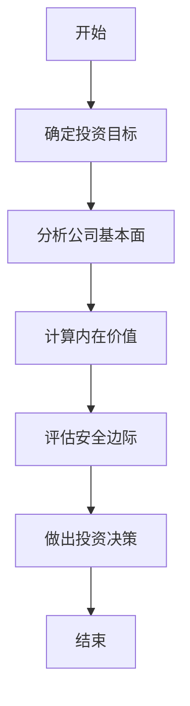
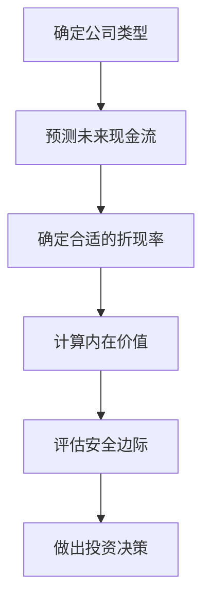
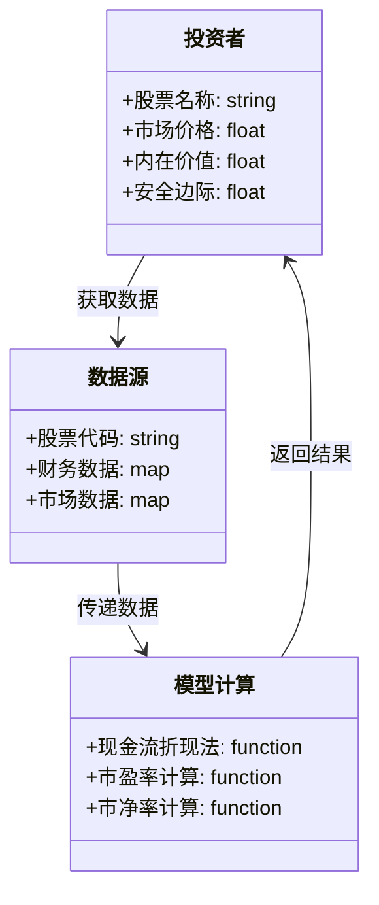
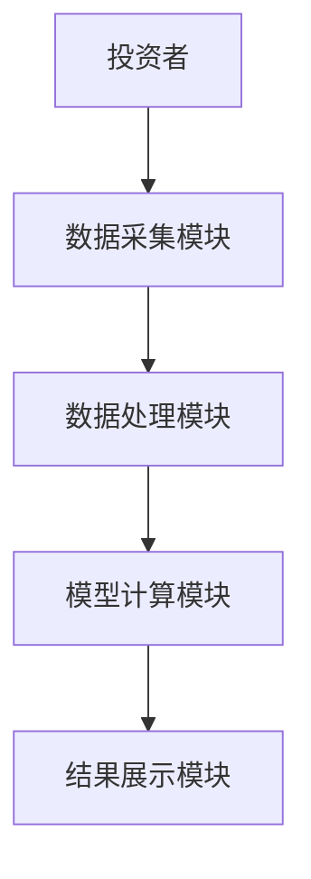
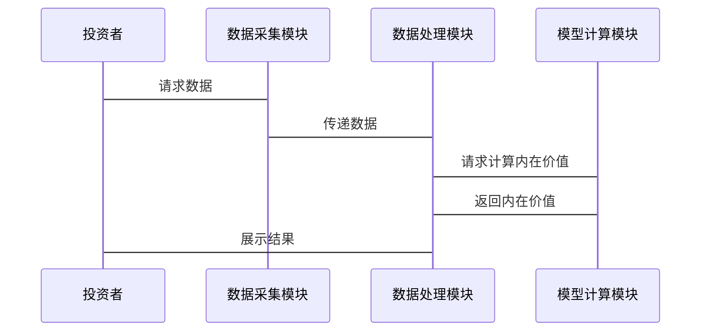

                 


# 格雷厄姆到巴菲特：价值投资理念的演变

## 关键词
价值投资、格雷厄姆、巴菲特、内在价值、安全边际

## 摘要
价值投资是一种长期有效的投资策略，由本杰明·格雷厄姆和戴维德·多德共同提出，并被沃伦·巴菲特进一步发展和完善。本文将从价值投资的起源、核心理念、数学模型、系统架构以及实际案例等方面进行详细分析，探讨其演变过程及其在现代投资中的应用。

---

# 第一部分: 价值投资的起源与发展

## 第1章: 价值投资的起源与核心理念

### 1.1 价值投资的起源

#### 1.1.1 投资学的早期发展
投资学的起源可以追溯到18世纪，但真正意义上的价值投资理念则在20世纪初由本杰明·格雷厄姆和戴维德·多德提出。格雷厄姆是哥伦比亚大学的教授，他的学生包括巴菲特等众多知名投资者。格雷厄姆提出的价值投资理念强调安全边际和内在价值的计算，为后来的价值投资奠定了基础。

#### 1.1.2 格雷厄姆与多德的价值投资理念
格雷厄姆和多德在1934年合著的《证券分析》一书中首次系统提出了价值投资的理念。他们认为，股票的价值应该基于其内在价值来评估，而不是市场的短期波动。内在价值可以通过对公司基本面的分析来计算，包括公司的盈利能力、资产状况和行业地位等。

#### 1.1.3 价值投资的核心概念与特征
价值投资的核心概念包括内在价值、安全边际和长期投资。内在价值是指公司未来现金流的现值，安全边际是市场价格与内在价值之间的差距，长期投资则是指持有优质股票直至其价值实现。

### 1.2 价值投资的核心理念

#### 1.2.1 安全边际的定义与重要性
安全边际是价值投资中一个关键概念，它是指市场价格低于内在价值的部分。格雷厄姆认为，只有当股票价格低于其内在价值时，才具有投资价值。安全边际的存在可以降低投资风险，确保投资者在市场波动中不会遭受重大损失。

#### 1.2.2 内在价值的计算方法
内在价值是通过对公司未来现金流的折现计算得出的。公式如下：
$$\text{内在价值} = \sum_{t=1}^{n} \frac{\text{现金流}_t}{(1 + r)^t}$$
其中，r是折现率，通常基于市场的无风险利率和风险溢价。

#### 1.2.3 投资组合的构建原则
价值投资者通常会构建一个分散化的投资组合，以降低风险。他们倾向于投资那些具有强大竞争优势、稳定盈利能力和良好管理团队的公司。

---

## 第2章: 价值投资与其他投资理念的对比

### 2.1 成长投资与价值投资的区别

#### 2.1.1 成长投资的核心特征
成长投资注重公司的成长性，即公司未来收入和利润的增长潜力。投资者通常会支付较高的市盈率或市净率来购买成长型股票，因为他们相信公司未来的增长能够弥补当前的高估值。

#### 2.1.2 价值投资的核心特征
价值投资关注的是公司股票的市场价格是否低于其内在价值。投资者通常寻找被市场低估的股票，并长期持有，直到其价值被市场发现。

#### 2.1.3 两者的优缺点对比
- 成长投资的优点在于能够获得高增长公司的超额收益，缺点是风险较高，容易受到市场波动的影响。
- 价值投资的优点在于风险较低，收益稳定，缺点是需要较长的时间才能看到收益。

### 2.2 技术分析与价值投资的对比

#### 2.2.1 技术分析的定义与方法
技术分析是通过研究历史价格数据来预测未来的价格走势。常用的技术分析方法包括趋势分析、图表分析和指标分析。

#### 2.2.2 价值投资的定义与方法
价值投资是通过分析公司的基本面来确定其内在价值，寻找市场价格低于内在价值的投资机会。

#### 2.2.3 两者的适用场景与局限性
- 技术分析适用于短期交易，但缺乏对公司基本面的深入分析，容易受到市场情绪的影响。
- 价值投资适用于长期投资，但需要对公司基本面有深刻的理解，且在市场低估时期需要耐心等待。

### 2.3 趋势投资与价值投资的对比

#### 2.3.1 趋势投资的核心理念
趋势投资是基于市场的趋势来制定投资策略，通常使用动量策略，即买入趋势向上的资产，卖出趋势向下的资产。

#### 2.3.2 价值投资的核心理念
价值投资是基于对公司内在价值的分析，寻找市场价格低于内在价值的投资机会。

#### 2.3.3 两者的策略差异与互补性
- 趋势投资注重市场的短期趋势，适合短期投资者。
- 价值投资注重公司的长期价值，适合长期投资者。

---

# 第三部分: 价值投资的数学模型与算法原理

## 第3章: 价值投资的数学模型

### 3.1 内在价值的计算公式

#### 3.1.1 现金流折现法（DCF）公式
现金流折现法是计算内在价值的核心方法。公式如下：
$$\text{内在价值} = \sum_{t=1}^{n} \frac{\text{现金流}_t}{(1 + r)^t}$$
其中，r是折现率，n是预测的年数，现金流_t是第t年的现金流。

#### 3.1.2 市盈率与市净率的计算公式
市盈率和市净率是常用的估值指标，公式如下：
$$\text{市盈率} = \frac{\text{股价}}{\text{每股收益}}$$
$$\text{市净率} = \frac{\text{股价}}{\text{每股净资产}}$$

### 3.2 安全边际的计算方法

#### 3.2.1 安全边际的定义
安全边际是市场价格与内在价值之间的差距，公式如下：
$$\text{安全边际} = \text{内在价值} - \text{市场价格}$$

#### 3.2.2 安全边际率的计算
安全边际率是安全边际占内在价值的比例，公式如下：
$$\text{安全边际率} = \frac{\text{安全边际}}{\text{内在价值}} \times 100\%$$

## 第4章: 价值投资的算法原理

### 4.1 价值投资的决策流程



### 4.2 内在价值计算的步骤



---

# 第四部分: 价值投资的系统分析与架构设计

## 第5章: 系统分析与架构设计方案

### 5.1 问题场景介绍
价值投资的系统化应用需要构建一个完整的投资决策系统，包括数据采集、模型计算、策略执行和风险控制等环节。

### 5.2 系统功能设计



### 5.3 系统架构设计



### 5.4 系统接口设计
系统接口包括数据输入接口、模型计算接口和结果输出接口。数据输入接口用于获取股票的财务数据和市场数据，模型计算接口用于计算内在价值和安全边际，结果输出接口用于展示投资决策结果。

### 5.5 系统交互设计



---

# 第五部分: 价值投资的项目实战

## 第6章: 项目实战

### 6.1 环境安装
为了进行价值投资的实战分析，需要安装以下工具：
- Python编程语言
- 数据分析库（如Pandas、NumPy）
- 可视化库（如Matplotlib）
- 财务数据源（如Yahoo Finance API）

### 6.2 核心实现源代码

```python
import pandas as pd
import numpy as np

def calculate_intrinsic_value(fcf, discount_rate):
    return np.sum(fcf / (1 + discount_rate)**range(1, len(fcf)+1))

def calculate_pe_ratio(price, eps):
    return price / eps

def calculate_pure_ratio(price, book_value_per_share):
    return price / book_value_per_share

# 示例数据
fcf = [100, 120, 150, 200]  # 自由现金流
discount_rate = 0.1  # 折现率
price = 50  # 市场价格
eps = 10  # 每股收益
book_value_per_share = 5  # 每股净资产

# 计算内在价值
intrinsic_value = calculate_intrinsic_value(fcf, discount_rate)
pe_ratio = calculate_pe_ratio(price, eps)
pure_ratio = calculate_pure_ratio(price, book_value_per_share)

print(f"内在价值: {intrinsic_value}")
print(f"市盈率: {pe_ratio}")
print(f"市净率: {pure_ratio}")
```

### 6.3 实际案例分析

#### 6.3.1 巴菲特投资可口可乐的案例
巴菲特在20世纪80年代开始投资可口可乐，当时可口可乐的股票市场价格远低于其内在价值。通过计算可口可乐的自由现金流和折现率，巴菲特确定其内在价值远高于市场价格，从而决定长期持有该股票，最终获得了丰厚的回报。

#### 6.3.2 价值投资在当前市场的应用
在当前市场中，价值投资者可以使用现金流折现法和市盈率等指标，寻找那些市场价格低于内在价值的公司股票。例如，假设某公司的自由现金流为100万元，折现率为10%，未来三年的现金流分别为100、120、150万元，则其内在价值为：
$$\text{内在价值} = \frac{100}{1.1} + \frac{120}{1.1^2} + \frac{150}{1.1^3} \approx 272.73 + 96.12 + 82.64 \approx 451.49$$
如果该股票的市场价格为400元，则其安全边际为51.49元，安全边际率为11.4%。

---

# 第六部分: 总结与展望

## 第7章: 总结与展望

### 7.1 最佳实践 tips
- 价值投资者应注重对公司基本面的深入分析，寻找市场价格低于内在价值的投资机会。
- 长期持有优质股票，避免频繁交易，以降低交易成本和税务负担。
- 保持耐心和纪律，即使在市场低迷时期也不盲目恐慌。

### 7.2 小结
价值投资是一种长期有效的投资策略，通过分析公司的内在价值和市场价格的差异，寻找具有安全边际的投资机会。格雷厄姆和巴菲特的价值投资理念为投资者提供了宝贵的指导，但需要根据市场环境和公司情况灵活调整。

### 7.3 注意事项
- 投资者应避免盲目跟从市场潮流，而是要基于公司的基本面进行独立思考。
- 风险管理是投资过程中不可忽视的一部分，投资者应合理分散投资组合，降低风险。

### 7.4 拓展阅读
- 《证券分析》（本杰明·格雷厄姆）
- 《巴菲特致股东的信》（沃伦·巴菲特）
- 《价值投资实战手册》（机械工业出版社）

---

# 结语

价值投资的理念从格雷厄姆到巴菲特，经历了理论与实践的不断完善。通过深入分析公司的内在价值和市场价格的差异，投资者可以找到具有安全边际的投资机会，实现长期稳定的收益。希望本文能够为价值投资的学习者和实践者提供有益的指导和启示。

