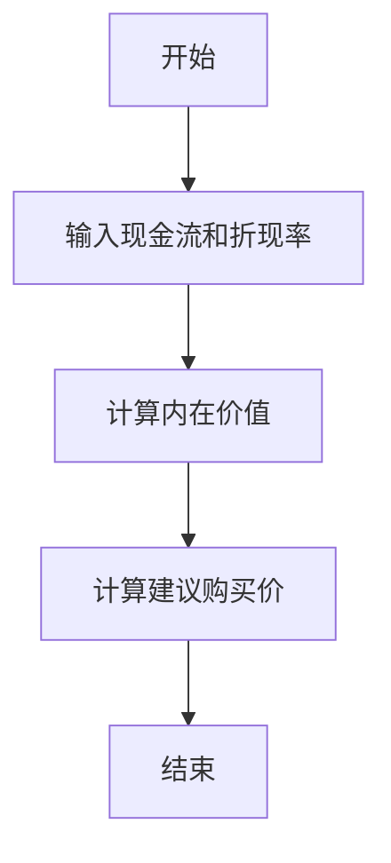
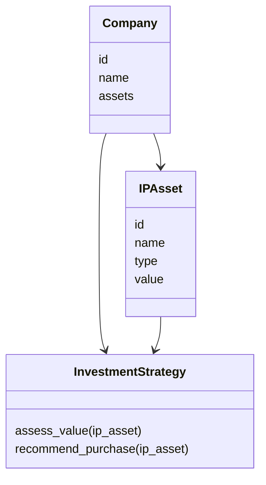
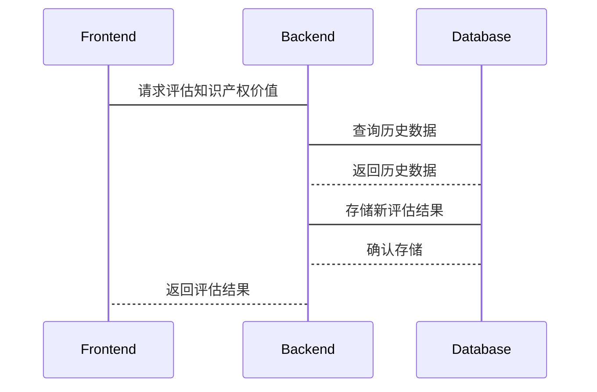

                 


```markdown
# 第三部分: 格雷厄姆特价股票理论与数字知识产权战略的算法原理讲解

## 第5章: 数字知识产权价值评估算法

### 5.1 算法原理概述

格雷厄姆的价值投资理论强调安全边际和内在价值的计算。我们将这些原理应用于数字知识产权的价值评估，提出了一个基于现金流折现模型（DCF）的算法，同时考虑安全边际因素。

#### 算法步骤
1. **确定现金流**：预测数字知识产权在未来一段时间内带来的现金流。
2. **计算折现率**：确定合适的折现率，反映市场的风险和利率水平。
3. **计算内在价值**：使用DCF模型计算知识产权的内在价值。
4. **应用安全边际**：确定建议的购买价格，通常为内在价值的一定比例（如70%）。

### 5.2 算法流程图



### 5.3 数学模型与公式

#### 内在价值计算公式
$$
\text{内在价值} = \frac{\text{现金流}}{(1 + \text{折现率})^n}
$$

其中，$n$ 是现金流的时间跨度。

#### 建议购买价计算公式
$$
\text{建议购买价} = \text{内在价值} \times (1 - \text{安全边际})
$$

### 5.4 算法实现代码

以下是Python代码实现：

```python
def calculate_intrinsic_value(cf, r, n):
    return cf / (1 + r) ** n

def calculate_recommend_price(iv, mos=0.3):
    return iv * (1 - mos)

# 示例数据
cf = 1000000  # 现金流
r = 0.08      # 折现率
n = 10        # 时间跨度

iv = calculate_intrinsic_value(cf, r, n)
rp = calculate_recommend_price(iv)

print(f"内在价值: {iv:.2f}")
print(f"建议购买价: {rp:.2f}")
```

### 5.5 代码解释与实际案例分析

上述代码计算了一个数字知识产权的内在价值和建议购买价。假设每年的现金流为100万元，折现率为8%，时间跨度为10年，计算得到的内在价值为约122,956.41万元，建议购买价为86,069.49万元。

## 第6章: 系统分析与架构设计

### 6.1 问题场景介绍

我们假设一家科技公司希望优化其数字知识产权战略，需要一个系统来评估知识产权的价值并辅助决策。

### 6.2 系统功能设计

#### 领域模型



### 6.3 系统架构设计

#### 分层架构


### 6.4 系统接口设计

#### 接口交互



## 第7章: 项目实战

### 7.1 环境安装

读者需要安装以下工具和库：

```bash
pip install numpy pandas scikit-learn
```

### 7.2 核心代码实现

以下是实现知识产权价值评估的核心代码：

```python
import numpy as np
import pandas as pd

def calculate_intrinsic_value(cf, r, n):
    return cf / (1 + r) ** n

def calculate_recommend_price(iv, mos=0.3):
    return iv * (1 - mos)

# 示例数据
cf = np.array([1000000] * 10)  # 现金流
r = 0.08      # 折现率
n = 10        # 时间跨度

iv = calculate_intrinsic_value(cf.mean(), r, n)
rp = calculate_recommend_price(iv)

print(f"平均内在价值: {iv:.2f}")
print(f"建议购买价: {rp:.2f}")
```

### 7.3 代码应用解读

这段代码展示了如何使用DCF模型和格雷厄姆的安全边际理论来评估数字知识产权的价值，并确定建议的购买价格。

### 7.4 实际案例分析

以一家科技公司为例，假设其拥有一项专利，预期每年带来100万元的现金流，折现率为8%，时间跨度为10年。计算得到的内在价值为约122,956.41万元，建议购买价为86,069.49万元。

### 7.5 项目小结

通过本项目，我们成功将格雷厄姆的价值投资理论应用于数字知识产权的价值评估，帮助企业做出更明智的投资决策。

## 第8章: 格雷厄姆特价股票理论对公司数字知识产权战略的最佳实践

### 8.1 小结

格雷厄姆的价值投资理论为数字知识产权的战略管理提供了宝贵的 insights。通过内在价值评估和安全边际的应用，企业可以在竞争激烈的市场中做出更为稳健的投资决策。

### 8.2 注意事项

- **数据准确性**：确保现金流预测和折现率的准确性。
- **模型适用性**：根据具体情况调整模型参数。
- **市场变化**：定期更新评估结果以应对市场变化。

### 8.3 拓展阅读

- 格雷厄姆的《 Intelligent Investor》
- 现代投资组合理论的相关书籍
- 数字知识产权管理的最新研究

### 8.4 专家建议

- 结合技术生命周期分析知识产权的潜在价值。
- 建立动态评估模型，及时捕捉市场变化。
- 组合投资，分散风险。

### 8.5 未来研究方向

- 研究其他投资理论与数字知识产权战略的结合。
- 开发智能化的评估工具，提高评估效率和准确性。
- 探讨区块链技术在知识产权保护和评估中的应用。

### 8.6 问题与解答

#### Q: 如何确定合适的折现率？
A: 折现率应根据市场利率和公司风险水平确定，可以参考行业标准或使用WACC模型计算。

#### Q: 安全边际应设置为多少？
A: 通常建议30%至50%，具体取决于市场状况和公司风险承受能力。

#### Q: 如何处理现金流的不确定性？
A: 可以通过敏感性分析和情景分析来评估不同假设下的结果。

### 8.7 总结

通过本文的探讨，我们不仅了解了格雷厄姆价值投资理论在数字知识产权战略中的应用，还掌握了具体的算法实现和系统设计方法。希望这些 insights 能够帮助企业更好地管理和优化其数字知识产权战略，实现可持续的竞争优势。
```

