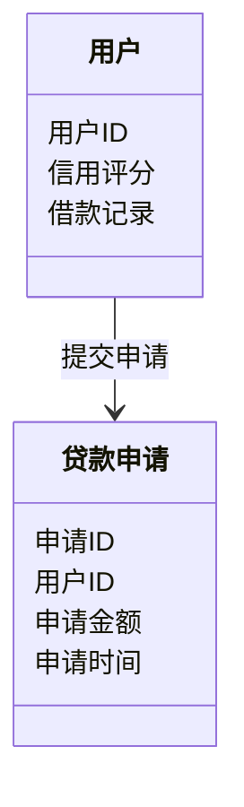
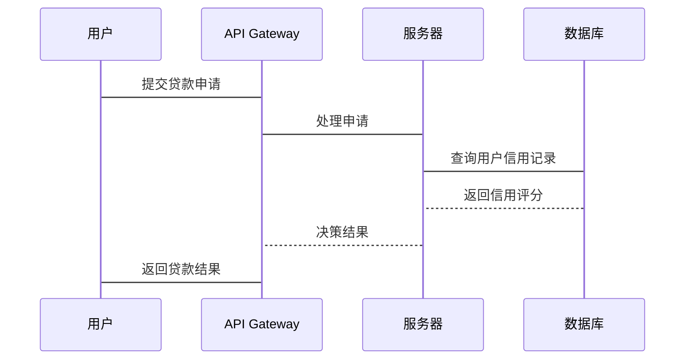

                 


# 格雷厄姆特价股票理论对数字普惠金融的启示

## 关键词：格雷厄姆投资理论、数字普惠金融、价值投资、风险管理、金融科技创新

## 摘要：本文探讨格雷厄姆的价值投资理论如何启示数字普惠金融的发展，分析其核心概念、数学模型和系统架构，并通过案例展示其应用。

---

# 第1章: 格雷厄姆特价股票理论概述

## 1.1 格雷厄姆投资理论的背景

### 1.1.1 价值投资的起源与发展
- 价值投资由本杰明·格雷厄姆提出，强调购买被市场低估的股票。
- 格雷厄姆的学生彼得·林奇进一步发展了这一理论。

### 1.1.2 格雷厄姆投资理念的核心思想
- **安全边际**：购买价格低于内在价值，确保投资的安全性。
- **内在价值**：通过分析企业基本面确定其真实价值。

### 1.1.3 特价股票理论的基本概念
- 特价股票：市场价格低于内在价值的股票。
- 投资者应寻找具有安全边际的股票。

## 1.2 数字普惠金融的背景与现状

### 1.2.1 数字普惠金融的定义与特点
- 数字普惠金融：利用数字技术提高金融服务的可及性，特别是针对中小微企业和个人。
- 特点：便捷、高效、低成本。

### 1.2.2 数字普惠金融的发展现状
- 技术进步推动金融服务数字化。
- 数字普惠金融在解决传统金融覆盖不足方面的作用。

### 1.2.3 数字普惠金融与传统金融的区别
| 特性 | 传统金融 | 数字普惠金融 |
|------|----------|---------------|
| 渠道 | 实体网点 | 数字平台       |
| 成本 | 高       | 低             |
| 覆盖范围 | 有限   | 广泛           |

## 1.3 格雷厄姆理论与数字普惠金融的结合

### 1.3.1 格雷厄姆理论在金融领域的应用
- 价值投资的核心是寻找低估的资产，这与数字普惠金融中发现未被充分服务的客户群体有相似之处。

### 1.3.2 数字普惠金融的核心问题与挑战
- 服务对象的信用评估困难。
- 风险管理的技术挑战。

### 1.3.3 格雷厄姆理论对数字普惠金融的启示
- 强调基本面分析，应用于客户信用评估。
- 安全边际的概念用于风险控制。

---

# 第2章: 格雷厄姆特价股票理论的核心概念

## 2.1 格雷厄姆投资理念的核心要素

### 2.1.1 安全边际的定义与计算
$$ \text{安全边际} = \text{内在价值} - \text{市场价格} $$

### 2.1.2 内在价值的评估方法
$$ V = \frac{E}{k} $$
其中，\( E \) 是企业的预期收益，\( k \) 是资本成本。

### 2.1.3 投资组合的构建策略
- 分散投资以降低风险。
- 选择具有安全边际的股票。

## 2.2 数字普惠金融的核心要素

### 2.2.1 金融服务的数字化转型
- 技术如大数据、AI推动金融服务创新。

### 2.2.2 数字普惠金融的技术支撑
- 区块链：确保交易透明。
- AI：用于信用评估和风险预测。

### 2.2.3 数字普惠金融的用户需求分析
- 需求层次：从基本金融服务到个性化需求。

## 2.3 格雷厄姆理论与数字普惠金融的关联性分析

### 2.3.1 格雷厄姆理论在数字普惠金融中的适用性
- **内在价值**：应用于客户信用评估。
- **安全边际**：用于风险控制。

### 2.3.2 数字普惠金融对格雷厄姆理论的创新性应用
- 使用大数据和AI进行更精准的内在价值评估。

### 2.3.3 格雷厄姆理论对数字普惠金融的风险控制启示
- 强调基本面分析，减少市场情绪影响。

---

# 第3章: 格雷厄姆特价股票理论的数学模型与算法原理

## 3.1 内在价值计算模型

### 3.1.1 内在价值的公式表示
$$ V = \frac{E}{k} $$
其中，\( E \) 是企业的预期收益，\( k \) 是资本成本。

### 3.1.2 内在价值计算的步骤
1. **估算现金流**：预测未来现金流。
2. **确定贴现率**：使用CAPM模型计算。
3. **计算现值**：将未来现金流贴现到现值。
4. **比较价格**：与市场价格对比，判断是否低估。

## 3.2 安全边际的计算方法

### 3.2.1 安全边际的定义
$$ \text{安全边际} = \text{内在价值} - \text{市场价格} $$

### 3.2.2 安全边际的计算步骤
1. 计算内在价值。
2. 确定市场价格。
3. 计算安全边际。

## 3.3 数字普惠金融中的风险评估模型

### 3.3.1 风险评分模型
$$ \text{风险评分} = \alpha \cdot \text{收入} + \beta \cdot \text{信用历史} + \gamma \cdot \text{负债} $$
其中，\( \alpha, \beta, \gamma \) 是权重系数。

### 3.3.2 风险评分的计算步骤
1. 收集客户数据。
2. 确定各因素的权重。
3. 计算风险评分。
4. 根据评分决定贷款额度。

---

# 第4章: 数字普惠金融的系统架构设计

## 4.1 系统功能设计

### 4.1.1 领域模型


### 4.1.2 系统架构
```mermaid
client
  internet
    gateway
      server
        database
```

## 4.2 系统接口设计

### 4.2.1 用户接口


---

# 第5章: 项目实战

## 5.1 环境安装

### 5.1.1 安装Python环境
```bash
python --version
pip install requests
pip install numpy
pip install pandas
pip install matplotlib
```

## 5.2 核心代码实现

### 5.2.1 计算内在价值
```python
def calculate_intrinsic_value(revenue, cost_of_capital):
    return revenue / cost_of_capital
```

### 5.2.2 计算风险评分
```python
def calculate_risk_score(income, credit_history, debt):
    alpha = 0.4
    beta = 0.3
    gamma = 0.3
    return alpha * income + beta * credit_history + gamma * debt
```

## 5.3 案例分析

### 5.3.1 案例背景
- 小微企业贷款申请。

### 5.3.2 数据分析
- 收入：100万
- 信用历史：良好
- 负债：50万

### 5.3.3 计算结果
- 内在价值：150万
- 风险评分：0.4*100 + 0.3*80 + 0.3*60 = 74

### 5.3.4 贷款决策
- 风险评分74分，批准贷款额度10万。

## 5.4 项目小结

---

# 第6章: 总结与展望

## 6.1 核心观点总结
- 格雷厄姆理论在数字普惠金融中的应用潜力巨大。
- 数字技术提升了理论的实践效果。

## 6.2 未来展望
- 更广泛的应用场景。
- 更精准的模型开发。

## 6.3 最佳实践Tips
- 结合技术与投资理论。
- 定期更新模型参数。

## 6.4 小结
格雷厄姆理论为数字普惠金融提供了新的视角，未来将有更多创新应用。

---

# 附录

## 附录A: 扩展阅读

### A.1 推荐书籍
- 《The Intelligent Investor》
- 《Digital Finance》

### A.2 推荐工具
- Python数据分析库：pandas, numpy
- 可视化工具：Matplotlib, Seaborn

---

这篇文章通过详细分析格雷厄姆理论的核心概念、数学模型和系统架构，展示了其在数字普惠金融中的应用潜力，为读者提供了全面的理论和实践指导。

