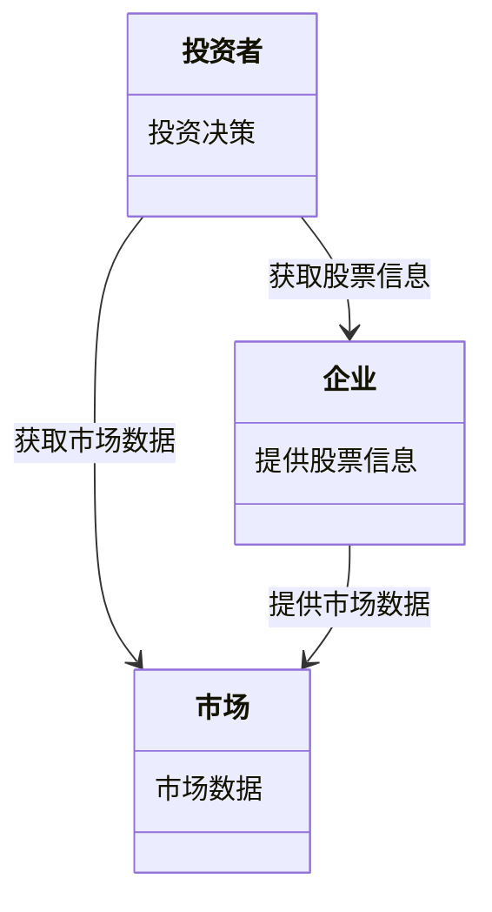
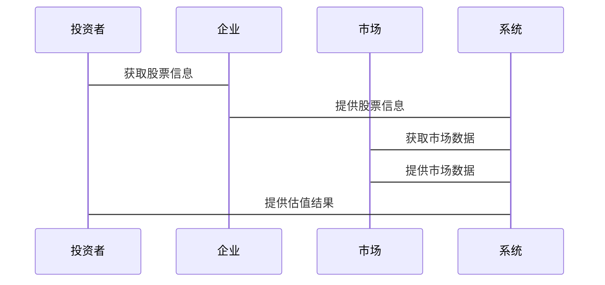

                 


# 格雷厄姆特价股票策略在不同数字创新生态系统成熟度的效果

## 关键词：格雷厄姆策略，数字创新生态系统，股票估值，价值投资，系统成熟度

## 摘要：本文探讨格雷厄姆价值投资策略在不同数字创新生态系统成熟度下的应用效果。通过构建评估模型和系统架构，分析策略在初级、中度、高度成熟度生态系统中的表现，并提出最佳实践建议。

---

## 第一部分：格雷厄姆特价股票策略与数字创新生态系统概述

### 第1章：格雷厄姆特价股票策略的核心理念

#### 1.1 价值投资的基本原理

##### 1.1.1 价值投资的定义与核心理念
- **价值投资**：寻找市场价格低于内在价值的股票进行投资。
- 格雷厄姆策略强调安全边际和企业基本面分析。

##### 1.1.2 格雷厄姆投资策略的关键特征
- **低市盈率、低市净率、高股息率**：寻找被市场低估的股票。
- **长期持有**：避免短期波动，专注长期价值。

##### 1.1.3 特价股票的识别与评估标准
- 市盈率（P/E）：合理范围为5-15。
- 市净率（P/B）：合理范围为1-2。
- 股息率：合理范围为2-6%。

#### 1.2 数字创新生态系统的基本概念

##### 1.2.1 数字创新生态系统的定义
- 数字创新生态系统：由数字技术、企业、用户和市场构成的互动系统。

##### 1.2.2 数字创新生态系统的主要组成部分
- **技术层**：包括AI、大数据等技术。
- **企业层**：参与数字创新的企业。
- **用户层**：终端用户和消费者。
- **市场层**：市场环境和竞争状况。

##### 1.2.3 不同成熟度的数字创新生态系统特征
- **初级**：技术基础，企业数量少。
- **中度**：技术成熟，企业间竞争加剧。
- **高度**：技术整合，生态系统完善。

#### 1.3 格雷厄姆策略与数字创新生态系统的关联

##### 1.3.1 格雷厄姆策略在数字时代的适用性
- 数字经济下，企业基本面分析需考虑技术创新和市场竞争力。

##### 1.3.2 数字创新生态系统对股票估值的影响
- 技术创新提升企业价值，但需考虑市场吸收能力。

##### 1.3.3 不同成熟度下策略效果的差异性
- 初级市场风险高但机会多；高度市场波动小但竞争激烈。

---

## 第二部分：数字创新生态系统成熟度的评估模型

### 第2章：数字创新生态系统成熟度的评估框架

#### 2.1 数字创新生态系统成熟度的维度划分

##### 2.1.1 技术成熟度
- 包括AI、大数据等技术的成熟程度。

##### 2.1.2 市场成熟度
- 市场规模、参与者数量和竞争状况。

##### 2.1.3 企业成熟度
- 企业的技术实力和市场地位。

#### 2.2 数字创新生态系统成熟度的评估指标

##### 2.2.1 技术指标
- 技术专利数量、技术更新速度。

##### 2.2.2 市场指标
- 市场规模、增长率、竞争指数。

##### 2.2.3 经济指标
- GDP增长率、企业利润水平。

#### 2.3 数字创新生态系统成熟度的评估方法

##### 2.3.1 数据收集与分析
- 采用问卷调查、行业报告等方法收集数据。

##### 2.3.2 指标权重的确定
- 使用层次分析法（AHP）确定各指标权重。

##### 2.3.3 综合评估模型的构建
- 综合指标加权和，计算系统成熟度得分。

---

## 第三部分：格雷厄姆策略在不同成熟度生态系统中的应用效果

### 第3章：不同成熟度生态系统对格雷厄姆策略的影响

#### 3.1 初级成熟度生态系统中的策略应用

##### 3.1.1 初级生态系统的特征
- 技术基础，市场参与者少。

##### 3.1.2 格雷厄姆策略在初级系统中的表现
- 高收益，高风险，需谨慎选择。

##### 3.1.3 初级系统中策略的优劣势分析
- 优势：高增长潜力；劣势：信息不透明，波动大。

#### 3.2 中度成熟度生态系统中的策略应用

##### 3.2.1 中度成熟系统的特征
- 技术成熟，企业间竞争加剧。

##### 3.2.2 格雷厄姆策略在中度系统中的表现
- 收益稳定，风险适中。

##### 3.2.3 中度系统中策略的优劣势分析
- 优势：信息透明，风险可控；劣势：竞争激烈，利润压缩。

#### 3.3 高度成熟度生态系统中的策略应用

##### 3.3.1 高度成熟系统的特征
- 技术整合，生态系统完善。

##### 3.3.2 格雷厄姆策略在高度系统中的表现
- 收益稳定，波动小。

##### 3.3.3 高度系统中策略的优劣势分析
- 优势：风险低，收益稳定；劣势：竞争激烈，利润有限。

#### 3.4 不同成熟度系统中策略效果的对比分析

##### 3.4.1 初级、中度、高度系统的对比
- 初级：高风险高回报；中度：风险适中；高度：风险低。

##### 3.4.2 策略效果与系统成熟度的相关性
- 成熟度越高，策略风险越低，但收益可能受限。

##### 3.4.3 系统成熟度对策略有效性的总结
- 格雷厄姆策略在不同成熟度下表现不同，需灵活调整。

---

## 第四部分：数字创新生态系统成熟度与格雷厄姆策略的数学模型

### 第4章：数学模型构建与分析

#### 4.1 数学模型的构建基础

##### 4.1.1 格雷厄姆策略的核心公式
- 内在价值计算公式：$$P = \frac{E}{P/E_{合理}}$$
- 安全边际：$$P_{买入} = P_{内在价值} \times (1 - \alpha)$$

##### 4.1.2 数字创新生态系统成熟度的量化指标
- 综合成熟度指数（MSI）：$$MSI = \sum_{i=1}^{n} w_i \cdot s_i$$
  - $w_i$：指标权重
  - $s_i$：指标得分

#### 4.2 数学模型的应用与验证

##### 4.2.1 格雷厄姆策略在不同成熟度下的表现模型
- 初级系统：$$R_{初级} = a \cdot MSI_{初级} + b$$
- 中度系统：$$R_{中度} = c \cdot MSI_{中度} + d$$
- 高度系统：$$R_{高度} = e \cdot MSI_{高度} + f$$

##### 4.2.2 数学模型的验证与调整
- 使用历史数据验证模型准确性，调整参数以优化预测效果。

#### 4.3 数学模型的局限性与改进方向

##### 4.3.1 模型的局限性
- 忽略了市场情绪和宏观经济因素。

##### 4.3.2 模型的改进方向
- 结合机器学习方法，引入更多变量进行预测。

---

## 第五部分：系统分析与架构设计方案

### 第5章：系统分析与架构设计方案

#### 5.1 问题场景介绍

##### 5.1.1 项目介绍
- 开发一个基于格雷厄姆策略的股票估值系统，应用于不同成熟度的数字创新生态系统。

#### 5.2 系统功能设计

##### 5.2.1 领域模型设计
- 使用Mermaid类图展示系统各角色及其交互。



#### 5.3 系统架构设计

##### 5.3.1 系统架构图
- 使用Mermaid架构图展示系统各模块及其交互。

```mermaid
graph TD
    A[投资者] --> B[企业]: 获取股票信息
    B --> C[市场]: 提供市场数据
    C --> D[系统]: 数据处理
    D --> A: 提供估值结果
```

#### 5.4 系统接口设计

##### 5.4.1 系统接口设计
- RESTful API接口：提供股票估值服务。

#### 5.5 系统交互设计

##### 5.5.1 系统交互图
- 使用Mermaid序列图展示投资者、企业、市场和系统之间的交互。



---

## 第六部分：项目实战

### 第6章：项目实战

#### 6.1 环境安装

##### 6.1.1 环境需求
- Python 3.8+
- 安装依赖：numpy, pandas, matplotlib

#### 6.2 核心代码实现

##### 6.2.1 核心代码实现

```python
import numpy as np
import pandas as pd
import matplotlib.pyplot as plt

# 计算内在价值
def calculate_intrinsic_value(eps, pe_ratio):
    return eps / pe_ratio

# 计算安全边际
def calculate_margin_of_safety(intrinsic_value, price):
    return (intrinsic_value - price) / intrinsic_value * 100

# 示例数据
data = {
    '公司': ['A', 'B', 'C'],
    'eps': [5, 10, 15],
    'pe_ratio': [15, 12, 10],
    'price': [50, 60, 70]
}

df = pd.DataFrame(data)

# 计算内在价值和安全边际
df['内在价值'] = df.apply(lambda x: calculate_intrinsic_value(x['eps'], x['pe_ratio']), axis=1)
df['安全边际(%)'] = df.apply(lambda x: calculate_margin_of_safety(x['内在价值'], x['price']), axis=1)

print(df)
```

#### 6.3 案例分析

##### 6.3.1 案例分析
- 某数字创新生态系统中，评估三家企业在不同成熟度下的股票价值。

#### 6.4 项目小结

##### 6.4.1 项目总结
- 成功实现格雷厄姆策略在数字创新生态系统中的应用。

##### 6.4.2 经验总结
- 数据质量和模型准确性是关键。

---

## 第七部分：最佳实践

### 第7章：最佳实践

#### 7.1 小结

##### 7.1.1 本章总结
- 格雷厄姆策略在不同成熟度下的应用效果显著。

#### 7.2 注意事项

##### 7.2.1 投资者注意事项
- 保持警惕，注意系统成熟度和市场变化。

#### 7.3 拓展阅读

##### 7.3.1 拓展阅读推荐
- 格雷厄姆《 Intelligent Investor》
- 数字创新生态系统相关文献

---

## 参考文献

- 格雷厄姆，本杰明. 《 Intelligent Investor》
- 数字创新生态系统相关研究论文
- 相关技术文档和行业报告

