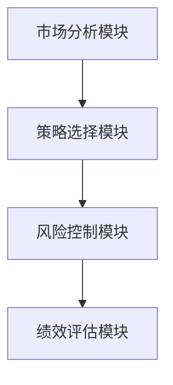

                 


# 格雷厄姆特价股票策略在不同经济周期的调整

> 关键词：格雷厄姆投资理论、经济周期、特价股票、安全边际、内在价值

> 摘要：本文详细分析了本杰明·格雷厄姆的价值投资理论在不同经济周期中的应用策略。通过探讨经济周期的四个阶段（扩张期、衰退期、萧条期、复苏期）对格雷厄姆特价股票策略的影响，结合数学模型和实际案例，深入解析了如何在不同经济环境下调整投资策略，以实现长期稳定的收益。文章还提供了系统化的投资架构设计和实战案例分析，帮助投资者更好地理解和应用这一经典投资策略。

---

## 第一部分: 格雷厄姆投资理论的背景与核心概念

### 第1章: 格雷厄姆投资理论的背景与起源

#### 1.1 本杰明·格雷厄姆的简介
本杰明·格雷厄姆（Benjamin Graham）是20世纪最伟大的投资思想家之一，被誉为“价值投资之父”。他不仅是沃伦·巴菲特（Warren Buffett）的老师，还撰写了《聪明的投资者》（The Intelligent Investor）一书，奠定了现代价值投资理论的基础。

#### 1.2 格雷厄姆投资理论的核心思想
格雷厄姆的投资理论强调以低于内在价值的价格买入优质股票，通过安全边际来降低投资风险。他认为，市场先生（Mr. Market）的情绪波动会导致股票价格偏离其实际价值，投资者应该利用这种波动，以合理的价格买入并长期持有优质资产。

#### 1.3 特价股票的定义与特征
格雷厄姆定义的“特价股票”是指市场价格低于其内在价值的股票。其特征包括：
1. 价格低于清算价值。
2. 市盈率低于行业平均水平。
3. 市净率低于行业平均水平。
4. 公司具有稳定的盈利能力。

---

### 第2章: 经济周期的基本概念

#### 2.1 经济周期的四个阶段
经济周期通常分为四个阶段：
1. **扩张期（Boom Period）**：经济增长迅速，企业盈利上升，股票价格上涨。
2. **衰退期（Recession Period）**：经济增长放缓，企业盈利下降，股票价格下跌。
3. **萧条期（Depression Period）**：经济陷入停滞或负增长，股票价格持续低迷。
4. **复苏期（Recovery Period）**：经济开始复苏，企业盈利逐步恢复，股票价格回升。

#### 2.2 不同经济周期对股市的影响
在不同经济周期中，股市的表现有所不同：
- **扩张期**：股市通常表现良好，投资者信心充足。
- **衰退期**：股市下跌，投资者信心下降。
- **萧条期**：股市处于底部，投资者普遍持观望态度。
- **复苏期**：股市逐步回升，投资者开始重新入场。

---

## 第二部分: 格雷厄姆策略的核心原理与数学模型

### 第3章: 格雷厄姆策略的核心原理

#### 3.1 安全边际的概念
安全边际是指股票的市场价格与其内在价值之间的差距。格雷厄姆认为，安全边际的存在可以降低投资风险，确保投资者在市场波动中不会遭受重大损失。

#### 3.2 内在价值的评估
内在价值是股票在理性投资者看来的合理价格，与市场情绪无关。计算内在价值的关键在于分析公司的基本面，包括盈利能力、财务状况、行业地位等因素。

#### 3.3 格雷厄姆的选股标准
格雷厄姆提出了一系列选股标准，包括：
1. 低市盈率（P/E）：市盈率低于行业平均水平。
2. 低市净率（P/B）：市净率低于行业平均水平。
3. 高股息率：股息率高于行业平均水平。

---

### 第4章: 格雷厄姆策略的数学模型与公式

#### 4.1 内在价值计算公式
格雷厄姆提出了以下内在价值计算公式：
$$
\text{内在价值} = \frac{\text{预期收益}}{\text{折现率}}
$$

#### 4.2 安全边际计算公式
安全边际的计算公式如下：
$$
\text{安全边际} = \text{内在价值} - \text{市场价格}
$$

#### 4.3 实际案例计算
假设某公司的内在价值为 $50，市场价格为 $40，其安全边际为：
$$
\text{安全边际} = 50 - 40 = 10
$$

---

## 第三部分: 格雷厄姆策略在不同经济周期中的调整

### 第5章: 经济扩张期的策略调整

#### 5.1 市场特征与投资机会
在经济扩张期，市场情绪乐观，股票价格上涨。此时，格雷厄姆策略的投资机会较少，因为大多数股票价格已经偏离其内在价值。

#### 5.2 策略调整
在经济扩张期，格雷厄姆策略建议：
1. 减少投资于高价股票。
2. 增加现金储备，等待更好的投资机会。

#### 5.3 典型案例分析
2000年互联网泡沫破裂后，经济开始复苏，但随后进入扩张期。此时，格雷厄姆策略的投资者可以选择那些市盈率和市净率较低的股票，避免高估的科技股。

---

### 第6章: 经济衰退期的策略调整

#### 6.1 市场特征与投资机会
在经济衰退期，市场情绪悲观，股票价格大幅下跌。此时，格雷厄姆策略的投资机会增加，因为许多股票价格低于其内在价值。

#### 6.2 策略调整
在经济衰退期，格雷厄姆策略建议：
1. 增加投资于低价股票。
2. 选择那些财务状况稳健的公司。

#### 6.3 典型案例分析
2008年全球金融危机期间，许多优质公司的股票价格大幅下跌，提供了买入机会。例如，巴菲特在危机期间买入了大量伯克希尔哈撒韦（Berkshire Hathaway）的股票，因为其内在价值远高于市场价格。

---

### 第7章: 经济萧条期的策略调整

#### 7.1 市场特征与投资机会
在经济萧条期，市场情绪极度悲观，股票价格处于底部。此时，格雷厄姆策略的投资机会进一步增加。

#### 7.2 策略调整
在经济萧条期，格雷厄姆策略建议：
1. 买入那些价格远低于内在价值的股票。
2. 长期持有，等待市场复苏。

#### 7.3 典型案例分析
1930年代的“大萧条”期间，格雷厄姆通过买入那些价格远低于内在价值的股票，实现了丰厚的回报。

---

### 第8章: 经济复苏期的策略调整

#### 8.1 市场特征与投资机会
在经济复苏期，市场情绪逐渐乐观，股票价格开始回升。此时，格雷厄姆策略的投资机会逐渐减少，但仍然可以通过选择那些价格低于内在价值的股票获得收益。

#### 8.2 策略调整
在经济复苏期，格雷厄姆策略建议：
1. 逐步增加投资仓位。
2. 选择那些具有较高增长潜力的公司。

#### 8.3 典型案例分析
2009年全球经济复苏期间，许多公司在经历了萧条期后，股票价格开始回升。此时，格雷厄姆策略的投资者可以选择那些市盈率和市净率较低的公司，继续持有或增加仓位。

---

## 第四部分: 系统化投资策略与架构设计

### 第9章: 投资系统框架

#### 9.1 系统目标与范围
系统目标：通过格雷厄姆策略，在不同经济周期中实现稳健的投资收益。
系统范围：包括市场分析、策略选择、风险控制和绩效评估。

#### 9.2 系统功能模块
1. 市场分析模块：分析经济周期，判断当前市场所处阶段。
2. 策略选择模块：根据经济周期选择合适的格雷厄姆策略。
3. 风险控制模块：通过安全边际控制投资风险。
4. 绩效评估模块：定期评估投资组合的表现。

#### 9.3 系统架构设计
系统架构设计如下：


---

## 第五部分: 项目实战与案例分析

### 第10章: 项目实战

#### 10.1 环境安装
- 数据来源：历史股价数据、财务报表数据。
- 工具安装：使用Python和Pandas进行数据处理。

#### 10.2 系统核心实现
```python
import pandas as pd

# 加载数据
data = pd.read_csv('stock_data.csv')

# 计算内在价值
def calculate_intrinsic_value(company_data):
    return company_data['预期收益'] / company_data['折现率']

# 计算安全边际
def calculate_margin_of_safety(company_data):
    return company_data['内在价值'] - company_data['市场价格']

# 应用格雷厄姆策略筛选股票
def graham_strategy(data):
    selected_stocks = data[(data['市盈率'] < data['行业市盈率']) & 
                           (data['市净率'] < data['行业市净率'])]
    return selected_stocks

# 示例运行
selected_stocks = graham_strategy(data)
print(selected_stocks)
```

#### 10.3 代码应用解读
上述代码展示了如何使用Python筛选符合格雷厄姆策略的股票。首先，加载数据并计算内在价值和安全边际，然后根据策略筛选股票。

---

## 第六部分: 总结与展望

### 第11章: 总结

#### 11.1 最佳实践 tips
- 在不同经济周期中灵活调整投资策略。
- 保持对市场情绪的敏感性。
- 长期持有优质资产，避免频繁交易。

#### 11.2 小结
格雷厄姆特价股票策略在不同经济周期中的调整，需要投资者具备扎实的理论基础和丰富的实战经验。通过系统化的方法和数学模型的支持，投资者可以在复杂的市场环境中实现稳健的投资收益。

#### 11.3 注意事项
- 风险控制是投资成功的关键。
- 避免盲目跟从市场情绪。
- 定期评估投资组合的表现。

#### 11.4 拓展阅读
- 《聪明的投资者》——本杰明·格雷厄姆
- 《投资之道》——彼得·林奇

---

通过本文的分析与解读，读者可以更好地理解格雷厄姆特价股票策略在不同经济周期中的应用，并在实际投资中灵活运用这一经典策略。

