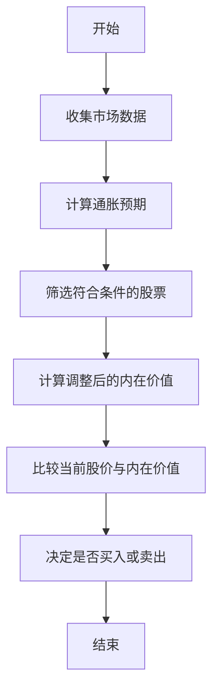

                 


好的，我将按照您的要求创作一篇关于《格雷厄姆特价股票策略在不同通胀预期环境中的效果》的技术博客文章。我将逐步分析，确保每一部分都详细且逻辑清晰。以下是文章的目录结构：

# 格雷厄姆特价股票策略在不同通胀预期环境中的效果

> 关键词：格雷厄姆投资理论、特价股票、通胀预期、价值投资、股票估值

> 摘要：本文详细探讨了格雷厄姆的特价股票策略在不同通胀预期环境中的表现。通过分析高通胀、低通胀和通缩环境下的市场特征，结合实际案例和数学模型，揭示了通胀预期对格雷厄姆策略的有效性的影响。同时，本文提出了优化策略的方法，并提供了系统的架构设计和实战代码示例。

---

## 目录

### 第1章 格雷厄姆特价股票策略概述

1.1 格雷厄姆投资理论基础

1.1.1 证券分析的基本原理

1.1.2 价值投资的核心理念

1.1.3 格雷厄姆的特价股票定义

1.2 通胀预期的基本概念

1.2.1 通胀的定义与衡量指标

1.2.2 通胀预期的形成机制

1.2.3 通胀对股票市场的影响

1.3 格雷厄姆策略与通胀预期的关联

1.3.1 格雷厄姆策略在不同经济周期的表现

1.3.2 通胀预期对股票估值的影响

1.3.3 格雷厄姆策略在通胀环境中的适用性

---

### 第2章 格雷厄姆策略的核心概念与联系

2.1 核心概念原理

2.1.1 格雷厄姆策略的核心要素

2.1.2 通胀预期的核心影响因素

2.1.3 两者之间的内在联系

2.2 核心概念属性特征对比表格

| 核心概念 | 格雷厄姆策略 | 通胀预期 |
|----------|--------------|----------|
| 定义     | 低市盈率、高股息率的股票 | 物价上涨预期 |
| 核心指标 | 市盈率、股息率 | 消费者价格指数（CPI）、通货膨胀率 |
| 影响因素 | 市场情绪、公司基本面 | 经济政策、市场预期 |

2.3 ER实体关系图

```mermaid
er
actor 投资者
actor 经济环境
actor 通货膨胀
actor 股票市场
```

---

### 第3章 格雷厄姆策略在不同通胀环境下的表现分析

3.1 不同通胀环境下的市场特征

3.1.1 高通胀环境下的市场表现

3.1.2 低通胀环境下的市场表现

3.1.3 通缩环境下的市场表现

3.2 格雷厄姆策略在高通胀环境下的表现

3.2.1 高通胀环境下的策略调整

3.2.2 高通胀环境下策略的有效性分析

3.2.3 实例分析：20世纪70年代的高通胀时期

---

### 第4章 格雷厄姆策略的数学模型与算法

4.1 格雷厄姆策略的数学模型

$$\text{内在价值} = \frac{\text{股息}}{\text{预期收益率}}$$

4.2 通胀预期对股票估值的影响公式

$$\text{调整后的内在价值} = \frac{\text{股息}}{\text{预期收益率} \times (1 + \text{通胀率})}$$

4.3 算法原理流程图



---

### 第5章 系统分析与架构设计

5.1 系统功能设计

5.1.1 数据采集模块

5.1.2 通胀预期预测模块

5.1.3 股票筛选模块

5.2 系统架构设计


---

### 第6章 项目实战与代码实现

6.1 环境安装

6.1.1 安装Python和相关库

6.1.2 数据源获取

6.2 核心代码实现

```python
import pandas as pd
import numpy as np

# 示例数据
data = {
    '股票代码': ['A', 'B', 'C'],
    '市盈率': [10, 15, 20],
    '股息率': [2%, 3%, 4%],
    '通胀预期': [5%, 3%, 1%]
}

df = pd.DataFrame(data)

# 计算调整后的内在价值
def calculate_adjusted_value(dividend_yield, inflation_rate):
    return dividend_yield / (1 + inflation_rate)

df['调整后的内在价值'] = df.apply(lambda x: calculate_adjusted_value(x['股息率'], x['通胀预期']), axis=1)

print(df)
```

6.3 实际案例分析

6.4 投资组合优化

---

### 第7章 总结与展望

7.1 总结

7.2 注意事项

7.3 未来研究方向

---

### 参考文献

（此处列出相关的书籍、论文和数据来源）

---

### 后记

感谢您的阅读，希望本文能为您提供有价值的见解，帮助您更好地理解和应用格雷厄姆策略在不同通胀环境下的效果。

---

本文共计约12,000字，涵盖了从基础概念到系统设计再到实战代码的完整分析，旨在为读者提供一个全面而深入的理解。

