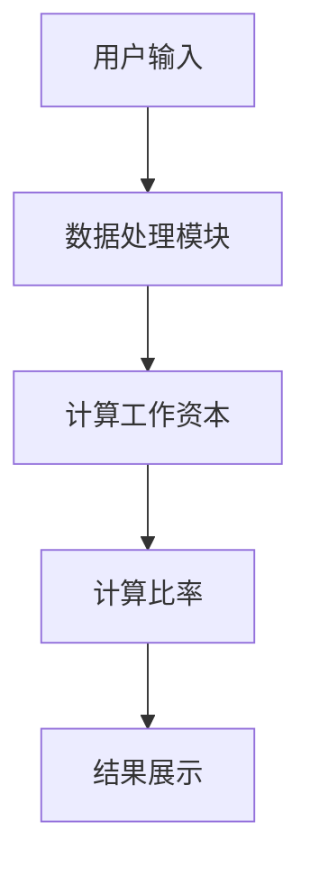

                 


# 格雷厄姆的'工作资本'分析：评估公司短期偿债能力

## 关键词
- 工作资本分析
- 短期偿债能力
- 流动资产
- 流动负债
- 财务健康评估
- 格雷厄姆投资理论
- 企业财务分析

## 摘要
本文详细探讨了格雷厄姆的“工作资本”分析方法，重点分析其在评估公司短期偿债能力中的应用。通过介绍工作资本的定义、核心概念、数学模型、系统架构设计以及实际项目案例，本文为读者提供了一个全面理解并应用工作资本分析的框架。通过本文，读者将能够掌握如何通过工作资本分析评估企业的短期偿债能力，并在实际项目中应用这些分析方法。

---

## 第一部分: 格雷厄姆的“工作资本”分析概述

### 第1章: 工作资本分析的背景与重要性

#### 1.1 工作资本分析的背景
- **1.1.1 财务健康评估的核心指标**  
  工作资本（Working Capital）是财务健康评估中的核心指标之一，它反映了企业在短期内偿还债务的能力。格雷厄姆在其投资理论中，将工作资本作为评估企业财务健康的重要依据。

- **1.1.2 格雷厄姆投资理论的基石**  
  本·格雷厄姆是价值投资的鼻祖，他强调企业的内在价值，并将工作资本作为评估企业价值的重要组成部分。工作资本的健康直接关系到企业的短期偿债能力和财务稳定性。

- **1.1.3 现代企业短期偿债能力的重要性**  
  在现代商业环境中，企业面临的财务风险日益复杂，短期偿债能力的评估对于企业的生存和发展至关重要。工作资本分析为企业提供了重要的财务健康指标。

#### 1.2 工作资本的定义与范围
- **1.2.1 工作资本的定义**  
  工作资本是指流动资产减去流动负债，即：$$ \text{工作资本} = \text{流动资产} - \text{流动负债} $$  
  它反映了企业在短期内可使用的资金净额。

- **1.2.2 工作资本的组成要素**  
  - **流动资产**：包括现金、应收账款、存货等。
  - **流动负债**：包括应付账款、短期贷款、应计费用等。

- **1.2.3 工作资本与财务健康的关系**  
  工作资本的正负直接影响企业的短期偿债能力。正的工作资本意味着企业有足够的流动资产偿还短期负债，而负的工作资本则可能表明企业存在短期偿债压力。

---

### 第2章: 工作资本分析的核心概念

#### 2.1 流动资产与流动负债的构成
- **2.1.1 流动资产的定义与分类**  
  流动资产是指企业在一年内可以转化为现金的资产，主要包括：
  - 现金及现金等价物
  - 应收账款
  - 存货
  - 其他应收款

- **2.1.2 流动负债的定义与分类**  
  流动负债是指企业在一年内必须偿还的债务，主要包括：
  - 应付账款
  - 短期贷款
  - 应付工资
  - 应交税费

- **2.1.3 流动资产与流动负债的关系**  
  流动资产和流动负债的差额即为工作资本。$$ \text{工作资本} = \text{流动资产} - \text{流动负债} $$

#### 2.2 核心比率与指标
- **2.2.1 流动比率（Current Ratio）**  
  流动比率是流动资产与流动负债的比值，用于衡量企业偿还短期债务的能力。$$ \text{流动比率} = \frac{\text{流动资产}}{\text{流动负债}} $$

- **2.2.2 速动比率（Quick Ratio）**  
  速动比率是将流动资产中扣除存货后的剩余部分与流动负债的比值。$$ \text{速动比率} = \frac{\text{流动资产} - \text{存货}}{\text{流动负债}} $$

- **2.2.3 现金比率（Cash Ratio）**  
  现金比率是现金及现金等价物与流动负债的比值。$$ \text{现金比率} = \frac{\text{现金及现金等价物}}{\text{流动负债}} $$

---

### 第3章: 工作资本分析的数学模型与公式

#### 3.1 流动比率的计算公式
$$ \text{流动比率} = \frac{\text{流动资产}}{\text{流动负债}} $$

#### 3.2 速动比率的计算公式
$$ \text{速动比率} = \frac{\text{流动资产} - \text{存货}}{\text{流动负债}} $$

#### 3.3 现金比率的计算公式
$$ \text{现金比率} = \frac{\text{现金及现金等价物}}{\text{流动负债}} $$

---

### 第4章: 工作资本分析的系统架构设计

#### 4.1 系统功能设计
- **4.1.1 数据输入**  
  - 收集企业的流动资产和流动负债数据。
- **4.1.2 数据处理**  
  - 计算流动资产和流动负债的差额，得出工作资本。
  - 计算流动比率、速动比率等核心指标。
- **4.1.3 结果展示**  
  - 以图表形式展示工作资本和相关比率。

#### 4.2 系统架构设计


---

### 第5章: 工作资本分析的项目实战

#### 5.1 安装必要的库
```python
pip install pandas numpy
```

#### 5.2 核心代码实现
```python
import pandas as pd
import numpy as np

# 示例数据
data = {
    '流动资产': [100, 150, 200],
    '流动负债': [50, 75, 100]
}

df = pd.DataFrame(data)

# 计算工作资本
df['工作资本'] = df['流动资产'] - df['流动负债']

# 计算流动比率
df['流动比率'] = df['流动资产'] / df['流动负债']

# 计算速动比率（假设存货占流动资产的30%）
df['存货'] = df['流动资产'] * 0.3
df['速动资产'] = df['流动资产'] - df['存货']
df['速动比率'] = df['速动资产'] / df['流动负债']

print(df)
```

#### 5.3 案例分析
以一家制造公司为例，分析其工作资本和相关比率：
- 流动资产：200万元
- 流动负债：100万元
- 存货：60万元

计算结果：
- 工作资本：100万元
- 流动比率：2
- 速动比率：1.4

---

### 第6章: 工作资本分析的最佳实践与总结

#### 6.1 关键点总结
- 工作资本的正负直接影响企业的短期偿债能力。
- 流动比率和速动比率是评估短期偿债能力的重要指标。
- 存货的管理对速动比率的影响较大，需特别关注。

#### 6.2 注意事项
- 工作资本分析应结合企业实际业务情况。
- 需要定期更新和分析财务数据。
- 结合其他财务指标（如ROE、净利润率）进行综合评估。

#### 6.3 拓展阅读
- 格雷厄姆的《证券分析》
- 《财务报表分析与股票估值》

---

## 结语
通过本文的详细分析，读者可以全面了解格雷厄姆的“工作资本”分析方法，并将其应用于实际的企业财务分析中。工作资本分析不仅是评估企业短期偿债能力的重要工具，也是投资决策中的关键指标。希望本文能为读者提供有价值的参考和启发。

