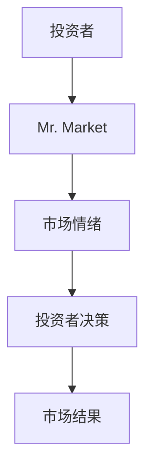

                 


# 格雷厄姆的Mr. Market比喻：理解市场心理

## 关键词：
- 投资者行为分析
- 市场心理
- 市场情绪分析
- 投资策略制定
- 风险管理

## 摘要：
本文章深入探讨了本杰明·格雷厄姆的Mr. Market比喻，分析其在理解市场心理中的应用。通过详细讲解市场心理的波动性、投资者行为模式、技术分析与基本面分析的结合，以及风险管理策略，文章为投资者提供了一种系统性的市场分析方法。结合实际案例和系统架构设计，本文展示了如何将Mr. Market的比喻应用于实际投资决策，帮助投资者在复杂多变的市场环境中做出明智的选择。

---

# 1. 引言

## 1.1 Mr. Market的背景与重要性
- 本杰明·格雷厄姆的Mr. Market是投资领域的重要比喻，用于描述市场情绪的波动性。
- Mr. Market代表市场，投资者需要与他互动，理解其行为模式，避免被其情绪左右。

---

# 2. 核心概念：市场心理的波动性

## 2.1 市场情绪的周期性
- 市场情绪通常呈现周期性波动，从乐观到悲观，再从悲观到乐观。
- 使用对比表格分析不同市场情绪阶段的特点。

| 市场情绪阶段 | 特点 | 投资者行为 |
|--------------|------|------------|
| 激情阶段     | 过度乐观 | 过度买入   |
| 理智阶段     | 理性评估 | 选择性买入 |
| 感性阶段     | 恐慌情绪 | 过度卖出   |
| 消极阶段     | 绝对悲观 | 选择性卖出 |

## 2.2 投资者行为模式
- 使用Mermaid流程图展示投资者行为模式。



---

# 3. 市场分析方法

## 3.1 技术分析与Mr. Market
- 技术分析的核心假设：市场价格反映所有信息。
- 常用技术指标：移动平均线（MA）、相对强弱指数（RSI）、MACD。

### 3.1.1 移动平均线（MA）的数学模型
- 简单移动平均线公式：
  $$ S_{MA}(n) = \frac{1}{n} \sum_{i=1}^{n} P_i $$
  其中，$P_i$为第i天的价格，$n$为天数。

### 3.1.2 相对强弱指数（RSI）的计算
- RSI公式：
  $$ RSI = \frac{100}{1 + \frac{A}{B}} $$
  其中，$A$为上涨幅度，$B$为下跌幅度。

## 3.2 基本面分析与Mr. Market
- 通过分析公司的财务状况和行业前景，评估其内在价值。

---

# 4. 投资策略制定

## 4.1 价值投资与成长投资
- 价值投资：寻找被市场低估的股票。
- 成长投资：投资于高成长潜力的公司。

### 4.1.1 价值投资的筛选标准
- 市盈率（P/E）：$$ P/E = \frac{\text{股价}}{\text{每股收益}} $$
- 市净率（P/B）：$$ P/B = \frac{\text{股价}}{\text{每股净资产}} $$

## 4.2 根据市场情绪调整策略
- 在市场恐慌时买入，在市场狂热时卖出。

---

# 5. 风险管理策略

## 5.1 风险评估与控制
- 使用VaR模型评估潜在损失。
- VaR计算公式：
  $$ VaR = \mu + z \cdot \sigma $$
  其中，$\mu$为平均回报率，$z$为标准正态分布的分位数，$\sigma$为标准差。

## 5.2 投资组合优化
- 使用现代投资组合理论（MPT）构建最优投资组合。

### 5.2.1 MPT的核心原理
- 通过分散投资降低风险。
- 使用Python代码优化投资组合。

---

# 6. 案例分析与实战

## 6.1 互联网泡沫案例
- 2000年互联网泡沫：Mr. Market的过度乐观导致市场崩盘。

## 6.2 2008年金融危机
- 市场恐慌阶段：投资者的非理性卖出行为加剧了危机。

---

# 7. 系统架构设计

## 7.1 数据源选择
- 股票数据、市场指数、经济指标。

## 7.2 数据处理流程
- 数据清洗、特征提取、数据标准化。

## 7.3 系统功能设计
- 市场情绪分析模块、投资策略模块、风险管理模块。

---

# 8. 项目实战：Python代码实现

## 8.1 数据获取与处理
```python
import pandas as pd
import numpy as np

# 获取数据
data = pd.read_csv('stock_data.csv')

# 数据清洗
data = data.dropna()
data = data[~data['volume'].eq(0)]
```

## 8.2 技术指标计算
```python
# 计算移动平均线
data['ma_50'] = data['close'].rolling(50).mean()

# 计算RSI
def calculate_rsi(data, period=14):
    diff = data['close'].diff()
    up = diff.where(diff > 0, 0)
    down = -diff.where(diff < 0, 0)
    rs = up.rolling(period).mean() / down.rolling(period).mean()
    rsi = 100 - 100/(1 + rs)
    return rsi
data['rsi'] = calculate_rsi(data)
```

## 8.3 投资策略回测
```python
# 策略回测
data['signal'] = 1  # 1表示持有，-1表示卖出

# 计算收益
data['return'] = data['close'].pct_change()
data['strategy_return'] = data['signal'].shift(1) * data['return']
```

---

# 9. 总结与展望

## 9.1 总结
- Mr. Market的比喻帮助投资者理解市场心理，制定合理的投资策略。
- 结合技术分析、基本面分析和风险管理，投资者可以在市场波动中保持理性。

## 9.2 展望
- 结合大数据和人工智能技术，进一步优化市场分析和投资决策。
- 深入研究投资者行为，开发更精准的行为预测模型。

---

# 结语

通过理解和应用本杰明·格雷厄姆的Mr. Market比喻，投资者可以更好地应对市场波动，做出明智的投资决策。希望本文能为您提供有价值的见解，帮助您在投资领域取得成功。

