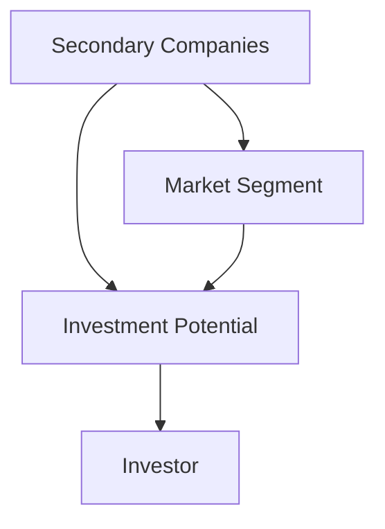
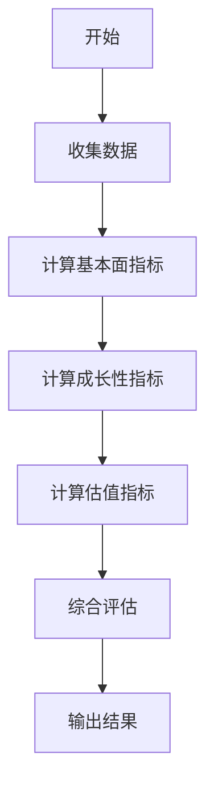

                 


# 格雷厄姆的Secondary Companies：二线公司的潜力

## 关键词：Secondary Companies, 格雷厄姆, 二线公司, 投资潜力, 价值投资, 股票分析

## 摘要：  
本文深入探讨了格雷厄姆在其投资理论中提到的Secondary Companies（二线公司）的潜力。通过分析二线公司的定义、特点、市场定位以及其在价值投资中的重要性，本文揭示了二线公司相对于一线公司的独特优势和投资机会。文章还结合实际案例，详细讲解了如何通过量化分析和系统设计来识别和评估二线公司的投资潜力，为投资者提供了实用的策略和方法。

---

# 第一部分: 背景介绍

## 第1章: 格雷厄姆的Secondary Companies概述

### 1.1 问题背景
#### 1.1.1 什么是Secondary Companies
Secondary Companies（二线公司）是指那些在行业中处于第二或第三梯队，规模较小但具有较高增长潜力的企业。它们通常专注于特定细分市场，具有较高的市场定位和竞争优势。

#### 1.1.2 Secondary Companies的定义与特征
- **定义**：二线公司是指那些在行业中排名靠后，但具备良好管理和增长潜力的企业。
- **特征**：
  - 规模较小
  - 专注于细分市场
  - 成本控制能力强
  - 投资门槛低
  - 潜在回报高

#### 1.1.3 Secondary Companies的市场定位
二线公司在市场中通常以差异化竞争为策略，通过专注于特定领域来获取市场份额。它们的优势在于灵活性和创新能力，能够在快速变化的市场环境中快速调整。

### 1.2 格雷厄姆的价值投资理论
#### 1.2.1 格雷厄姆投资理念的核心思想
本杰明·格雷厄姆是价值投资的鼻祖，他主张以低于内在价值的价格买入优质股票，长期持有，获取超额收益。

#### 1.2.2 Secondary Companies在格雷厄姆理论中的地位
在格雷厄姆的投资理论中，Secondary Companies被视为具有潜力的投资目标，尤其是那些被市场低估但具备良好基本面的企业。

#### 1.2.3 Secondary Companies的投资价值
- **低估性**：二线公司的估值通常低于其实际价值。
- **增长性**：二线公司往往在特定领域具有较高的增长潜力。
- **安全性**：相对于一线公司，二线公司的风险较小，回报稳定。

### 1.3 Secondary Companies的潜力分析
#### 1.3.1 Secondary Companies的市场机会
- **细分市场**：二线公司专注于特定领域，能够在细分市场中占据主导地位。
- **增长空间**：随着市场需求的变化，二线公司能够快速调整策略，抓住增长机会。

#### 1.3.2 Secondary Companies的竞争优势
- **成本优势**：二线公司通常具有较强的成本控制能力。
- **创新能力**：二线公司更灵活，能够快速适应市场变化。

#### 1.3.3 Secondary Companies的长期发展趋势
- **行业整合**：随着行业整合，二线公司有机会通过收购或合作扩大规模。
- **技术创新**：技术创新为二线公司提供了新的增长点。

---

## 第2章: Secondary Companies的核心概念与联系

### 2.1 核心概念原理
#### 2.1.1 Secondary Companies的定义与属性
- **定义**：二线公司是指在行业中排名靠后，但具备良好管理和增长潜力的企业。
- **属性**：
  - 规模较小
  - 专注于细分市场
  - 具有成本控制优势

#### 2.1.2 Secondary Companies的分类与特征
- **分类**：
  - 行业型二线公司：专注于特定行业，如科技、医疗等。
  - 地区型二线公司：专注于特定地区或区域市场。
- **特征**：
  - 专注性：专注于特定领域。
  - 灵活性：能够快速调整策略。
  - 成本优势：在成本控制方面具有优势。

#### 2.1.3 Secondary Companies的市场地位与影响
- **市场地位**：二线公司在市场中通常以差异化竞争为策略，通过专注于特定领域来获取市场份额。
- **市场影响**：二线公司通过专注于细分市场，能够在市场中占据一席之地，并为投资者提供高回报。

### 2.2 核心概念对比表格
```markdown
| 比较维度       | Secondary Companies          | Primary Companies          |
|----------------|------------------------------|-----------------------------|
| 定义           | 二线公司，规模较小，潜力大    | 一线公司，规模大，行业龙头 |
| 市场定位       | 细分市场，专注特定领域       | 主流市场，占据行业主导地位 |
| 投资价值       | 高增长潜力，估值相对较低     | 稳定收益，估值较高           |
| 竞争优势       | 灵活性强，专注细分市场       | 规模大，品牌影响力强          |
| 风险           | 中等风险，回报潜力高         | 低风险，回报相对稳定         |
```

### 2.3 ER实体关系图


---

## 第3章: Secondary Companies的潜力评估与分析

### 3.1 评估Secondary Companies的核心指标
#### 3.1.1 基本面分析
- **收入与利润**：评估公司的盈利能力。
- **资产负债表**：评估公司的财务健康状况。
- **现金流**：评估公司的资金流动性。

#### 3.1.2 成长性分析
- **行业增长潜力**：评估公司所在行业的增长空间。
- **公司竞争优势**：评估公司是否具备可持续的竞争优势。

#### 3.1.3 估值分析
- **市盈率（P/E）**：评估公司的估值是否合理。
- **市净率（P/B）**：评估公司的资产价值是否被低估。

### 3.2 Secondary Companies的潜力模型


### 3.3 潜力评估的数学模型
#### 3.3.1 基本面指标
$$ \text{盈利能力} = \frac{\text{净利润}}{\text{营业收入}} $$

#### 3.3.2 成长性指标
$$ \text{年增长率} = \frac{\text{当年增长量}}{\text{上年基数}} \times 100\% $$

#### 3.3.3 估值指标
$$ \text{市盈率} = \frac{\text{股价}}{\text{每股收益}} $$

---

## 第4章: Secondary Companies的投资策略与风险管理

### 4.1 投资策略
#### 4.1.1 格雷厄姆的买入策略
- **买入标准**：以低于内在价值的价格买入股票。
- **买入时机**：在市场低迷时买入低估股票。

#### 4.1.2 投资组合配置
- **分散投资**：将资金分散投资于多个二线公司，降低风险。
- **长期持有**：坚持长期投资，避免短期波动。

### 4.2 风险管理
#### 4.2.1 风险评估
- **行业风险**：评估公司所在行业的风险。
- **财务风险**：评估公司的财务健康状况。

#### 4.2.2 风险控制
- **设定止损点**：在股价下跌到一定幅度时及时止损。
- **定期评估**：定期评估投资组合的绩效，及时调整策略。

---

## 第5章: Secondary Companies的未来发展与趋势

### 5.1 未来发展趋势
#### 5.1.1 行业整合
- **并购机会**：二线公司通过并购扩大规模。
- **资源整合**：通过资源整合提升竞争力。

#### 5.1.2 技术创新
- **技术创新**：技术创新为二线公司提供了新的增长点。
- **数字化转型**：数字化转型帮助二线公司提升效率。

### 5.2 投资机会
#### 5.2.1 细分市场机会
- **新兴行业**：新兴行业中的二线公司具有较大的增长潜力。
- **技术创新**：技术创新领域的二线公司具备较高的投资价值。

#### 5.2.2 全球化机会
- **国际市场**：二线公司可以通过拓展国际市场扩大业务。
- **跨国合作**：通过跨国合作提升竞争力。

---

## 第6章: 结论与展望

### 6.1 研究总结
本文深入分析了格雷厄姆的Secondary Companies的投资潜力，揭示了二线公司在价值投资中的重要性。通过量化分析和系统设计，本文为投资者提供了实用的策略和方法。

### 6.2 未来展望
随着市场环境的变化，Secondary Companies的投资机会将更加多样化。未来的研究可以进一步探讨如何通过技术创新和数字化转型提升二线公司的竞争力。

---

## 参考文献
1. 本杰明·格雷厄姆：《价值投资入门》
2. 投资分析协会：《股票投资策略》
3. 行业研究报告：《Secondary Companies的市场分析》

---

通过以上分析，我们可以看出，Secondary Companies（二线公司）在价值投资中具有重要的地位。它们通常具备较高的增长潜力和低估的估值，是投资者获取超额收益的理想选择。未来，随着市场环境的变化，二线公司的发展潜力将进一步释放，为投资者带来更多机会。

