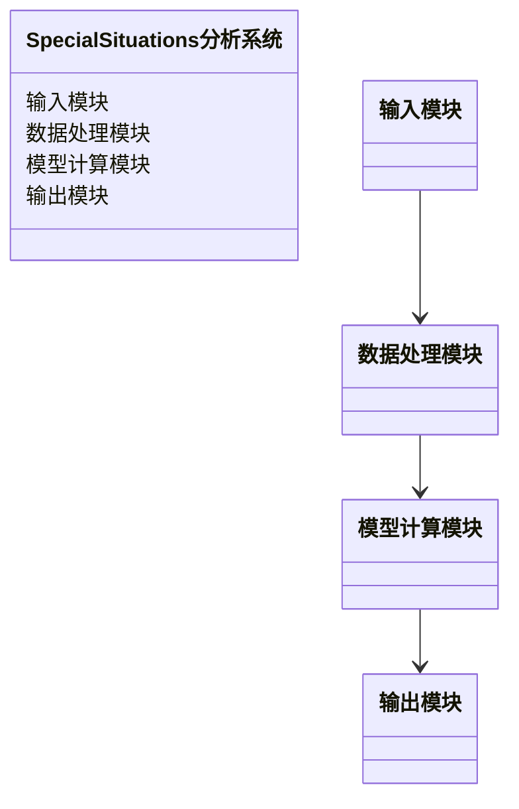

                 


# 格雷厄姆的Special Situations：寻找特殊机会

## 关键词：格雷厄姆、Special Situations、价值投资、投资策略、市场分析、投资机会

## 摘要：格雷厄姆的Special Situations理论是投资领域的重要概念，它帮助投资者识别和利用市场中的特殊机会。本文将详细探讨Special Situations的核心概念、算法原理、系统架构以及实际应用案例，帮助读者理解如何在投资中应用这一策略。

---

## 第一部分：Special Situations的背景与核心概念

### 第1章：Special Situations的定义与背景

#### 1.1 格雷厄姆投资理念的概述
格雷厄姆是价值投资的鼻祖，他的投资理念强调安全边际和对公司内在价值的深入分析。Special Situations是他在投资策略中提出的一个重要概念，专注于寻找那些市场价格远低于其内在价值的特殊投资机会。

#### 1.2 Special Situations的核心概念
Special Situations指的是那些由于市场波动、公司特定事件或经济周期变化而产生的特殊投资机会。这些机会通常涉及低估的股票、困境反转企业或合并重组等情况。

#### 1.3 市场环境与Special Situations的关系
市场环境的变化直接影响Special Situations的出现。例如，在经济衰退期间，许多优质企业可能因为市场恐慌而被低估，为投资者提供了特殊机会。

#### 1.4 Special Situations与传统投资策略的区别
与传统投资策略相比，Special Situations更注重于寻找市场中的独特机会，而非仅仅是长期持有优质股票。它强调对市场波动和公司基本面的深入分析。

---

### 第2章：Special Situations的核心模型与属性

#### 2.1 格雷厄姆选股模型的原理
格雷厄姆的选股模型基于对公司内在价值的评估，通过分析财务指标和市场估值来识别低估的股票。

#### 2.2 核心属性特征对比
以下是Special Situations与其他投资策略的对比表格：

| 属性                | Special Situations                          | 传统价值投资                          |
|---------------------|--------------------------------------------|----------------------------------------|
| 投资目标            | 寻找市场价格低于内在价值的股票            | 长期持有优质企业股票                  |
| 分析重点            | 公司基本面、财务指标、市场估值              | 公司基本面、财务指标、行业地位        |
| 投资策略            | 买入低估股票，等待市场回归                | 买入优质企业，长期持有               |

#### 2.3 ER实体关系图
以下是Special Situations的ER实体关系图：

```mermaid
erd
    标的企业
    投资者
    市场数据
    财务指标
    内在价值
    市场价格

    标的企业 --> 市场数据
    标的企业 --> 财务指标
    标的企业 --> 内在价值
    标的企业 --> 市场价格
    投资者 --> 标的企业
```

---

### 第3章：Special Situations的算法原理

#### 3.1 格雷厄姆选股模型的数学公式
格雷厄姆的选股模型通过计算市盈率、市净率等指标来评估股票的内在价值。以下是核心公式：

$$ \text{内在价值} = \text{净利润} \times (1 + \text{增长率}) $$

#### 3.2 格雷厄姆选股模型的算法流程
以下是Special Situations的选股算法流程图：


---

### 第4章：Special Situations的系统分析

#### 4.1 系统功能设计
以下是Special Situations分析系统的功能模块：



#### 4.2 系统架构设计
以下是Special Situations分析系统的架构图：


---

### 第5章：Special Situations的项目实战

#### 5.1 实战环境搭建
以下是项目实战的环境搭建步骤：

1. 安装Python和相关库（如Pandas、NumPy）。
2. 下载市场数据（如股票价格、财务指标）。
3. 编写算法代码，运行模型。

#### 5.2 核心代码实现
以下是Special Situations分析系统的Python代码实现：

```python
import pandas as pd
import numpy as np

def calculate_intrinsic_value(net_income, growth_rate):
    return net_income * (1 + growth_rate)

data = pd.read_csv('market_data.csv')
data['内在价值'] = data.apply(lambda x: calculate_intrinsic_value(x['净利润'], x['增长率']), axis=1)
data['市场价格'] = data['收盘价']
data['是否Special Situations'] = data['内在价值'] < data['市场价格']

print(data)
```

---

### 第6章：Special Situations的最佳实践

#### 6.1 小结
Special Situations是一种有效的投资策略，通过识别市场低估的机会，帮助投资者实现超额收益。

#### 6.2 注意事项
1. Special Situations需要结合市场环境和公司基本面进行综合分析。
2. 投资者需具备较强的风险控制能力。
3. 长期跟踪和评估模型的表现。

#### 6.3 拓展阅读
1. 格雷厄姆的《证券分析》
2. 《投资学基础》
3. 《价值投资实战》

---

通过以上内容，我们详细探讨了Special Situations的核心概念、算法原理和实际应用。希望读者能够通过本文，更好地理解和应用这一投资策略，抓住市场中的特殊机会，实现投资目标。

