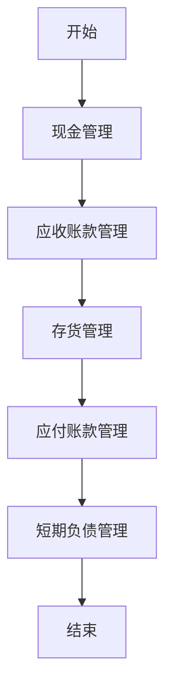
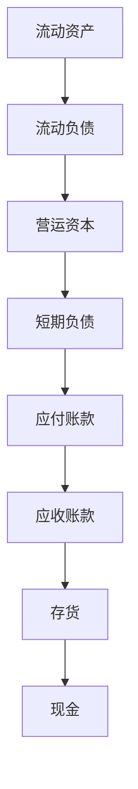
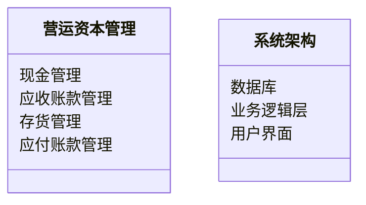
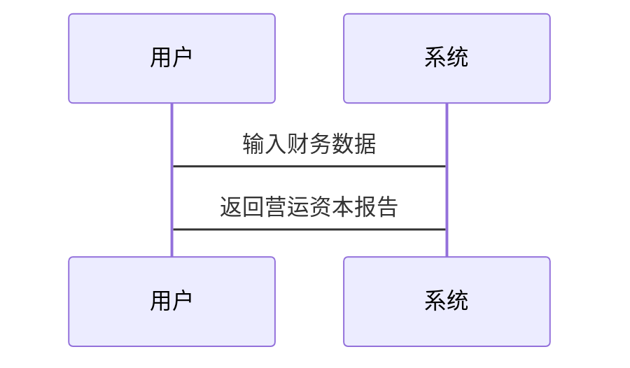

                 


# 格雷厄姆的Working Capital管理：运营效率的重要性

**关键词**：Working Capital，营运资本管理，格雷厄姆，流动资产，流动负债，财务比率，投资理念

**摘要**：本文深入探讨了格雷厄姆的Working Capital管理理论，结合营运资本管理的核心概念、算法原理、系统架构以及项目实战，详细分析了如何通过优化营运资本管理提升企业运营效率。文章通过逻辑清晰的结构和丰富的案例，展示了格雷厄姆投资理念在现代财务管理中的应用价值。

---

## 第一部分: 背景介绍与核心概念

### 第1章: Working Capital管理概述

#### 1.1 Working Capital的基本概念

##### 1.1.1 营运资本的定义与组成部分
营运资本（Working Capital）是企业流动资产与流动负债之间的差额，反映了企业在短期内的财务健康状况。其核心组成部分包括：

- **流动资产**：现金及现金等价物、应收账款、存货等。
- **流动负债**：短期借款、应付账款、应付工资等。

##### 1.1.2 营运资本管理的重要性
营运资本管理是企业财务管理的核心内容之一，直接影响企业的偿债能力、流动性和运营效率。通过优化营运资本管理，企业可以降低财务风险，提高资金使用效率。

##### 1.1.3 营运资本管理的核心目标
- **维持流动性**：确保企业有足够的资金应对短期债务。
- **提高周转效率**：加快资金周转速度，提升运营效率。
- **降低风险**：通过合理配置资产和负债，降低企业财务风险。

#### 1.2 营运资本管理的背景与现状

##### 1.2.1 当前企业面临的营运资本管理挑战
- 市场波动加剧，企业面临更大的流动性风险。
- 数字化转型要求企业采用更高效的管理工具和技术。
- 全球经济不确定性增加，企业需要更灵活的财务策略。

##### 1.2.2 营运资本管理的边界与外延
营运资本管理不仅关注企业内部的流动资产和流动负债，还涉及外部市场环境、行业特点和管理层决策。

##### 1.2.3 营运资本管理的演变历程
从传统的静态管理到现代的动态管理，营运资本管理经历了从简单记录到复杂模型的演变。

#### 1.3 格雷厄姆的投资理念与营运资本管理

##### 1.3.1 格雷厄姆的价值投资理论
格雷厄姆强调“安全边际”和“内在价值”，主张以低于内在价值的价格买入优质股票。

##### 1.3.2 营运资本管理与企业价值的关系
格雷厄姆认为，企业的营运资本管理能力是决定企业价值的重要因素。通过优化营运资本管理，企业可以提升整体价值。

##### 1.3.3 格雷厄姆理论在营运资本管理中的应用
格雷厄姆的理论为营运资本管理提供了投资视角，帮助企业通过优化资本结构和提高运营效率来实现价值增长。

### 第2章: 营运资本管理的核心要素

#### 2.1 营运资本的构成要素

##### 2.1.1 现金与现金等价物
现金是营运资本的重要组成部分，包括库存现金、银行存款等。合理管理现金流量是营运资本管理的关键。

##### 2.1.2 应收账款
应收账款是企业赊销形成的债权，其管理直接影响企业的资金周转效率。

##### 2.1.3 存货
存货管理是营运资本管理的重要环节，涉及库存控制、成本优化和周转效率提升。

##### 2.1.4 应付账款
应付账款是企业因赊购形成的债务，合理管理应付账款可以降低企业的短期负债压力。

##### 2.1.5 短期负债
短期负债包括短期借款、应付票据等，其管理直接影响企业的流动性风险。

#### 2.2 营运资本管理的驱动因素

##### 2.2.1 企业运营效率
运营效率是营运资本管理的核心驱动因素，直接影响企业的资金周转速度和盈利能力。

##### 2.2.2 财务杠杆与资本结构
合理的财务杠杆可以提高企业的资金使用效率，但过高的杠杆会增加财务风险。

##### 2.2.3 市场环境与行业特点
市场环境和行业特点影响企业的营运资本管理策略，例如周期性行业需要更高的流动性管理。

##### 2.2.4 管理层决策
管理层的决策能力直接影响企业的营运资本管理效果，例如库存策略、应收账款管理等。

#### 2.3 营运资本管理的系统性分析

##### 2.3.1 营运资本管理的系统架构
营运资本管理是一个复杂的系统工程，涉及企业内部和外部的多个环节。

##### 2.3.2 营运资本管理的流程图


##### 2.3.3 营运资本管理的KPI指标
- 流动比率（Current Ratio）
- 速动比率（Quick Ratio）
- 存货周转率（Inventory Turnover）
- 应收账款周转率（Receivables Turnover）

---

## 第二部分: 核心概念与联系

### 第3章: 营运资本管理的核心概念与联系

#### 3.1 营运资本管理的核心概念

##### 3.1.1 营运资本的流动性与收益性
流动性是指营运资本的变现能力，收益性是指营运资本的盈利能力。两者之间存在权衡关系。

##### 3.1.2 营运资本的周转效率
周转效率是衡量营运资本管理效果的重要指标，包括存货周转率、应收账款周转率等。

##### 3.1.3 营运资本的风险管理
营运资本管理需要关注流动性风险、信用风险和市场风险。

#### 3.2 营运资本管理的关键属性特征对比

##### 3.2.1 流动资产与流动负债的对比
| 属性 | 流动资产 | 流动负债 |
|------|----------|----------|
| 定义 | 可在一年内变现的资产 | 一年内需要偿还的债务 |
| 例子 | 现金、存货 | 应付账款、短期借款 |

##### 3.2.2 营运资本与非营运资本的对比
| 属性 | 营运资本 | 非营运资本 |
|------|----------|----------|
| 定义 | 支持日常运营的资本 | 支持长期发展的资本 |
| 例子 | 应收账款、存货 | 长期股权投资 |

##### 3.2.3 营运资本与长期资本的对比
| 属性 | 营运资本 | 长期资本 |
|------|----------|----------|
| 定义 | 支持日常运营的资本 | 支持长期发展的资本 |
| 例子 | 现金、应收账款 | 长期借款、债券 |

#### 3.3 营运资本管理的ER实体关系图


---

## 第三部分: 算法原理与数学模型

### 第4章: 营运资本管理的算法原理

#### 4.1 营运资本管理的核心算法

##### 4.1.1 营运资本周转率计算
```python
def calculate_working_capital_turnover(net_income, net_operating_assets):
    return net_income / net_operating_assets
```

##### 4.1.2 流动比率计算
```python
def calculate_current_ratio(current_assets, current_liabilities):
    return current_assets / current_liabilities
```

#### 4.2 算法原理的数学模型

##### 4.2.1 流动比率公式
$$ \text{流动比率} = \frac{\text{流动资产}}{\text{流动负债}} $$

##### 4.2.2 速动比率公式
$$ \text{速动比率} = \frac{\text{流动资产} - \text{存货}}{\text{流动负债}} $$

---

## 第四部分: 系统分析与架构设计

### 第5章: 营运资本管理系统架构

#### 5.1 系统功能设计

##### 5.1.1 领域模型设计


#### 5.2 系统架构设计

##### 5.2.1 系统架构图


#### 5.3 系统接口设计

##### 5.3.1 接口描述
- 数据输入接口：接收企业的财务数据。
- 数据处理接口：计算营运资本相关指标。
- 数据输出接口：生成报告和分析结果。

#### 5.4 系统交互设计

##### 5.4.1 交互流程图


---

## 第五部分: 项目实战

### 第6章: 营运资本管理项目实战

#### 6.1 环境安装

##### 6.1.1 安装Python和相关库
```bash
pip install numpy pandas matplotlib
```

#### 6.2 核心实现源代码

##### 6.2.1 计算流动比率
```python
import pandas as pd

def calculate_current_ratio(current_assets, current_liabilities):
    return current_assets / current_liabilities

# 示例数据
data = {
    'current_assets': [100000, 150000],
    'current_liabilities': [50000, 75000]
}
df = pd.DataFrame(data)

# 计算流动比率
current_ratio = calculate_current_ratio(df['current_assets'].mean(), df['current_liabilities'].mean())

print(f"流动比率: {current_ratio}")
```

#### 6.3 代码应用解读与分析

##### 6.3.1 代码实现步骤
1. 导入所需的库。
2. 定义流动比率计算函数。
3. 输入示例数据并计算流动比率。
4. 输出结果。

#### 6.4 实际案例分析

##### 6.4.1 案例分析
某企业流动资产为200万元，流动负债为100万元，流动比率为2:1，说明企业的短期偿债能力较强。

---

## 第六部分: 总结与展望

### 第7章: 总结与展望

#### 7.1 最佳实践 tips
- 定期监控流动比率和速动比率。
- 优化应收账款和存货管理。
- 合理配置短期负债和长期负债。

#### 7.2 小结
通过本文的分析，我们可以看到营运资本管理在企业运营中的重要性。格雷厄姆的投资理念为营运资本管理提供了新的视角，结合现代技术手段，企业可以更高效地管理营运资本。

#### 7.3 注意事项
- 营运资本管理需要结合企业的实际情况。
- 注意市场环境的变化对营运资本管理的影响。
- 避免过度依赖单一指标进行决策。

#### 7.4 拓展阅读
- 格雷厄姆的《证券分析》
- 财务管理相关书籍和文献

---

通过本文的详细分析，我们可以看到营运资本管理在企业运营中的重要性。格雷厄姆的投资理念为营运资本管理提供了新的视角，结合现代技术手段，企业可以更高效地管理营运资本。

