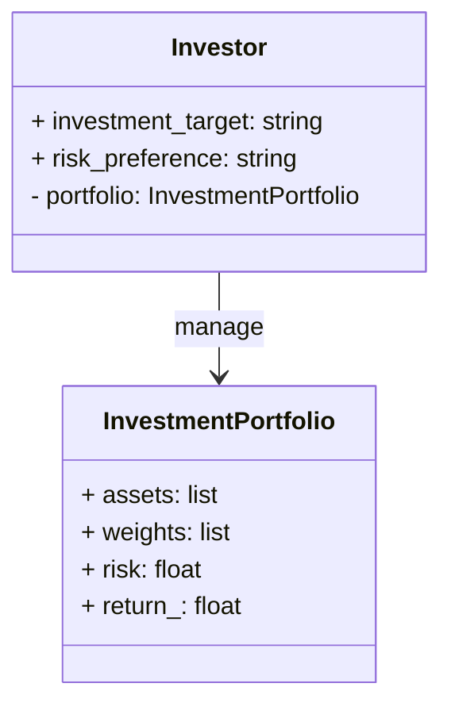

                 


# 格雷厄姆的分散化原则：降低投资风险

## 关键词：格雷厄姆，分散化原则，投资风险，资产配置，投资组合

## 摘要：本文深入探讨了格雷厄姆提出的分散化原则，分析其在降低投资风险中的作用。通过背景介绍、核心概念、算法原理、系统分析和项目实战等多角度，详细阐述了分散化原则的理论基础和实际应用。文章还结合数学模型和系统设计，提供了具体的实现方法和案例分析，帮助读者全面理解如何通过分散化原则实现稳健投资。

---

# 第1章: 投资风险与分散化原则概述

## 1.1 投资风险的基本概念

### 1.1.1 投资风险的定义
投资风险是指在投资过程中，由于市场波动、经济变化等因素，导致投资收益低于预期或出现损失的可能性。风险是投资决策中不可忽视的重要因素，直接关系到投资者的收益和资金安全。

### 1.1.2 投资风险的分类
投资风险可以从多个角度进行分类：
- **系统性风险**：由整体市场波动引发的风险，如经济衰退、通货膨胀等。
- **非系统性风险**：由特定资产或行业内部因素引发的风险，如公司财务状况恶化。
- **市场风险**：由于资产价格波动导致的风险。
- **流动性风险**：资产难以快速变现导致的风险。

### 1.1.3 投资风险的衡量指标
常用的衡量指标包括：
- **标准差**：衡量资产收益的波动性。
- **贝塔系数（Beta）**：衡量资产相对于市场波动的风险。
- **最大回撤（Max Drawdown）**：衡量资产在一段时间内的最大损失。

---

## 1.2 分散化原则的背景与意义

### 1.2.1 分散化原则的起源
分散化原则并非格雷厄姆首创，但他在《证券分析》一书中系统地阐述了这一理念。分散化的核心思想是通过投资多样化资产，降低非系统性风险。

### 1.2.2 分散化原则的核心思想
格雷厄姆认为，通过将资金分配到不同资产类别、行业或地区，可以有效降低投资组合的整体风险。分散化不是随机的，而是基于资产之间的相关性和风险收益特性进行优化配置。

### 1.2.3 分散化原则在现代投资中的应用
现代投资组合理论（MPT）将分散化原则进一步发展，提出了基于数学模型的投资组合优化方法。分散化不仅是降低风险的手段，更是实现稳健收益的重要策略。

---

## 1.3 格雷厄姆与分散化原则

### 1.3.1 格雷厄姆的生平简介
本杰明·格雷厄姆（Benjamin Graham）是20世纪著名的投资学家，被誉为“价值投资之父”。他的投资理念对现代金融理论产生了深远影响。

### 1.3.2 格雷厄姆的价值投资理念
格雷厄姆强调以基本面分析为基础，寻找被市场低估的股票进行投资。他认为，投资者应关注企业的内在价值，而非市场的短期波动。

### 1.3.3 格雷厄姆分散化原则的提出
格雷厄姆认识到，仅依靠个股选择并不能完全降低投资风险。他提出通过分散投资于多个资产或行业，构建一个风险可控、收益稳定的投资组合。

---

## 1.4 分散化原则的核心要素

### 1.4.1 分散化的基本原理
分散化的核心在于通过投资不同类型的资产，减少特定资产或市场的波动对整体投资组合的影响。

### 1.4.2 分散化与投资组合的关系
分散化是投资组合管理的重要组成部分。一个有效的投资组合应包含不同风险收益特性的资产，以实现风险与收益的最优平衡。

### 1.4.3 分散化与风险控制的结合
通过分散化，投资者可以将资金分配到多个不相关的资产上，降低非系统性风险，同时捕捉不同资产的收益机会。

---

## 1.5 本章小结
本章介绍了投资风险的基本概念、分散化原则的背景与意义，以及格雷厄姆在分散化原则中的贡献。分散化不仅是降低风险的手段，更是实现稳健投资的重要策略。

---

# 第2章: 分散化原则的核心概念与数学模型

## 2.1 分散化原则的核心概念

### 2.1.1 资产配置的重要性
资产配置是分散化的核心，决定了投资组合中各类资产的权重。合理的资产配置可以平衡风险与收益，降低整体投资组合的波动性。

### 2.1.2 资产相关性的分析
资产之间的相关性是分散化的重要因素。低相关性的资产组合可以有效降低非系统性风险。

### 2.1.3 投资组合的风险与收益平衡
通过分散化，投资者可以在承受较低风险的前提下，获得更高的收益。这种平衡是分散化原则的核心价值。

---

## 2.2 分散化与非相关资产的组合

### 2.2.1 非相关资产的定义与特点
非相关资产是指在价格变动上没有相关性的资产。例如，股票和债券在价格波动上通常呈现负相关性。

### 2.2.2 非相关资产对风险分散的作用
将资金分配到非相关资产上，可以降低投资组合的整体波动性。例如，投资于股票和债券的组合通常比单一投资于股票的风险更低。

### 2.2.3 如何选择非相关资产
选择非相关资产需要考虑资产的行业、地区和资产类别等因素。例如，投资于不同行业的股票可以降低行业特定风险。

---

## 2.3 分散化与市场风险的对冲

### 2.3.1 市场风险的定义与特征
市场风险是由于整体市场波动引起的，无法通过分散化完全消除。但通过投资于不同类型资产，可以部分对冲市场风险。

### 2.3.2 分散化对市场风险的降低作用
通过投资于不同资产类别，分散化可以部分抵消市场波动的影响。例如，投资于股票、债券和 commodities 的组合可以降低市场风险。

### 2.3.3 分散化与市场风险对冲策略
对冲基金等复杂工具也可以用于市场风险的对冲，但需要谨慎操作，避免过度杠杆和复杂性。

---

## 2.4 分散化原则的数学模型

### 2.4.1 投资组合风险的数学表达
投资组合的总风险可以用方差表示：
$$ \sigma_p^2 = \sum_{i=1}^n w_i^2 \sigma_i^2 + 2 \sum_{i < j} w_i w_j \sigma_i \sigma_j \rho_{i,j} $$
其中，$w_i$ 是资产 i 的权重，$\sigma_i$ 是资产 i 的波动性，$\rho_{i,j}$ 是资产 i 和 j 的相关性。

### 2.4.2 分散化对风险方差的影响
通过分散化，投资组合的方差可以被分解为资产方差的加权和及相关项。相关项的存在使得分散化能够降低整体风险。

### 2.4.3 分散化与收益的关系公式
分散化不仅影响风险，还可能影响收益。通过优化资产配置，投资者可以在风险可控的前提下，实现收益的最大化。

---

## 2.5 本章小结
本章详细分析了分散化原则的核心概念，包括资产配置、资产相关性以及数学模型。通过数学公式，我们看到了分散化如何降低投资组合的风险。

---

# 第3章: 分散化原则的算法原理与实现

## 3.1 分散化原则的算法概述

### 3.1.1 分散化算法的基本流程
分散化算法的基本流程包括：
1. 确定投资目标和风险承受能力。
2. 分析各类资产的相关性和风险收益特性。
3. 构建投资组合，优化资产配置。
4. 定期调整投资组合，以适应市场变化。

### 3.1.2 分散化算法的关键步骤
- 数据采集与预处理
- 资产相关性计算
- 投资组合优化
- 风险收益分析

---

## 3.2 分散化算法的数学模型

### 3.2.1 投资组合优化的数学表达
现代投资组合理论（MPT）提出的投资组合优化公式为：
$$ \text{最小化} \quad \sigma_p^2 $$
$$ \text{在约束条件下} \quad \sum_{i=1}^n w_i = 1 $$

其中，$\sigma_p^2$ 是投资组合的方差，$w_i$ 是资产 i 的权重。

### 3.2.2 马科维茨均值-方差模型
马科维茨均值-方差模型是分散化算法的基础，通过优化资产配置，实现风险与收益的最优平衡。

---

## 3.3 分散化算法的实现步骤

### 3.3.1 确定投资目标和风险偏好
投资者需要明确自己的投资目标和风险承受能力，这是分散化配置的基础。

### 3.3.2 数据采集与分析
收集各类资产的历史数据，计算相关性矩阵和风险收益指标。

### 3.3.3 构建投资组合
使用数学模型优化资产配置，构建最优投资组合。

### 3.3.4 定期调整与优化
根据市场变化和个人风险偏好，定期调整投资组合。

---

## 3.4 分散化算法的系统实现

### 3.4.1 系统功能设计
- 数据输入与处理模块
- 相关性计算模块
- 投资组合优化模块
- 风险收益分析模块

### 3.4.2 系统实现的Python代码示例

```python
import numpy as np

def calculate_correlation_matrix(returns):
    return np.corrcoef(returns.T)

def optimize_portfolio(weights, returns, risk_free_rate=0.02):
    n = len(weights)
    covariance_matrix = np.cov(returns.T)
    return np.linalg.solve(covariance_matrix, weights)

# 示例数据
returns = np.array([[0.1, 0.05, 0.02],
                    [0.05, 0.08, 0.03],
                    [0.02, 0.03, 0.07]])
weights = np.array([0.3, 0.4, 0.3])

correlation_matrix = calculate_correlation_matrix(returns)
optimized_weights = optimize_portfolio(weights, returns)
print("Optimized Weights:", optimized_weights)
```

---

## 3.5 本章小结
本章详细介绍了分散化原则的算法原理，包括优化模型和实现步骤。通过代码示例，我们看到了如何在实际中应用这些原理。

---

# 第4章: 分散化原则的系统分析与设计

## 4.1 系统功能设计

### 4.1.1 领域模型设计
使用 Mermaid 类图展示系统的功能模块：


### 4.1.2 系统功能模块
- 投资者信息输入
- 资产选择与配置
- 投资组合优化
- 风险收益分析

---

## 4.2 系统架构设计

### 4.2.1 系统架构图
使用 Mermaid 架构图展示系统的分层结构：


### 4.2.2 接口设计
- 数据接口：读取资产数据
- 优化接口：计算最优资产配置
- 展示接口：显示投资组合的风险收益分析

---

## 4.3 本章小结
本章从系统设计的角度，分析了分散化原则的实现方式，包括功能模块、架构设计和接口设计。

---

# 第5章: 分散化原则的项目实战

## 5.1 环境安装与配置

### 5.1.1 Python环境搭建
安装必要的 Python 库，如 NumPy、Pandas 和 Scipy。

### 5.1.2 数据源获取
获取历史资产数据，例如通过 Yahoo Finance 或其他数据源。

---

## 5.2 系统核心实现

### 5.2.1 资产相关性计算
使用 NumPy 计算资产之间的相关性矩阵。

```python
import numpy as np

def calculate_correlation_matrix(returns):
    return np.corrcoef(returns.T)

# 示例数据
returns = np.array([[0.1, 0.05, 0.02],
                    [0.05, 0.08, 0.03],
                    [0.02, 0.03, 0.07]])

correlation_matrix = calculate_correlation_matrix(returns)
print("Correlation Matrix:\n", correlation_matrix)
```

### 5.2.2 投资组合优化
使用优化算法计算最优资产配置。

```python
def optimize_portfolio(weights, returns):
    n = len(weights)
    covariance_matrix = np.cov(returns.T)
    return np.linalg.solve(covariance_matrix, weights)

weights = np.array([0.3, 0.4, 0.3])
optimized_weights = optimize_portfolio(weights, returns)
print("Optimized Weights:", optimized_weights)
```

---

## 5.3 案例分析与解读

### 5.3.1 案例背景
假设我们有三种资产：股票、债券和 commodities。

### 5.3.2 数据分析
计算相关性矩阵和优化后的资产权重。

### 5.3.3 结果解读
优化后的权重显示，债券的权重较高，说明在当前市场环境下，债券的风险较低，收益稳定。

---

## 5.4 本章小结
本章通过项目实战，展示了如何在实际中应用分散化原则。通过代码实现和案例分析，我们看到了分散化原则的有效性。

---

# 第6章: 分散化原则的最佳实践与注意事项

## 6.1 最佳实践 tips

### 6.1.1 定期调整投资组合
市场环境不断变化，需要定期调整资产配置。

### 6.1.2 选择合适的资产类别
根据自身风险偏好和投资目标选择资产。

### 6.1.3 注意相关性
避免选择高度相关的资产，以降低分散化效果。

---

## 6.2 分散化原则的注意事项

### 6.2.1 避免过度分散
过度分散可能导致收益下降。

### 6.2.2 注意杠杆使用
杠杆会放大波动性，增加投资风险。

### 6.2.3 风险与收益的平衡
分散化可以在一定程度上降低风险，但无法完全消除。

---

## 6.3 本章小结
本章总结了分散化原则的最佳实践和注意事项，帮助投资者更好地应用这一原则。

---

# 7. 总结与展望

## 7.1 本文章总结
本文全面探讨了格雷厄姆的分散化原则，从理论到实践，详细分析了其在降低投资风险中的作用。

## 7.2 对未来展望
随着金融市场的不断发展，分散化原则将不断创新和应用。投资者需要持续学习和调整策略，以应对新的挑战。

---

通过本文的学习，读者可以深入理解格雷厄姆的分散化原则，并在实际投资中应用这一原则，实现稳健投资。

