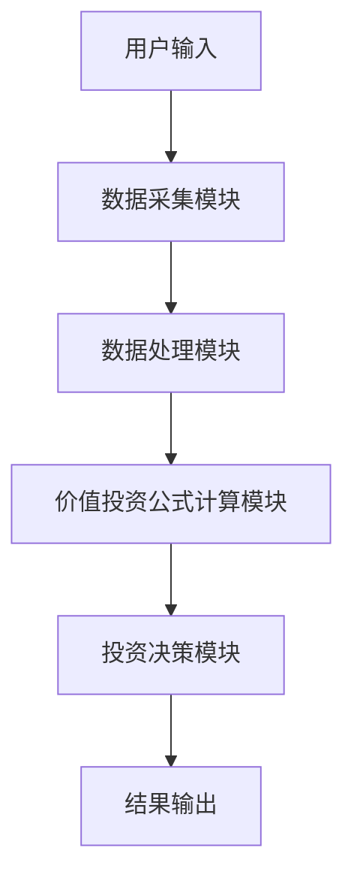
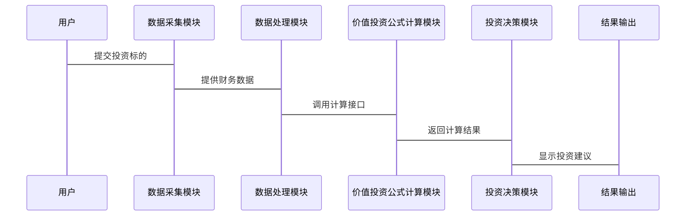

                 

# 格雷厄姆的价值投资公式解析

## 关键词：价值投资、格雷厄姆、投资公式、安全边际、内在价值、投资策略、投资分析

## 摘要：本篇文章深入解析了格雷厄姆的价值投资公式，从其背景、核心概念到数学模型，再到实际应用案例，详细分析了该公式在投资决策中的应用和意义。通过技术化的语言和逻辑分析，帮助读者理解如何通过格雷厄姆的投资理念实现稳健的投资策略。

---

## 第1章: 价值投资的起源与格雷厄姆的贡献

### 1.1 价值投资的起源

#### 1.1.1 投资领域的演变
投资领域的发展经历了从传统到现代的转变，早期的投资行为更多依赖于市场情绪和直觉，而20世纪初，以本杰明·格雷厄姆为代表的价值投资者开始系统性地研究投资的科学性。他们提出了一套基于公司基本面分析的投资方法，为现代投资理论奠定了基础。

#### 1.1.2 格雷厄姆与价值投资的诞生
格雷厄姆是价值投资的鼻祖，他在1934年出版的《证券分析》一书中首次系统地阐述了价值投资的理念。他提出，投资者应该以低于公司净资产价值的价格购买股票，并长期持有，以获得稳定的收益。

#### 1.1.3 价值投资的核心理念
价值投资的核心理念是通过深入分析公司的财务状况、行业地位和竞争优势，找到被市场低估的股票，长期持有并获得超越市场平均收益的投资回报。

---

### 1.2 格雷厄姆的投资哲学

#### 1.2.1 格雷厄姆的生平与著作
本杰明·格雷厄姆（1897-1975）是20世纪最著名的价值投资者之一。他不仅是《证券分析》的作者，还与大卫·多德合著了《 Intelligent Investor》。他的投资理念影响了包括沃伦·巴菲特在内的众多投资者。

#### 1.2.2 投资者的心理与行为
格雷厄姆深刻认识到市场波动性对投资者心理的影响，他将市场比作“情绪化的先生”，认为投资者的非理性行为是市场波动的主要原因。

#### 1.2.3 安全边际的概念
安全边际是格雷厄姆投资理论中的核心概念，指股票的市场价格低于其内在价值的部分。通过预留安全边际，投资者可以降低投资风险，确保在市场波动中依然能够获得收益。

---

### 1.3 价值投资的核心原则

#### 1.3.1 股票的内在价值
股票的内在价值是基于公司财务状况和未来盈利能力的评估，与市场价格无关。格雷厄姆提出，内在价值是投资决策的核心依据。

#### 1.3.2 市场先生的疯狂与恐惧
格雷厄姆将市场比作“市场先生”，认为市场的波动性是投资者可以利用的机会。在市场恐慌时买入低估资产，在市场狂热时卖出高估资产。

#### 1.3.3 投资组合的构建原则
格雷厄姆强调分散投资和长期持有，建议投资者构建一个包含多种资产的投资组合，并定期进行再平衡以保持风险可控。

---

## 第2章: 价值投资公式的构成与解析

### 2.1 格雷厄姆价值投资公式的概述

#### 2.1.1 公式的数学表达
格雷厄姆的价值投资公式可以用以下数学模型表示：
$$ V = \frac{E}{(1 + r)^n} $$
其中，\( V \) 表示股票的内在价值，\( E \) 是公司未来现金流的总和，\( r \) 是折现率，\( n \) 是现金流的时间跨度。

#### 2.1.2 公式的核心要素
价值投资公式的计算基于以下几个核心要素：
1. 公司未来现金流的预测。
2. 合理的折现率。
3. 时间跨度的确定。

#### 2.1.3 公式的适用范围
该公式适用于对具有稳定现金流和明确未来收益的公司进行估值，尤其适合那些具有强大竞争优势和稳定业务模式的企业。

---

### 2.2 格雷厄姆价值投资公式的详细解析

#### 2.2.1 内在价值的计算公式
股票的内在价值公式：
$$ V = \sum_{t=1}^{n} \frac{C_t}{(1 + r)^t} $$
其中，\( C_t \) 是第 \( t \) 年的现金流，\( r \) 是折现率。

#### 2.2.2 安全边际的计算方法
安全边际公式：
$$ MS = V - P $$
其中，\( MS \) 是安全边际，\( V \) 是股票的内在价值，\( P \) 是股票的市场价格。

#### 2.2.3 市场价格与内在价值的关系
当市场价格 \( P \) 低于内在价值 \( V \) 时，股票具有投资价值，安全边际为正，反之则不具有投资价值。

---

### 2.3 格雷厄姆价值投资公式的数学模型

#### 2.3.1 内在价值公式
$$ V = \frac{E}{(1 + r)^n} $$
其中，\( E \) 是公司未来现金流的总和，\( r \) 是折现率，\( n \) 是时间跨度。

#### 2.3.2 安全边际公式
$$ MS = V - P $$

---

## 第3章: 格雷厄姆价值投资公式的实际应用

### 3.1 投资决策系统的构建

#### 3.1.1 系统功能设计
1. 数据采集：获取目标公司的财务数据和行业信息。
2. 模型计算：计算股票的内在价值和安全边际。
3. 投资决策：根据计算结果生成投资建议。

#### 3.1.2 系统架构设计

#### 3.1.3 系统接口设计
1. 数据接口：与财务数据库对接，获取公司数据。
2. 计算接口：调用价值投资公式进行计算。
3. 输出接口：将结果展示给用户。

#### 3.1.4 系统交互流程

---

### 3.2 项目实战: 实际案例分析

#### 3.2.1 案例背景介绍
以某制造公司为例，假设其未来5年的预期现金流分别为100万、120万、150万、180万和200万，折现率为10%。

#### 3.2.2 计算股票的内在价值
$$ V = \sum_{t=1}^{5} \frac{C_t}{(1 + 0.1)^t} $$
计算结果为：
$$ V ≈ 423.93 \text{万元} $$

#### 3.2.3 计算安全边际
假设股票当前市场价格为400万元，则安全边际为：
$$ MS = 423.93 - 400 = 23.93 \text{万元} $$

由于安全边际为正，该股票具有投资价值。

---

## 第4章: 格雷厄姆价值投资公式的最佳实践

### 4.1 投资的关键点
1. 长期视角：价值投资需要耐心，等待市场回归合理估值。
2. 安全边际：始终预留安全边际，降低投资风险。
3. 持续学习：不断更新知识，适应市场变化。

### 4.2 实际操作中的注意事项
1. 数据质量：确保财务数据的准确性和完整性。
2. 模型假设：合理假设折现率和现金流预测。
3. 风险控制：分散投资，避免过度集中。

### 4.3 拓展阅读
推荐阅读格雷厄姆的经典著作《 Intelligent Investor》和《证券分析》，深入了解价值投资的精髓。

---

## 第5章: 总结与展望

### 5.1 总结
格雷厄姆的价值投资公式为投资者提供了一套科学的投资方法，通过内在价值评估和安全边际预留，帮助投资者在市场波动中保持理性，实现稳健的投资回报。

### 5.2 展望
随着金融市场的不断发展，价值投资理论也在不断进化。未来，投资者需要结合新技术和新工具，进一步优化投资决策，提升投资效率。

---

通过以上结构和技术化的语言，我们可以系统性地解析格雷厄姆的价值投资公式，帮助读者深入理解其原理和应用，从而在实际投资中做出更明智的决策。

