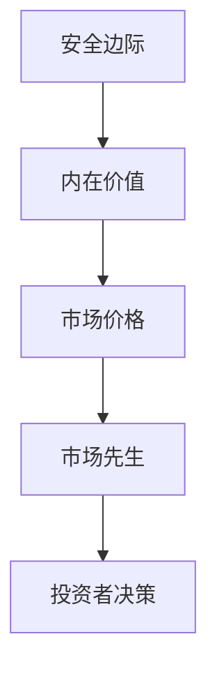
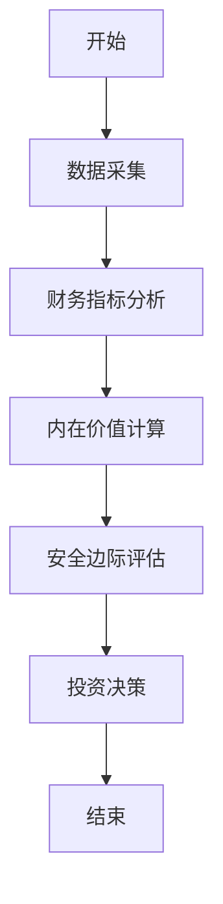

                 


# 格雷厄姆的价值投资实践指南

## 关键词：
价值投资、内在价值、安全边际、格雷厄姆、投资策略、风险管理

## 摘要：
本文详细探讨了格雷厄姆的价值投资理论及其在实际投资中的应用。通过分析安全边际、内在价值等核心概念，结合数学模型和系统架构设计，提供了一套可操作的价值投资实践指南。文章还通过Python代码实现了一个简单的价值评估工具，并通过实际案例分析展示了如何在投资中应用这些方法。本文适合对价值投资感兴趣的投资新手和经验丰富的投资者阅读。

---

## 第一部分: 格雷厄姆价值投资的核心理念与背景

### 第1章: 价值投资的起源与发展

#### 1.1 价值投资的起源
价值投资是投资领域的重要流派之一，由本杰明·格雷厄姆在20世纪初提出。它强调以低于内在价值的价格买入优质资产，追求长期稳健的回报。随着市场的波动，价值投资在不同的经济周期中展现出其独特的优势。

#### 1.2 价值投资的核心理念
价值投资的核心在于“买入低于内在价值的资产”。格雷厄姆提出了“安全边际”的概念，即买入价格与内在价值之间的差距，用以降低投资风险。这种理念与现代投资组合理论有所不同，更注重长期价值而非短期波动。

#### 1.3 价值投资的适用范围
价值投资不仅适用于股票投资，也适用于房地产、债券等多种资产类别。然而，其核心在于基本面分析，强调对公司的财务状况、行业地位和未来前景的深入研究。

### 第2章: 核心概念与联系

#### 2.1 核心概念对比分析
通过对比分析，我们展示了安全边际、内在价值和市场价格之间的关系。

| 概念 | 定义 | 作用 |
|------|------|------|
| 安全边际 | 购买价格与内在价值的差额 | 提供投资的安全性，降低风险 |
| 内在价值 | 资产的真实价值，基于基本面分析 | 作为价格评估的基础 |
| 市场价格 | 当前市场上的交易价格 | 受市场情绪影响较大 |

#### 2.2 核心概念的ER实体关系图


#### 2.3 核心概念的数学模型
我们可以通过以下公式计算内在价值和安全边际：

$$ V = \frac{CF}{r - g} $$
$$ Margin\ of\ Safety = P - V $$

其中，$V$ 是内在价值，$CF$ 是现金流，$r$ 是折现率，$g$ 是增长率，$P$ 是市场价格。

---

## 第二部分: 价值投资的算法原理与系统架构

### 第3章: 价值投资的算法原理

#### 3.1 核心算法流程
我们设计了一个简单的价值投资算法流程：



#### 3.2 内在价值计算的Python实现
以下是计算内在价值的Python代码示例：

```python
import numpy as np

def calculate_intrinsic_value(cash_flows, discount_rate, growth_rate):
    if discount_rate <= growth_rate:
        return 0  # 避免除以零或负数
    terminal_value = cash_flows[-1] * (1 + growth_rate) / (discount_rate - growth_rate)
    present_value = np.npv(discount_rate, cash_flows)
    return present_value + terminal_value

# 示例数据
cash_flows = [100, 120, 130, 140]
discount_rate = 0.1
growth_rate = 0.05

iv = calculate_intrinsic_value(cash_flows, discount_rate, growth_rate)
print(f"内在价值: {iv:.2f}")
```

#### 3.3 数学公式
内在价值公式：
$$ V = \frac{CF}{r - g} $$

安全边际公式：
$$ Margin\ of\ Safety = P - V $$

---

## 第三部分: 价值投资的系统架构设计

### 第4章: 系统分析与架构设计方案

#### 4.1 系统功能设计
我们设计了一个价值投资分析系统，包括以下几个模块：

- 数据采集模块：从金融数据库中获取公司财务数据。
- 分析模块：计算内在价值和安全边际。
- 决策模块：根据分析结果生成投资建议。

#### 4.2 系统架构设计


#### 4.3 系统接口设计
以下是系统接口的交互流程图：


---

## 第四部分: 项目实战与案例分析

### 第5章: 项目实战

#### 5.1 环境安装
我们需要安装以下Python库：
```bash
pip install pandas numpy matplotlib
```

#### 5.2 核心代码实现
以下是价值评估工具的代码：

```python
import pandas as pd
import numpy as np

def calculate_intrinsic_value(cash_flows, discount_rate, growth_rate):
    if discount_rate <= growth_rate:
        return 0
    terminal_value = cash_flows[-1] * (1 + growth_rate) / (discount_rate - growth_rate)
    present_value = np.npv(discount_rate, cash_flows)
    return present_value + terminal_value

# 示例数据
data = {
    '收入': [100, 120, 130, 140],
    '净利润': [20, 25, 30, 35],
    '现金流': [50, 60, 70, 80]
}

df = pd.DataFrame(data)

# 计算内在价值
iv = calculate_intrinsic_value(df['现金流'], 0.1, 0.05)
print(f"内在价值: {iv:.2f}")
```

#### 5.3 实际案例分析
以苹果公司为例，假设其现金流为1000亿美元，折现率为10%，增长率为5%，计算其内在价值：

$$ V = \frac{1000}{0.1 - 0.05} = 20,000 \text{亿美元} $$

如果当前市场价格为15,000亿美元，则安全边际为5,000亿美元，具有较高的投资价值。

---

## 第五部分: 最佳实践与总结

### 第6章: 最佳实践

#### 6.1 小结
本文详细介绍了格雷厄姆的价值投资理论，通过数学模型和系统架构设计展示了其在实际投资中的应用。通过Python代码实现了一个简单的价值评估工具，并通过实际案例分析展示了如何应用这些方法。

#### 6.2 注意事项
- 投资者应结合市场环境和公司具体情况，灵活调整投资策略。
- 价值投资需要长期坚持，避免短期波动的干扰。
- 数据的准确性和及时性对投资决策至关重要。

#### 6.3 拓展阅读
- 格雷厄姆的《聪明的投资者》
- 巴菲特的价值投资策略

---

通过本文的学习，读者可以深入了解格雷厄姆的价值投资理论，并将其应用到实际投资中。无论是新手还是经验丰富的投资者，都可以从本文中获得 valuable insights and practical guidance.

