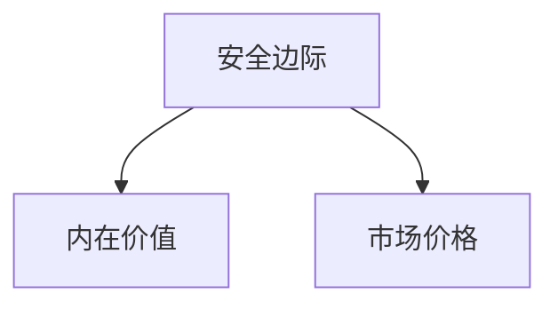
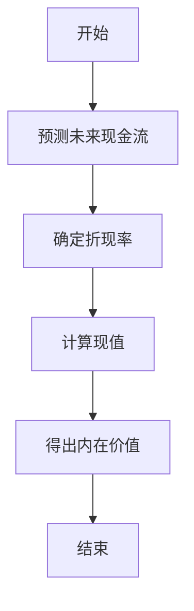
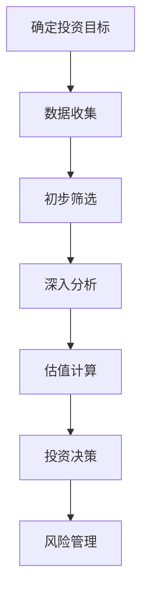
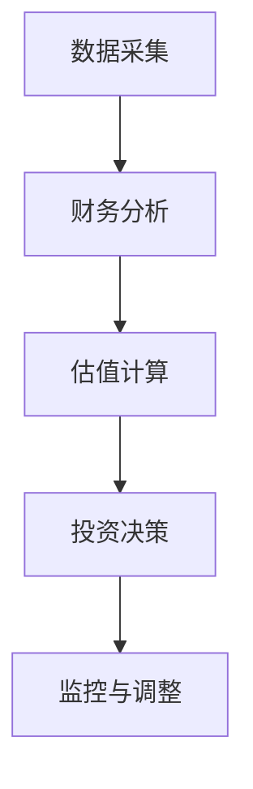
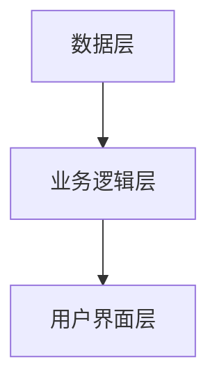

                 

# 《格雷厄姆的价值投资者修炼之道》

## 关键词：价值投资，格雷厄姆，DCF模型，财务报表分析，投资决策系统

## 摘要：  
本文深入探讨了格雷厄姆的价值投资理论，从其核心理念、财务分析方法、投资决策算法到系统架构设计，全面解析了价值投资者修炼的路径。通过详细讲解DCF模型、财务报表分析、投资组合优化等关键内容，结合实际案例分析和系统设计，为读者提供一套完整的价值投资方法论。

---

# 第1章: 价值投资的起源与核心理念

## 1.1 价值投资的起源  
价值投资作为一种投资策略，起源于20世纪初，其核心思想由本杰明·格雷厄姆提出。格雷厄姆是哥伦比亚大学的教授，也是投资大师菲利普·费雪和沃伦·巴菲特的导师。他通过长期的市场观察和实践，总结出一套以基本面分析为核心的投资方法。  

### 1.1.1 投资领域的传统观念  
传统投资观念往往依赖于市场趋势和技术分析，但这种方法在市场波动剧烈时显得力不从心。格雷厄姆意识到，投资的真正价值在于企业本身，而非市场的短期波动。  

### 1.1.2 格雷厄姆的学术背景与贡献  
格雷厄姆在《证券分析》一书中首次系统性地提出了价值投资的理念。他强调，投资者应关注企业的内在价值，而非市场的短期波动。他的理论奠定了现代价值投资的基础。  

### 1.1.3 价值投资的定义与核心思想  
价值投资是一种以企业内在价值为核心的投资策略。格雷厄姆认为，市场波动是投资者的朋友，而非敌人。通过寻找市场价格低于内在价值的企业，投资者可以在长期获得超额收益。  

---

## 1.2 价值投资的核心概念  

### 1.2.1 安全边际的定义与作用  
安全边际是价值投资中最重要的概念之一。它指的是市场价格与内在价值之间的差距。通过购买市场价格低于内在价值的股票，投资者可以降低投资风险。  

| 安全边际 | 内在价值 | 市场价格 |
|----------|----------|----------|
| 高       | 高       | 低       |
| 低       | 低       | 高       |

**图1-1：安全边际的实体关系图**  

### 1.2.2 内在价值的计算方法  
内在价值是基于企业未来现金流的现值计算得出的。格雷厄姆常用的方法是DCF模型，即现金流量折现法。  

$$ \text{内在价值} = \sum_{t=1}^{n} \frac{CF_t}{(1 + r)^t} $$  

其中，\( CF_t \) 是第t年的现金流，\( r \) 是折现率。  

### 1.2.3 股票与企业价值的区分  
股票的市场价格反映的是市场情绪，而企业价值则基于企业的实际盈利能力。格雷厄姆强调，投资者应关注企业价值，而非股票价格。  

---

## 1.3 价值投资的哲学与心理学基础  

### 1.3.1 投资中的理性与非理性  
市场波动往往由非理性情绪驱动，如贪婪和恐惧。格雷厄姆提醒投资者，必须保持理性，避免被市场情绪左右。  

### 1.3.2 行为偏差对企业估值的影响  
行为偏差，如过度自信和从众心理，会影响投资者的决策。格雷厄姆强调，投资者必须克服这些偏差，才能做出明智的投资决策。  

### 1.3.3 格雷厄姆的投资心态管理  
格雷厄姆认为，投资心态管理是价值投资成功的关键。投资者应保持耐心，避免频繁交易，并在市场恐慌时寻找机会。  

---

## 1.4 价值投资的适用场景与边界  

### 1.4.1 价值投资的适用领域  
价值投资适用于那些基本面稳定、财务健康的企业。特别适合那些具有强大竞争优势和持续盈利能力的企业。  

### 1.4.2 价值投资的局限性  
价值投资的局限性在于，市场可能长期忽视某些优质企业，导致股价长期低于内在价值。此外，价值投资需要较长的时间周期，不适合短期投资者。  

### 1.4.3 价值投资与其他投资策略的对比  
与技术分析不同，价值投资基于企业的基本面分析。与成长投资相比，价值投资更注重企业的当前价值，而非未来的增长潜力。  

---

## 1.5 本章小结  
本章介绍了价值投资的起源、核心理念和核心概念，包括安全边际、内在价值和企业价值的区分。通过分析价值投资的哲学基础和适用场景，我们为后续的深入分析奠定了基础。

---

# 第2章: 价值投资的核心分析方法  

## 2.1 财务报表分析与企业估值  

### 2.1.1 财务报表分析的基础  
财务报表分析是价值投资的核心技能之一。通过分析资产负债表、利润表和现金流量表，投资者可以评估企业的财务健康状况。  

#### 资产负债表的核心要素  
- **资产**：企业拥有的资源，如现金、应收账款和存货。  
- **负债**：企业欠款，如应付账款和长期负债。  
- **所有者权益**：企业净资产的价值。  

#### 利润表的关键指标  
- **收入**：企业的总收入。  
- **成本**：企业的总成本。  
- **利润**：企业的净利润。  

#### 现金流量表的重要性  
现金流量表反映了企业的现金流入和流出情况，是评估企业流动性的重要指标。  

---

### 2.1.2 格雷厄姆的估值方法  

#### 现金流量折现模型（DCF）  
DCF模型是价值投资中常用的估值方法。通过将未来现金流折现为现值，投资者可以估算企业的内在价值。  

**图2-1：DCF模型流程图**  

#### 市盈率与市净率的分析  
市盈率（P/E）和市净率（P/B）是常用的估值指标。  
- **P/E = 市场价格 / 每股收益**  
- **P/B = 市场价格 / 每股净资产**  

#### 股息率的计算与应用  
股息率是衡量股票收益能力的指标。  
$$ \text{股息率} = \frac{\text{每股股息}}{\text{市场价格}} $$  

---

### 2.1.3 企业财务健康度的评估  

#### 财务杠杆与流动性分析  
财务杠杆过高会增加企业的偿债压力，而流动性不足会影响企业的运营能力。  

#### 盈利能力与成长性评估  
盈利能力强的企业具有更高的内在价值，而成长性好的企业具有更高的未来潜力。  

#### 企业竞争优势的判断  
竞争优势是企业长期盈利的关键。格雷厄姆特别强调企业的护城河，如专利、品牌和成本优势。  

---

## 2.2 本章小结  
本章详细讲解了财务报表分析与企业估值的核心方法，包括DCF模型、市盈率、市净率和股息率的分析。通过这些方法，投资者可以准确评估企业的内在价值，并做出明智的投资决策。

---

# 第3章: 价值投资的决策算法与数学模型  

## 3.1 基于价值投资的决策算法  

### 3.1.1 价值投资的决策流程  
价值投资的决策流程包括以下几个步骤：  
1. 确定投资目标与策略。  
2. 数据收集与初步筛选。  
3. 深入分析与估值计算。  
4. 投资决策与风险管理。  

**图3-1：价值投资决策流程图**  

### 3.1.2 DCF模型的算法流程  
DCF模型的算法流程如下：  
1. 预测未来现金流。  
2. 确定合适的折现率。  
3. 计算未来现金流的现值。  
4. 求和得到内在价值。  

---

### 3.1.3 投资组合优化的数学模型  

#### 马科维茨均值-方差模型  
马科维茨均值-方差模型是投资组合优化的经典模型。  
$$ \text{目标函数} = \min \sigma^2 $$  
$$ \text{约束条件} = \sum w_i = 1 $$  

其中，\( \sigma^2 \) 是投资组合的方差，\( w_i \) 是各资产的权重。  

#### 基于价值投资的组合优化  
基于价值投资的组合优化需要结合企业的内在价值和市场估值。投资者应选择那些市场价格低于内在价值的企业，并根据风险承受能力调整投资比例。  

---

## 3.2 本章小结  
本章详细讲解了价值投资的决策算法和数学模型，包括DCF模型和投资组合优化的数学模型。通过这些算法，投资者可以系统性地进行投资决策，并优化投资组合的风险和收益。

---

# 第4章: 价值投资的系统架构与实战  

## 4.1 投资决策系统的架构设计  

### 4.1.1 系统功能模块划分  
投资决策系统通常包括以下模块：  
- 数据采集与处理模块。  
- 财务分析与估值模块。  
- 投资决策与监控模块。  

**图4-1：系统功能模块划分图**  

### 4.1.2 系统架构设计  
系统架构设计通常采用分层架构，包括数据层、业务逻辑层和用户界面层。  

**图4-2：系统架构设计图**  

### 4.1.3 系统接口设计  
系统接口设计需要考虑数据输入、处理和输出的标准化。投资者可以通过用户界面输入数据，系统进行处理后输出估值结果和投资建议。  

---

## 4.2 价值投资的实战案例分析  

### 4.2.1 案例背景与目标  
假设我们选择一家制造业企业进行分析，目标是评估其内在价值，并决定是否投资。  

### 4.2.2 数据收集与初步筛选  
收集企业的财务报表数据，包括收入、成本、利润和现金流。  

### 4.2.3 深入分析与估值计算  
使用DCF模型计算企业的内在价值。  

### 4.2.4 投资决策与风险管理  
根据估值结果和市场环境，决定是否投资，并制定风险管理策略。  

---

## 4.3 本章小结  
本章通过系统架构设计和实战案例分析，展示了如何将价值投资理论应用于实际投资决策。通过系统的架构设计，投资者可以高效地进行数据处理和投资分析。

---

# 第5章: 价值投资的未来与总结  

## 5.1 价值投资的未来发展趋势  
随着人工智能和大数据技术的发展，价值投资将更加依赖于数据驱动的分析和决策。投资者可以通过技术手段提高分析效率，并优化投资组合的风险管理。  

## 5.2 投资者的自我修养  
价值投资不仅是一种方法论，更是一种心态和生活方式。投资者需要不断学习和反思，保持理性，并在市场波动中坚持自己的投资理念。  

## 5.3 本章小结  
本章总结了全文的核心内容，并展望了价值投资的未来发展趋势。通过不断学习和实践，投资者可以逐步掌握价值投资的精髓，并在长期的投资生涯中获得成功。

---

# 结语  
价值投资是一种长期有效的投资策略，其核心在于对企业内在价值的深入分析和对市场波动的理性看待。通过系统的分析和实践，投资者可以逐步修炼出一套适合自己的价值投资方法论，并在长期的投资中实现财富的稳健增长。

