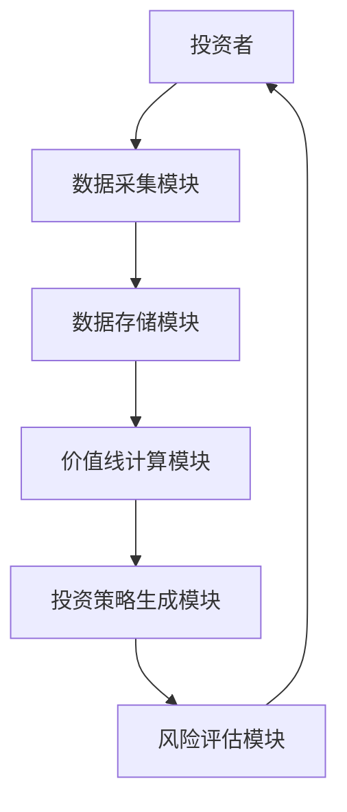
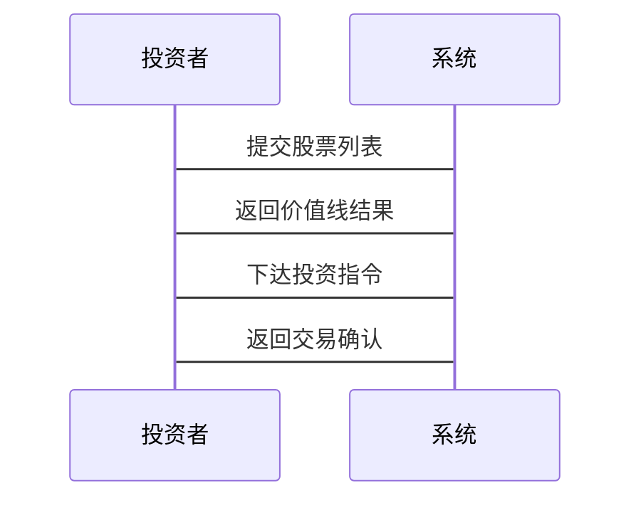

                 


# 格雷厄姆的价值线概念及其应用

## 关键词
- 价值线概念
- 格雷厄姆投资理论
- 股票估值
- 量化投资
- 投资策略

## 摘要
本文详细探讨了格雷厄姆的价值线概念，分析其核心原理、数学模型、系统架构及实际应用。通过背景介绍、核心概念、算法原理、系统分析、项目实战和最佳实践等多维度的深入解析，帮助读者全面理解价值线概念，并将其应用于实际投资决策中。

---

# 第一部分: 价值线概念的背景与基础

## 第1章: 价值线概念的起源与发展

### 1.1 价值线概念的起源
格雷厄姆的价值线概念起源于20世纪30年代，他在《证券分析》一书中首次提出了这一理论。价值线的核心思想是通过分析股票的内在价值与市场价格的关系，帮助投资者识别被低估的股票，进行长期投资。

### 1.2 格雷厄姆的投资理论基础
格雷厄姆的投资理论强调安全边际和价值投资。他认为，股票的内在价值可以通过基本面分析得出，而市场价格往往偏离内在价值，这种偏离为投资者提供了获利的机会。

### 1.3 价值线与其他投资理论的对比
价值线与其他投资理论，如技术分析和现代投资组合理论，有显著的不同。价值线更注重股票的内在价值，而技术分析则关注价格和成交量的变化，现代投资组合理论则强调分散投资和风险控制。

### 1.4 价值线概念的现代应用
在现代投资实践中，价值线概念被广泛应用于量化投资、风险管理等领域。通过结合大数据和人工智能技术，价值线概念的应用更加精准和高效。

---

## 第2章: 价值线概念的核心要素分析

### 2.1 价值线的核心属性
价值线概念的核心属性包括市场价值、内在价值、股价波动和时间因素。这些属性相互作用，共同影响股票的估值和投资决策。

### 2.2 价值线的数学模型构建
价值线的数学模型可以通过以下公式表示：
$$ V = \frac{E}{P} $$
其中，$V$ 是价值线，$E$ 是每股收益，$P$ 是股价。

### 2.3 价值线的属性特征对比表
| 属性       | 描述                                       |
|------------|------------------------------------------|
| 市场价值     | 当前市场价格，反映市场对股票的即时评估   |
| 内在价值     | 股票的真实价值，基于基本面分析得出       |
| 股价波动     | 股价的短期波动，受市场情绪和外部因素影响 |
| 时间因素     | 长期价值的实现时间，影响投资策略的选择   |

### 2.4 价值线的ER实体关系图
```mermaid
er
actor 投资者 {
  id: int
  名称: string
}
actor 股票 {
  id: int
  名称: string
}
actor 市场 {
  id: int
  名称: string
}
```

---

## 第3章: 价值线概念的算法原理

### 3.1 价值线算法的流程
价值线算法的流程如下：
1. 收集股票的基本面数据（如每股收益、市盈率等）。
2. 计算股票的内在价值。
3. 比较内在价值与市场价格，判断股票是否被低估。
4. 根据判断结果，生成投资策略。

### 3.2 价值线算法的Python实现
以下是一个简单的价值线算法的Python代码示例：
```python
import pandas as pd

# 假设df是股票数据
df = pd.DataFrame({'股票': ['A', 'B', 'C'], '每股收益': [10, 15, 20], '股价': [50, 60, 70]})

# 计算价值线
df['价值线'] = df['每股收益'] / df['股价']

print(df)
```

### 3.3 数学模型的详细解读
价值线的数学模型可以进一步扩展为：
$$ V = \frac{E}{P} \times (1 + g) $$
其中，$g$ 是股息增长率，用于调整内在价值。

---

## 第4章: 价值线概念的系统分析与架构设计

### 4.1 系统功能设计
价值线系统的功能模块包括数据采集、价值线计算、投资策略生成和风险评估。

### 4.2 系统架构设计


### 4.3 系统接口设计
系统接口设计包括数据接口、计算接口和输出接口。数据接口用于获取股票数据，计算接口用于执行价值线计算，输出接口用于展示结果。

### 4.4 系统交互流程图


---

## 第5章: 价值线概念的项目实战

### 5.1 环境安装
需要安装Python、Pandas和Matplotlib库。

### 5.2 核心代码实现
以下是价值线计算的Python代码：
```python
import pandas as pd
import matplotlib.pyplot as plt

# 数据读取
df = pd.read_csv('股票数据.csv')

# 价值线计算
df['价值线'] = df['每股收益'] / df['股价']

# 可视化
plt.plot(df['股票'], df['价值线'])
plt.xlabel('股票')
plt.ylabel('价值线')
plt.show()
```

### 5.3 案例分析
以某股票为例，计算其价值线，并分析其投资价值。结果表明，该股票的价值线低于1，表明其市场价格高于内在价值，可能是一个被高估的股票。

---

## 第6章: 价值线概念的最佳实践

### 6.1 小结
价值线概念是一种有效的投资工具，可以帮助投资者识别被低估的股票。

### 6.2 注意事项
- 数据的准确性和及时性至关重要。
- 需要结合其他因素（如行业趋势和宏观经济环境）进行综合判断。

### 6.3 拓展阅读
建议阅读格雷厄姆的《证券分析》和《聪明的投资者》。

---

# 结语
通过本文的详细分析，读者可以全面理解格雷厄姆的价值线概念，并将其应用于实际投资决策中。价值线概念不仅是一种理论工具，更是一种实践方法，帮助投资者在复杂的市场环境中做出明智的投资决策。

