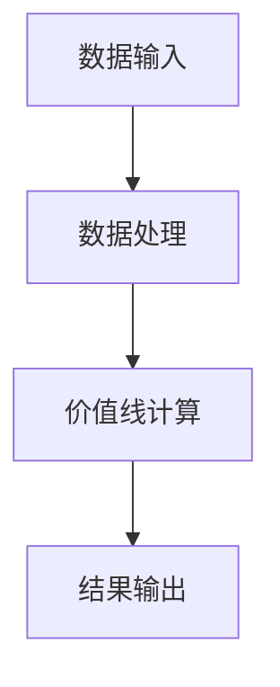

                 


# 格雷厄姆的价值线概念：买入低于内在价值的股票

## 关键词：格雷厄姆，价值线，内在价值，安全边际，股票投资，价值投资

## 摘要：  
本文详细介绍了格雷厄姆的价值线概念，探讨了如何通过买入低于内在价值的股票来实现稳健的投资回报。文章从价值投资的基本原理出发，逐步分析了价值线的定义、计算方法及其在实际投资中的应用。通过数学模型、系统架构设计和项目实战，本文为读者提供了全面且深入的理论支持和实践指导。最后，文章总结了价值线投资的关键要点，并提供了实际操作中的注意事项和最佳实践。

---

# 第1章: 价值投资与价值线概述

## 1.1 价值投资的核心理念  
### 1.1.1 价值投资的定义  
价值投资是一种以基本面分析为基础的投资策略，旨在通过识别市场价格与内在价值之间的差异，寻找被市场低估的投资标的。其核心理念是：市场价格与内在价值之间的差异为投资者提供了获利的机会。  

### 1.1.2 价值投资的基本原则  
1. **安全边际**：买入价格低于内在价值的股票，确保在市场波动中仍能获得收益。  
2. **长期视角**：关注企业的长期价值，而非短期市场波动。  
3. **基本面分析**：通过分析企业的财务数据、行业地位和竞争优势，评估其内在价值。  

### 1.1.3 格雷厄姆的价值投资理论  
本杰明·格雷厄姆是价值投资的鼻祖，他提出了“安全边际”和“内在价值”两大核心概念。他认为，市场价格往往偏离内在价值，而这种偏离为投资者提供了套利机会。  

---

## 1.2 价值线概念的提出  
### 1.2.1 价值线的定义  
价值线（Value Line）是格雷厄姆提出的一个概念，用于衡量市场价格与内在价值之间的关系。具体而言，价值线是指内在价值与市场价格的比率，即：  
$$ VL = \frac{V}{P} $$  
其中，$V$ 是内在价值，$P$ 是市场价格。  

### 1.2.2 价值线与市场价的关系  
当市场价格低于内在价值时，$VL > 1$，表明股票被低估，具有投资价值。反之，当市场价格高于内在价值时，$VL < 1$，表明股票被高估，应避免投资。  

### 1.2.3 价值线在投资决策中的作用  
价值线为投资者提供了一个直观的指标，帮助他们在投资决策中判断股票是否被低估或高估。通过分析价值线的变化趋势，投资者可以更好地把握市场波动和投资机会。  

---

## 1.3 价值线的计算方法  
### 1.3.1 内在价值的计算公式  
内在价值是衡量企业真实价值的指标，其计算公式为：  
$$ V = \frac{E}{(1 + r)^n} $$  
其中，$E$ 是企业的未来现金流，$r$ 是折现率，$n$ 是时间跨度。  

### 1.3.2 价值线的数学模型  
价值线的数学模型可以表示为：  
$$ VL = \frac{V}{P} = \frac{\frac{E}{(1 + r)^n}}{P} $$  
通过上述公式，投资者可以量化市场价格与内在价值之间的差异，并据此做出投资决策。  

### 1.3.3 价值线与市场价的对比分析  
通过对比分析价值线与市场价，投资者可以判断股票的估值水平。例如，当 $VL > 1$ 时，股票被低估；当 $VL < 1$ 时，股票被高估。  

---

## 1.4 价值线的理论基础  
### 1.4.1 格雷厄姆的防御性投资策略  
格雷厄姆主张防御性投资策略，即通过买入价格低于内在价值的股票，降低投资风险。他认为，市场波动是不可避免的，但通过安全边际可以确保投资的稳健性。  

### 1.4.2 安全边际的概念与应用  
安全边际是指内在价值与市场价格之间的差额，即：  
$$ MS = V - P $$  
当安全边际为正时，股票具有投资价值；当安全边际为负时，股票应避免投资。  

### 1.4.3 内在价值与市场波动的关系  
市场波动是价值投资的敌人，但也是机会的来源。通过分析市场波动，投资者可以找到被低估的股票，并在市场回调时获利。  

---

## 1.5 本章小结  
本章详细介绍了价值投资的核心理念和价值线的概念，解释了价值线的定义、计算方法及其在投资决策中的作用。通过分析内在价值和市场价格的关系，读者可以更好地理解格雷厄姆的价值投资理论，并将其应用于实际投资中。  

---

# 第2章: 价值线的数学模型与算法原理  

## 2.1 内在价值的计算公式  
### 2.1.1 内在价值的公式推导  
内在价值的计算公式可以通过现金流折现模型（DCF）推导得出。具体步骤如下：  
1. 确定企业的未来现金流。  
2. 选择合适的折现率。  
3. 计算未来现金流的现值。  
4. 将现值与市场价格进行比较。  

### 2.1.2 内在价值的计算步骤  
1. 收集企业的财务数据，包括收入、利润和现金流等。  
2. 估算企业的未来现金流。  
3. 确定合适的折现率。  
4. 计算内在价值。  
5. 比较内在价值与市场价格，判断股票的估值水平。  

### 2.1.3 内在价值的数学模型  
$$ V = \sum_{t=1}^{n} \frac{CF_t}{(1 + r)^t} $$  
其中，$CF_t$ 是第 $t$ 年的现金流，$r$ 是折现率，$n$ 是时间跨度。  

---

## 2.2 安全边际的计算方法  
### 2.2.1 安全边际的定义  
安全边际是内在价值与市场价格之间的差额，即：  
$$ MS = V - P $$  
当安全边际为正时，股票具有投资价值；当安全边际为负时，股票应避免投资。  

### 2.2.2 安全边际的计算公式  
$$ MS = V - P $$  

### 2.2.3 安全边际与价值线的关系  
价值线与安全边际密切相关。当价值线 $VL > 1$ 时，安全边际为正；当价值线 $VL < 1$ 时，安全边际为负。  

---

## 2.3 价值线的算法实现  
### 2.3.1 价值线的计算流程  
1. 收集股票的市场价格和财务数据。  
2. 计算内在价值。  
3. 比较内在价值与市场价格，计算价值线。  
4. 根据价值线判断股票的估值水平。  

### 2.3.2 价值线的算法步骤  
1. 确定企业的未来现金流。  
2. 计算内在价值。  
3. 比较内在价值与市场价格，计算价值线。  
4. 输出结果。  

### 2.3.3 价值线的代码实现  
```python
def calculate_intrinsic_value(E, r, n):
    # 计算内在价值
    IV = E / (1 + r) ** n
    return IV

def calculate_value_line(IV, P):
    # 计算价值线
    VL = IV / P
    return VL

# 示例
E = 1000  # 未来现金流
r = 0.05  # 折现率
n = 5    # 时间跨度
P = 800  # 市场价格

IV = calculate_intrinsic_value(E, r, n)
VL = calculate_value_line(IV, P)

print(f"内在价值: {IV:.2f}")
print(f"价值线: {VL:.2f}")
```

---

## 2.4 价值线的数学模型与公式  
### 2.4.1 内在价值公式  
$$ V = \frac{E}{(1 + r)^n} $$  
### 2.4.2 安全边际公式  
$$ MS = V - P $$  
### 2.4.3 价值线公式  
$$ VL = \frac{V}{P} $$  

---

## 2.5 本章小结  
本章详细介绍了内在价值和价值线的数学模型，并通过代码实现展示了算法的步骤。通过分析价值线的计算公式和算法实现，读者可以更好地理解格雷厄姆的价值投资理论，并将其应用于实际投资中。  

---

# 第3章: 价值线的系统分析与架构设计  

## 3.1 系统分析  
### 3.1.1 问题场景介绍  
本系统旨在通过计算价值线，帮助投资者判断股票的估值水平。  

### 3.1.2 系统功能需求  
1. 数据输入：收集股票的市场价格和财务数据。  
2. 数据处理：计算内在价值和价值线。  
3. 结果输出：显示价值线和安全边际。  

### 3.1.3 系统性能需求  
系统需支持大规模数据处理，并确保计算结果的准确性。  

---

## 3.2 系统架构设计  
### 3.2.1 系统架构图  

### 3.2.2 系统模块划分  
1. 数据输入模块：负责接收股票的市场价格和财务数据。  
2. 数据处理模块：计算内在价值和价值线。  
3. 结果输出模块：显示计算结果。  

### 3.2.3 系统接口设计  
1. 数据输入接口：接收股票代码、市场价格和财务数据。  
2. 计算接口：调用内在价值和价值线的计算函数。  
3. 结果输出接口：显示计算结果。  

---

## 3.3 系统实现  
### 3.3.1 数据收集模块  
1. 数据输入：通过用户输入或数据库查询获取股票数据。  
2. 数据处理：对数据进行清洗和预处理。  

### 3.3.2 数据处理模块  
1. 计算内在价值：使用现金流折现模型。  
2. 计算价值线：比较内在价值与市场价格。  

### 3.3.3 价值线计算模块  
1. 内在价值计算：调用 `calculate_intrinsic_value` 函数。  
2. 价值线计算：调用 `calculate_value_line` 函数。  

### 3.3.4 结果展示模块  
1. 显示内在价值和价值线。  
2. 提供投资建议。  

---

## 3.4 本章小结  
本章通过系统分析和架构设计，展示了如何通过价值线计算帮助投资者判断股票的估值水平。通过模块划分和接口设计，系统可以高效地完成数据处理和结果展示。  

---

# 第4章: 价值线的项目实战  

## 4.1 项目背景  
### 4.1.1 项目目标  
通过价值线计算，寻找被低估的股票。  

### 4.1.2 项目范围  
分析某行业内的若干股票，计算其价值线。  

### 4.1.3 项目计划  
1. 数据收集：获取股票的市场价格和财务数据。  
2. 数据处理：计算内在价值和价值线。  
3. 结果分析：判断股票的估值水平。  

---

## 4.2 项目实现  
### 4.2.1 环境安装  
1. 安装 Python 和必要的库（如 NumPy 和 Pandas）。  
2. 配置数据源（如 Yahoo Finance）。  

### 4.2.2 核心代码实现  
```python
import pandas as pd
import numpy as np

def calculate_intrinsic_value(E, r, n):
    return E / (1 + r) ** n

def calculate_value_line(IV, P):
    return IV / P

# 数据输入
data = pd.DataFrame({
    'Stock': ['A', 'B', 'C'],
    'E': [1000, 1500, 800],
    'r': [0.05, 0.06, 0.04],
    'n': [5, 5, 5],
    'P': [800, 1000, 700]
})

# 数据处理
data['IV'] = data.apply(lambda x: calculate_intrinsic_value(x['E'], x['r'], x['n']), axis=1)
data['VL'] = data.apply(lambda x: calculate_value_line(x['IV'], x['P']), axis=1)

# 结果展示
print(data)
```

---

## 4.3 实际案例分析  
### 4.3.1 案例背景  
以某行业内的三只股票为例，分析其价值线。  

### 4.3.2 数据收集与处理  
1. 收集三只股票的市场价格和财务数据。  
2. 计算内在价值和价值线。  

### 4.3.3 价值线计算与分析  
通过计算价值线，判断股票的估值水平。  

### 4.3.4 投资决策  
根据价值线的结果，做出投资决策。  

---

## 4.4 本章小结  
本章通过项目实战，展示了如何通过价值线计算帮助投资者判断股票的估值水平。通过实际案例分析，读者可以更好地理解格雷厄姆的价值投资理论，并将其应用于实际投资中。  

---

# 第5章: 总结与展望  

## 5.1 本章小结  
本文详细介绍了格雷厄姆的价值线概念，并通过数学模型、系统架构设计和项目实战，展示了如何通过买入低于内在价值的股票实现稳健的投资回报。  

## 5.2 投资决策中的注意事项  
1. 确保数据的准确性和完整性。  
2. 考虑市场波动和宏观经济因素。  
3. 结合多种指标进行综合判断。  

## 5.3 未来展望  
随着人工智能和大数据技术的发展，价值线计算将更加精确和高效。未来，投资者可以通过更先进的工具和技术，进一步优化投资决策。  

---

# 关键词：格雷厄姆，价值线，内在价值，安全边际，股票投资，价值投资

---

通过以上内容，读者可以全面理解格雷厄姆的价值线概念，并将其应用于实际投资中。

