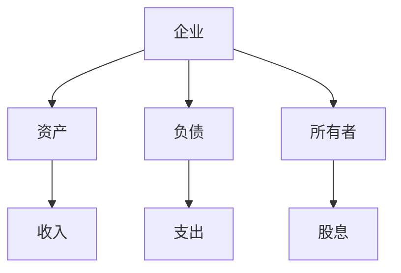
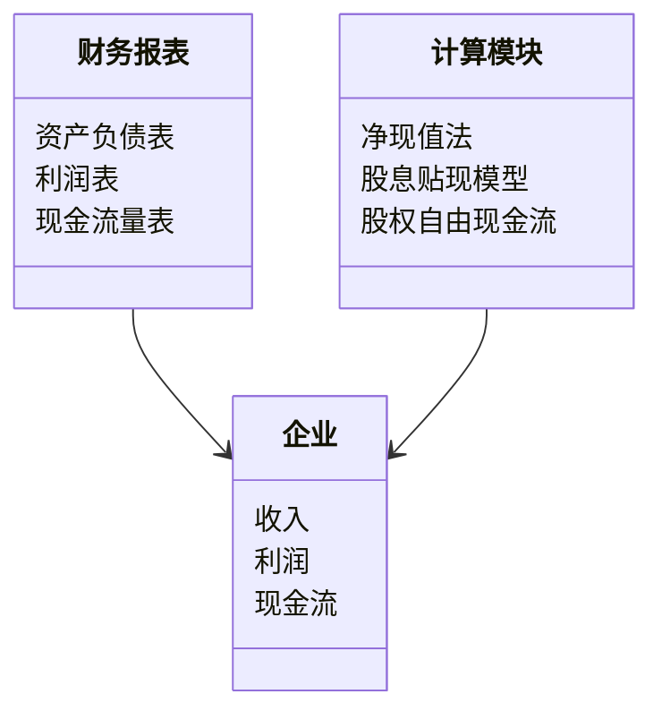
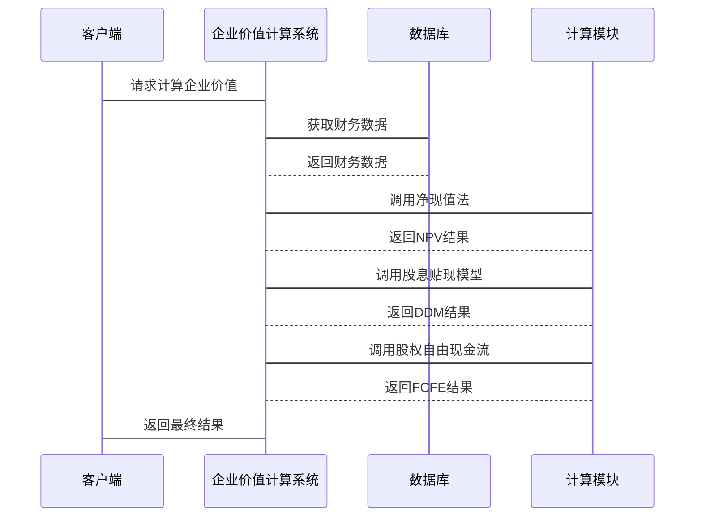

                 


# 格雷厄姆的企业价值计算方法

## 关键词：企业价值计算，格雷厄姆，价值投资，净现值法，股息贴现模型

## 摘要：  
本文详细介绍了格雷厄姆的企业价值计算方法，从其核心理念、算法原理到系统实现，层层深入，结合实际案例，全面解析了如何通过科学的方法评估企业价值。文章首先从格雷厄姆的背景及其价值投资理念入手，详细讲解了企业价值计算的核心概念、公式和步骤，随后通过算法原理和系统架构设计，展示了如何将这些理论应用于实际投资决策中。最后，通过项目实战和总结，为读者提供了实用的建议和注意事项。

---

# 第1章: 格雷厄姆与价值投资背景

## 1.1 格雷厄姆的背景与价值投资理念
### 1.1.1 格雷厄姆的生平简介
本杰明·格雷厄姆（Benjamin Graham）是20世纪著名的投资大师，被誉为“价值投资之父”。他于1894年出生于伦敦，后移居美国，曾在哥伦比亚大学教授投资课程，培养了包括沃伦·巴菲特在内的众多投资界精英。格雷厄姆的投资理念强调安全边际和长期价值，主张以低于内在价值的价格买入优质股票。

### 1.1.2 价值投资的核心理念
格雷厄姆的价值投资理念强调以下几点：
1. **安全边际**：买入价格低于企业内在价值的股票，以确保投资的安全性。
2. **长期视角**：关注企业的基本面，而非短期市场波动。
3. **逆向投资**：在市场恐慌时买入，在市场狂热时卖出。

### 1.1.3 企业价值计算方法的重要性
格雷厄姆认为，只有通过科学的方法计算出企业的内在价值，才能做出明智的投资决策。企业价值计算是价值投资的核心，它帮助投资者识别被低估的企业。

### 1.1.4 与其他投资方法的对比
与技术分析不同，价值投资强调对企业基本面的深入研究。与成长投资相比，价值投资更注重企业的当前价值，而非未来的增长潜力。

## 1.2 企业价值计算的基本定义
### 1.2.1 企业价值的定义与内涵
企业价值（Enterprise Value，EV）是指企业整体的经济价值，包括股权和债权的总价值。它反映了企业的实际价值，而非市场波动带来的价格变化。

### 1.2.2 企业价值计算的公式与步骤
企业价值的计算公式为：
$$ EV = EBIT \times (1 + g) / (r - g) $$
其中，EBIT是息税前利润，g是增长率，r是贴现率。

计算步骤如下：
1. 确定企业的EBIT。
2. 估算增长率g和贴现率r。
3. 将EBIT乘以（1 + g）并除以（r - g）。

### 1.2.3 企业价值与市场价值的区别
企业价值是企业的实际价值，而市场价值是股票在市场上的交易价格。市场价值受情绪影响较大，而企业价值基于企业的基本面。

## 1.3 格雷厄姆的企业价值计算方法的核心要素
### 1.3.1 核心要素的定义与特征
企业价值计算的核心要素包括：
1. **收入**：企业的收入是计算价值的基础。
2. **利润**：企业的利润反映了收入的质量。
3. **现金流**：现金流是企业的“血液”，决定企业的生存能力。

### 1.3.2 核心要素之间的关系
收入、利润和现金流之间相互关联，共同决定了企业的价值。收入高不一定利润高，利润高不一定现金流好，但现金流是企业最重要的财务指标。

### 1.3.3 核心要素的对比分析
通过对比收入、利润和现金流，可以帮助投资者更好地理解企业的价值。

## 1.4 企业价值计算的边界与外延
### 1.4.1 计算范围的界定
企业价值计算需要明确企业的范围，包括母公司和子公司。

### 1.4.2 外延部分的处理
外延部分包括未实现的收益和潜在的资产，需要谨慎处理。

### 1.4.3 边界条件对结果的影响
边界条件如增长率和贴现率的变化会影响企业价值的计算结果。

## 1.5 本章小结
本章介绍了格雷厄姆的背景及其价值投资理念，详细阐述了企业价值的定义、公式和计算步骤，并分析了核心要素及其关系。

---

# 第2章: 格雷厄姆企业价值计算的核心概念与联系

## 2.1 核心概念原理
### 2.1.1 净现值法的原理
净现值法（Net Present Value，NPV）是通过将未来现金流按贴现率折现，计算其现值。

公式：
$$ NPV = \sum_{t=1}^{n} \frac{CF_t}{(1 + r)^t} $$

### 2.1.2 股息贴现模型的原理
股息贴现模型（Dividend Discount Model，DDM）通过将未来股息贴现，计算企业的内在价值。

公式：
$$ V = \frac{D_1}{r - g} $$
其中，D1是下一年度的股息，r是贴现率，g是股息增长率。

### 2.1.3 股权自由现金流的原理
股权自由现金流（Free Cash Flow to Equity，FCFE）是企业在支付所有负债后的剩余现金流。

公式：
$$ FCFE = FCFF - (负债增加) + (折旧和摊销) $$

## 2.2 核心概念属性特征对比表格
```markdown
| 概念         | 特性1       | 特性2       | 特性3       |
|--------------|------------|------------|------------|
| 净现值法      | 现值计算    | 折现率      | 现金流      |
| 股息贴现模型  | 股息计算    | 折现率      | 股东权益    |
| 股权自由现金流 | 现金流计算 | 折现率      | 企业价值    |
```

## 2.3 ER实体关系图


## 2.4 本章小结
本章通过对比分析，详细讲解了净现值法、股息贴现模型和股权自由现金流的核心概念及其联系。

---

# 第3章: 格雷厄姆企业价值计算的算法原理

## 3.1 净现值法的算法步骤
### 3.1.1 算法步骤
1. 确定未来现金流。
2. 选择贴现率。
3. 计算各期现金流的现值。
4. 求和得到净现值。

### 3.1.2 Python代码实现
```python
def net_present_value(cash_flows, discount_rate):
    npv = 0
    for t, cf in enumerate(cash_flows):
        npv += cf / (1 + discount_rate) ** t
    return npv

# 示例
cash_flows = [100, 200, 300]
discount_rate = 0.1
print(net_present_value(cash_flows, discount_rate))
```

## 3.2 股息贴现模型的算法步骤
### 3.2.1 算法步骤
1. 确定初始股息。
2. 估算股息增长率。
3. 计算未来股息的现值。

### 3.2.2 Python代码实现
```python
def dividend_discount_model(dividend, growth_rate, discount_rate):
    value = dividend / (discount_rate - growth_rate)
    return value

# 示例
dividend = 2
growth_rate = 0.05
discount_rate = 0.1
print(dividend_discount_model(dividend, growth_rate, discount_rate))
```

## 3.3 股权自由现金流的算法步骤
### 3.3.1 算法步骤
1. 计算企业自由现金流（FCFF）。
2. 减去负债增加额。
3. 加上折旧和摊销。

### 3.3.2 Python代码实现
```python
def free_cash_flow_to_equity(fcff, debt_increase, depreciation_amortization):
    fcf = fcff - debt_increase + depreciation_amortization
    return fcf

# 示例
fcff = 500
debt_increase = 100
depreciation_amortization = 50
print(free_cash_flow_to_equity(fcff, debt_increase, depreciation_amortization))
```

## 3.4 本章小结
本章详细讲解了净现值法、股息贴现模型和股权自由现金流的算法原理，并通过Python代码实现。

---

# 第4章: 格雷厄姆企业价值计算的系统分析与架构设计

## 4.1 问题场景介绍
企业价值计算需要考虑企业的财务数据、市场环境和宏观经济因素。

## 4.2 系统功能设计
### 4.2.1 领域模型（Mermaid类图）


### 4.2.2 系统架构设计（Mermaid架构图）


### 4.2.3 系统接口设计
接口包括数据输入、模型调用和结果输出。

### 4.2.4 系统交互设计（Mermaid序列图）


## 4.3 本章小结
本章通过系统分析和架构设计，展示了如何将格雷厄姆的企业价值计算方法应用于实际系统中。

---

# 第5章: 格雷厄姆企业价值计算的项目实战

## 5.1 环境安装
需要安装Python和相关库（如numpy、pandas）。

## 5.2 系统核心实现源代码
### 5.2.1 净现值法实现
```python
import numpy as np

def calculate_npv(cash_flows, discount_rate):
    return np.npv(discount_rate, *cash_flows)

# 示例
cash_flows = [ -100, 200, 300 ]
discount_rate = 0.1
print(calculate_npv(cash_flows, discount_rate))
```

### 5.2.2 股息贴现模型实现
```python
def calculate_ddm(initial_dividend, growth_rate, discount_rate):
    return initial_dividend / (discount_rate - growth_rate)

# 示例
initial_dividend = 2
growth_rate = 0.05
discount_rate = 0.1
print(calculate_ddm(initial_dividend, growth_rate, discount_rate))
```

### 5.2.3 股权自由现金流实现
```python
def calculate_fcf(ebit, interest, tax_rate, depreciation):
    ebit_tax = ebit * (1 - tax_rate)
    ebit_after_interest = ebit_tax - interest
    fcf = ebit_after_interest + depreciation
    return fcf

# 示例
ebit = 500
interest = 100
tax_rate = 0.3
depreciation = 50
print(calculate_fcf(ebit, interest, tax_rate, depreciation))
```

## 5.3 代码应用解读与分析
详细解读代码的功能和实现逻辑。

## 5.4 实际案例分析
### 5.4.1 案例背景
假设某企业过去三年的EBIT分别为100、150、200，预计未来三年将以5%的速度增长，贴现率为10%。

### 5.4.2 计算步骤
1. 计算NPV：NPV = 100/(1.1) + 150/(1.1)^2 + 200/(1.1)^3 ≈ 100/1.1 ≈ 90.91 + 150/1.21 ≈ 123.97 + 200/1.331 ≈ 150.88，总计≈ 365.76。
2. 计算DDM：假设初始股息为2，增长率为5%，贴现率为10%，则价值 = 2 / (0.1 - 0.05) = 40。
3. 计算FCFE：假设EBIT为200，利息为100，税率30%，折旧为50，则FCFE = (200*(1-0.3) - 100) + 50 = (140 - 100) + 50 = 90。

### 5.4.3 计算结果分析
企业价值约为40，股权自由现金流为90，说明企业具有较高的投资价值。

## 5.5 本章小结
本章通过实际案例分析，详细讲解了如何应用格雷厄姆的企业价值计算方法。

---

# 第6章: 格雷厄姆企业价值计算的总结与展望

## 6.1 核心观点总结
### 6.1.1 格雷厄姆的价值投资理念
强调安全边际和长期价值。

### 6.1.2 企业价值计算方法的核心
通过科学的方法计算内在价值，识别被低估的企业。

## 6.2 投资策略建议
### 6.2.1 选择低估企业
通过计算企业价值，选择市场价格低于内在价值的企业。

### 6.2.2 长期投资
坚持长期投资，避免短期市场波动的影响。

## 6.3 投资者注意事项
### 6.3.1 数据来源的准确性
确保财务数据的准确性。

### 6.3.2 模型的局限性
格雷厄姆的方法适用于稳定企业，对周期性企业可能不适用。

### 6.3.3 风险管理
分散投资，控制风险。

## 6.4 未来研究方向
### 6.4.1 模型优化
结合机器学习优化计算方法。

### 6.4.2 应用拓展
将方法应用于其他领域，如创业企业。

## 6.5 本章小结
本章总结了格雷厄姆企业价值计算的核心观点，并提出了投资策略和注意事项。

---

# 参考文献
1. 格雷厄姆，本杰明. 《 Intelligent Investor》.
2.巴菲特，沃伦. 《巴菲特致股东的信》.
3. 史蒂夫·罗斯. 《企业价值评估》.

---

# 拓展阅读
1. 《价值投资入门》
2. 《股票投资实战技巧》
3. 《财务报表分析》

