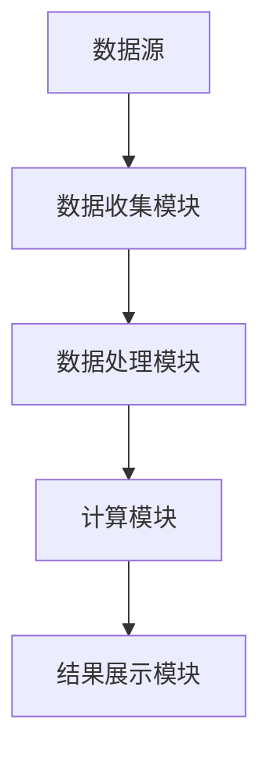

                 


# 格雷厄姆的企业价值计算方法

## 关键词
- 企业价值计算
- 格雷厄姆投资方法
- 市场价值评估
- 内在价值
- 财务报表分析

## 摘要
本文深入探讨了格雷厄姆的企业价值计算方法，从理论基础到实际应用进行了全面分析。文章首先介绍了企业价值计算的基本概念和重要性，然后详细讲解了格雷厄姆的投资理念及其独特的企业价值计算方法。接着，通过数学模型和公式，分析了格雷厄姆方法的核心算法，结合实际案例进行了详细演示。最后，通过系统架构设计和项目实战，展示了如何将格雷厄姆的方法应用于实际投资分析中，总结了该方法的优势与局限性，并提出了最佳实践建议。

---

## 第一部分: 企业价值计算的背景与基础

### 第1章: 企业价值计算概述

#### 1.1 企业价值计算的定义与重要性

企业价值计算是评估企业整体经济价值的重要方法，它不仅考虑了企业的财务状况，还包括市场环境和行业竞争等因素。企业价值计算的重要性体现在以下几个方面：
1. **投资决策支持**：帮助投资者判断企业的潜在收益和风险。
2. **企业并购定价**：企业在并购时需要准确评估目标企业的价值。
3. **企业内部管理**：企业可以通过价值计算优化内部资源配置。

#### 1.2 格雷厄姆的投资理念与分析方法

格雷厄姆是价值投资的鼻祖，他强调以低于内在价值的价格买入优质企业。其核心理念包括：
1. **安全边际**：买入价格低于内在价值，以降低投资风险。
2. **长期视角**：关注企业的长期盈利能力，而非短期市场波动。
3. **基本面分析**：通过财务报表分析企业的财务状况和盈利能力。

### 第2章: 企业价值计算的核心概念与联系

#### 2.1 企业价值计算的核心概念

企业价值计算涉及多个核心概念，包括：
- **内在价值**：企业未来现金流的现值。
- **市场价值**：企业在市场上的交易价格。
- **财务报表分析**：通过资产负债表、利润表和现金流量表评估企业价值。

#### 2.2 格雷厄姆企业价值计算的核心要素

格雷厄姆的计算方法强调对企业未来现金流的评估，以下是其核心要素：
1. **净利润**：企业的盈利能力。
2. **资本结构**：企业的负债和股东权益比例。
3. **增长率**：企业未来收入的增长潜力。

---

## 第二部分: 格雷厄姆企业价值计算的数学模型与算法

### 第3章: 格雷厄姆企业价值计算的数学模型

#### 3.1 格雷厄姆企业价值计算的公式推导

格雷厄姆的内在价值计算公式如下：

$$
\text{内在价值} = \frac{\text{净利润} \times (1 + g)}{r - g}
$$

其中：
- 净利润为企业税后利润。
- \( g \) 是企业的年增长率。
- \( r \) 是投资者要求的回报率。

#### 3.2 格雷厄姆企业价值计算的变量分析

通过公式可以看出，内在价值与净利润、增长率和回报率密切相关。例如，如果净利润为100万元，增长率为5%，回报率为10%，则内在价值为：

$$
\text{内在价值} = \frac{100 \times (1 + 0.05)}{0.10 - 0.05} = \frac{105}{0.05} = 2100 \text{万元}
$$

### 第4章: 格雷厄姆企业价值计算的系统分析与架构设计

#### 4.1 系统功能模块划分

系统架构设计包括以下几个模块：
- 数据收集模块：收集企业的财务数据。
- 数据处理模块：对数据进行清洗和预处理。
- 计算模块：应用格雷厄姆的方法进行价值计算。
- 结果展示模块：以可视化方式呈现计算结果。

#### 4.2 系统架构设计

系统架构图如下：



---

## 第三部分: 项目实战与应用

### 第5章: 格雷厄姆企业价值计算的项目实战

#### 5.1 环境安装与数据收集

需要安装Python和相关库（如Pandas、NumPy）。数据收集包括企业的财务报表数据。

#### 5.2 核心实现代码

以下是计算内在价值的Python代码：

```python
def calculate_intrinsic_value(net_profit, growth_rate, required_return):
    numerator = net_profit * (1 + growth_rate)
    denominator = required_return - growth_rate
    return numerator / denominator

net_profit = 1000000  # 假设净利润为100万元
growth_rate = 0.05     # 增长率为5%
required_return = 0.10 # 投资者要求回报率为10%

intrinsic_value = calculate_intrinsic_value(net_profit, growth_rate, required_return)
print(f"内在价值为: {intrinsic_value}元")
```

#### 5.3 实际案例分析

以某公司为例，计算其内在价值：

1. 数据收集：净利润为1000万元，预计增长率为5%，投资者要求回报率为10%。
2. 计算结果：内在价值为21000万元。

---

## 第四部分: 总结与展望

### 第6章: 总结与最佳实践

- **总结**：格雷厄姆的方法提供了企业价值计算的有效工具，但需要结合市场环境和企业实际情况。
- **最佳实践**：投资者应关注企业的长期增长潜力，选择具有安全边际的投资标的。

### 第7章: 注意事项与拓展阅读

- **注意事项**：格雷厄姆方法的假设可能与实际情况不符，需谨慎调整参数。
- **拓展阅读**：建议阅读格雷厄姆的经典著作《证券分析》。

---

通过以上分析，我们可以看到格雷厄姆的企业价值计算方法不仅在理论上具有深度，而且在实际应用中也具有重要的指导意义。

