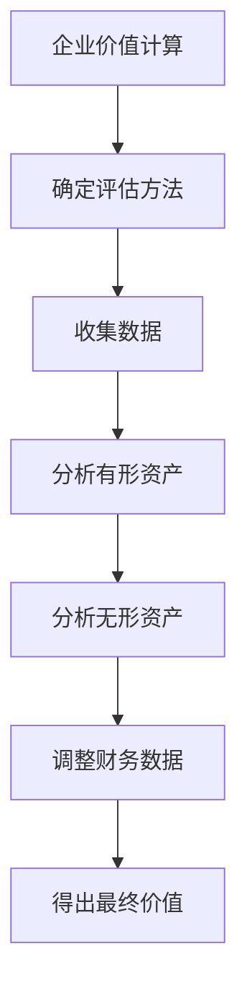

                 

# 格雷厄姆的企业价值计算：调整无形资产的重要性

## 关键词：企业价值计算，格雷厄姆，无形资产，价值投资，财务分析

## 摘要：本文深入探讨了格雷厄姆的企业价值计算方法，重点分析了调整无形资产在评估企业内在价值中的重要性。通过详细阐述无形资产的定义、分类及其对财务表现的影响，结合实际案例分析，展示了如何正确评估和调整无形资产以得出更准确的企业价值。文章还提供了数学模型和流程图，帮助读者更好地理解和应用这些方法。

---

# 第一部分: 引言

## 第1章: 企业价值计算的背景与重要性

### 1.1 企业价值计算的基本概念
企业价值（Enterprise Value，EV）是衡量一家企业整体价值的重要指标，通常用于评估企业的内在价值，以帮助投资者做出更明智的投资决策。企业价值不仅包括企业的有形资产，还应考虑其无形资产的价值。

### 1.2 问题背景
传统的财务分析方法往往忽视了无形资产对企业价值的影响。许多企业在计算企业价值时，仅考虑有形资产和财务报表上的数据，而忽略了品牌价值、技术专利、客户关系等无形资产的实际价值。

### 1.3 格雷厄姆的价值投资理论
本·格雷厄姆是价值投资的鼻祖，他提出的企业价值计算方法强调深入分析企业的财务状况和内在价值。他认为，投资者应关注企业的实际价值，而不是市场的短期波动。

---

## 第2章: 无形资产在企业价值中的重要性

### 2.1 无形资产的定义与分类
无形资产是指企业拥有的、不能用实物形式表示的资产，主要包括品牌价值、技术专利、客户关系、商誉等。这些资产往往对企业未来的盈利能力产生重大影响。

#### 表2-1：无形资产与有形资产的对比

| 属性          | 无形资产                   | 有形资产                   |
|---------------|---------------------------|---------------------------|
| 定义          | 无实物形态的资产             | 具有实物形态的资产           |
| 评估难度      | 较高，需专业方法             | 较低，可通过市场价或成本评估 |
| 对企业价值影响 | 高，直接影响企业未来的盈利能力 | 较低，主要影响企业的生产能力   |

### 2.2 无形资产对企业价值的影响
无形资产不仅直接影响企业的盈利能力，还会影响企业的市场地位和竞争优势。例如，强大的品牌价值可以为企业带来更高的客户忠诚度和市场溢价能力。

---

## 第3章: 调整无形资产对企业价值的影响

### 3.1 调整无形资产的必要性
传统的企业价值计算方法通常忽视了无形资产的价值，导致评估结果偏离实际。通过调整无形资产，可以更准确地反映企业的实际价值。

#### 图3-1：企业价值计算流程图

### 3.2 调整无形资产的方法

#### 3.2.1 无形资产的量化方法
无形资产的价值可以通过多种方法进行量化，例如：

1. **市场法**：通过对比类似企业的市场价值进行评估。
2. **收益法**：通过预测无形资产带来的未来收益进行折现。
3. **成本法**：通过估算开发无形资产所需的成本进行评估。

#### 3.2.2 调整财务报表
调整无形资产后，需要对企业的财务报表进行相应调整，以更准确地反映企业的实际价值。例如，将无形资产的价值加回到企业的总价值中。

---

## 第4章: 格雷厄姆的企业价值计算方法

### 4.1 格雷厄姆的内在价值公式
格雷厄姆提出的企业价值计算公式如下：

$$
EV = \text{净利润} \times \text{合理市盈率} + \text{无形资产调整值}
$$

其中，合理市盈率通常基于企业的行业平均水平或历史数据确定。

### 4.2 实际案例分析
以一家科技公司为例，假设其净利润为1000万元，行业平均市盈率为15倍，无形资产价值为5000万元。

根据公式计算：

$$
EV = 1000 \times 15 + 5000 = 15000 + 5000 = 20000 \text{万元}
$$

调整后的企业价值为2亿元，比传统方法计算的1.5亿元更为准确。

---

## 第5章: 调整无形资产的注意事项

### 5.1 谨慎评估无形资产的价值
无形资产的评估需要结合企业的实际情况，避免过高或过低的估计。

### 5.2 定期更新评估结果
企业的无形资产价值可能会随市场环境和企业战略的变化而变化，因此需要定期更新评估结果。

### 5.3 结合多种评估方法
为了提高评估的准确性，建议结合多种评估方法（如市场法、收益法和成本法）进行综合分析。

---

## 第6章: 总结与展望

### 6.1 总结
调整无形资产是准确计算企业价值的重要步骤。通过本文的分析，我们可以看到，无形资产的价值对企业整体价值有着不可忽视的影响。格雷厄姆的价值投资理论为我们提供了一种科学的方法，帮助我们更好地评估企业的内在价值。

### 6.2 未来展望
随着科技的发展和企业模式的不断变化，无形资产的评估方法也需要不断创新。未来的研究可以进一步探索新兴技术对企业无形资产的影响，以及如何更准确地量化这些资产的价值。

---

## 结语
通过调整无形资产，我们可以更准确地计算企业价值，从而做出更明智的投资决策。格雷厄姆的企业价值计算方法为我们提供了一个强大的工具，但其成功应用离不开对无形资产的深入分析和合理调整。希望本文能为读者在企业价值评估领域提供有价值的参考。

