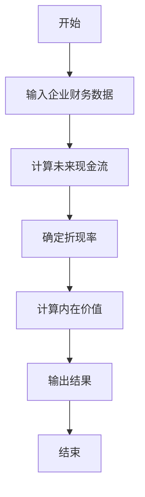

                 


# 格雷厄姆的企业内在价值计算方法

## 关键词：价值投资、内在价值、格雷厄姆、投资分析、企业估值

## 摘要：  
本文深入探讨了格雷厄姆的价值投资理论，重点分析了企业内在价值的计算方法。通过系统化的分析与实践案例，详细阐述了格雷厄姆内在价值计算的核心公式、数学模型、系统架构及实际应用。文章内容涵盖了从理论基础到实践操作的全过程，旨在帮助读者全面理解并掌握这一经典投资方法。

---

# 第一部分: 格雷厄姆的企业内在价值计算方法概述

## 第1章: 价值投资与企业内在价值的背景介绍

### 1.1 价值投资的起源与核心理念

#### 1.1.1 价值投资的定义与特点
价值投资是一种以基本面分析为基础的投资策略，其核心在于寻找市场价格低于其内在价值的证券。这种投资方法强调长期持有优质资产，而非短期市场波动。格雷厄姆是价值投资的鼻祖，他提出了“安全边际”和“内在价值”等核心概念。

#### 1.1.2 格雷厄姆与价值投资的贡献
本杰明·格雷厄姆（Benjamin Graham）是20世纪最伟大的投资思想家之一。他通过《证券分析》和《 Intelligent Investor》等著作，系统地阐述了价值投资的理念。格雷厄姆认为，投资者应该关注企业的内在价值，而不是市场的短期波动。

#### 1.1.3 内在价值计算的现实意义
在当今金融市场中，价格波动往往与企业基本面脱节。通过计算企业的内在价值，投资者可以识别出被市场低估的企业，从而实现超额收益。格雷厄姆的内在价值计算方法为这种投资策略提供了理论基础。

### 1.2 企业内在价值的核心概念

#### 1.2.1 内在价值的定义
内在价值是指企业在正常经营条件下，能够为股东创造的未来现金流的现值。它反映了企业在未来经营中所产生的收益，是衡量企业价值的核心指标。

#### 1.2.2 内在价值的计算方法
格雷厄姆的内在价值计算方法基于现金流折现模型（DCF模型）。其核心思想是将企业未来现金流折现到现值，从而确定其内在价值。

#### 1.2.3 内在价值与市场价值的关系
市场价值是市场价格的表现，而内在价值是企业未来现金流的现值。两者的差异为投资者提供了套利机会。当市场价格低于内在价值时，投资者可以买入该股票，反之则卖出。

---

## 第2章: 格雷厄姆内在价值计算的核心要素

### 2.1 格雷厄姆内在价值公式

#### 2.1.1 格雷厄姆公式的基本结构
格雷厄姆的内在价值公式可以表示为：
$$ V = \frac{E}{(1 + r)^n} $$
其中：
- \( V \) 是企业的内在价值
- \( E \) 是企业未来现金流的总和
- \( r \) 是折现率
- \( n \) 是现金流的时间跨度

#### 2.1.2 格雷厄姆公式中的关键参数
- **未来现金流（E）**：企业未来各期的自由现金流之和。
- **折现率（r）**：反映投资风险的贴现率，通常基于市场利率和企业风险等级确定。
- **时间跨度（n）**：现金流预测的时间长度，通常为5-10年。

#### 2.1.3 格雷厄姆公式与企业价值的关系
通过格雷厄姆公式，投资者可以将企业的未来现金流折现到现值，从而评估其内在价值。这种方法能够帮助投资者识别出那些市场价格低于内在价值的企业。

---

## 第3章: 格雷厄姆内在价值计算的数学模型与公式

### 3.1 格雷厄姆公式的基本数学表达

#### 3.1.1 格雷厄姆公式的核心公式
$$ V = \frac{E}{(1 + r)^n} $$
其中，\( E \) 是未来现金流的总和，\( r \) 是折现率，\( n \) 是时间跨度。

#### 3.1.2 格雷厄姆公式的变形与应用
通过变形格雷厄姆公式，可以得到以下两种形式：
- 现值公式：
$$ PV = \frac{CF_1}{(1 + r)^1} + \frac{CF_2}{(1 + r)^2} + \dots + \frac{CF_n}{(1 + r)^n} $$
- 终值公式：
$$ FV = CF \times (1 + r)^n $$

### 3.2 格雷厄姆内在价值计算的详细步骤

#### 3.2.1 现金流预测
预测企业未来现金流是内在价值计算的第一步。通常包括以下几个步骤：
1. 预测企业未来几年的收入和利润。
2. 估算自由现金流，即企业净利润减去再投资需求。

#### 3.2.2 确定合理的折现率
折现率的确定是内在价值计算的关键。通常，折现率基于企业的风险等级和市场利率。例如，对于低风险企业，折现率可能为5%-7%；对于高风险企业，折现率可能为8%-10%。

#### 3.2.3 计算内在价值
将未来现金流按确定的折现率折现到现值，即得到企业的内在价值。

---

## 第4章: 格雷厄姆内在价值计算的系统架构设计

### 4.1 系统分析与架构设计方案

#### 4.1.1 系统功能设计
- 数据输入：企业财务数据（收入、利润、现金流等）
- 现金流预测：基于历史数据和增长假设，预测未来现金流。
- 折现率计算：根据企业风险和市场利率，确定合理的折现率。
- 内在价值计算：将未来现金流折现到现值，得出内在价值。
- 结果输出：显示计算结果，并与市场价格进行比较。

#### 4.1.2 系统架构设计


#### 4.1.3 系统接口设计
- 输入接口：企业财务数据接口。
- 输出接口：内在价值计算结果接口。

### 4.2 格雷厄姆内在价值计算的流程图



---

## 第5章: 格雷厄姆内在价值计算的项目实战

### 5.1 项目环境安装与配置

#### 5.1.1 Python环境的安装
- 下载并安装Python 3.x。
- 安装必要的库：numpy、pandas、scipy。

#### 5.1.2 必要库的安装
```bash
pip install numpy pandas scipy
```

### 5.2 格雷厄姆内在价值计算的核心代码实现

#### 5.2.1 现金流预测函数

```python
def calculate_future_cash_flows(revenue, growth_rate, discount_rate):
    # 计算未来现金流
    cash_flows = []
    for i in range(len(revenue)):
        cf = revenue[i] * (1 + growth_rate/100)
        cash_flows.append(cf)
    return cash_flows
```

#### 5.2.2 折现率计算函数

```python
def calculate_discount_rate(risk_free_rate, market_rate):
    # 计算折现率
    return (risk_free_rate + market_rate) / 2
```

#### 5.2.3 内在价值计算函数

```python
def calculate_intrinsic_value(cash_flows, discount_rate):
    # 计算内在价值
    pv = 0
    for i in range(len(cash_flows)):
        pv += cash_flows[i] / (1 + discount_rate/100)**(i+1)
    return pv
```

---

## 第6章: 格雷厄姆内在价值计算的总结与展望

### 6.1 格雷厄姆内在价值计算方法的优缺点

#### 优点
- 理论基础坚实，能够准确反映企业的未来现金流。
- 通过安全边际的概念，降低了投资风险。

#### 缺点
- 对未来现金流的预测具有较大的主观性。
- 折现率的选择可能影响计算结果。

### 6.2 实际应用中的注意事项

- 数据的准确性：现金流预测需要基于可靠的历史数据。
- 模型的适用性：不同行业和企业可能需要调整模型参数。
- 市场环境的变化：经济周期和市场利率的变化会影响折现率。

### 6.3 拓展阅读与进一步学习

- 《 Intelligent Investor》——本杰明·格雷厄姆
- 《价值投资实战》——彼得·林奇
- 《企业价值评估》——巴菲特的导师

---

通过本文的系统分析与实践，读者可以全面掌握格雷厄姆的企业内在价值计算方法，并在实际投资中加以应用。

