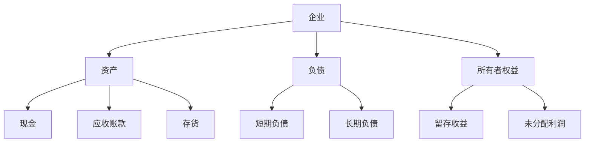
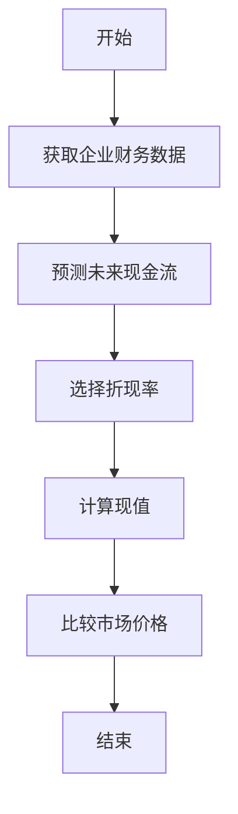
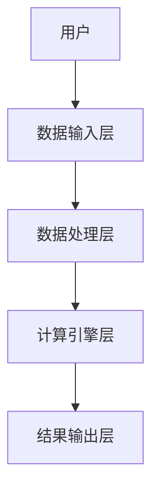

                 


# 格雷厄姆的企业内在价值计算：现代化的方法与工具

## 关键词：
- 格雷厄姆
- 内在价值
- 价值投资
- 现代方法
- 技术工具
- 投资分析

## 摘要：
本文系统地探讨了格雷厄姆的企业内在价值计算理论，并结合现代化的方法与工具，分析了如何在当今环境下优化这一经典模型。文章从格雷厄姆的核心理念出发，逐步引入现代计算工具和算法，通过具体案例和系统设计，展示了如何将传统投资理论与现代技术相结合，以提高企业内在价值评估的准确性和效率。本文旨在为投资者和数据科学家提供一个清晰的框架，帮助他们在复杂多变的市场环境中做出明智的投资决策。

---

## 第一部分: 格雷厄姆的企业内在价值计算基础

### 第1章: 格雷厄姆内在价值理论概述

#### 1.1 格雷厄姆投资理论的核心观点

##### 1.1.1 价值投资的基本原理
格雷厄姆是价值投资的鼻祖，他强调投资的本质是购买企业的一部分，而非单纯地参与市场交易。他认为市场波动是投资者的朋友，而非敌人，因为波动为理性投资者提供了廉价买入优质资产的机会。

##### 1.1.2 内在价值的定义与计算方法
格雷厄姆提出，内在价值是企业未来现金流的现值，其计算公式为：
$$
\text{内在价值} = \sum_{t=1}^{n} \frac{C_t}{(1+r)^t}
$$$
其中，$C_t$是第$t$年的现金流，$r$是折现率，$n$是预测的年数。

##### 1.1.3 格雷厄姆投资理念的现代意义
尽管格雷厄姆的理论提出于20世纪，但其核心思想——寻找市场低估的优质企业——在今天依然具有重要的指导意义。现代投资者可以利用大数据和人工智能技术，更高效地筛选出符合格雷厄姆标准的潜在投资标的。

#### 1.2 企业内在价值的计算背景

##### 1.2.1 传统财务分析的局限性
传统财务分析主要依赖于历史数据和静态指标（如市盈率、市净率等），难以捕捉企业的未来增长潜力。此外，市场情绪和宏观经济因素往往被忽视，导致评估结果不够准确。

##### 1.2.2 现代企业价值评估的需求
随着全球经济的复杂化，企业内在价值的评估需要考虑更多动态因素，如技术创新、市场竞争、政策变化等。投资者需要更精确的工具和方法来应对这些挑战。

##### 1.2.3 内在价值计算的演变历程
从格雷厄姆的原始模型到现代的现金流折现法（DCF），内在价值的计算方法不断完善。现代技术（如机器学习）的应用，使得模型更加灵活和高效。

#### 1.3 格雷厄姆方法与现代工具的结合

##### 1.3.1 格雷厄姆方法的核心步骤
1. 确定企业的核心业务和财务指标。
2. 预测未来现金流。
3. 选择合理的折现率。
4. 计算现值并与市场价格进行比较。

##### 1.3.2 现代化工具的优势
现代工具（如Excel、Python）可以快速处理大量数据，进行复杂的计算和模拟，显著提高了评估效率和准确性。

##### 1.3.3 方法与工具结合的必要性
通过结合格雷厄姆的理论和现代技术，投资者能够更全面地评估企业的内在价值，捕捉更多的投资机会。

#### 1.4 本章小结

##### 1.4.1 格雷厄姆理论的核心要点
- 内在价值是未来现金流的现值。
- 市场价格波动为投资提供了机会。

##### 1.4.2 现代化方法与工具的必要性
- 提高计算效率。
- 扩大分析范围。

##### 1.4.3 后续章节的框架概述
- 第2章：核心概念与联系。
- 第3章：算法原理。
- 第4章：系统架构。
- 第5章：项目实战。
- 第6章：总结与展望。

---

### 第2章: 企业内在价值的核心概念与联系

#### 2.1 核心概念原理

##### 2.1.1 企业内在价值的定义
内在价值是指企业在未来经营中能够为所有者创造的经济价值，是基于未来现金流的现值。

##### 2.1.2 格雷厄姆方法的核心要素
- 现金流预测。
- 折现率选择。
- 企业生命周期分析。

##### 2.1.3 现代化工具的应用逻辑
- 数据获取与清洗。
- 模型构建与参数优化。
- 结果分析与可视化。

#### 2.2 核心概念属性特征对比

##### 2.2.1 财务指标与非财务指标的对比

| 财务指标       | 非财务指标       |
|----------------|------------------|
| 利润率         | 市场地位         |
| 净资产收益率     | 管理团队能力     |
| 现金流         | 创新能力         |

##### 2.2.2 现金流与利润的差异分析
- 现金流反映企业的实际资金流动情况。
- 利润是会计利润，可能受到会计政策的影响。

##### 2.2.3 市场价值与内在价值的关联
市场价值围绕内在价值波动，但受市场情绪影响较大。

#### 2.3 ER实体关系图架构



#### 2.4 本章小结

##### 2.4.1 核心概念的系统化分析
通过对企业内在价值的定义、影响因素及其相互关系的分析，为后续的计算提供了理论基础。

##### 2.4.2 后续章节的逻辑衔接
第3章将详细介绍内在价值的计算方法及其现代技术实现。

---

### 第3章: 现代化方法与工具的具体实现

#### 3.1 算法原理讲解

##### 3.1.1 现金流折现模型的算法流程



##### 3.1.2 现金流预测的数学模型
使用线性回归模型预测未来现金流：
$$
\hat{CF}_t = \beta_0 + \beta_1 \cdot t + \epsilon_t
$$$
其中，$\beta_0$和$\beta_1$是回归系数，$\epsilon_t$是误差项。

##### 3.1.3 折现率的确定
折现率通常基于无风险利率和风险溢价之和：
$$
r = r_f + \text{risk premium}
$$$
其中，$r_f$是无风险利率。

#### 3.2 系统分析与架构设计

##### 3.2.1 系统功能设计
- 数据输入与处理。
- 模型计算。
- 结果输出。

##### 3.2.2 系统架构图



#### 3.3 项目实战

##### 3.3.1 环境安装
安装Python和相关库（如Pandas、NumPy、Scikit-learn）。

##### 3.3.2 核心代码实现
```python
import pandas as pd
import numpy as np
from sklearn import linear_model

# 数据处理
data = pd.DataFrame({
    'Year': [1, 2, 3, 4, 5],
    'CashFlow': [100, 150, 200, 250, 300]
})

# 现金流预测
model = linear_model.LinearRegression()
model.fit(data[['Year']], data['CashFlow'])
predicted_flow = model.predict(data[['Year']])

# 折现率计算
r_f = 0.05
risk_premium = 0.03
r = r_f + risk_premium

# 现值计算
pv = sum(predicted_flow / (1 + r)**t for t in range(len(predicted_flow)))
```

#### 3.4 本章小结
通过具体实现现金流折现模型，展示了如何将格雷厄姆的理论与现代技术工具相结合，提高内在价值计算的效率和准确性。

---

## 第四部分: 结论与展望

### 第4章: 总结与展望

#### 4.1 本章小结
本文系统地介绍了格雷厄姆的企业内在价值计算理论，并结合现代化的方法与工具，分析了其在当代的应用。通过具体案例和系统设计，展示了如何利用大数据和人工智能技术优化传统模型。

#### 4.2 投资中的注意事项
- 数据质量至关重要。
- 模型假设需要合理。
- 市场情绪不可忽视。

#### 4.3 拓展阅读
推荐阅读格雷厄姆的《 Intelligent Investor》以及现代投资学的相关书籍。

---

## 附录
### 附录A: 数据表格
提供相关数据表格，如现金流预测表。

### 附录B: 代码实现
详细代码实现，包括数据清洗、模型训练等步骤。

### 附录C: 参考文献
列出所有引用的文献和工具。

---

# 结语
格雷厄姆的企业内在价值计算理论为现代投资分析提供了宝贵的思路。通过结合现代化的方法与工具，投资者能够更准确地评估企业的内在价值，做出更明智的投资决策。希望本文能够为读者提供有价值的参考。

