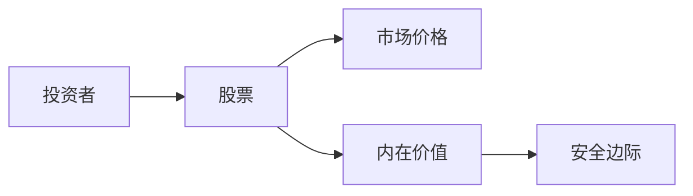

                 


# 格雷厄姆的保守估值方法：留足安全边际

---

## 关键词

- 格雷厄姆  
- 保守估值  
- 安全边际  
- 股票估值  
- 投资策略  

---

## 摘要

格雷厄姆的保守估值方法是一种基于内在价值和安全边际的投资策略，旨在通过留足安全边际来降低投资风险。本文从安全边际的基本概念出发，逐步分析其在股票估值中的应用，结合具体案例，深入探讨如何通过保守估值方法实现稳健投资。文章还详细介绍了安全边际的数学模型、系统架构设计以及实际投资中的应用场景，为投资者提供实用的指导。

---

# 第一部分: 引言

## 第1章: 安全边际与保守估值方法概述

### 1.1 安全边际的基本概念

#### 1.1.1 什么是安全边际

安全边际是格雷厄姆投资理论中的核心概念，指股票的市场价格低于其内在价值的部分。具体来说，安全边际 = 内在价值 - 市场价格。这个差额越大，投资的安全性越高。

#### 1.1.2 安全边际的定义与作用

安全边际的定义可以表示为：

$$ \text{安全边际} = V - P $$

其中，$V$ 是内在价值，$P$ 是市场价格。

安全边际的作用包括：
1. 降低投资风险。
2. 提供缓冲空间，避免因估值误差导致的损失。
3. 帮助投资者在市场波动中保持稳健。

#### 1.1.3 格雷厄姆投资理念的核心思想

格雷厄姆的投资理念可以概括为“买入低于内在价值的股票”，并通过留足安全边际来确保投资的安全性。他强调，投资的本质是寻找具有稳定现金流和低估价值的企业。

---

## 第2章: 投资的基础知识

### 2.1 投资的基本概念

#### 2.1.1 投资的定义与分类

投资是指将资金投入到某种资产中，以期获得未来收益的行为。常见的投资类型包括股票、债券、基金等。

#### 2.1.2 投资的目标与风险

投资的目标是通过资产增值实现财富增长，但投资过程中存在市场风险、流动性风险等多种风险因素。

#### 2.1.3 投资的基本原则

1. 长期投资，避免频繁交易。
2. 分散投资，降低风险。
3. 以价值为导向，而非价格为导向。

### 2.2 股票估值的基本方法

#### 2.2.1 市盈率法

市盈率（P/E）= 股价 / 每股收益。

#### 2.2.2 市净率法

市净率（P/B）= 股价 / 每股净资产。

#### 2.2.3 股息率法

股息率 = 每股股息 / 股价。

---

## 第3章: 安全边际的核心概念

### 3.1 安全边际的数学模型

#### 3.1.1 内在价值的计算公式

内在价值的计算公式为：

$$ V = \frac{CF}{r - g} $$

其中，$CF$ 是未来现金流，$r$ 是折现率，$g$ 是增长率。

#### 3.1.2 安全边际的计算公式

安全边际的计算公式为：

$$ MS = V_{\text{估计}} - V_{\text{实际}} $$

其中，$V_{\text{估计}}$ 是估计的内在价值，$V_{\text{实际}}$ 是实际的内在价值。

### 3.2 安全边际的属性特征对比

| 属性        | 特征                              |
|-------------|-----------------------------------|
| 计算方式     | 基于内在价值与市场价格的差异      |
| 作用         | 降低投资风险                      |
| 应用范围     | 适用于股票、债券等多种资产        |

### 3.3 实体关系图



---

## 第4章: 内在价值的计算方法

### 4.1 内在价值的定义

内在价值是指股票本身的价值，与市场价格无关。它是基于企业未来现金流的折现值。

### 4.2 内在价值的计算步骤

#### 4.2.1 确定企业的未来现金流

未来现金流的计算需要考虑企业的盈利能力、增长潜力等因素。

#### 4.2.2 确定合适的折现率

折现率通常采用无风险利率加风险溢价。

#### 4.2.3 计算内在价值

将未来现金流按折现率折现，求和即为内在价值。

---

## 第5章: 安全边际的评估与应用

### 5.1 安全边际的评估标准

#### 5.1.1 安全边际的百分比要求

通常要求安全边际至少为20%~30%。

#### 5.1.2 安全边际的动态调整

根据市场变化和企业基本面调整安全边际。

### 5.2 安全边际的应用案例

#### 5.2.1 具体股票的估值案例

以某股票为例，计算其内在价值和市场价格，确定安全边际。

#### 5.2.2 如何选择具有安全边际的股票

通过比较市场价格与内在价值，选择具有足够安全边际的股票。

---

## 第6章: 投资系统的架构设计

### 6.1 系统功能设计

#### 6.1.1 数据采集模块

收集企业的财务数据和市场数据。

#### 6.1.2 估值计算模块

计算内在价值和安全边际。

#### 6.1.3 投资决策模块

根据安全边际的结果，做出投资决策。

---

## 第7章: 项目实战

### 7.1 环境安装

安装必要的金融分析工具和编程库。

### 7.2 核心实现源代码

使用Python编写股票估值的代码。

```python
def calculate_intrinsic_value(cash_flow, discount_rate, growth_rate):
    return cash_flow / (discount_rate - growth_rate)
```

### 7.3 代码应用解读与分析

解释代码的功能和实现逻辑。

### 7.4 实际案例分析

以具体股票为例，进行详细分析。

---

## 第8章: 总结与扩展阅读

### 8.1 总结

本文详细介绍了格雷厄姆的保守估值方法，强调了安全边际的重要性。

### 8.2 扩展阅读

推荐相关书籍和资源，供读者深入学习。

---

通过以上步骤，我们可以清晰地看到格雷厄姆的保守估值方法在实际投资中的应用，以及如何通过留足安全边际来实现稳健的投资回报。这种方法不仅适用于股票投资，还可以扩展到其他类型的资产估值中。

