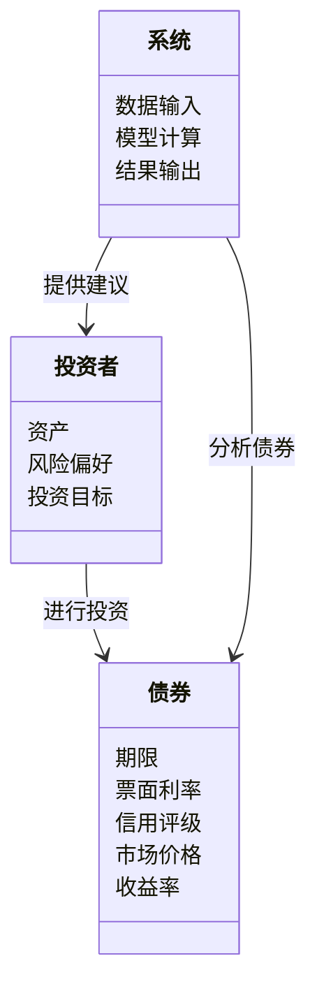
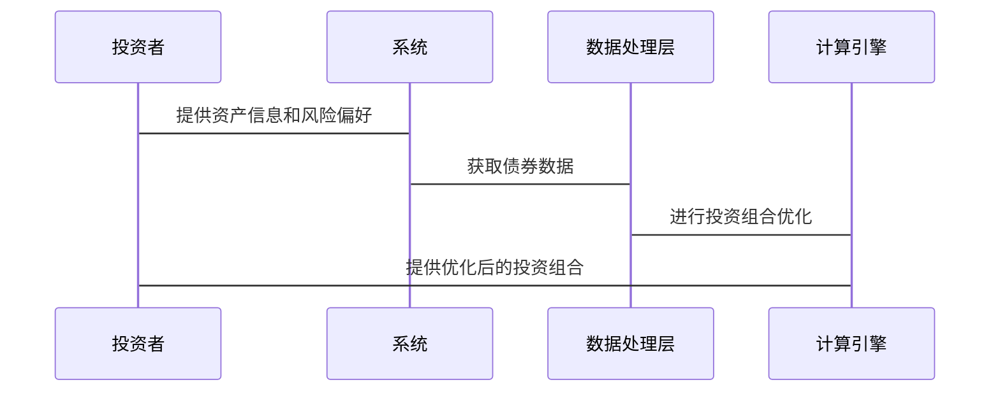

                 


# 格雷厄姆的债券投资策略：在低收益环境中的替代方案

## 关键词：
- 格雷厄姆债券投资策略
- 低收益环境
- 债券投资
- 投资策略
- 数学模型

## 摘要：
在当前低收益的经济环境下，传统的债券投资策略面临严峻挑战。本文将深入探讨格雷厄姆的债券投资策略，分析其在低收益环境中的应用价值。通过构建数学模型，评估债券的投资风险与收益，优化投资组合，并结合实际案例进行分析。本文旨在为投资者提供一种在低收益环境中优化债券投资的替代方案。

## 第一部分：背景介绍

### 第1章：债券投资的基本概念

#### 1.1 债券的定义与特点

- 1.1.1 债券的定义：债券是债务工具，发行人承诺在特定时间偿还本金和利息。
- 1.1.2 债券的主要特点：包括期限、面值、票面利率、偿还方式等。
- 1.1.3 债券的分类与属性：分为政府债券、企业债券、可转换债券等。

#### 1.2 债券市场的运作机制

- 1.2.1 债券市场的基本结构：一级市场和二级市场的运作模式。
- 1.2.2 债券的发行与交易流程：包括发行、承销、上市交易等环节。
- 1.2.3 债券价格与收益率的关系：债券价格受市场利率、期限和信用评级影响。

#### 1.3 债券投资的基本原理

- 1.3.1 债券投资的核心概念：本金安全、固定收益、流动性。
- 1.3.2 债券投资的主要策略：价值投资、趋势投资、套利策略。
- 1.3.3 债券投资的风险与收益分析：利率风险、信用风险、流动性风险。

### 第2章：低收益环境下的投资挑战

#### 2.1 当前市场环境分析

- 2.1.1 全球经济形势对债券市场的影响：低增长、低通胀环境导致债券收益率下降。
- 2.1.2 低利率环境下的债券投资困境：债券收益率接近历史低点，投资回报率下降。
- 2.1.3 通货膨胀对债券投资的潜在影响：通胀上升可能导致债券实际收益下降。

#### 2.2 低收益环境下的投资策略

- 2.2.1 债券投资的替代方案：寻找高信用评级、高收益债券，或考虑其他资产类别。
- 2.2.2 高收益债券的识别与评估：筛选信用评级高、期限适中的债券。
- 2.2.3 分散投资与风险控制：通过多样化投资降低风险，优化投资组合。

### 第3章：格雷厄姆的债券投资策略

#### 3.1 格雷厄姆的投资理念

- 3.1.1 格雷厄姆的投资哲学：注重安全边际，追求长期稳定的回报。
- 3.1.2 格雷厄姆的防御性投资策略：通过购买低估的债券，避免重大损失。
- 3.1.3 格雷厄姆的安全边际概念：债券价格低于其内在价值，提供安全空间。

#### 3.2 格雷厄姆债券投资的核心原则

- 3.2.1 债券投资的长期视角：关注长期趋势，避免短期波动的干扰。
- 3.2.2 债券投资的保守与稳健原则：选择信誉良好的发行人，保持适度杠杆。
- 3.2.3 格雷厄姆债券投资的组合管理：分散投资，定期调整，控制风险。

## 第二部分：核心概念与联系

### 第4章：格雷厄姆债券投资策略的数学模型

#### 4.1 债券定价的数学模型

- 4.1.1 债券收益率的计算公式：
  - 单利计算：$I = P \times r \times t$
  - 复利计算：$A = P \times (1 + r)^t$
- 4.1.2 债券久期与凸性的数学表达：
  - 久期公式：$D = -\frac{1}{P}\times \frac{\partial P}{\partial y}$
  - 凸性公式：$C = \frac{1}{2P}\times \frac{\partial^2 P}{\partial y^2}$
- 4.1.3 债券价格波动的数学模型：使用收益率波动和久期计算债券价格变化。

#### 4.2 债券组合优化的数学方法

- 4.2.1 债券组合的风险-收益优化：使用均值-方差优化模型。
- 4.2.2 债券组合的夏普比率计算：夏普比率公式为$\text{Sharp} = \frac{E[r] - r_f}{\sigma}$。
- 4.2.3 债券组合的马科维茨有效前沿：通过优化算法确定最优投资组合。

## 第三部分：系统分析与架构设计

### 第5章：系统分析与架构设计

#### 5.1 问题场景介绍

- 市场环境：低收益环境下，投资者寻求优化债券投资组合。
- 项目目标：构建数学模型，优化债券投资策略，降低风险，提高收益。

#### 5.2 领域模型设计



#### 5.3 系统架构设计


#### 5.4 系统接口设计

- 输入接口：债券数据接口、投资者参数接口。
- 输出接口：投资建议接口、风险评估接口。

#### 5.5 系统交互设计



## 第四部分：项目实战

### 第6章：项目实战

#### 6.1 环境安装

- 安装Python和相关库：`pip install numpy pandas matplotlib`。

#### 6.2 系统核心实现源代码

```python
import numpy as np
import pandas as pd

def calculate_duration(bond_price, coupon_rate, face_value, yield_to_maturity, years):
    cash_flows = [coupon_rate * face_value] * years + [face_value]
    discounted_cash_flows = [cf / (1 + yield_to_maturity) ** (i+1) for i, cf in enumerate(cash_flows)]
    duration = sum(cash_flows[i] * i for i, cf in enumerate(cash_flows)) / sum(discounted_cash_flows)
    return duration

# 示例数据
bond_price = 100
coupon_rate = 0.05
face_value = 100
yield_to_maturity = 0.03
years = 10

duration = calculate_duration(bond_price, coupon_rate, face_value, yield_to_maturity, years)
print(f"债券的久期为：{duration}")
```

#### 6.3 实际案例分析

- 案例：假设当前市场利率为3%，某债券面值100元，票面利率5%，剩余期限10年。计算其久期和凸性，评估其价格波动。

#### 6.4 代码应用解读与分析

- 计算久期和凸性，评估债券价格对利率变化的敏感性，优化投资组合。

### 第7章：最佳实践

#### 7.1 投资建议

- 选择高信用评级的债券，分散投资，定期调整组合。

#### 7.2 小结

- 格雷厄姆策略在低收益环境中提供了一种稳健的投资方法，通过数学模型优化投资组合，降低风险，提高收益。

#### 7.3 注意事项

- 保持对市场变化的敏感性，及时调整投资策略。
- 定期评估投资组合的表现，确保符合投资目标和风险承受能力。

#### 7.4 拓展阅读

- 推荐阅读《证券分析》（Benjamin Graham），深入理解格雷厄姆的投资理念。

---

通过以上步骤，我们可以系统地分析和优化债券投资策略，为投资者在低收益环境下提供有效的投资方案。

