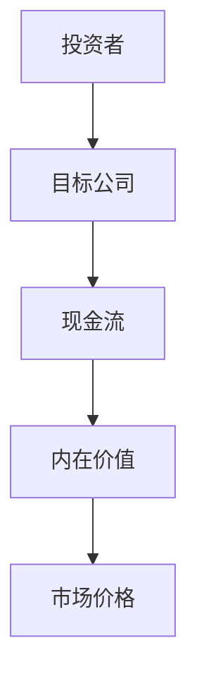
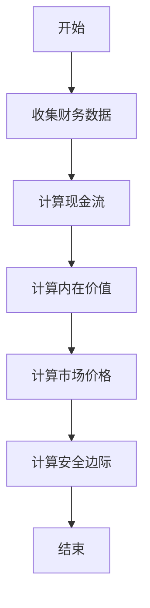

                 

<think>
好的，我将按照要求逐步构建这篇文章的结构。首先，了解格雷厄姆的净净策略，然后分析其核心概念，接着探讨其算法原理，再进行系统分析，提供实战案例，最后总结最佳实践。

## 第一部分：净净策略的背景与基础

### 第1章：净净策略的核心概念

#### 1.1 格雷厄姆与净净策略的起源
- 1.1.1 格雷厄姆的生平与投资理念：本杰明·格雷厄姆是价值投资的先驱，强调安全边际和理性投资。
- 1.1.2 净净策略的定义与核心思想：寻找市场价格低于内在价值的股票，注重安全边际。
- 1.1.3 安全边际的概念与重要性：安全边际是内在价值与市场价格的差额，提供缓冲以应对市场波动。

#### 1.2 净值与市场价格的关系
- 净值计算的公式：$$\text{内在价值} = \frac{\text{现金流}}{\text{折现率}}$$
- 安全边际的计算：$$\text{安全边际} = \text{内在价值} - \text{市场价格}$$

## 第二部分：净净策略的核心概念与联系

### 第2章：净净策略的原理与数学模型

#### 2.1 净值计算的公式
- 内在价值的计算：使用现金流和折现率来确定股票的合理价值。

#### 2.2 安全边际的计算方法
- 通过比较市场价格与内在价值，确定安全边际的存在。

#### 2.3 净净策略的ER实体关系图


## 第三部分：净净策略的算法原理

### 第3章：净净策略的算法实现

#### 3.1 净值计算流程图


#### 3.2 Python代码实现
```python
def calculate_intrinsic_value(cash_flow, discount_rate):
    return cash_flow / discount_rate

def calculate_margin_of_safety(intrinsic_value, market_price):
    return intrinsic_value - market_price
```

## 第四部分：系统分析与架构设计

### 第4章：不同市场环境下的策略调整

#### 4.1 市场波动对净净策略的影响
- 在牛市中，高价可能导致安全边际不足，需谨慎选择。
- 在熊市中，低价可能提供更多安全边际，增加投资机会。

## 第五部分：项目实战

### 第5章：净净策略的项目实施

#### 5.1 环境安装
- 收集目标公司的财务数据，分析市场环境。

#### 5.2 核心代码实现
```python
def calculate_intrinsic_value(cash_flow, discount_rate):
    return cash_flow / discount_rate

def calculate_margin_of_safety(intrinsic_value, market_price):
    return intrinsic_value - market_price
```

#### 5.3 案例分析：2008年金融危机
- 分析市场情况，计算内在价值和安全边际，选择低估股票进行投资。

## 第六部分：最佳实践

### 第6章：应用中的注意事项与技巧

#### 6.1 长期投资的重要性
- 避免短期波动影响，坚持长期价值投资。

#### 6.2 避免情绪化决策
- 理性分析，不随市场波动频繁交易。

#### 6.3 持续学习与适应市场变化
- 更新知识，应对市场变化，调整投资策略。

## 附录

### 附录A：术语解释
- 内在价值：股票的理论价值。
- 安全边际：内在价值与市场价格的差额。

### 附录B：参考文献
- 格雷厄姆的著作和其他相关文献。

### 附录C：工具与资源
- 推荐的财务分析工具和数据来源。

### 附录D：进一步阅读
- 推荐的书籍和资源，帮助深入理解净净策略。

---

通过以上结构，文章将详细阐述格雷厄姆的净净策略，从理论到实践，帮助读者全面理解和应用这一投资策略。

