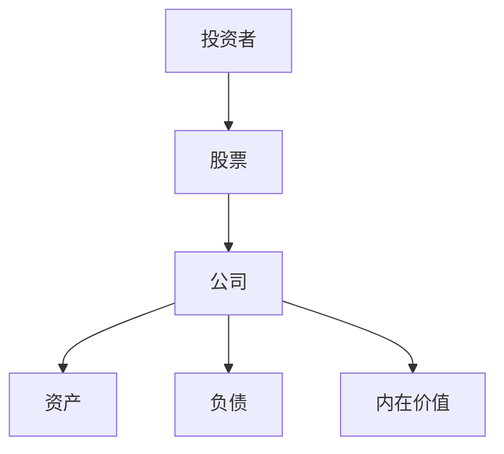
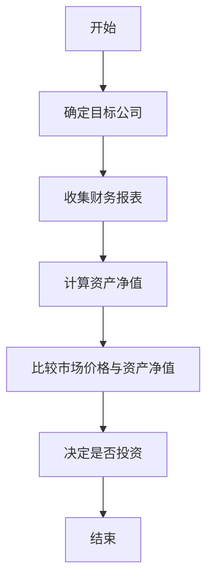
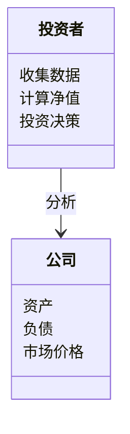
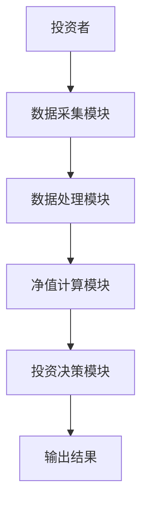

                 


# 格雷厄姆的净净股投资策略

## 关键词：格雷厄姆，价值投资，净净股，投资策略，内在价值，安全边际，市场先生

## 摘要：
本文深入探讨了格雷厄姆的净净股投资策略，分析了其核心概念、算法原理及其在现代投资中的应用。文章从格雷厄姆的投资理念出发，详细阐述了净净股的定义、计算方法和评估标准，并通过实际案例分析了其在投资决策中的应用。此外，本文还探讨了净净股投资的边界条件、实现路径及其与市场价值的联系与区别，为投资者提供了清晰的指导。

---

# 第一部分: 格雷厄姆的净净股投资策略概述

## 第1章: 格雷厄姆投资理念与净净股的背景介绍

### 1.1 格雷厄姆与价值投资概述

#### 1.1.1 格雷厄姆的生平简介
本杰明·格雷厄姆（Benjamin Graham）是20世纪最伟大的投资思想家之一，被誉为“价值投资之父”。他出生于1894年，早年从商，后来转向投资领域，并在哥伦比亚大学教授投资课程。他的思想对后来的投资理论产生了深远影响，尤其是他的学生彼得·林奇和沃伦·巴菲特。

#### 1.1.2 价值投资的核心理念
价值投资的核心理念是寻找市场上被低估的股票，即那些市场价格低于其内在价值的股票。格雷厄姆认为，市场先生（Mr. Market）的情绪波动为投资者提供了机会，当市场恐慌时，聪明的投资者可以以低价买入优质资产。

#### 1.1.3 净净股策略的提出背景
净净股策略是格雷厄姆提出的一种投资策略，旨在通过分析公司的净资产价值来判断其是否被低估。该策略在20世纪30年代大萧条时期得到广泛应用，帮助投资者在市场低迷时发现价值。

### 1.2 净净股的定义与核心概念

#### 1.2.1 净净股的定义
净净股是指那些市场价格低于其净资产价值的股票。净资产价值（Net Worth）是公司资产减去负债的净值，反映了公司的实际价值。

#### 1.2.2 净净股的核心要素
- **资产净值**：公司资产的公允价值减去负债。
- **市场价格**：股票在市场上的交易价格。
- **安全边际**：市场价格与资产净值之间的差距，提供了投资的安全性。

#### 1.2.3 净净股与传统投资策略的区别
与传统投资策略（如技术分析或趋势投资）不同，净净股策略注重基本面分析，尤其是公司的资产状况和财务健康。

### 1.3 净净股投资的背景与问题背景

#### 1.3.1 净净股投资的背景分析
20世纪30年代的大萧条时期，市场恐慌导致许多优质股票价格暴跌，格雷厄姆发现这些股票的市场价格远低于其资产净值，因此提出了净净股策略。

#### 1.3.2 净净股投资的核心问题
如何准确计算公司的资产净值，并判断其市场价格是否低于该价值。

#### 1.3.3 净净股投资的边界与外延
净净股策略主要适用于那些资产净值稳定且易于计算的公司，如银行、保险公司和制造业公司。

### 1.4 净净股投资的核心目标与实现路径

#### 1.4.1 净净股投资的核心目标
通过识别市场价格低于资产净值的股票，实现长期稳定的超额收益。

#### 1.4.2 净净股投资的实现路径
1. 收集目标公司的财务报表，计算其资产净值。
2. 比较市场价格与资产净值，寻找被低估的股票。
3. 结合安全边际，进行投资决策。

#### 1.4.3 净净股投资的边界条件
- 公司的财务数据必须可靠。
- 市场波动可能影响价格，但长期来看，价值会回归。

---

## 第2章: 净净股投资的核心概念与联系

### 2.1 净净股投资的核心概念

#### 2.1.1 公司内在价值的计算公式
$$ V = \text{资产价值} - \text{负债价值} $$

#### 2.1.2 净净股价值的评估方法
- 计算资产净值：$$ \text{资产净值} = \text{资产价值} - \text{负债价值} $$
- 比较市场价格与资产净值：$$ \text{市场低估} \iff \text{市场价格} < \text{资产净值} $$

#### 2.1.3 净净股与市场价值的联系
净净股策略关注的是资产净值与市场价格的差异，而市场价值受市场情绪影响较大。

### 2.2 净净股与市场价值的对比分析

#### 2.2.1 净净股与市场价值的定义对比
- **净净股**：基于资产净值的投资策略。
- **市场价值**：受市场情绪影响的价格。

#### 2.2.2 净净股与市场价值的属性特征对比
| 属性       | 净净股             | 市场价值           |
|------------|--------------------|--------------------|
| 基础       | 资产净值           | 市场情绪           |
| 稳定性     | 较稳定             | 易波动             |
| 可预测性   | 较高               | 较低               |

#### 2.2.3 净净股与市场价值的联系与区别
- **联系**：市场价格围绕资产净值波动。
- **区别**：市场价格受情绪影响，资产净值反映公司真实价值。

### 2.3 净净股投资的ER实体关系图


---

## 第3章: 净净股投资的算法原理

### 3.1 净净股价值计算的算法流程


### 3.2 净值计算的数学模型

#### 3.2.1 净值计算公式
$$ \text{资产净值} = \text{资产价值} - \text{负债价值} $$

#### 3.2.2 市场价格比较
$$ \text{市场低估} \iff \text{市场价格} < \text{资产净值} $$

### 3.3 净值投资的算法实现

#### 3.3.1 算法步骤
1. 收集目标公司财务数据。
2. 计算资产净值。
3. 比较市场价格与资产净值。
4. 决策是否投资。

#### 3.3.2 代码实现示例
```python
def calculate_intrinsic_value(company_data):
    assets = company_data['assets']
    liabilities = company_data['liabilities']
    market_price = company_data['market_price']
    intrinsic_value = assets - liabilities
    is_undervalued = market_price < intrinsic_value
    return is_undervalued
```

#### 3.3.3 示例分析
假设某公司资产为1000万元，负债为500万元，市场价格为400万元：
- 资产净值：500万元
- 市场价格：400万元
- 结论：市场价格低于资产净值，建议投资。

---

## 第4章: 净净股投资的系统架构与项目实战

### 4.1 系统功能设计

#### 4.1.1 领域模型


#### 4.1.2 系统架构


### 4.2 项目实战

#### 4.2.1 环境安装
- Python 3.x
- 数据分析库（Pandas、NumPy）

#### 4.2.2 核心代码实现
```python
import pandas as pd

def main():
    # 收集数据
    data = pd.read_csv('company_data.csv')
    # 计算资产净值
    data['intrinsic_value'] = data['assets'] - data['liabilities']
    # 判断是否低估
    data['is_undervalued'] = data['market_price'] < data['intrinsic_value']
    # 输出结果
    print(data[['company', 'intrinsic_value', 'market_price', 'is_undervalued']])

if __name__ == "__main__":
    main()
```

---

## 第5章: 净净股投资的最佳实践与小结

### 5.1 最佳实践 Tips
1. **长期投资**：耐心持有优质资产。
2. **安全边际**：确保市场价格远低于资产净值。
3. **分散投资**：避免过度集中。

### 5.2 小结
格雷厄姆的净净股策略通过基本面分析，帮助投资者识别被低估的股票。该策略注重资产净值与市场价格的差异，强调安全边际和长期投资。在现代投资中，净净股策略仍然是价值投资的重要组成部分，值得深入研究和应用。

---

# 总结
本文详细介绍了格雷厄姆的净净股投资策略，从其核心概念、算法原理到系统架构与项目实战，为投资者提供了全面的指导。通过本文的分析，读者可以更好地理解如何利用净净股策略进行投资决策，并在实际操作中应用相关算法和工具。

