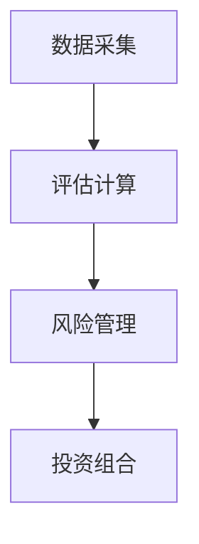
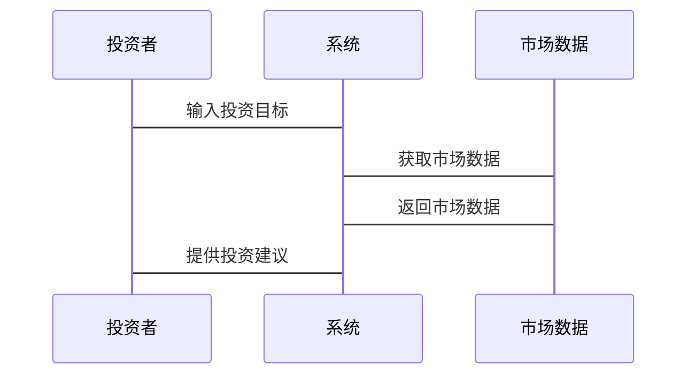

                 


# 格雷厄姆的净净股策略：在高科技股中寻找价值

## 关键词
- 格雷厄姆，净净股策略，价值投资，高科技股，系统架构，Python代码，投资策略

## 摘要
本文深入探讨了格雷厄姆的净净股策略在高科技股投资中的应用。通过分析净净股策略的核心理念、数学模型和系统架构，结合实际案例和Python代码实现，为投资者提供了一套在高科技股中寻找价值的系统方法。文章还讨论了投资组合构建和风险管理，并提出了系统的优化建议和未来研究方向。

---

## 第1章：投资的基础与价值投资概述

### 1.1 投资的基本概念
#### 1.1.1 投资的定义与分类
投资是指将资金投入到金融资产或实体资产中，以期获得未来收益的行为。主要分类包括股票、债券、房地产和货币市场工具等。

#### 1.1.2 金融市场的基本构成
金融市场由投资者、发行人、中介结构和监管机构构成，是资金流动和资产交易的场所。

#### 1.1.3 投资者的角色与类型
投资者可以是个人、机构或基金，不同类型的投资者有不同的风险承受能力和收益目标。

### 1.2 价值投资的核心理念
#### 1.2.1 价值投资的起源与发展
价值投资由本杰明·格雷厄姆提出，强调以低于内在价值的价格购买优质资产。

#### 1.2.2 价值投资的核心原则
价值投资强调安全边际、分散投资和长期持有，注重基本面分析而非市场波动。

#### 1.2.3 价值投资与其它投资策略的对比
与成长投资和趋势投资不同，价值投资更注重资产的内在价值和安全边际。

---

## 第2章：格雷厄姆的净净股策略

### 2.1 净净股策略的背景与起源
#### 2.1.1 格雷厄姆的投资理念
格雷厄姆认为市场先生是机会的提供者，而非价格的制定者，强调安全边际的重要性。

#### 2.1.2 净净股策略的提出
净净股策略是指购买那些市场价格低于其净资产价值的股票，确保投资的安全性。

#### 2.1.3 净净股策略的理论基础
基于资产的价值评估，强调资产的安全性和可计算性。

### 2.2 净净股策略的核心概念
#### 2.2.1 净值计算
$$ \text{净值} = \text{资产} - \text{负债} $$

#### 2.2.2 市净率计算
$$ \text{市净率} = \frac{\text{股价}}{\text{每股净资产}} $$

#### 2.2.3 净净股与其它股票的对比
通过对比市净率，识别市场价格低于净资产价值的股票。

### 2.3 净净股策略在高科技股中的应用
#### 2.3.1 高科技股的特点
高科技股通常具有高成长性和高波动性，适合长期投资。

#### 2.3.2 高科技股的评估标准
结合市净率、市盈率和成长性，筛选具备长期增长潜力的股票。

#### 2.3.3 高科技股投资的风险与机遇
高科技行业波动性大，但技术创新带来的增长机会也更多。

---

## 第3章：净净股策略的数学模型与公式

### 3.1 净净股评估的核心公式
#### 净值计算公式
$$ \text{净值} = \text{资产} - \text{负债} $$

#### 市净率计算公式
$$ \text{市净率} = \frac{\text{股价}}{\text{每股净资产}} $$

### 3.2 净净股策略的数学模型
#### 净值增长模型
$$ \text{未来净值} = \text{当前净值} \times (1 + \text{增长率}) $$

#### 市场波动对净值的影响
$$ \text{波动后的净值} = \text{净值} \times \text{波动系数} $$

#### 风险评估的数学模型
$$ \text{风险} = \frac{\text{波动性}}{\text{收益}} $$

---

## 第4章：系统分析与架构设计方案

### 4.1 投资系统的构成
#### 系统目标
实现基于净净股策略的高科技股投资筛选和管理。

#### 系统功能模块
- 数据采集模块
- 评估计算模块
- 风险管理模块
- 投资组合模块

#### 系统架构图（Mermaid）


### 4.2 系统接口设计
#### 数据输入接口
```python
def get_market_data(ticker):
    # 获取股票数据
    pass
```

#### 数据处理接口
```python
def calculate_pure_value(ticker):
    # 计算净净股价值
    pass
```

#### 数据输出接口
```python
def display_results(ticker):
    # 显示评估结果
    pass
```

### 4.3 系统交互流程图（Mermaid）


---

## 第5章：项目实战

### 5.1 环境安装
安装Python和相关库：
```bash
pip install pandas numpy matplotlib
```

### 5.2 核心实现源代码
```python
import pandas as pd
import numpy as np

def calculate_pure_value(ticker_data):
    # 计算净净股价值
    ticker_data['pure_value'] = ticker_data['price'] / ticker_data['book_value']
    return ticker_data

# 示例数据
data = {'price': [100, 80, 90], 'book_value': [50, 40, 60]}
df = pd.DataFrame(data)
result = calculate_pure_value(df)
print(result)
```

### 5.3 代码应用解读
代码实现净净股价值的计算，帮助筛选符合条件的股票，应用于实际投资决策。

### 5.4 案例分析
分析某高科技股，计算其市净率，判断是否符合净净股标准。

### 5.5 案例小结
案例分析展示了如何利用净净股策略筛选出具有投资价值的高科技股。

---

## 第6章：项目总结与展望

### 6.1 项目成果
成功构建了基于净净股策略的投资系统，实现了高科技股的价值评估和风险管理。

### 6.2 项目总结
总结了净净股策略的优势和局限性，讨论了系统设计中的关键点。

### 6.3 未来展望
建议进一步优化系统，加入更多评估指标和机器学习算法，提升投资决策的准确性。

### 6.4 投资建议
建议投资者结合净净股策略和市场趋势，制定合理的投资计划。

### 6.5 注意事项
提醒投资者注意市场波动和个股风险，保持长期投资心态。

### 6.6 拓展阅读
推荐相关书籍和资源，帮助读者深入学习价值投资和系统设计。

---

## 第7章：小结

通过系统化的分析和实际案例的探讨，本文深入解析了格雷厄姆的净净股策略在高科技股中的应用，为投资者提供了一套科学的投资方法。希望本文能帮助读者在复杂多变的市场中找到价值投资的方向，实现长期稳健的收益。

--- 

**本文结束**

