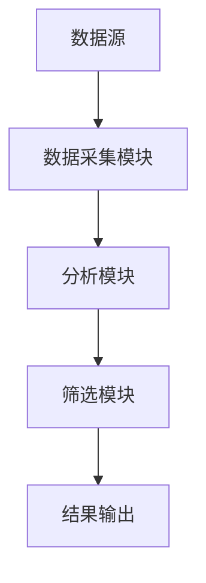

                 


# 格雷厄姆的净净股策略：寻找被低估的公司

## 关键词：
- 价值投资、净净股策略、内在价值、市场价格、格雷厄姆、股票估值

## 摘要：
本文深入探讨了格雷厄姆的净净股策略，解释了如何通过分析公司基本面，寻找市场价格低于其内在价值的股票。文章首先介绍了投资的基本概念和价值投资的起源，详细讲解了净净股策略的核心概念和计算方法，包括内在价值的数学模型和股票筛选标准。接着，文章通过系统架构图和流程图展示了如何构建一个投资决策系统，利用Python代码实现净净股的筛选。最后，结合实际案例，文章详细说明了如何在A股市场中应用该策略，提供了代码实现和项目实战指导。

---

## 第一部分：投资基础知识与价值投资概述

### 第1章：投资的基本概念

#### 1.1 投资的定义与分类
- **投资的定义**：投资是指将资金投入到某种资产或项目中，以期在未来获得收益或资本增值的行为。
- **投资的分类**：包括股票、债券、房地产、基金等多种形式。
- **投资的基本原则**：分散投资、长期持有、价值投资等。

#### 1.2 价值投资的起源与发展
- **价值投资的定义**：以低于其内在价值的价格买入优质股票的投资策略。
- **价值投资的起源**：由本杰明·格雷厄姆和戴维·多德提出，强调安全边际和长期持有。
- **价值投资的发展**：从早期的格雷厄姆学派到后来的巴菲特学派，逐步发展为现代价值投资的主流方法。

---

### 第2章：格雷厄姆与净净股策略

#### 2.1 格雷厄姆的生平与贡献
- **生平简介**：本杰明·格雷厄姆（1894-1975），著名投资家、教授，著有《证券分析》和《聪明的投资者》。
- **格雷厄姆的贡献**：提出了“价值投资”理念，强调寻找市场价格低于内在价值的股票。
- **价值投资理念**：安全边际、margin of safety、投资的三要素（价格、价值、成长）。

#### 2.2 净净股策略的定义与核心思想
- **净净股策略的定义**：通过分析公司基本面，寻找市场价格低于其内在价值的股票。
- **核心思想**：股票的内在价值是其未来现金流的现值，市场价格波动为其提供了投资机会。
- **与传统估值方法的区别**：注重安全边际，强调长期持有，避免短期市场波动的干扰。

---

## 第二部分：净净股策略的核心概念与计算方法

### 第3章：净净股策略的核心概念与计算方法

#### 3.1 核心概念
- **内在价值**：股票的真实价值，由公司盈利能力、资产质量、行业地位等因素决定。
- **市场价格**：股票在市场上的交易价格，受情绪、市场波动等因素影响。
- **安全边际**：市场价格与内在价值之间的差额，提供了投资的安全性。

#### 3.2 净净股策略的计算方法
- **股息贴现模型（DDM）**：通过预测未来股息，计算股票的内在价值。
  $$ V = \frac{D}{k - g} $$
  其中，\( V \) 是内在价值，\( D \) 是股息，\( k \) 是折现率，\( g \) 是股息增长率。
- **资产重估模型（AR）**：通过评估公司资产的公允价值，计算内在价值。
  $$ V = \text{资产公允价值} - \text{负债} $$

#### 3.3 净净股筛选标准
- **市盈率（P/E）**：低于行业平均水平。
- **市净率（P/B）**：低于1。
- **股息率**：高于行业平均水平。
- **ROE**：净资产收益率高于行业平均水平。

---

### 第4章：净净股策略的数学模型与公式

#### 4.1 内在价值的数学模型
- **股息贴现模型（DDM）**
  $$ V = \frac{D_1}{k - g} $$
  其中，\( D_1 \) 是第一年的股息，\( k \) 是折现率，\( g \) 是股息增长率。
- **资产重估模型（AR）**
  $$ V = \text{资产公允价值} - \text{负债} $$

#### 4.2 净净股策略的公式推导
- **内在价值与市场价格的差异**
  $$ \text{安全边际} = \text{内在价值} - \text{市场价格} $$
- **净净股筛选公式**
  $$ \text{筛选条件} = \text{内在价值} > \text{市场价格} \times (1 + \text{安全边际}) $$

---

### 第5章：净净股策略的系统分析与架构设计

#### 5.1 投资决策系统的总体架构
- **系统目标**：通过数据采集、分析和筛选，找出符合净净股策略的股票。
- **系统功能模块**：
  - 数据采集模块：获取公司基本面数据。
  - 分析模块：计算内在价值、市场价格，判断是否满足筛选条件。
  - 筛选模块：输出符合条件的股票列表。
- **系统架构图（Mermaid）**



---

### 第6章：净净股策略的项目实战

#### 6.1 环境安装与工具配置
- **Python环境安装**：使用Anaconda安装Python 3.8以上版本。
- **数据分析工具安装**：安装Pandas、NumPy、Matplotlib等库。
  ```bash
  pip install pandas numpy matplotlib
  ```

#### 6.2 核心实现源代码
- **代码示例：计算内在价值**
  ```python
  import pandas as pd
  import numpy as np

  # 假设df是包含股票数据的DataFrame，包含'PE'、'PB'、'ROE'等列
  df['内在价值'] = df['资产公允价值'] - df['负债']
  df['市场价格'] = df['收盘价']
  df['安全边际'] = df['内在价值'] - df['市场价格']
  ```

#### 6.3 实际案例分析
- **案例：分析某公司股票**
  - 公司基本面数据：资产公允价值为100亿元，负债为50亿元，市场价格为40元。
  - 内在价值计算：100 - 50 = 50元/股。
  - 市场价格与内在价值差异：50 - 40 = 10元，安全边际为10元。

#### 6.4 项目小结
- **项目总结**：通过代码实现净净股策略，能够快速筛选出被低估的股票。
- **注意事项**：数据来源的准确性、模型的适用性、市场的变化等。

---

## 第三部分：最佳实践与小结

### 第7章：最佳实践与小结

#### 7.1 小结
- 净净股策略是一种有效的投资方法，通过分析公司基本面，寻找市场价格低于内在价值的股票。
- 投资者需要结合市场环境、公司基本面和估值指标，综合判断投资机会。

#### 7.2 最佳实践
- **风险管理**：设置止损点，避免重大损失。
- **长期投资**：坚持价值投资理念，避免短期波动干扰。
- **持续学习**：关注市场变化，不断优化投资策略。

#### 7.3 注意事项
- **避免过度依赖单一指标**：结合多种估值方法，全面评估股票价值。
- **关注公司质量**：选择行业地位稳固、财务健康的企业。
- **分散投资**：降低投资风险，避免过度集中。

---

## 结语
格雷厄姆的净净股策略为投资者提供了一种寻找被低估股票的有效方法。通过系统的分析和实践，投资者可以更好地把握市场机会，实现长期稳定的收益。希望本文的分析和代码示例能够为读者提供清晰的思路和实践指导。

