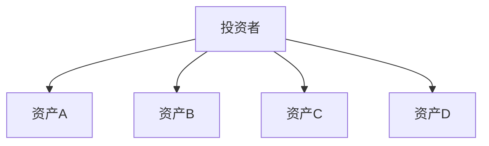
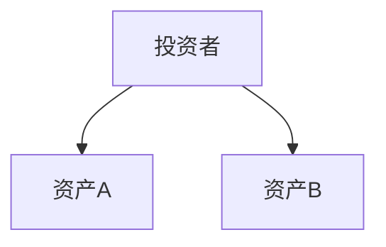

                 


# 分散投资与集中投资的优缺点分析

## 关键词：格雷厄姆，分散投资，集中投资，风险管理，投资策略，巴菲特

## 摘要：本文详细探讨了格雷厄姆倡导的分散投资与集中投资的优缺点，分析了两种策略的核心理念、数学模型和实际应用案例。通过对比分析，帮助投资者理解如何根据自身情况选择适合的投资策略。

---

# 引言

## 1.1 投资的基本概念与格雷厄姆的背景

### 1.1.1 投资的定义与分类

投资是指将资金投入到资产中，以期望在未来获得收益或资本增值的行为。根据资产类型，投资可以分为股票、债券、房地产等多种形式。

### 1.1.2 投资的基本原则

- 长期视角：投资需要耐心，避免频繁交易。
- 风险管理：分散投资以降低风险。
- 理性决策：基于数据和逻辑，而非情绪。

### 1.1.3 投资的三大核心要素

- 资金：可用资金的规模和流动性。
- 时间：投资的期限和目标。
- 风险承受能力：对风险的容忍度。

### 1.2 格雷厄姆的背景与贡献

### 1.2.1 格雷厄姆的生平简介

本杰明·格雷厄姆（1897-1976）是价值投资的鼻祖，被誉为“价值投资之父”。他是哥伦比亚大学商学院的教授，培养了包括巴菲特在内的众多投资大师。

### 1.2.2 格雷厄姆的价值投资理念

格雷厄姆主张以低于内在价值的价格买入优质的公司股票，长期持有，以获取安全的收益。

### 1.2.3 格雷厄姆对现代投资的影响

格雷厄姆的理论奠定了现代投资学的基础，尤其是其分散投资理念影响深远。

## 1.3 分散投资与集中投资的背景

### 1.3.1 现代投资组合理论的起源

现代投资组合理论（MPT）由哈里·马科维茨提出，强调通过分散投资降低风险。

### 1.3.2 分散投资与集中投资的定义

分散投资：将资金分配到多个资产或行业中，降低特定资产的风险。

集中投资：将大部分资金投资于少数几种资产或行业，追求高回报。

### 1.3.3 分散投资与集中投资的优劣势对比

- 分散投资风险低，收益稳定，但可能错失高回报。
- 集中投资风险高，收益潜力大，但可能面临重大损失。

---

# 第二部分：分散投资的核心理念与策略

## 2.1 格雷厄姆的分散投资策略

### 2.1.1 分散投资的起源与发展

现代投资组合理论（MPT）的提出为分散投资提供了理论基础。

### 2.1.2 格雷厄姆的分散投资原则

- 选择具有安全边际的股票。
- 长期持有，定期再平衡。

### 2.1.3 分散投资的实施步骤

1. 确定投资目标和风险承受能力。
2. 分配资产到不同类别。
3. 定期审查和调整。

## 2.2 分散投资的数学模型与风险分析

### 2.2.1 投资组合的风险-收益模型

$$ \text{风险} = \sqrt{\sum w_i^2 \sigma_i^2 + \sum w_i w_j \sigma_{ij}} $$

其中，\( w \) 是权重，\( \sigma \) 是波动率，\( \sigma_{ij} \) 是相关系数。

### 2.2.2 分散投资的数学公式

$$ \text{预期收益} = \sum w_i E[r_i] $$

### 2.2.3 分散投资的风险分析

分散投资通过减少特定资产的风险，降低整体波动性。以下是一个简单的分散投资组合：

```python
import numpy as np

# 假设三个资产的预期收益率和方差
mu = np.array([0.1, 0.15, 0.05])
sigma = np.array([[0.2, 0, 0], [0, 0.3, 0], [0, 0, 0.1]])

# 等权重分配
weights = np.array([1/3, 1/3, 1/3])

# 计算组合方差
portfolio_variance = np.dot(weights.T, np.dot(sigma, weights))
print("组合方差:", portfolio_variance)
```

---

# 第三部分：集中投资的核心理念与策略

## 3.1 巴菲特的集中投资理念

### 3.1.1 集中投资的起源与发展

集中投资的理念起源于格雷厄姆的学生巴菲特，他认为长期投资优质资产可以获得超额收益。

### 3.1.2 集中投资的核心原则

- 投资于具有强大竞争优势的企业。
- 长期持有优质资产。

### 3.1.3 集中投资的实施步骤

1. 选择少数优质资产。
2. 长期持有，不频繁交易。

## 3.2 集中投资的数学模型与风险分析

### 3.2.1 集中投资的风险-收益模型

$$ \text{风险} = \sqrt{w_i^2 \sigma_i^2} $$

### 3.2.2 集中投资的数学公式

$$ \text{预期收益} = w_i E[r_i] $$

### 3.2.3 集中投资的风险分析

集中投资的风险较高，但潜在回报也更大。以下是一个简单的集中投资组合：

```python
import numpy as np

# 假设两个资产的预期收益率和方差
mu = np.array([0.1, 0.2])
sigma = np.array([[0.2, 0], [0, 0.3]])

# 集中投资于第二个资产
weights = np.array([0, 1])

# 计算组合方差
portfolio_variance = np.dot(weights.T, np.dot(sigma, weights))
print("组合方差:", portfolio_variance)
```

---

# 第四部分：分散投资与集中投资的对比分析

## 4.1 对比分析与优缺点

| 对比维度 | 分散投资 | 集中投资 |
|----------|----------|----------|
| 风险 | 低 | 高 |
| 收益 | 稳定 | 潜力大 |
| 管理成本 | 低 | 高 |
| 适用场景 | 风险厌恶型投资者 | 高风险承受能力的投资者 |

### 4.2 投资组合系统架构图



分散投资：


集中投资：



### 4.3 实际案例分析

- 分散投资案例：投资于股票、债券、房地产等多种资产。
- 集中投资案例：投资于苹果、微软等科技巨头。

---

# 第五部分：总结与展望

## 5.1 总结

分散投资适合风险厌恶型投资者，收益稳定但可能错失高回报。集中投资适合高风险承受能力的投资者，潜在回报高但风险也大。

## 5.2 实用建议

- 根据自身风险承受能力和投资目标选择策略。
- 定期审查和调整投资组合。
- 保持长期投资心态，避免短期波动影响决策。

## 5.3 未来趋势展望

随着市场波动加剧，分散投资可能更受欢迎。然而，集中投资在特定市场环境下仍能带来高回报。

---

通过以上分析，投资者可以根据自身情况选择适合的投资策略，平衡风险与收益。

