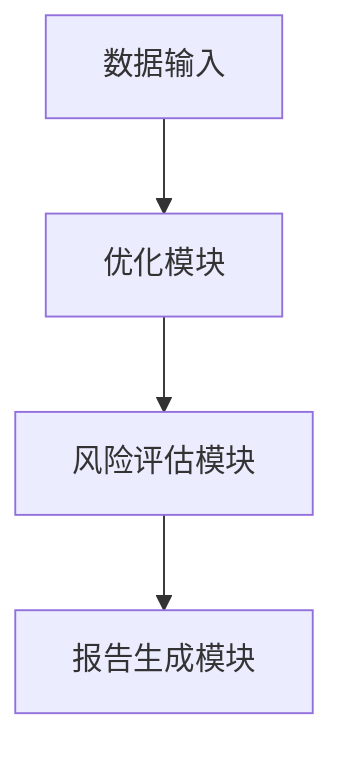

                 


# 格雷厄姆的分散投资原则

> 关键词：分散投资，格雷厄姆，投资原则，风险管理，资产配置，数学模型

> 摘要：本文深入探讨了格雷厄姆的分散投资原则，分析了其在投资策略中的重要性。通过详细讲解分散投资的数学模型和算法，结合系统架构设计和实际案例，为读者提供了一个全面理解分散投资的框架。文章还讨论了分散投资的心理因素和税务规划，为投资者提供了实用的建议。

---

# 第一部分: 分散投资的背景与核心概念

## 第1章: 投资的基本概念与分散投资的重要性

### 1.1 投资的基本概念

#### 1.1.1 投资的定义与分类

投资是指将资金投入到某一领域，以期在未来获得收益的行为。根据投资对象的不同，可以将投资分为以下几类：

- **股票投资**：购买公司股份，成为股东。
- **债券投资**：购买政府或企业发行的债券，定期获得利息。
- **房地产投资**：购买房地产用于出租或升值。
- **基金投资**：通过购买共同基金或指数基金进行投资。

#### 1.1.2 投资的目标与风险

投资的主要目标是实现资产的保值和增值。然而，投资也伴随着风险，包括市场风险、流动性风险和信用风险等。

#### 1.1.3 投资的基本原则

- **分散投资**：避免将所有资金投入单一资产，降低风险。
- **长期投资**：通过长期持有优质资产，获得稳定的收益。
- **价值投资**：选择具有安全边际的股票进行投资。

### 1.2 分散投资的重要性

#### 1.2.1 集中投资的风险

集中投资意味着将大部分资金投入到单一资产或少数几种资产中。这种策略在市场表现良好时可以获得高收益，但在市场波动时可能会遭受重大损失。例如，2008年金融危机期间，许多集中投资房地产的投资者遭受了严重的损失。

#### 1.2.2 分散投资的原理

分散投资通过将资金分配到不同的资产类别中，降低特定资产价格波动对整体投资组合的影响。这种策略利用了不同资产之间的负相关性，即一种资产价格下跌时，另一种资产可能保持稳定或上涨。

#### 1.2.3 分散投资与风险控制的关系

分散投资的核心目标是降低投资组合的整体风险，同时尽可能地提高收益。通过合理分配资产，投资者可以在市场波动时保持投资组合的稳定性。

---

## 第2章: 格雷厄姆的生平与投资理念

### 2.1 格雷厄姆的生平简介

本·格雷厄姆（Ben Graham）是20世纪著名的投资学家，被誉为“价值投资之父”。他在哥伦比亚大学教授证券分析课程，培养了许多著名的投资者，如沃伦·巴菲特。

#### 2.1.1 早年经历与学术背景

格雷厄姆出生于英国，后移居美国。他在哥伦比亚大学学习经济学，并在毕业后从事证券分析工作。

#### 2.1.2 投资生涯与成就

格雷厄姆是早期的证券分析师，他的研究成果奠定了现代证券分析的基础。他与戴维·多德（David Dodd）共同编写了《证券分析》一书，成为投资领域的经典著作。

### 2.2 格雷厄姆的投资理念

#### 2.2.1 价值投资的核心思想

价值投资的核心是寻找那些市场价格低于其内在价值的股票。格雷厄姆认为，市场先生的情绪波动会导致股票价格与实际价值出现偏差，投资者应该利用这种偏差进行投资。

#### 2.2.2 分散投资在格雷厄姆理念中的地位

格雷厄姆强调分散投资的重要性，他认为通过分散投资可以降低特定股票的风险，同时抓住市场中的多个投资机会。

#### 2.2.3 安全边际的概念

安全边际是指股票的市场价格与内在价值之间的差距。格雷厄姆建议投资者选择那些市场价格显著低于内在价值的股票，以确保投资的安全性。

---

## 第3章: 分散投资的原则与策略

### 3.1 分散投资的定义与优势

#### 3.1.1 分散投资的定义

分散投资是指将资金分配到多种不同的资产或资产类别中，以降低投资组合的整体风险。

#### 3.1.2 分散投资的优势

- **降低风险**：通过分散投资，投资者可以减少单一资产价格波动带来的影响。
- **提高收益稳定性**：不同资产的收益可能在不同市场环境下表现不同，分散投资可以提高整体收益的稳定性。

### 3.2 分散投资的实现策略

#### 3.2.1 资产配置的重要性

资产配置是指将资金分配到不同的资产类别中，如股票、债券、房地产等。合理的资产配置可以平衡风险和收益。

#### 3.2.2 不同资产类别的分散

- **股票**：分散投资于不同行业和地区的股票。
- **债券**：投资于不同发行人和期限的债券。
- **现金**：保持一部分现金以应对市场波动。

### 3.3 分散投资的风险管理

#### 3.3.1 风险分散的原理

通过投资于相关性较低的资产，投资者可以降低投资组合的整体风险。例如，股票和债券之间通常具有负相关性。

#### 3.3.2 如何避免过度集中风险

投资者可以通过设定每个资产类别的投资比例上限来避免过度集中风险。例如，将单个资产的投资比例限制在投资组合的10%以内。

---

## 第4章: 分散投资的数学模型与算法

### 4.1 分散投资的数学模型

#### 4.1.1 均值-方差优化模型

均值-方差优化模型是由哈里·马科维茨提出的，用于优化投资组合的收益和风险。模型的目标是找到使收益最大化或风险最小化的资产配置。

#### 4.1.2 现代投资组合理论（MPT）

现代投资组合理论（MPT）是分散投资的理论基础，强调通过分散投资降低风险。

### 4.2 分散投资的算法实现

#### 4.2.1 随机矩阵生成算法

随机矩阵生成算法用于生成随机的资产回报率，以便进行投资组合优化。

#### 4.2.2 风险调整后的收益优化算法

风险调整后的收益优化算法用于在考虑风险的前提下，优化投资组合的收益。

### 4.3 分散投资的数学公式

#### 4.3.1 投资组合的期望收益公式

投资组合的期望收益可以表示为各资产的期望收益的加权平均值：

$$ E(r_p) = \sum_{i=1}^{n} w_i E(r_i) $$

其中，\( w_i \) 是第i个资产的投资权重，\( E(r_i) \) 是第i个资产的期望收益。

#### 4.3.2 投资组合的方差公式

投资组合的方差可以表示为：

$$ Var(r_p) = \sum_{i=1}^{n} \sum_{j=1}^{n} w_i w_j Cov(r_i, r_j) $$

其中，\( Cov(r_i, r_j) \) 是第i个资产和第j个资产的协方差。

---

## 第5章: 分散投资的系统分析与架构设计

### 5.1 投资组合的风险管理

#### 5.1.1 风险指标的定义与计算

常见的风险指标包括标准差、VaR（在险价值）和CVaR（条件在险价值）。

#### 5.1.2 风险监控的策略

投资者需要定期监控投资组合的风险指标，并根据市场变化进行调整。

### 5.2 系统架构设计

#### 5.2.1 投资组合管理系统的功能模块

- **数据输入模块**：输入资产的回报率和相关性数据。
- **优化模块**：进行投资组合优化。
- **风险评估模块**：计算投资组合的风险指标。
- **报告生成模块**：生成投资组合的报告。

#### 5.2.2 系统架构的流程图



---

## 第6章: 分散投资的项目实战

### 6.1 环境配置

#### 6.1.1 安装必要的Python库

安装必要的Python库，如`numpy`、`pandas`和`scipy`。

### 6.2 系统核心实现源代码

```python
import numpy as np
import pandas as pd

# 定义投资组合优化函数
def portfolio_optimization(returns, risk_free_rate):
    # 计算协方差矩阵
    covariance_matrix = np.cov(returns.T)
    
    # 计算均值收益
    mean_return = returns.mean(axis=0)
    
    # 使用均值-方差优化模型
    from scipy.optimize import minimize
    n = returns.shape[1]
    # 初始权重
    init_weights = np.array([1.0/n]*n)
    
    # 目标函数：最小化投资组合的方差
    def objective(weights):
        return np.dot(weights.T, np.dot(covariance_matrix, weights))
    
    # 约束条件：权重之和为1
    constraints = {'type': 'eq', 'fun': lambda w: sum(w) - 1}
    
    # 求解优化问题
    result = minimize(objective, init_weights, method='SLSQP', constraints=constraints)
    
    return result.x

# 示例数据
np.random.seed(42)
n_assets = 5
returns = np.random.randn(100, n_assets) * 0.1 + 0.05

# 调用优化函数
weights = portfolio_optimization(returns, 0.01)

print("最优权重:", weights)
```

### 6.3 代码应用解读与分析

上述代码实现了一个简单的均值-方差优化模型，用于计算最优的投资组合权重。投资者可以根据自己的需求调整输入数据和优化目标。

### 6.4 实际案例分析

假设我们有5种资产，每天的回报率数据如下：

```python
returns = np.array([
    [0.05, 0.03, 0.07, 0.02, 0.04],
    [0.04, 0.06, 0.05, 0.03, 0.06],
    [0.03, 0.04, 0.06, 0.05, 0.05],
    [0.02, 0.05, 0.04, 0.06, 0.04],
    [0.04, 0.03, 0.05, 0.07, 0.06]
])
```

通过上述代码，我们可以计算出最优的投资组合权重。

### 6.5 项目小结

通过实际案例分析，我们可以看到分散投资的数学模型在实际应用中的有效性。投资者可以根据市场环境和自身风险偏好，调整投资组合的权重。

---

## 第7章: 分散投资的最佳实践与小结

### 7.1 分散投资的心理因素

投资者在进行分散投资时，需要克服情绪化决策的诱惑，坚持长期投资策略。

### 7.2 分散投资的税务规划

合理安排资产的持有期限和类型，可以降低税务负担，提高投资收益。

### 7.3 小结

格雷厄姆的分散投资原则为投资者提供了一种科学的投资方法。通过合理分散资产，投资者可以在降低风险的同时，实现资产的长期增值。

---

## 第8章: 优化与扩展

### 8.1 优化策略

- **动态调整投资组合**：根据市场变化定期调整资产配置。
- **引入机器学习算法**：利用大数据和机器学习技术优化投资组合。

### 8.2 拓展阅读

- 《证券分析》（Ben Graham）
- 《投资学原理》（Richard A. Brealey）

---

# 结语

格雷厄姆的分散投资原则不仅是一种投资策略，更是一种风险管理的艺术。通过科学的资产配置和合理的投资组合管理，投资者可以在复杂多变的市场中实现稳健的投资收益。希望本文的分析和实践对读者在投资道路上有所帮助。

--- 

如果需要进一步的代码实现或更详细的案例分析，请随时告知！

