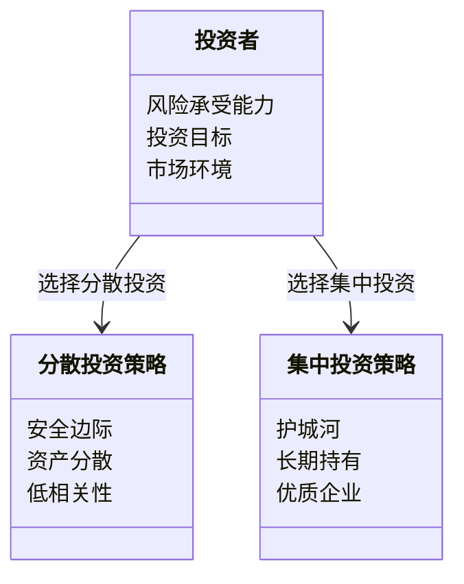

                 


# 格雷厄姆的分散投资原则vs巴菲特的集中投资

> **关键词**: 格雷厄姆, 巴菲特, 分散投资, 集中投资, 价值投资, 投资策略, 投资分析

> **摘要**: 本文详细对比了本杰明·格雷厄姆的分散投资原则与沃伦·巴菲特的集中投资原则，从理论基础、投资策略、数学模型、系统架构等多个维度进行分析，并通过实际案例和项目实战，帮助读者理解这两种投资策略的异同及其适用场景。文章最后还总结了如何根据自身情况选择合适的投资策略，并展望了未来投资策略的发展趋势。

---

## 第1章: 格雷厄姆的分散投资原则

### 1.1 投资理念的起源

#### 1.1.1 价值投资的定义与核心思想
价值投资是一种以低于内在价值的价格买入优质股票的投资策略。格雷厄姆在《证券分析》中提出，股票的价值不仅取决于其市场表现，更取决于其内在价值。他强调，市场先生（市场情绪）经常会出现非理性波动，投资者应利用这种波动，以低于内在价值的价格买入股票。

**核心思想**:
- 股票是企业的部分所有权。
- 投资的目的是寻找具有安全边际的股票。
- 避免市场波动的影响，通过分散投资降低风险。

#### 1.1.2 安全边际的概念与计算
安全边际是格雷厄姆提出的一个重要概念，指股票的市场价格低于其内在价值的程度。计算安全边际的方法如下：

1. 计算股票的内在价值（如通过基本面分析）。
2. 比较市场价格与内在价值的差距。

公式:
$$ \text{安全边际} = \text{内在价值} - \text{市场价格} $$

例如，如果一只股票的内在价值为 $50，市场价格为 $40，其安全边际为 $10，意味着该股票具有较高的投资价值。

#### 1.1.3 分散投资的策略与优势
格雷厄姆主张分散投资，通过投资多种股票来降低特定风险。他建议投资者将资金分散到多个行业中，以避免因个别股票或行业波动带来的重大损失。

**优势**:
- 降低非系统性风险。
- 平衡不同资产的表现。
- 利用不同资产的低相关性分散风险。

### 1.2 格雷厄姆的投资策略分析

#### 1.2.1 投资组合的构建原则
格雷厄姆建议投资者构建一个包含多种股票和债券的投资组合。他推荐的投资组合比例通常为：

- 50% 股票
- 30% 债券
- 20% 其他资产

#### 1.2.2 分散投资的风险控制
通过分散投资，投资者可以降低特定风险（即非系统性风险），但无法降低系统性风险（如市场整体下跌）。分散投资的风险控制可以通过以下方式实现：

1. **资产配置**: 将资金分配到不同资产类别中。
2. **行业分散**: 投资于不同行业的公司。
3. **地域分散**: 投资于不同地区的资产。

#### 1.2.3 资产配置的数学模型
格雷厄姆的资产配置模型可以用以下公式表示：

$$ \text{风险} = \sqrt{ \sum_{i=1}^{n} w_i^2 \times \sigma_i^2 } $$

其中：
- \( w_i \) 是第 i 个资产的权重。
- \( \sigma_i \) 是第 i 个资产的风险（标准差）。

---

## 第2章: 巴菲特的集中投资原则

### 2.1 投资理念的形成

#### 2.1.1 集中投资的哲学基础
巴菲特的投资理念深受其导师格雷厄姆的影响，但又有自己的独特之处。他认为，集中投资于少数优质企业可以更好地关注企业的基本面，并长期持有这些企业，从而获得超额收益。

**核心思想**:
- 投资于具有强大竞争优势的企业。
- 长期持有优质股票，获取复利效应。
- 避免频繁交易，降低交易成本。

#### 2.1.2 企业分析的核心要素
巴菲特在选择投资标的时，注重企业的护城河、管理团队和财务状况。他提出的“护城河”概念，帮助投资者识别具有长期竞争优势的企业。

#### 2.1.3 长期持有的投资策略
巴菲特认为，长期持有优质股票可以最大化复利效应，并减少交易带来的摩擦成本。他的投资策略可以用以下公式表示：

$$ \text{复利收益} = (1 + r)^t - 1 $$

其中：
- \( r \) 是年化收益率。
- \( t \) 是投资时间（年）。

### 2.2 巴菲特的投资策略分析

#### 2.2.1 股票选择的标准与流程
巴菲特选择股票的标准包括：

1. **护城河**: 公司是否具有竞争优势。
2. **管理层**: 管理层是否诚实、有能力。
3. **财务状况**: 公司是否有健康的财务状况。
4. **长期前景**: 公司是否具有长期增长潜力。

#### 2.2.2 集中投资的风险管理
集中投资的风险较高，但巴菲特认为，通过选择具有强大竞争优势的企业，可以有效降低风险。他通常将资金的绝大部分投资于少数几家公司。

#### 2.2.3 资本分配的数学模型
巴菲特的资本分配模型可以用以下公式表示：

$$ \text{投资价值} = \sum_{t=1}^{n} \frac{\text{现金流}}{(1 + r)^t} $$

其中：
- \( r \) 是贴现率。
- \( n \) 是现金流的期限。

---

## 第3章: 分散投资与集中投资的对比

### 3.1 核心概念对比分析

| 对比维度         | 分散投资（格雷厄姆）                        | 集中投资（巴菲特）                          |
|------------------|-------------------------------------------|--------------------------------------------|
| 投资理念         | 以安全边际为核心，分散投资降低风险        | 以护城河为核心，集中投资优质企业            |
| 投资策略         | 投资多种股票，避免过度集中                | 投资少数优质企业，长期持有                  |
| 风险控制         | 通过分散投资降低非系统性风险              | 通过选择优质企业降低系统性风险              |
| 适用场景         | 适合风险厌恶型投资者                      | 适合风险承受能力强的投资者                  |

### 3.2 数学模型与风险分析

#### 3.2.1 分散投资的风险-收益模型
分散投资的风险-收益模型可以用以下公式表示：

$$ \text{分散后的风险} = \sqrt{ \sum_{i=1}^{n} w_i^2 \times \sigma_i^2 } $$

其中：
- \( w_i \) 是第 i 个资产的权重。
- \( \sigma_i \) 是第 i 个资产的风险（标准差）。

#### 3.2.2 集中投资的风险-收益模型
集中投资的风险-收益模型可以用以下公式表示：

$$ \text{集中后的风险} = \max(\sigma_i) $$

其中：
- \( \sigma_i \) 是各资产的风险（标准差）。

---

## 第4章: 不同市场环境下的策略选择

### 4.1 市场波动性与策略适用性

| 市场环境         | 分散投资（格雷厄姆）                        | 集中投资（巴菲特）                          |
|------------------|-------------------------------------------|--------------------------------------------|
| 牛市             | 分散投资表现平稳，避免大幅波动            | 集中投资表现优异，可能获得超额收益          |
| 熊市             | 分散投资损失较小，风险较低                | 集中投资可能遭受较大损失，但优质企业更具防御性 |
| 震荡市           | 分散投资表现稳定，适合保守投资者          | 集中投资需要谨慎选择，避免投资低质量企业    |

### 4.2 投资者类型与策略选择

| 投资者类型         | 分散投资（格雷厄姆）                        | 集中投资（巴菲特）                          |
|------------------|-------------------------------------------|--------------------------------------------|
| 风险厌恶型         | 适合分散投资                               | 不太适合集中投资                            |
| 风险中性型         | 适合分散投资                               | 适合集中投资                                |
| 风险偏好型         | 适合集中投资                               | 适合集中投资                                |

---

## 第5章: 系统分析与架构设计方案

### 5.1 问题场景介绍
投资者需要根据自身的风险承受能力、投资目标和市场环境选择合适的投资策略。

### 5.2 项目介绍
本文旨在构建一个基于格雷厄姆和巴菲特投资理念的投资决策系统。

### 5.3 系统功能设计

#### 5.3.1 领域模型（mermaid 类图）


#### 5.3.2 系统架构设计（mermaid 架构图）
```mermaid
container 投资决策系统 {
    [投资者输入]
    [数据处理]
    [策略选择]
    [结果输出]
}
```

---

## 第6章: 项目实战

### 6.1 环境安装
- Python 3.8+
- NumPy、Pandas 等数据分析库

### 6.2 核心实现源代码

```python
import numpy as np
import pandas as pd

# 分散投资风险计算
def calculate_diversified_risk(weights, volatilities):
    covariance_matrix = np.diag(volatilities)
    risk = np.sqrt(np.dot(weights.T, covariance_matrix.dot(weights)))
    return risk

# 集中投资价值计算
def calculate_intrinsic_value(cash_flows, discount_rate):
    present_value = sum(cash_flows / (1 + discount_rate) ** t for t in range(len(cash_flows)))
    return present_value
```

### 6.3 实际案例分析
案例：假设投资者有 $100,000 可投资资金，选择分散投资和集中投资两种策略。

#### 分散投资
- 投资于 10 只股票，每只股票投资 $10,000。
- 假设每只股票的年波动率为 15%，相关系数为 0.2。

#### 集中投资
- 投资于 2 只股票，每只股票投资 $50,000。
- 假设每只股票的年波动率为 25%，相关系数为 0.8。

通过以上分析，投资者可以根据自身的风险偏好选择合适的投资策略。

---

## 第7章: 最佳实践与小结

### 7.1 最佳实践 tips
- 分散投资适合风险厌恶型投资者，集中投资适合风险偏好型投资者。
- 投资者应根据市场环境和自身情况动态调整投资策略。

### 7.2 项目小结
本文通过对比分析格雷厄姆和巴菲特的投资策略，帮助投资者理解两种策略的异同及其适用场景。通过系统分析和项目实战，投资者可以更好地制定和实施投资计划。

---

## 第8章: 结论与展望

### 8.1 结论
格雷厄姆的分散投资原则和巴菲特的集中投资原则各有优劣，投资者应根据自身的风险承受能力、投资目标和市场环境选择合适的投资策略。

### 8.2 展望
未来，随着人工智能和大数据技术的发展，投资策略将更加多样化和个性化。投资者可以利用这些技术工具，更好地分析市场趋势和企业基本面，制定更加科学的投资策略。

---

**更多关于投资策略的内容，请参考相关书籍和文献。**

