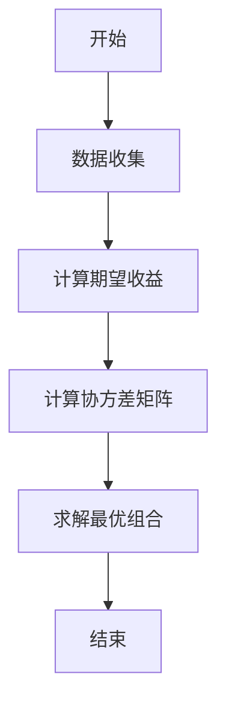
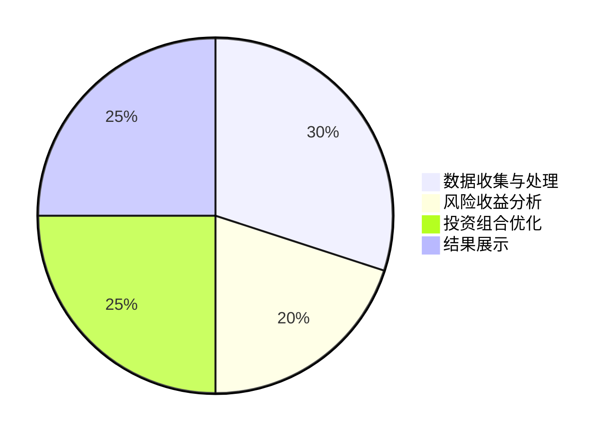
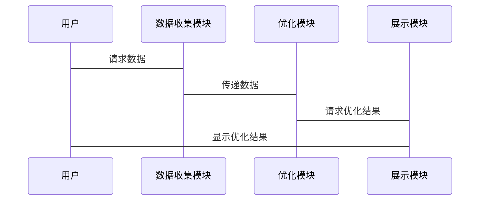

                 

# 分散投资的数学模型与算法原理

## 4.3 分散投资的数学模型

### 4.3.1 投资组合优化的数学公式

$$ E(R_p) = \sum_{i=1}^n w_i R_i $$

$$ Var(R_p) = \sum_{i=1}^n \sum_{j=1}^n w_i w_j Cov(R_i, R_j) $$

其中，\( E(R_p) \) 是投资组合的期望收益率，\( w_i \) 是资产 \( i \) 的权重，\( R_i \) 是资产 \( i \) 的期望收益率，\( Cov(R_i, R_j) \) 是资产 \( i \) 和 \( j \) 的协方差。

### 4.3.2 马科维茨的现代投资组合理论

马科维茨提出，投资者可以通过优化投资组合的夏普比率来实现收益最大化。夏普比率的计算公式为：

$$ Sharpe Ratio = \frac{E(R_p) - R_f}{\sigma_p} $$

其中，\( R_f \) 是无风险利率，\( \sigma_p \) 是投资组合的收益率标准差。

### 4.3.3 夏普比率的计算公式

$$ Sharpe Ratio = \frac{E(R_p) - R_f}{\sigma_p} $$

## 4.4 分散投资的算法流程

### 4.4.1 数据收集与处理

在进行投资组合优化之前，首先需要收集相关资产的历史收益率数据，并进行必要的数据清洗和预处理。

### 4.4.2 风险-收益曲线的绘制

通过计算不同资产组合的期望收益率和标准差，绘制出风险-收益曲线，选择最优的投资组合。

### 4.4.3 最优投资组合的确定

利用优化算法（如均值-方差优化）确定最优投资组合，使得在给定风险水平下，收益最大化，或者在给定收益水平下，风险最小化。

## 4.5 分散投资的mermaid流程图

## 4.6 分散投资的系统架构设计

### 4.6.1 系统功能设计

- 数据收集与处理模块：负责收集和处理投资相关的数据。
- 风险收益分析模块：计算投资组合的风险和收益。
- 投资组合优化模块：根据优化算法确定最优投资组合。
- 结果展示模块：以可视化方式展示投资组合的优化结果。

### 4.6.2 系统架构图

## 4.7 系统接口设计

- 数据接口：提供数据的输入和输出接口。
- 优化接口：提供投资组合优化的算法接口。
- 展示接口：提供结果展示的接口。

## 4.8 系统交互mermaid序列图

## 4.9 本章小结

通过数学模型和算法原理的讲解，我们了解了分散投资在理论和实践中的具体应用。接下来，我们将通过项目实战进一步深入理解分散投资的实现过程。

