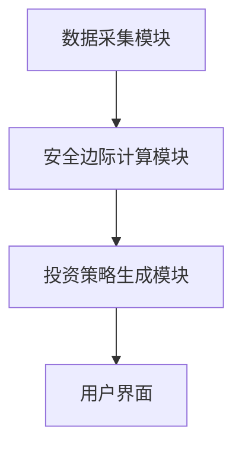
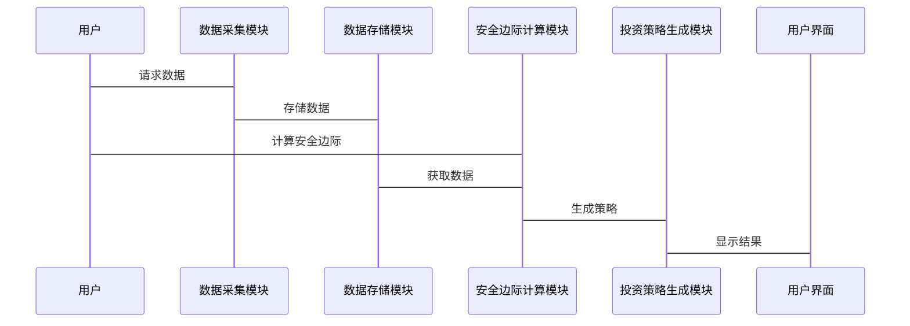

                 


# 格雷厄姆的安全边际在不同市场环境中的应用

## 关键词
- 格雷厄姆，安全边际，投资策略，市场环境，价值投资

## 摘要
格雷厄姆的安全边际概念是价值投资的核心原则之一，它帮助投资者在不同市场环境中做出更明智的投资决策。本文从安全边际的定义和背景出发，探讨其在牛市和熊市等不同市场环境中的应用策略，并通过实例分析和系统设计提供实践指导。

---

# 第1章: 安全边际的核心概念与背景

## 1.1 安全边际的定义与背景

### 1.1.1 投资中的安全边际概念
安全边际是格雷厄姆价值投资理论中的关键概念，指股票的内在价值与市场价格之间的差额。它确保了投资者在市场波动中能够以较低的风险获得收益。

### 1.1.2 格雷厄姆的价值投资理论
格雷厄姆强调以低于内在价值的价格购买优质股票，安全边际提供了这种“Margin of Safety”，帮助投资者在市场低估时抓住机会，避免过度支付。

### 1.1.3 安全边际在投资中的重要性
安全边际通过降低投资风险，为投资者提供了心理上的缓冲区，尤其是在市场波动剧烈时，能够保护投资本金免受损失。

## 1.2 安全边际的核心原理

### 1.2.1 安全边际的数学模型
安全边际（ MOS ）的计算公式为：
$$ \text{MOS} = \text{内在价值} - \text{市场价格} $$

### 1.2.2 安全边际与市场波动的关系
市场波动会影响安全边际的大小，通常在市场下跌时，安全边际增大，为投资者提供了更多的买入机会。

### 1.2.3 安全边际与投资风险的平衡
通过合理配置资产和选择高安全边际的股票，投资者可以在不同市场环境下平衡风险与收益。

## 1.3 安全边际的应用场景

### 1.3.1 不同市场环境下的安全边际
在牛市中，安全边际较低，需谨慎选择；在熊市中，安全边际较高，适合价值投资。

### 1.3.2 安全边际在个股与组合投资中的应用
个股投资中，安全边际用于筛选低估股票；组合投资中，用于分散风险，平衡整体投资组合的安全边际。

### 1.3.3 安全边际与价值发现的关系
安全边际帮助投资者识别市场中的价值洼地，发现被低估的股票和投资机会。

---

# 第2章: 牛市环境中的安全边际应用

## 2.1 牛市环境的特点

### 2.1.1 牛市的定义与特征
牛市是指市场整体呈现上升趋势，投资者情绪乐观，市场交易活跃。

### 2.1.2 牛市中的市场情绪分析
牛市中市场情绪高涨，投资者容易忽视风险，导致市场价格高于内在价值。

### 2.1.3 牛市中的投资者行为模式
投资者倾向于追涨杀跌，容易陷入非理性投资，安全边际在此时显得尤为重要。

## 2.2 安全边际在牛市中的策略

### 2.2.1 高安全边际股票的筛选
在牛市中，寻找那些市场价格接近内在价值的股票，避免过度支付。

### 2.2.2 安全边际与牛市泡沫的识别
通过分析安全边际，识别市场泡沫，避免在高位买入。

### 2.2.3 牛市中安全边际的动态调整
根据市场变化，动态调整安全边际的计算，及时修正投资策略。

## 2.3 实例分析: 牛市中的安全边际应用

### 2.3.1 某行业牛市中的安全边际计算
以科技行业为例，计算某科技股的内在价值和市场价格，判断其安全边际。

### 2.3.2 实例投资策略的制定与实施
基于安全边际分析，制定买入策略，分散投资，降低风险。

### 2.3.3 实例结果与经验总结
通过实例分析，总结牛市中应用安全边际的策略效果，提炼经验教训。

---

# 第3章: 熊市环境中的安全边际应用

## 3.1 熊市环境的特点

### 3.1.1 熊市的定义与特征
熊市是指市场整体呈现下降趋势，投资者情绪悲观，市场交易清淡。

### 3.1.2 熊市中的市场情绪分析
熊市中市场情绪低落，投资者倾向于恐慌性抛售，导致市场价格低于内在价值。

### 3.1.3 熊市中的投资者行为模式
投资者倾向于恐慌性抛售，容易错失价值投资的机会，安全边际在此时提供了买入信号。

## 3.2 安全边际在熊市中的策略

### 3.2.1 高安全边际股票的筛选
在熊市中，寻找那些市场价格远低于内在价值的股票，进行价值投资。

### 3.2.2 安全边际与熊市底部的识别
通过分析安全边际，识别熊市底部，判断买入时机。

### 3.2.3 熊市中安全边际的动态调整
根据市场变化，动态调整安全边际的计算，及时修正投资策略。

## 3.3 实例分析: 熊市中的安全边际应用

### 3.3.1 某行业熊市中的安全边际计算
以金融行业为例，计算某金融股的内在价值和市场价格，判断其安全边际。

### 3.3.2 实例投资策略的制定与实施
基于安全边际分析，制定买入策略，集中投资于高安全边际的股票。

### 3.3.3 实例结果与经验总结
通过实例分析，总结熊市中应用安全边际的策略效果，提炼经验教训。

---

# 第4章: 安全边际的系统架构设计与实现

## 4.1 问题场景介绍

### 4.1.1 投资者面临的挑战
市场波动剧烈，投资者难以准确判断买入时机，安全边际提供了量化工具。

### 4.1.2 项目目标
设计一个基于安全边际的投资系统，帮助投资者在不同市场环境中做出明智决策。

## 4.2 系统功能设计

### 4.2.1 数据采集模块
负责收集股票的市场价格、财务数据等，为后续计算提供数据支持。

### 4.2.2 安全边际计算模块
基于收集的数据，计算每只股票的安全边际，筛选出符合投资条件的股票。

### 4.2.3 投资策略生成模块
根据安全边际计算结果，生成投资策略，指导投资者进行买卖决策。

## 4.3 系统架构设计

### 4.3.1 系统架构图


### 4.3.2 系统交互流程图


## 4.4 系统接口设计

### 4.4.1 数据接口
定义API接口，用于数据采集模块与数据存储模块之间的数据传输。

### 4.4.2 用户接口
设计友好的用户界面，方便投资者查看安全边际计算结果和投资策略。

---

# 第5章: 项目实战——安全边际在股票投资中的应用

## 5.1 环境安装

### 5.1.1 安装Python
安装Python 3.8及以上版本，确保环境配置正确。

### 5.1.2 安装相关库
安装pandas、numpy、yfinance等库，用于数据处理和获取。

## 5.2 核心代码实现

### 5.2.1 数据采集
```python
import pandas as pd
import numpy as np
import yfinance as yf

# 下载股票数据
data = yf.download('AAPL', start='2020-01-01', end='2023-12-31')
```

### 5.2.2 安全边际计算
```python
# 计算内在价值（简化模型）
def calculate_intrinsic_value(stock_data):
    # 假设市盈率合理为15
    fair_price = stock_data['Close'] * 15
    return fair_price.mean()

# 计算安全边际
def calculate_margin_of_safety(fair_price, stock_price):
    mos = fair_price - stock_price
    return mos

# 示例计算
fair_price = calculate_intrinsic_value(data)
current_price = data['Close'].iloc[-1]
mos = calculate_margin_of_safety(fair_price, current_price)
```

### 5.2.3 投资策略生成
```python
# 生成投资策略
def generate_strategy(mos):
    if mos > 0.2:
        return "买入"
    elif mos < -0.1:
        return "卖出"
    else:
        return "观望"

# 示例策略
strategy = generate_strategy(mos)
```

## 5.3 案例分析与结果解读

### 5.3.1 案例背景
以苹果公司（AAPL）为例，分析其安全边际，并制定投资策略。

### 5.3.2 数据处理与计算
通过数据采集和计算，得出AAPL的安全边际，并根据结果制定投资策略。

### 5.3.3 结果解读
解读计算结果，判断AAPL是否处于高安全边际区域，指导投资者进行买卖决策。

---

# 第6章: 安全边际应用的最佳实践与小结

## 6.1 应用注意事项

### 6.1.1 数据质量的重要性
确保数据的准确性和完整性，避免因数据错误导致的决策失误。

### 6.1.2 模型的局限性
安全边际模型基于假设，实际操作中需结合其他因素进行综合判断。

### 6.1.3 风险管理的重要性
合理配置资产，分散投资，降低整体投资组合的风险。

## 6.2 小结

### 6.2.1 核心观点总结
安全边际是价值投资的重要工具，在不同市场环境中提供了有效的投资策略。

### 6.2.2 未来展望
随着市场的变化，安全边际的应用也将不断创新，为投资者提供更强大的工具。

---

# 第7章: 结语与拓展阅读

## 7.1 结语

### 7.1.1 安全边际的重要性
安全边际不仅是一种投资工具，更是一种风险管理的哲学，帮助投资者在不确定的市场中保持理性。

## 7.2 拓展阅读

### 7.2.1 格雷厄姆的其他投资理念
推荐阅读格雷厄姆的《聪明的投资者》，深入理解价值投资的精髓。

### 7.2.2 相关学术研究
查阅更多关于安全边际的学术论文和研究报告，拓展知识视野。

---

通过以上章节的详细分析和实战案例，我们可以清晰地看到，格雷厄姆的安全边际在不同市场环境中的应用不仅理论深厚，而且实践性强。投资者可以通过合理应用这一工具，在市场波动中做出更明智的投资决策，实现稳健的收益。

