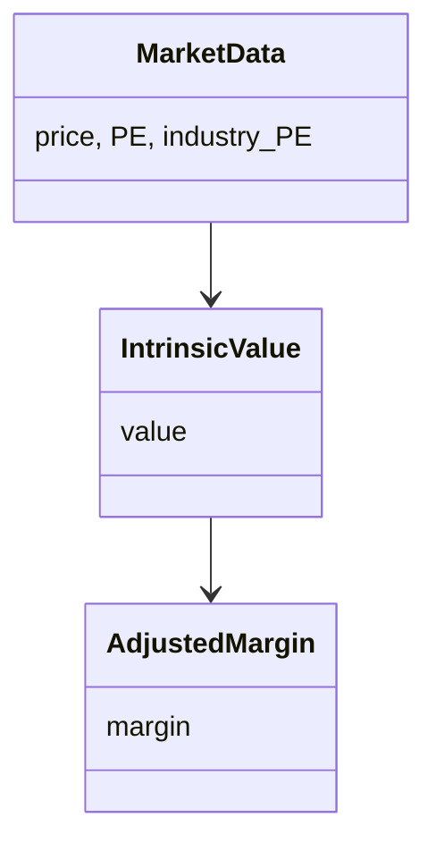

                 


```markdown
# 格雷厄姆的安全边际理论在高估值市场中的调整

> 关键词：安全边际理论, 高估值市场, 格雷厄姆, 投资策略, 股票估值

> 摘要：本文探讨了本杰明·格雷厄姆的安全边际理论在当前高估值市场中的应用与调整，分析了高估值市场环境对传统安全边际理论的挑战，并提出了动态调整的安全边际计算方法。通过数学模型和Python代码的实现，结合实际案例分析，展示了如何在高估值市场中有效应用调整后的安全边际理论，以降低投资风险并提高投资收益。

---

# 第一部分: 格雷厄姆的安全边际理论基础

## 第1章: 安全边际理论的起源与发展

### 1.1 本杰明·格雷厄姆与价值投资

#### 1.1.1 价值投资的鼻祖
- **定义**：价值投资是一种以低于内在价值的价格购买优质股票的投资策略。
- **格雷厄姆的核心思想**：投资的本质是寻找具有安全边际的股票，即市场价格远低于内在价值的股票。
- **现代发展**：价值投资理念被广泛应用于主动管理型基金和机构投资者的决策中。

### 1.2 安全边际理论的核心概念

#### 1.2.1 安全边际的定义与计算
- **定义**：安全边际 = 内在价值 - 市场价格。
- **计算方法**：基于基本面分析，估算股票的内在价值，再与市场价格进行对比。
- **案例分析**：假设一只股票的内在价值为100元，市场价格为80元，安全边际为20元。

#### 1.2.2 格雷厄姆的估值方法
- **市盈率与市净率分析**：通过比较市盈率和市净率与行业平均水平的差异，判断股票的估值水平。
- **股东权益与资产分析**：通过分析公司的净资产和资产质量，评估其内在价值。
- **数学模型**：内在价值的计算公式为：
  $$ V = \text{净利润} \times \text{合理市盈率} $$

### 1.3 安全边际理论与现代投资理论的对比

#### 1.3.1 现代投资组合理论（MPT）
- **核心思想**：通过分散投资降低非系统性风险，构建最优投资组合。
- **与安全边际理论的异同**：
  - 相同点：都强调风险控制。
  - 不同点：MPT关注组合风险，而安全边际理论关注个股的安全性。
- **局限性**：MPT假设资产收益符合正态分布，但在实际市场中可能不成立。

#### 1.3.2 其他投资策略与安全边际理论的对比
- **技术分析**：基于价格和成交量的变化预测未来走势，但忽略了基本面因素。
- **成长型投资**：侧重于公司未来的增长潜力，但可能忽视当前的安全边际。
- **风险平价投资**：通过平衡不同资产的风险来优化投资组合，与安全边际理论有部分相似性。

---

# 第二部分: 高估值市场中的投资挑战

## 第2章: 高估值市场的特点与风险

### 2.1 高估值市场的定义与特征

#### 2.1.1 市场估值水平的衡量
- **市盈率（P/E）**：市场价格除以每股收益。
- **市净率（P/B）**：市场价格除以每股净资产。
- **EV/EBITDA**：企业价值与息税折旧及摊销前利润的比率。

#### 2.1.2 高估值市场的风险
- **估值过高**：市场价格远高于内在价值，安全边际为负数。
- **市场波动性**：高估值市场容易受到情绪驱动，波动性较大。
- **泡沫破裂风险**：当市场回归理性时，股价可能大幅下跌。

#### 2.1.3 高估值市场的周期性
- **周期性波动**：市场估值会周期性地波动，高估值阶段通常出现在市场顶部。
- **历史案例**：2000年互联网泡沫和2020年科技股泡沫。

### 2.2 高估值市场中的投资者行为

#### 2.2.1 投资者情绪的影响
- **情绪驱动**：投资者在高估值市场中容易被乐观情绪影响，忽视基本面。
- **羊群效应**：投资者跟随市场潮流，可能导致非理性决策。
- **贪婪与恐惧**：高估值市场容易引发贪婪，而泡沫破裂时则引发恐惧。

#### 2.2.2 市场情绪与安全边际
- **情绪指数**：通过分析市场情绪指标（如VIX指数）来判断市场的风险偏好。
- **安全边际的动态调整**：根据市场情绪调整安全边际的计算方式。

---

# 第三部分: 安全边际理论的调整与优化

## 第3章: 安全边际理论的动态调整方法

### 3.1 动态调整的必要性

#### 3.1.1 高估值市场的挑战
- **传统安全边际的局限性**：在高估值市场中，传统安全边际可能为负数，无法提供有效的保护。
- **市场环境的变化**：需要根据市场环境动态调整安全边际的计算方式。

### 3.2 动态调整的数学模型

#### 3.2.1 调整后的安全边际公式
$$ \text{调整后安全边际} = V - P \times (1 + \alpha) $$
其中，$\alpha$ 是一个调整因子，根据市场估值水平动态调整。

#### 3.2.2 调整因子 $\alpha$ 的计算
$$ \alpha = \max(0, 1 - \text{市场估值水平}) $$
其中，市场估值水平可以通过市盈率或市净率与行业平均水平的比值来衡量。

### 3.3 动态调整的安全边际算法实现

#### 3.3.1 数据准备
```python
import pandas as pd
import numpy as np

# 假设我们有一个包含股票价格和基本面数据的数据框
data = pd.DataFrame({
    'price': [80, 90, 100, 110, 120],
    'intrinsic_value': [100, 110, 120, 130, 140]
})
```

#### 3.3.2 计算调整后的安全边际
```python
# 定义调整因子 alpha
def calculate_alpha(PE, industry_PE):
    return max(0, 1 - (PE / industry_PE))

# 计算调整后的安全边际
data['alpha'] = data['price'].apply(lambda x: calculate_alpha(x, 15))
data['adjusted_margin'] = data['intrinsic_value'] - data['price'] * (1 + data['alpha'])
```

### 3.4 调整后的安全边际分析

#### 3.4.1 分析调整后的安全边际
- **案例分析**：假设市场PE为15，行业PE为10，计算得到$\alpha = 0.33$。
- **结果解读**：调整后的安全边际为$120 - 80 \times 1.33 = 40$，比传统安全边际（20）更高，提供了更好的保护。

---

# 第四部分: 高估值市场中的投资策略

## 第4章: 投资策略的优化与实施

### 4.1 投资策略的优化

#### 4.1.1 估值调整策略
- **动态调整市盈率**：根据市场环境调整市盈率的合理范围。
- **分阶段投资**：在高估值市场中，分阶段逐步建仓，降低风险。

#### 4.1.2 风险控制策略
- **止损策略**：设定止损点，避免过大损失。
- **分散投资**：通过分散投资降低单一股票的风险。

### 4.2 投资策略的实施

#### 4.2.1 系统架构设计


#### 4.2.2 系统实现
```python
# 系统实现
def calculate_adjusted_margin(data, industry_pe):
    pe = data['price'] / data['eps']
    alpha = max(0, 1 - (pe / industry_pe))
    adjusted_margin = data['intrinsic_value'] - data['price'] * (1 + alpha)
    return adjusted_margin

# 示例数据
data = {
    'price': [80, 90, 100, 110, 120],
    'eps': [10, 10, 10, 10, 10],
    'intrinsic_value': [100, 110, 120, 130, 140]
}

data = pd.DataFrame(data)
adjusted_margin = calculate_adjusted_margin(data, 15)
print(adjusted_margin)
```

---

# 第五部分: 结论与展望

## 第5章: 结论与投资建议

### 5.1 研究总结
- **动态调整的安全边际理论**在高估值市场中提供了有效的保护。
- **数学模型与代码实现**验证了理论的可行性。
- **系统架构设计**为实际应用提供了指导。

### 5.2 投资建议
- **保持谨慎**：在高估值市场中，降低投资风险，避免盲目追高。
- **动态调整**：根据市场环境和公司基本面，动态调整投资策略。
- **长期投资**：选择基本面强劲、具有竞争优势的公司，长期持有。

### 5.3 展望
- **进一步研究**：结合机器学习技术，优化安全边际的计算方法。
- **多策略结合**：将安全边际理论与其他投资策略相结合，提高投资收益。

---

# 附录

## 附录A: Python代码实现

```python
import pandas as pd
import numpy as np

def calculate_adjusted_margin(data, industry_pe):
    pe = data['price'] / data['eps']
    alpha = max(0, 1 - (pe / industry_pe))
    adjusted_margin = data['intrinsic_value'] - data['price'] * (1 + alpha)
    return adjusted_margin

data = pd.DataFrame({
    'price': [80, 90, 100, 110, 120],
    'eps': [10, 10, 10, 10, 10],
    'intrinsic_value': [100, 110, 120, 130, 140]
})

adjusted_margin = calculate_adjusted_margin(data, 15)
print(adjusted_margin)
```

## 附录B: 图表与数据可视化


---

通过本文的分析与实践，我们可以看到，动态调整的安全边际理论在高估值市场中具有重要的应用价值。投资者可以通过本文提供的方法和代码，更好地应对高估值市场的挑战，实现稳健的投资收益。
```

