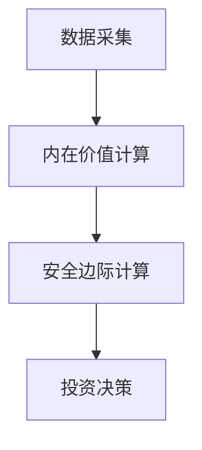
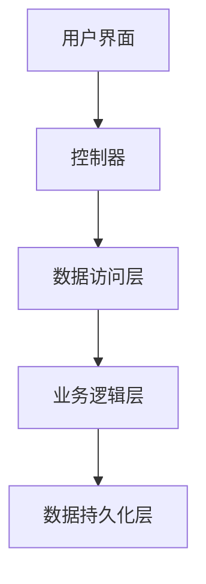
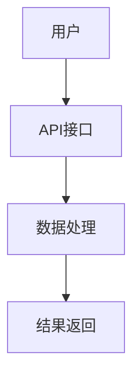

                 


```markdown
# 格雷厄姆的安全边际：如何在投资中留有余地

## 关键词
安全边际，投资，价值投资，内在价值，风险管理，格雷厄姆

## 摘要
本文深入探讨了格雷厄姆的安全边际理论，分析了其在投资决策中的重要性。通过详细讲解安全边际的计算方法、应用策略以及系统架构，帮助读者理解如何在投资中留有余地，降低风险，实现稳健收益。

## 第一部分：安全边际的核心概念与理论基础

### 第1章：安全边际的核心概念

#### 1.1 格雷厄姆的价值投资理论
##### 1.1.1 价值投资的起源与核心思想
价值投资是一种以内在价值为基础的投资策略，起源于20世纪初，由本杰明·格雷厄姆和戴维德·多德提出。该理论强调以低于内在价值的价格买入优质股票，以确保投资的安全性。

##### 1.1.2 格雷厄姆的安全边际理论
安全边际是价值投资的核心概念，指股票的市场价格低于其内在价值的部分。通过预留安全边际，投资者可以避免因市场波动带来的损失，确保投资的稳健性。

##### 1.1.3 安全边际在投资决策中的作用
安全边际为投资者提供了在市场波动中应对风险的缓冲空间，帮助投资者在市场恐慌时保持冷静，避免非理性决策。

#### 1.2 安全边际的定义与特征
##### 1.2.1 安全边际的定义
安全边际=内在价值-市场价格

##### 1.2.2 安全边际的属性特征对比
| 特性 | 安全边际 |
|------|----------|
| 计算方式 | 内在价值减去市场价格 |
| 作用 | 提供风险缓冲 |

#### 1.3 安全边际的重要性
##### 1.3.1 为什么需要安全边际
为了保护投资者在市场下跌时免受损失，确保投资组合的稳定性。

##### 1.3.2 安全边际在投资中的实际应用
通过预留安全边际，投资者可以以更低的价格买入优质资产，从而在市场回升时获得超额收益。

##### 1.3.3 安全边际与长期投资收益的关系
安全边际较高的投资标的往往具有较高的长期收益潜力，尤其是在市场周期性波动中表现更为稳定。

### 第2章：安全边际的计算与评估方法

#### 2.1 安全边际的计算公式
##### 2.1.1 现值法与安全边际的关系
内在价值可以通过现金流折现法计算，而安全边际则基于此计算的内在价值与市场价格之间的差异。

##### 2.1.2 股息贴现模型的应用
$$内在价值 = \sum_{t=1}^{\infty} \frac{\text{股息}_t}{(1 + r)^t}$$

##### 2.1.3 市盈率与安全边际的结合
$$内在价值 = \text{每股收益} \times 合理市盈率$$

#### 2.2 内在价值与安全边际的宽度
##### 2.2.1 内在价值的定义与计算
内在价值是基于未来现金流的现值，反映了资产的真实价值。

##### 2.2.2 安全边际宽度的确定方法
安全边际宽度=内在价值-市场价格

##### 2.2.3 安全边际与市场波动的关系
安全边际为投资者提供了应对市场波动的缓冲空间，帮助投资者在市场波动中保持投资的稳定性。

### 第3章：安全边际在股票投资中的应用

#### 3.1 股票投资中的安全边际策略
##### 3.1.1 买入价格与安全边际的关系
买入价格应低于内在价值，确保存在足够的安全边际。

##### 3.1.2 市场价格与内在价值的对比
通过比较市场价格与内在价值，投资者可以判断是否存在安全边际。

##### 3.1.3 安全边际在选股中的应用
选择那些市场价格显著低于内在价值的股票，确保投资的安全性。

#### 3.2 安全边际与成长型投资
##### 3.2.1 成长型投资的核心理念
成长型投资关注具有高增长潜力的企业，通过长期持有实现资本增值。

##### 3.2.2 安全边际在成长股投资中的作用
在成长型投资中，安全边际帮助投资者避免为高成长性支付过高的价格，降低投资风险。

##### 3.2.3 成长股的安全边际评估方法
通过比较市场价格与未来现金流的现值，评估成长股的安全边际。

### 第4章：安全边际在债券投资中的应用

#### 4.1 债券投资中的安全边际
##### 4.1.1 债券的基本概念与分类
债券是债务工具，发行人承诺在特定时间支付利息和本金。

##### 4.1.2 债券价格波动与安全边际的关系
债券价格受市场利率影响，安全边际帮助投资者在债券价格波动中降低风险。

##### 4.1.3 安全边际在债券投资中的应用
选择信用评级高、市场价格低于内在价值的债券，确保投资的安全性。

#### 4.2 高质量债券的选择标准
##### 4.2.1 债券评级与安全边际的关系
高质量债券通常具有较高的信用评级，安全边际较大。

##### 4.2.2 利息支付能力与安全边际的结合
评估债券的利息支付能力，确保在市场价格波动中保持投资的安全性。

##### 4.2.3 债券组合管理中的安全边际应用
通过分散投资和选择具有较高安全边际的债券，降低债券组合的整体风险。

### 第5章：安全边际在价值投资策略中的应用

#### 5.1 价值投资的核心策略
##### 5.1.1 价值投资的定义与核心思想
价值投资以寻找市场价格低于内在价值的资产为核心策略。

##### 5.1.2 安全边际在价值投资中的地位
安全边际是价值投资的核心原则，确保投资的安全性和收益性。

##### 5.1.3 价值投资与成长投资的对比
价值投资关注低估资产，成长投资关注高增长潜力企业，两者在策略上有所不同，但都可以通过预留安全边际降低风险。

## 第二部分：安全边际的数学模型与系统架构

### 第6章：安全边际的数学模型

#### 6.1 安全边际计算的数学模型
##### 6.1.1 现金流折现模型
$$内在价值 = \sum_{t=1}^{\infty} \frac{\text{现金流}_t}{(1 + r)^t}$$

##### 6.1.2 安全边际计算
$$安全边际 = 内在价值 - 市场价格$$

##### 6.1.3 例子分析
假设某股票的内在价值为100元，市场价格为80元，则安全边际为20元。

#### 6.2 安全边际的风险管理模型
##### 6.2.1 风险调整后的安全边际计算
考虑市场风险和流动性风险，调整内在价值和市场价格的计算。

##### 6.2.2 例子分析
$$调整后的内在价值 = 100 \times (1 - \text{风险调整因子})$$

#### 6.3 安全边际的动态调整模型
##### 6.3.1 动态调整的必要性
市场环境变化时，需要定期调整内在价值和市场价格的计算。

##### 6.3.2 例子分析
$$内在价值_{t+1} = 内在价值_t + \Delta \text{现金流}_t$$

### 第7章：安全边际的系统架构设计

#### 7.1 系统功能设计
##### 7.1.1 系统功能模块
- 数据采集模块：收集市场数据
- 内在价值计算模块：基于现金流折现法计算内在价值
- 安全边际计算模块：计算安全边际
- 投资决策模块：基于安全边际进行投资决策

##### 7.1.2 功能流程图


#### 7.2 系统架构设计
##### 7.2.1 系统架构图


##### 7.2.2 系统组件说明
- 用户界面：提供数据输入和结果展示
- 控制器：协调各个组件的工作
- 数据访问层：与数据源交互
- 业务逻辑层：执行内在价值和安全边际的计算
- 数据持久化层：存储计算结果

#### 7.3 系统接口设计
##### 7.3.1 API接口定义
- 输入：资产名称、市场数据
- 输出：内在价值、安全边际、投资建议

##### 7.3.2 接口交互图


## 第三部分：安全边际的项目实战

### 第8章：环境安装与配置

#### 8.1 环境要求
- 操作系统：Linux/Windows/MacOS
- Python版本：3.6及以上
- 依赖库：pandas, numpy, matplotlib

#### 8.2 安装步骤
1. 安装Python
2. 安装所需的依赖库
3. 下载源代码
4. 配置环境变量

### 第9章：核心代码实现

#### 9.1 数据采集模块
##### 9.1.1 代码实现
```python
import pandas as pd
import numpy as np

def get_market_data(ticker):
    # 模拟数据获取
    return pd.DataFrame({
        'price': [100],
        'volume': [1000]
    })
```

##### 9.1.2 代码解读
- 使用pandas库获取市场数据
- 返回包含价格和成交量的数据框

#### 9.2 内在价值计算模块
##### 9.2.1 代码实现
```python
def calculate_intrinsic_value(cash_flows, discount_rate):
    return sum(cash_flows / (1 + discount_rate)**t for t in range(len(cash_flows)))
```

##### 9.2.2 代码解读
- 使用现金流折现法计算内在价值
- 现金流和折现率作为输入，返回计算的内在价值

#### 9.3 安全边际计算模块
##### 9.3.1 代码实现
```python
def calculate_margin_of_safety(intrinsic_value, market_price):
    return intrinsic_value - market_price
```

##### 9.3.2 代码解读
- 输入内在价值和市场价格，返回安全边际

#### 9.4 投资决策模块
##### 9.4.1 代码实现
```python
def investment_decision(margin_of_safety):
    if margin_of_safety > 0:
        return "买入"
    elif margin_of_safety == 0:
        return "观望"
    else:
        return "卖出"
```

##### 9.4.2 代码解读
- 根据安全边际的正负，决定买入、观望或卖出

### 第10章：实际案例分析

#### 10.1 案例背景
- 股票名称：ABC公司
- 市场价格：$50
- 预测现金流：$20, $25, $30
- 折现率：10%

#### 10.2 计算内在价值
$$
\text{内在价值} = \frac{20}{1.1} + \frac{25}{1.21} + \frac{30}{1.331} ≈ 18.18 + 20.66 + 22.54 ≈ 61.38
$$

#### 10.3 计算安全边际
$$
\text{安全边际} = 61.38 - 50 = 11.38
$$

#### 10.4 投资决策
投资决策模块返回“买入”

### 第11章：项目小结

#### 11.1 项目总结
通过本项目，我们实现了基于安全边际的价值投资策略，能够帮助投资者在投资决策中预留足够的安全边际，降低投资风险。

#### 11.2 项目成果
- 实现了安全边际计算的自动化
- 提供了基于安全边际的投资决策建议
- 通过实际案例展示了安全边际的应用

#### 11.3 项目意义
安全边际是价值投资的核心原则，通过预留安全边际，投资者可以在市场波动中保持稳健的投资回报。

## 第四部分：安全边际的拓展阅读与最佳实践

### 第12章：最佳实践与小结

#### 12.1 最佳实践
- 定期检查投资组合的安全边际
- 根据市场环境动态调整安全边际
- 选择具有高安全边际的优质资产

#### 12.2 小结
通过本文的讲解，读者可以深入了解安全边际在投资中的重要性，并能够实际应用安全边际理论进行投资决策。

### 第13章：注意事项与风险提示

#### 13.1 投资风险提示
- 安全边际不能完全消除投资风险，但可以降低风险
- 市场波动可能会影响安全边际的实际效果
- 投资者需根据自身风险承受能力调整安全边际

#### 13.2 实际操作中的注意事项
- 确保数据的准确性和及时性
- 定期评估投资组合的安全边际
- 避免过度依赖单一投资策略

### 第14章：拓展阅读与深入学习

#### 14.1 深入学习资源
- 格雷厄姆的《 Intelligent Investor 》
- 价值投资的经典文献
- 金融分析的相关书籍

#### 14.2 相关领域研究
- 行为金融学
- 投资心理学
- 市场预测模型

## 附录：术语表与公式汇总

### 附录A：术语表

| 术语 | 定义 |
|------|------|
| 内在价值 | 资产的真实价值，基于未来现金流的现值 |
| 安全边际 | 内在价值与市场价格的差额 |
| 价值投资 | 以低于内在价值的价格买入优质资产的投资策略 |

### 附录B：公式汇总

$$
\text{内在价值} = \sum_{t=1}^{\infty} \frac{\text{现金流}_t}{(1 + r)^t}
$$

$$
\text{安全边际} = \text{内在价值} - \text{市场价格}
$$

### 附录C：进一步阅读

- 本杰明·格雷厄姆的《 Intelligent Investor 》
- 大卫·多德的《 Security Analysis 》
- 现代投资组合理论的相关文献
```

---

通过以上详细的大纲，您可以按照章节逐步撰写完整的文章，确保每部分内容详实、逻辑清晰，并符合用户的要求。

