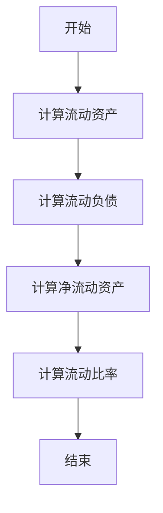

                 


# 格雷厄姆的工作资本分析：适应轻资产商业模式

## 关键词：
- 工作资本分析
- 轻资产商业模式
- 格雷厄姆分析法
- 企业估值
- 财务分析

## 摘要：
本文将深入探讨格雷厄姆的工作资本分析方法，并将其应用于轻资产商业模式中。通过分析工作资本的核心概念、算法原理、系统架构设计及项目实战，我们将帮助读者理解如何在现代商业模式中有效应用这一经典分析方法，实现企业估值和财务优化的目标。

---

## 第一章: 工作资本分析的定义与背景

### 1.1 工作资本分析的定义
工作资本分析是评估企业短期偿债能力和流动性的重要方法，通过分析流动资产和流动负债的关系，帮助企业优化资金使用效率。

### 1.2 轻资产商业模式的特点
轻资产模式强调通过较少的固定资产投入，依靠无形资产和运营效率实现价值增长。这种模式对工作资本的依赖更高，需要更精细的流动性管理。

---

## 第二章: 工作资本分析的核心概念与联系

### 2.1 核心概念原理
流动资产包括现金、存货和应收账款，流动负债包括应付账款和短期债务。净流动资产等于流动资产减去流动负债，流动比率和速动比率用于评估短期偿债能力。

### 2.2 属性特征对比表格
| 概念       | 定义                                                                 | 属性特征                   |
|------------|----------------------------------------------------------------------|---------------------------|
| 流动资产     | 可在一年内转化为现金或被消耗的资产                                   | 短期性、流动性、波动性       |
| 流动负债     | 在一年内需要偿还的债务                                               | 短期性、刚性、偿付压力       |
| 净流动资产   | 流动资产减去流动负债                                                 | 反映企业短期偿债能力         |
| 流动比率     | 流动资产与流动负债的比率                                           | 评估企业短期偿债能力         |
| 速动比率     | 速动资产（流动资产减去存货）与流动负债的比率                       | 更严格的短期偿债能力评估     |

### 2.3 ER实体关系图架构
```mermaid
er
  actor 企业 {
    <-(r1)- 账户: 账户名称
    <-(r2)- 交易: 交易日期
  }
  actor 财务部门 {
    <-(r3)- 账户: 账户名称
    <-(r4)- 交易: 交易日期
  }
  actor 供应商 {
    <-(r5)- 账户: 账户名称
    <-(r6)- 交易: 交易日期
  }
```

---

## 第三章: 工作资本分析的算法原理

### 3.1 算法原理
工作资本分析涉及计算净流动资产和流动比率。公式如下：
$$
\text{净流动资产} = \text{流动资产} - \text{流动负债}
$$
$$
\text{流动比率} = \frac{\text{流动资产}}{\text{流动负债}}
$$

### 3.2 Python代码示例
```python
# 计算净流动资产和流动比率
流动资产 = 500000  # 元
流动负债 = 300000  # 元

净流动资产 = 流动资产 - 流动负债
流动比率 = 流动资产 /流动负债

print(f"净流动资产: {净流动资产}")
print(f"流动比率: {流动比率}")
```

### 3.3 算法流程图


---

## 第四章: 系统分析与架构设计

### 4.1 系统功能设计


### 4.2 系统架构设计


### 4.3 接口设计
系统提供REST接口：
- POST /api/calculate?流动资产=500000&流动负债=300000

---

## 第五章: 项目实战

### 5.1 安装环境
安装Python和相关库：
```bash
pip install numpy pandas
```

### 5.2 核心代码实现
```python
def calculate_working_capital(流动资产, 流动负债):
    净流动资产 = 流动资产 - 流动负债
    流动比率 = 流动资产 /流动负债
    return 净流动资产, 流动比率

流动资产 = 500000
流动负债 = 300000
结果 = calculate_working_capital(流动资产, 流动负债)
print(f"净流动资产: {结果[0]}")
print(f"流动比率: {结果[1]}")
```

### 5.3 案例分析
假设一家企业流动资产为50万元，流动负债为30万元：
- 净流动资产：20万元
- 流动比率：1.67

---

## 第六章: 最佳实践

### 6.1 小结
工作资本分析在轻资产模式中至关重要，需定期监控流动比率和速动比率。

### 6.2 注意事项
- 数据准确性
- 考虑行业差异
- 结合其他财务指标

### 6.3 拓展阅读
- 格雷厄姆的《证券分析》
- 现代企业财务分析方法

---

通过以上步骤，我们详细分析了格雷厄姆的工作资本分析方法，并展示了其在轻资产商业模式中的应用。希望这篇文章能为您提供有价值的见解和实践指导。

