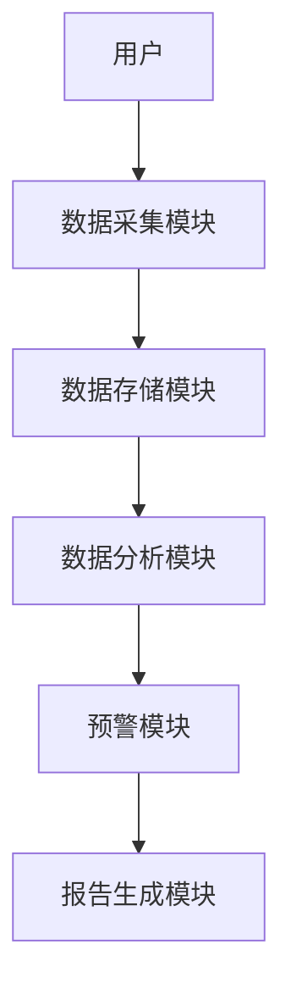

                 


# 格雷厄姆的工作资本策略：关注流动性

## 关键词：
1. 工作资本
2. 流动性管理
3. 价值投资
4. 格雷厄姆策略
5. 财务健康

## 摘要：
本文深入探讨了格雷厄姆的工作资本策略，重点关注流动性管理在企业财务健康中的核心作用。通过分析工作资本的定义、流动性比率、数学模型和系统架构，结合实际案例和Python代码实现，为读者提供全面的策略解读和实践指导。

---

# 第一部分: 工作资本策略概述

## 第1章: 工作资本的定义与重要性

### 1.1 工作资本的定义

工作资本（Working Capital），又称营运资本，是企业在日常经营活动中所需的流动资产与流动负债的差额。公式为：
$$
\text{工作资本} = \text{流动资产} - \text{流动负债}
$$

流动资产包括现金、应收账款、存货等，而流动负债则包括应付账款、短期借款等。

### 1.2 工作资本的重要性

工作资本是企业维持日常运营的关键，直接影响企业的偿债能力和运营效率。充足的流动性能够确保企业按时支付账单、采购原材料，从而避免生产中断。

---

## 第2章: 格雷厄姆的投资理念

### 2.1 价值投资的核心思想

格雷厄姆倡导“买入低于内在价值的股票”，通过分析企业的基本面，特别是工作资本的流动性，来识别被低估的投资机会。

### 2.2 工作资本在投资决策中的作用

格雷厄姆认为，企业的工作资本状况是衡量其财务健康的重要指标。他建议投资者关注企业的流动比率和速动比率：
$$
\text{流动比率} = \frac{\text{流动资产}}{\text{流动负债}}
$$
$$
\text{速动比率} = \frac{\text{流动资产} - \text{存货}}{\text{流动负债}}
$$

---

## 第3章: 工作资本策略的核心概念

### 3.1 流动性管理的核心要素

为了确保企业的流动性，格雷厄姆建议以下策略：

1. **优化流动资产结构**：减少不必要的库存，加快应收账款的回收。
2. **延长应付账款周期**：与供应商协商更长的付款期限。
3. **保持充足的现金流**：通过合理预测销售和支出，确保现金储备。

---

## 第4章: 工作资本策略的数学模型

### 4.1 工作资本需求预测模型

基于历史数据，可以建立一个简单的线性回归模型来预测工作资本需求。假设流动资产和流动负债与销售额呈线性关系，模型可以表示为：
$$
\text{流动资产} = a \times \text{销售额} + b
$$
$$
\text{流动负债} = c \times \text{销售额} + d
$$

### 4.2 Python代码实现

以下是一个简单的Python代码示例，用于计算工作资本需求：

```python
import pandas as pd
import numpy as np

# 假设data为包含销售额的DataFrame
data = pd.DataFrame({'销售额': [100, 200, 300, 400, 500]})

# 计算流动资产和流动负债的系数
coefficients = np.polyfit(data['销售额'], data['流动资产'], 1)
a, b = coefficients

# 预测工作资本需求
data['预测流动资产'] = a * data['销售额'] + b
data['预测流动负债'] = c * data['销售额'] + d
data['预测工作资本'] = data['预测流动资产'] - data['预测流动负债']

print(data)
```

---

## 第5章: 系统架构与实现

### 5.1 系统架构设计

以下是企业级流动性管理系统的架构图：



### 5.2 系统功能设计

1. **数据采集模块**：从企业财务系统中获取实时的流动资产和流动负债数据。
2. **数据分析模块**：使用机器学习算法预测未来的工作资本需求。
3. **预警模块**：当流动比率低于设定阈值时，触发预警机制。
4. **报告生成模块**：生成详细的财务分析报告，供管理层决策参考。

---

## 第6章: 项目实战与案例分析

### 6.1 环境安装

安装所需的Python库：
```bash
pip install pandas numpy matplotlib
```

### 6.2 核心代码实现

以下是一个简单的流动比率计算代码：

```python
import pandas as pd

# 创建示例数据
data = {
    '流动资产': [1000, 1500, 2000, 2500],
    '流动负债': [500, 700, 900, 1100]
}
df = pd.DataFrame(data)

# 计算流动比率
df['流动比率'] = df['流动资产'] / df['流动负债']

print(df)
```

### 6.3 案例分析

假设某企业2023年的销售额预测为500万元，流动资产和流动负债的预测系数分别为0.6和0.4。则：
$$
\text{流动资产} = 0.6 \times 500 + 200 = 500 \text{万元}
$$
$$
\text{流动负债} = 0.4 \times 500 + 100 = 300 \text{万元}
$$
$$
\text{工作资本} = 500 - 300 = 200 \text{万元}
$$

---

## 第7章: 最佳实践与小结

### 7.1 小结

格雷厄姆的工作资本策略强调流动性管理的重要性，通过优化流动资产和流动负债的结构，确保企业的财务健康和稳健发展。

### 7.2 注意事项

1. 定期监控流动比率和速动比率，确保其在合理范围内。
2. 根据企业的实际情况调整工作资本策略，避免一刀切。
3. 结合其他财务指标，全面评估企业的财务状况。

### 7.3 拓展阅读

1. 《The Intelligent Investor》 by Benjamin Graham
2. 《Financial Statement Analysis and Security Valuation》 by Bruce J. Flugman

---

通过本文的详细分析和实际案例，读者可以更好地理解格雷厄姆的工作资本策略，并将其应用于实际的财务管理和投资决策中。

