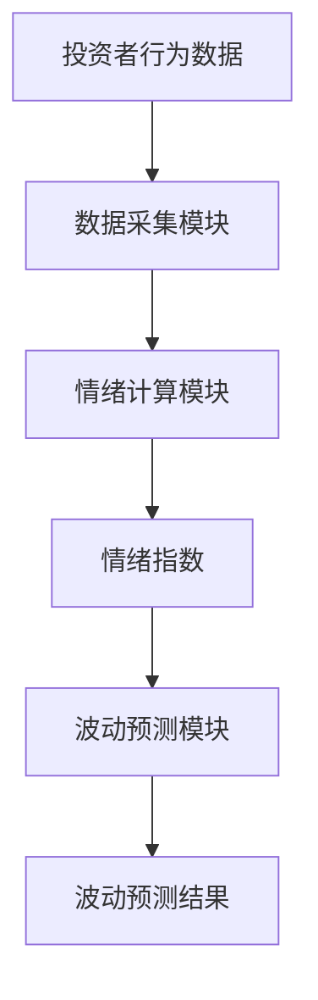

                 


# 格雷厄姆的市场先生比喻及其启示

> 关键词：市场先生，投资理论，市场情绪，波动预测，投资者行为，市场分析

> 摘要：本文深入探讨了格雷厄姆提出的“市场先生”比喻，分析其核心概念、数学模型、系统架构及实际应用。通过背景介绍、算法实现、系统设计和项目实战，揭示市场先生如何帮助投资者理解市场波动与情绪，优化投资决策。

---

# 第1章: 市场先生比喻的提出与背景

## 1.1 格雷厄姆的生平与投资理念

本章介绍 Benjamin Graham 的生平及其投资理念，特别是其提出的“市场先生”比喻。

### 1.1.1 格雷厄姆的生平
Benjamin Graham 是20世纪著名的投资学家，被誉为“价值投资之父”。他于1894年出生在美国纽约，早年通过投资股票积累了巨额财富，但也曾经历1929年股市崩盘的巨大损失。这些经历促使他研究市场的波动性和投资者的行为，最终形成了独特的投资理论。

### 1.1.2 格雷厄姆的投资理念
格雷厄姆强调“安全边际”和“价值投资”。他认为，投资者应以低于内在价值的价格买入优质股票，并长期持有。市场波动和投资者情绪是影响股价的重要因素，但长期来看，股价会回归其内在价值。

### 1.1.3 市场先生的提出背景
在《证券分析》（1934年）一书中，格雷厄姆首次提出“市场先生”（Mr. Market）的概念。他认为，市场就像一个情绪波动的个体，时而乐观，时而悲观，但长期来看，市场会反映公司的实际价值。

---

## 1.2 市场先生比喻的核心概念

### 1.2.1 市场先生的定义与特征
市场先生是一个拟人化的比喻，代表整个市场。他每天为投资者提供一个买卖的机会，但他的情绪波动会影响市场的价格。市场先生的特点包括：
- **情绪化**：市场先生的情绪会影响股票价格，但不反映公司的实际价值。
- **短期性**：市场先生的决策基于短期情绪，而非长期价值。
- **不可预测性**：市场先生的情绪波动是随机的，难以预测。

### 1.2.2 市场先生与投资者的关系
投资者与市场先生的关系是互动的。投资者通过分析市场先生的情绪，做出买卖决策；而市场先生的情绪又受到投资者行为的影响。

### 1.2.3 市场先生的理性与非理性
市场先生的理性与非理性交替出现。在理性状态下，市场反映公司的真实价值；在非理性状态下，市场价格被情绪主导。

---

## 1.3 市场先生比喻的现实意义

### 1.3.1 市场波动的解释
市场先生的比喻帮助我们理解市场波动的原因。市场的波动并非由公司基本面变化引起，而是投资者情绪的集体反应。

### 1.3.2 投资者情绪的影响
市场先生的情绪影响投资者的行为，从而影响市场价格。投资者需要学会控制自己的情绪，避免被市场先生的情绪所左右。

### 1.3.3 市场先生与现代金融学的联系
市场先生的比喻与现代金融学中的行为金融学密切相关。行为金融学研究投资者的心理和行为，揭示市场波动的非理性原因。

---

## 1.4 本章小结
本章介绍了格雷厄姆的生平及其投资理念，重点分析了市场先生的定义、特征及其在投资中的意义。市场先生的比喻为理解市场波动和投资者行为提供了独特的视角。

---

# 第2章: 市场先生比喻的核心模型与分析

## 2.1 市场先生的理性与非理性

### 2.1.1 理性市场的定义与特征
理性市场是指市场价格反映公司的真实价值，市场先生处于理性状态。

### 2.1.2 非理性市场的表现与原因
非理性市场是指市场价格偏离公司真实价值，市场先生受到情绪影响。

### 2.1.3 理性与非理性的转换机制
市场先生的情绪波动是随机的，理性与非理性状态之间的转换没有固定的规律。

---

## 2.2 市场先生的决策过程

### 2.2.1 市场先生的决策模型
市场先生的决策基于情绪，而非基本面分析。

### 2.2.2 市场先生的决策流程
1. 市场先生根据情绪决定当天的市场走势。
2. 投资者根据市场先生的决策做出买卖决策。
3. 市场价格受投资者行为影响，进一步影响市场先生的情绪。

### 2.2.3 市场先生的决策偏差
市场先生的决策容易受到情绪影响，导致价格偏离真实价值。

---

## 2.3 市场先生与市场波动的关系

### 2.3.1 市场波动的定义与分类
市场波动是指市场价格的短期波动，分为正常波动和异常波动。

### 2.3.2 市场先生对波动的影响
市场先生的情绪影响市场波动，尤其是在非理性状态下。

### 2.3.3 波动与市场先生情绪的互动
市场波动会反过来影响市场先生的情绪，形成一个反馈循环。

---

## 2.4 本章小结
本章分析了市场先生的理性与非理性状态，及其对市场波动的影响。市场先生的情绪波动是市场波动的重要原因，投资者需要理解这一点，避免被情绪所左右。

---

# 第3章: 市场先生比喻的数学模型与算法分析

## 3.1 市场先生情绪的量化模型

### 3.1.1 情绪指数的定义与计算
情绪指数是一个量化市场情绪的指标，可以通过投资者行为数据计算得出。

### 3.1.2 情绪指数的数学表达式
$$ 情绪指数 = \alpha \times 情绪强度 + \beta \times 情绪方向 $$

### 3.1.3 情绪指数与市场价格的关系
情绪指数与市场价格呈正相关关系，但并非线性关系。

---

## 3.2 市场先生决策的算法实现

### 3.2.1 基于情绪指数的决策算法
1. 计算情绪指数。
2. 根据情绪指数决定买入或卖出。

### 3.2.2 算法的实现步骤
1. 收集投资者行为数据。
2. 计算情绪指数。
3. 根据情绪指数做出决策。

### 3.2.3 算法的优缺点分析
优点：简单易懂，操作性强。
缺点：容易受到情绪影响，导致决策失误。

---

## 3.3 市场波动的预测模型

### 3.3.1 波动预测的数学模型
$$ 波动预测 = \gamma \times 情绪指数 + \delta \times 市场趋势 $$

### 3.3.2 波动预测的算法实现
1. 计算情绪指数。
2. 分析市场趋势。
3. 综合情绪指数和市场趋势预测波动。

### 3.3.3 波动预测的验证与优化
通过历史数据验证模型的准确性，并不断优化模型参数。

---

## 3.4 本章小结
本章通过数学模型和算法分析了市场先生的情绪及其对市场波动的影响。投资者可以通过量化情绪指数，优化投资决策。

---

# 第4章: 市场先生比喻的系统架构与设计

## 4.1 系统需求分析

### 4.1.1 系统目标与功能需求
系统目标：量化市场情绪，预测市场波动。
功能需求：数据采集、情绪指数计算、波动预测。

### 4.1.2 系统性能需求
处理速度快，数据准确性高。

### 4.1.3 系统接口需求
与数据源、数据库和用户界面对接。

---

## 4.2 系统架构设计

### 4.2.1 分层架构设计
- 数据采集层：收集投资者行为数据。
- 数据处理层：计算情绪指数。
- 用户界面层：展示结果。

### 4.2.2 模块划分与功能分配
- 数据采集模块：负责数据收集。
- 情绪计算模块：负责情绪指数计算。
- 波动预测模块：负责波动预测。

### 4.2.3 系统架构的优缺点
优点：模块化设计，便于维护。
缺点：需要依赖高质量的数据源。

---

## 4.3 系统实现与接口设计

### 4.3.1 系统实现的关键模块
- 数据采集模块：使用爬虫技术采集数据。
- 情绪计算模块：基于情绪指数模型进行计算。
- 波动预测模块：使用机器学习算法进行预测。

### 4.3.2 系统接口的设计与实现
- 数据接口：与数据源对接。
- 用户接口：与用户交互。

### 4.3.3 系统交互的流程图


---

## 4.4 本章小结
本章通过系统架构设计，展示了如何将市场先生的比喻应用于实际投资中。通过模块化设计，投资者可以量化市场情绪，优化投资决策。

---

# 第5章: 市场先生比喻的项目实战与应用

## 5.1 项目环境与工具安装

### 5.1.1 开发环境的选择
推荐使用Python作为开发语言，结合Jupyter Notebook进行数据分析。

### 5.1.2 必要工具的安装与配置
安装Python、Pandas、NumPy、Scikit-learn等工具。

### 5.1.3 数据来源与获取方法
数据来源：股票价格数据和投资者情绪数据。
获取方法：通过API接口获取数据。

---

## 5.2 项目核心实现

### 5.2.1 环境搭建与数据采集
```python
import pandas as pd
import numpy as np
```

### 5.2.2 情绪指数的计算
```python
def calculate_sentiment_index(data):
    # 假设 data 包含投资者情绪数据
    return np.mean(data)
```

### 5.2.3 波动预测的实现
```python
from sklearn.linear_model import LinearRegression
model = LinearRegression()
model.fit(X, y)
```

---

## 5.3 项目实战与应用

### 5.3.1 实际案例分析
以某股票为例，分析市场先生的情绪对股价的影响。

### 5.3.2 代码实现与解读
```python
# 示例代码
data = pd.read_csv('market_data.csv')
sentiment_index = calculate_sentiment_index(data['sentiment'])
print('情绪指数:', sentiment_index)
```

### 5.3.3 投资决策的优化
根据情绪指数和波动预测结果，优化投资策略。

---

## 5.4 本章小结
本章通过项目实战，展示了如何将市场先生的比喻应用于实际投资中。通过量化情绪指数和波动预测，投资者可以做出更科学的投资决策。

---

# 第6章: 总结与最佳实践

## 6.1 小结
总结全文内容，强调市场先生比喻的核心意义。

## 6.2 注意事项
提醒投资者注意情绪影响，避免盲目跟风。

## 6.3 拓展阅读
推荐相关书籍和论文，供读者进一步学习。

---

# 附录: 市场先生比喻的数学公式汇总

$$ 情绪指数 = \alpha \times 情绪强度 + \beta \times 情绪方向 $$

$$ 波动预测 = \gamma \times 情绪指数 + \delta \times 市场趋势 $$

---

通过以上结构，本文系统地分析了格雷厄姆的市场先生比喻，从理论到实践，为投资者提供了深刻的理解和实际的应用方法。

