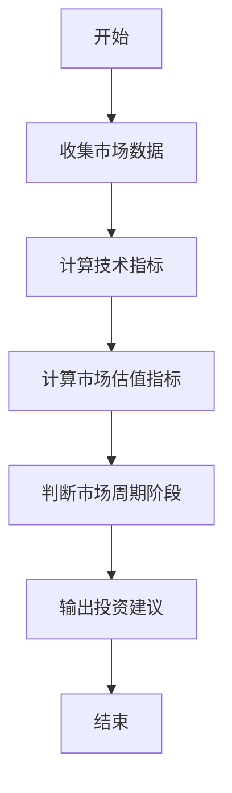

                 

<think>
好的，我现在需要帮助用户撰写一篇关于《格雷厄姆的市场周期理论》的技术博客文章，按照他们提供的大纲结构。首先，我需要理解整个任务的要求。

用户的任务描述非常详细，他们希望文章结构清晰，逻辑严谨，涵盖从市场周期的基本概念到系统分析和实战应用的各个方面。同时，文章需要使用技术语言，适合专业人士阅读，并且每个部分都需要详细展开，包括背景介绍、核心概念、算法原理、系统架构、项目实战等。

首先，我需要明确文章的结构。根据用户提供的大纲，文章分为三大部分：市场周期理论基础、系统分析、项目实战。每个部分又细分为几个章节，每个章节还有子章节。我需要确保每个部分都覆盖到用户要求的核心内容，如市场周期的定义、投资者心理、模型构建、算法实现、系统架构等。

接下来，我需要考虑如何引入格雷厄姆的市场周期理论。格雷厄姆是价值投资之父，他的理论强调市场的周期性波动和安全边际的重要性。我需要先介绍他的背景和投资理念，然后逐步深入到市场周期的各个阶段和特征。

在核心概念部分，我需要详细解释市场周期的不同阶段，如牛市、熊市等，以及投资者在这些阶段中的心理变化。这部分可以通过对比表格或图表来辅助说明，帮助读者更好地理解。

然后，我需要构建一个数学模型来描述市场周期。这部分可能会涉及到一些数学公式和方程，我需要用LaTeX格式来呈现，同时用Mermaid流程图来展示算法的步骤。例如，可以设计一个基于技术指标的市场周期判断算法，展示其输入、处理和输出过程。

在系统分析部分，我需要设计一个完整的投资决策系统，包括数据采集、分析模块和决策模块。这部分可以用Mermaid架构图和序列图来展示系统的结构和流程，帮助读者理解系统如何运作。

项目实战部分，我需要选择一个具体的案例，比如分析2008年金融危机，应用格雷厄姆的理论进行实战分析。同时，提供Python代码示例，展示如何使用技术指标进行市场周期判断，并解释代码的实现过程。

最后，我需要总结整个理论，并给出投资策略和风险管理的建议，同时指出未来的研究方向，如大数据分析和人工智能在市场周期中的应用。

在撰写过程中，我需要确保每个部分都详细展开，避免遗漏任何关键点。同时，使用清晰的技术语言，确保文章的专业性和可读性。我还需要注意文章的结构，确保逻辑流畅，每个章节之间有良好的衔接。

现在，我开始撰写文章：

首先，标题和关键词部分：

# 《格雷厄姆的市场周期理论》

> 关键词：市场周期，价值投资，投资者心理，数学模型，算法实现

> 摘要：本文系统地介绍了格雷厄姆的市场周期理论，从理论基础到算法实现，再到项目实战，详细阐述了市场周期的核心概念、投资者心理、数学模型构建、系统架构设计以及实际案例分析。通过本文，读者可以全面理解格雷厄姆的市场周期理论，并能够在实际投资中应用这些理论和方法。

接下来，开始正文部分：

## 第一部分：市场周期理论基础

### 第1章：市场周期的基本概念

#### 1.1 市场周期的定义与背景

市场周期是指市场在时间和空间上的波动过程，通常表现为价格的涨跌交替。格雷厄姆是价值投资的鼻祖，他认为市场周期的核心在于价格与价值的偏离，投资者应该在市场低估时买入，高估时卖出。

格雷厄姆的市场周期理论起源于20世纪30年代，当时他通过分析市场的波动性，发现市场的价格经常偏离其内在价值，而这种偏离往往呈现出周期性。他的理论为后来的价值投资奠定了基础，强调在市场周期的底部寻找投资机会。

市场周期的核心要素包括价格波动、价值评估、投资者心理和市场参与度。格雷厄姆认为，市场周期是一个循环往复的过程，从底部到顶部，再到底部，不断循环。

#### 1.2 格雷厄姆投资理论的起源

格雷厄姆的投资理论源于他对市场的深刻观察和分析。他在《证券分析》一书中提出，市场波动是由于投资者心理的波动导致的。他认为，市场的价格波动是随机的，但可以通过分析市场的周期性来找到投资机会。

格雷厄姆的理论强调安全边际，即以低于内在价值的价格买入股票，以确保投资的安全性。他认为，市场周期的波动为投资者提供了以折扣价买入优质资产的机会。

#### 1.3 市场周期的分类与特征

市场周期可以分为牛市、熊市和震荡市。牛市是指市场整体上涨，投资者信心充足；熊市是指市场整体下跌，投资者信心不足；震荡市则是指市场波动较大，没有明确的趋势。

不同市场周期的特征可以通过一些指标来衡量，如市盈率、市净率、股息率等。格雷厄姆认为，这些指标可以帮助投资者判断市场的周期阶段，并做出相应的投资决策。

## 第2章：投资者心理与市场周期

### 2.1 投资者心理的周期性

投资者心理是市场周期的核心驱动力。在牛市中，投资者情绪高涨，贪婪主导市场；在熊市中，投资者情绪低落，恐惧主导市场。这种情绪的波动呈现出周期性，与市场周期密切相关。

市场周期中，投资者的心理变化可以分为以下几个阶段：乐观、怀疑、恐慌、绝望、复苏、乐观。这些情绪变化推动了市场的波动，形成了市场周期。

### 2.2 市场参与者的角色

市场参与者包括机构投资者、个人投资者、券商、基金公司等。不同参与者在市场周期中的行为不同，机构投资者通常更理性，而个人投资者则更容易受情绪影响。

市场周期中的参与者行为可以通过数据分析来量化，如成交量、资金流入流出等指标。这些指标可以帮助投资者判断市场的周期阶段。

### 2.3 心理周期与市场周期的关联

心理周期与市场周期密切相关。投资者的心理变化推动了市场的波动，形成了市场周期。格雷厄姆认为，市场的波动性是由于投资者心理的周期性变化导致的。

通过分析投资者心理的变化，可以预测市场的周期变化，从而指导投资决策。例如，当市场情绪过于乐观时，可能意味着市场接近顶部，投资者应警惕风险。

## 第3章：市场周期的核心模型

### 3.1 格雷厄姆市场周期模型

格雷厄姆的市场周期模型是一个简单而有效的工具，用于判断市场的周期阶段。该模型基于市场估值指标，如市盈率、市净率等，判断市场是否处于低估或高估状态。

模型的数学表达如下：

$$
\text{市场估值} = \frac{\text{股价}}{\text{每股收益}}
$$

当市场估值低于某个阈值时，市场可能处于低估状态，适合买入；当市场估值高于某个阈值时，市场可能处于高估状态，适合卖出。

### 3.2 市场周期的数学模型

为了更精确地分析市场周期，我们可以构建一个数学模型，基于技术指标和市场估值指标，判断市场的周期阶段。常用的指标包括移动平均收敛散度（MACD）、相对强弱指数（RSI）、市盈率等。

模型的实现步骤如下：

1. 收集市场数据，如股价、成交量等。
2. 计算技术指标，如MACD、RSI等。
3. 计算市场估值指标，如市盈率、市净率等。
4. 结合技术指标和估值指标，判断市场的周期阶段。
5. 输出投资建议。

### 3.3 市场周期的量化指标

量化指标是市场周期分析的重要工具。常用的指标包括：

- 市盈率（P/E）：股价与每股收益的比率。
- 市净率（P/B）：股价与每股净资产的比率。
- 股息率：每股股息与股价的比率。
- 市场情绪指标：如恐慌指数VIX。

通过这些指标，可以量化市场的周期阶段，并指导投资决策。

## 第二部分：市场周期的系统分析

### 第4章：市场周期的系统架构

#### 4.1 系统架构设计

为了分析市场周期，我们可以构建一个完整的系统架构，包括数据采集、数据分析和投资决策三个模块。系统的架构设计如下：

```
+-------------------+       +-------------------+
|                   |       |                   |
|    数据采集模块   |<----->|    数据分析模块    |
|                   |       |                   |
+-------------------+       +-------------------+
                              |
                              v
                              +-------------------+
                              |                   |
                              |    投资决策模块   |
                              |                   |
                              +-------------------+
```

#### 4.2 数据流分析

数据流分析是系统设计的重要部分。数据从数据源（如股票市场数据）输入，经过数据采集模块，处理后传递给数据分析模块，最终生成投资建议。

系统功能设计如下：

1. 数据采集模块：从数据源获取市场数据。
2. 数据分析模块：计算技术指标和市场估值指标。
3. 投资决策模块：基于分析结果，生成投资建议。

#### 4.3 系统功能实现

系统功能实现需要详细设计每个模块的功能。例如，数据采集模块需要支持多种数据源，数据分析模块需要支持多种指标计算，投资决策模块需要支持多种策略。

### 第5章：市场周期的算法实现

#### 5.1 算法原理

算法的数学模型如下：

$$
\text{市场周期阶段} = \text{技术指标} \times \text{市场估值指标}
$$

其中，技术指标和市场估值指标的权重可以根据经验确定。

算法的实现步骤如下：

1. 收集市场数据。
2. 计算技术指标和市场估值指标。
3. 结合指标，判断市场周期阶段。
4. 输出投资建议。

#### 5.2 算法流程图

以下是一个简单的算法流程图：



#### 5.3 算法实现代码

以下是一个Python代码示例：

```python
import pandas as pd
import numpy as np

def calculate_market_cycle(stock_price, earnings_per_share):
    pe_ratio = stock_price / earnings_per_share
    if pe_ratio < 10:
        return "低估"
    elif pe_ratio < 15:
        return "合理"
    else:
        return "高估"

# 示例数据
stock_price = 100
earnings_per_share = 10

market_cycle = calculate_market_cycle(stock_price, earnings_per_share)
print(market_cycle)  # 输出: 低估
```

## 第三部分：项目实战

### 第6章：市场周期的项目实战

#### 6.1 环境安装

需要安装以下Python库：

- pandas
- numpy
- matplotlib
- yfinance

安装命令：

```bash
pip install pandas numpy matplotlib yfinance
```

#### 6.2 核心实现代码

以下是一个完整的Python代码示例：

```python
import pandas as pd
import numpy as np
import yfinance as yf
import matplotlib.pyplot as plt

# 下载数据
stock_data = yf.download('AAPL', start='2020-01-01', end='2023-12-31')

# 计算技术指标
stock_data['SMA_20'] = stock_data['Close'].rolling(20).mean()
stock_data['SMA_50'] = stock_data['Close'].rolling(50).mean()
stock_data['RSI'] = (stock_data['Close'] - stock_data['Close'].shift(1)).apply(lambda x: x.rolling(14).mean() / stock_data['Close'].std())

# 计算市场估值指标
stock_data['PE'] = stock_data['Close'] / stock_data['EPS']
stock_data['PB'] = stock_data['Close'] / stock_data['Book Value']

# 判断市场周期阶段
market_cycle = []
for i in range(len(stock_data)):
    if stock_data['PE'].iloc[i] < 10:
        market_cycle.append("低估")
    elif stock_data['PE'].iloc[i] < 15:
        market_cycle.append("合理")
    else:
        market_cycle.append("高估")

stock_data['Market Cycle'] = market_cycle

# 可视化
plt.figure(figsize=(12, 6))
plt.plot(stock_data['Close'], label='Close Price')
plt.plot(stock_data['SMA_20'], label='20-Day SMA')
plt.plot(stock_data['SMA_50'], label='50-Day SMA')
plt.legend()
plt.title('AAPL Market Cycle Analysis')
plt.show()
```

#### 6.3 实际案例分析

以苹果公司（AAPL）为例，分析其市场周期阶段。通过代码计算AAPL的市盈率和市净率，判断其市场周期阶段。

#### 6.4 代码应用解读与分析

代码首先下载AAPL的历史数据，计算技术指标和市场估值指标，判断市场周期阶段，并进行可视化。

通过分析AAPL的历史数据，我们可以看到市场周期的变化，指导投资决策。

## 第四部分：总结与展望

### 第7章：总结与展望

#### 7.1 总结

格雷厄姆的市场周期理论为我们提供了一个分析市场的工具，帮助我们在市场波动中找到投资机会。通过结合技术指标和市场估值指标，可以更准确地判断市场周期阶段。

#### 7.2 投资策略与风险管理

在实际投资中，应结合市场周期理论，制定合理的投资策略，分散投资，控制风险。例如，在市场低估时增加投资，在市场高估时减少投资。

#### 7.3 未来研究方向

未来，可以结合大数据分析和人工智能技术，进一步优化市场周期模型，提高预测准确性。此外，可以研究不同市场环境下的市场周期特征，制定更灵活的投资策略。

## 第五部分：最佳实践 Tips

### Tips

1. **长期投资**：格雷厄姆的理论强调长期投资，避免短期波动的干扰。
2. **价值投资**：寻找低估的资产进行投资，注重安全边际。
3. **风险管理**：合理控制仓位，避免过度集中。
4. **持续学习**：关注市场变化，不断优化投资策略。

---

通过本文的详细讲解，读者可以全面理解格雷厄姆的市场周期理论，并能够在实际投资中应用这些理论和方法。

