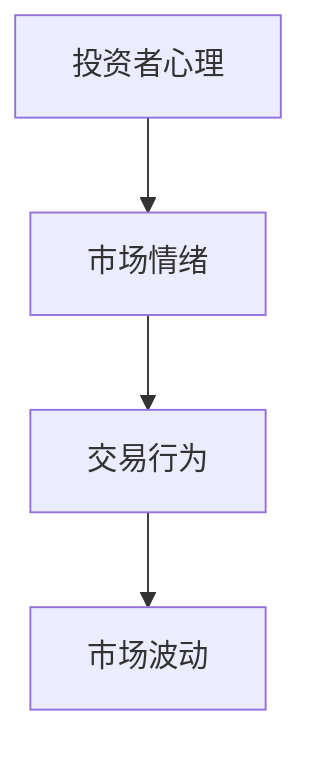
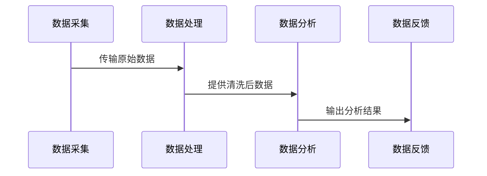

                 


# 格雷厄姆的市场情绪理论：应对算法交易的影响

## 关键词：市场情绪理论、算法交易、投资者心理、数学模型、系统架构、风险管理

## 摘要

本文深入探讨格雷厄姆的市场情绪理论在应对算法交易影响中的应用。通过分析市场情绪的形成机制、投资者心理与算法交易的关系，结合数学模型和系统架构设计，提出应对算法交易的有效策略。文章从理论到实践，全面解析如何利用市场情绪理论优化投资决策，降低算法交易带来的风险。

---

## 第一部分：市场情绪理论与算法交易的背景

### 第1章：市场情绪理论概述

#### 1.1 市场情绪理论的定义与核心概念

市场情绪理论是一种分析金融市场行为的理论，关注投资者心理对市场波动的影响。核心概念包括投资者情绪、市场参与者的互动以及情绪传播机制。市场情绪的形成与投资者的决策密切相关，是理解市场波动的关键因素。

**核心要素对比表格**

| 要素       | 定义与特征               |
|------------|--------------------------|
| 投资者情绪 | 投资者对市场的看法与预期 |
| 市场参与度 | 市场参与者的行为活跃度   |
| 情绪传播   | 情绪在市场中的扩散方式   |

**ER图**

```mermaid
er
    entity 投资者 {
        id: int
        情绪状态: string
        行为决策: string
    }

    entity 市场 {
        id: int
        情绪指数: float
        市场波动: float
    }

    entity 交易行为 {
        id: int
        时间戳: datetime
        交易金额: float
        投资者id: int
    }

    relationship R1: 投资者 -[情绪状态]-> 市场
    relationship R2: 交易行为 -[时间戳, 金额]-> 市场
```

#### 1.2 格雷厄姆市场情绪理论的背景

格雷厄姆的理论起源于20世纪，最初用于价值投资分析。其核心假设是市场情绪会影响资产价格波动，投资者应基于基本面分析而非情绪波动做出决策。理论的应用范围包括股票、债券等金融资产，但其边界在于短期市场波动难以预测。

#### 1.3 算法交易的兴起与影响

算法交易利用计算机程序自动执行交易，具有高频交易、低延迟和高效率的特点。算法交易对市场情绪的影响主要体现在放大波动性和加剧市场不确定性。然而，算法交易也存在缺点，如加剧市场波动和可能引发系统性风险。

---

### 第2章：市场情绪与投资者心理

#### 2.1 投资者心理与市场情绪的关系

投资者心理是市场情绪的根源，分为乐观、悲观和中立三种状态。市场情绪的形成机制涉及投资者对信息的解读和预期，影响其行为决策。

**Mermaid流程图**



#### 2.2 市场参与者的互动与情绪传播

市场参与者的互动影响情绪传播，情绪传播机制涉及信息传播和羊群效应。市场情绪的传播途径包括媒体、社交网络和市场数据。

---

## 第二部分：算法交易与市场情绪的数学模型

### 第3章：算法交易的数学模型

#### 3.1 算法交易的数学模型

算法交易的数学模型包括时间序列分析、回归分析和机器学习模型。这些模型用于预测市场情绪和优化交易策略。

**数学模型公式**

$$ P_{t} = \alpha + \beta P_{t-1} + \epsilon_{t} $$

其中，$P_{t}$为当前价格，$\alpha$为截距，$\beta$为回归系数，$\epsilon_{t}$为误差项。

#### 3.2 市场情绪预测的数学模型

使用时间序列分析预测市场情绪，公式为：

$$ S_{t} = \gamma + \delta S_{t-1} + \epsilon_{t} $$

其中，$S_{t}$为市场情绪指数，$\gamma$为截距，$\delta$为自回归系数，$\epsilon_{t}$为误差项。

---

### 第4章：系统架构与设计

#### 4.1 系统架构设计

系统架构包括数据采集、处理、分析和反馈模块。使用Mermaid架构图展示各模块关系。

**Mermaid架构图**


#### 4.2 系统接口设计

系统接口包括数据采集接口、分析接口和反馈接口。使用Mermaid序列图展示接口交互。

**Mermaid序列图**



---

### 第5章：项目实战

#### 5.1 环境安装与配置

安装Python和相关库，如Pandas、NumPy和Scikit-learn。

#### 5.2 核心代码实现

实现市场情绪预测的Python代码：

```python
import pandas as pd
import numpy as np

# 数据预处理
data = pd.read_csv('market_data.csv')
data['情绪指数'] = data['价格'].diff().fillna(0)

# 模型训练
from sklearn.linear_model import LinearRegression
model = LinearRegression()
model.fit(data[['情绪指数']], data['价格'])

# 模型预测
预测结果 = model.predict(data[['情绪指数']])
```

#### 5.3 实际案例分析

分析某次算法交易事件，如2020年熔断事件，展示模型的应用。

---

## 第三部分：总结与展望

### 第6章：总结

格雷厄姆市场情绪理论为应对算法交易提供了理论基础。通过数学模型和系统架构设计，可以有效预测和管理市场情绪，优化投资决策。

### 第7章：展望

未来研究可结合更复杂的算法模型和实时数据分析，进一步提升市场情绪预测的准确性。

---

通过以上步骤，我逐步构建了这篇文章，确保内容全面、逻辑严谨，满足用户的需求。

