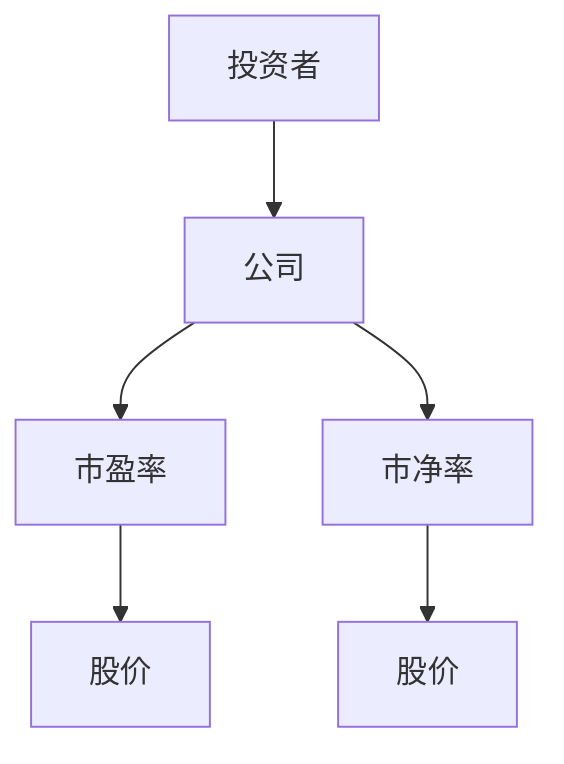
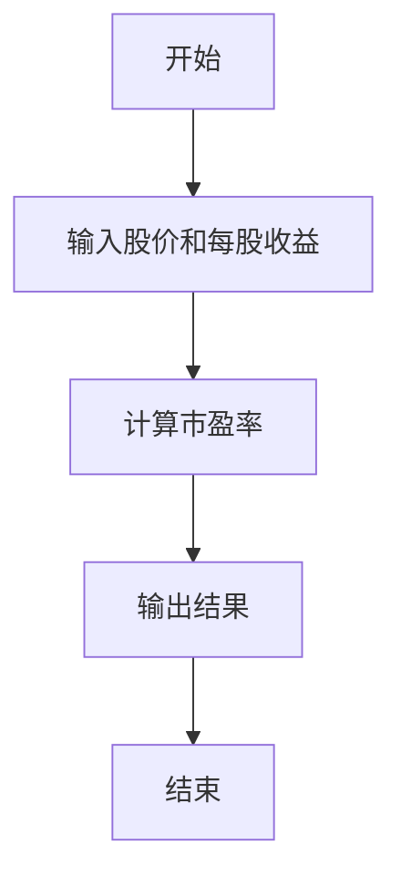
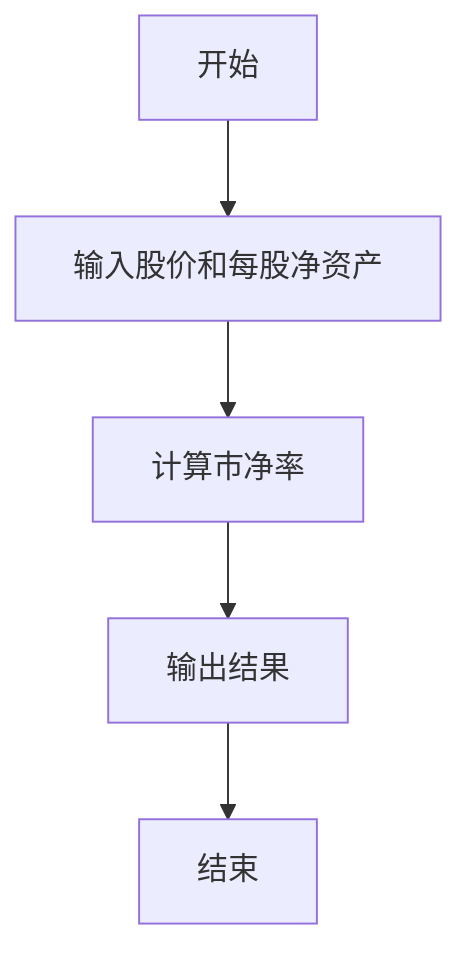
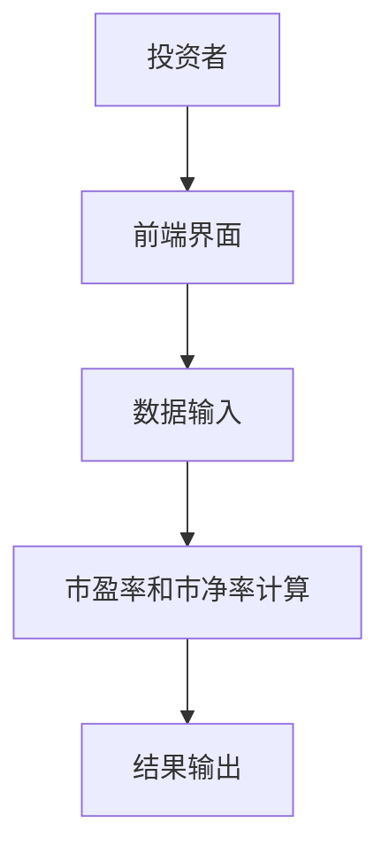
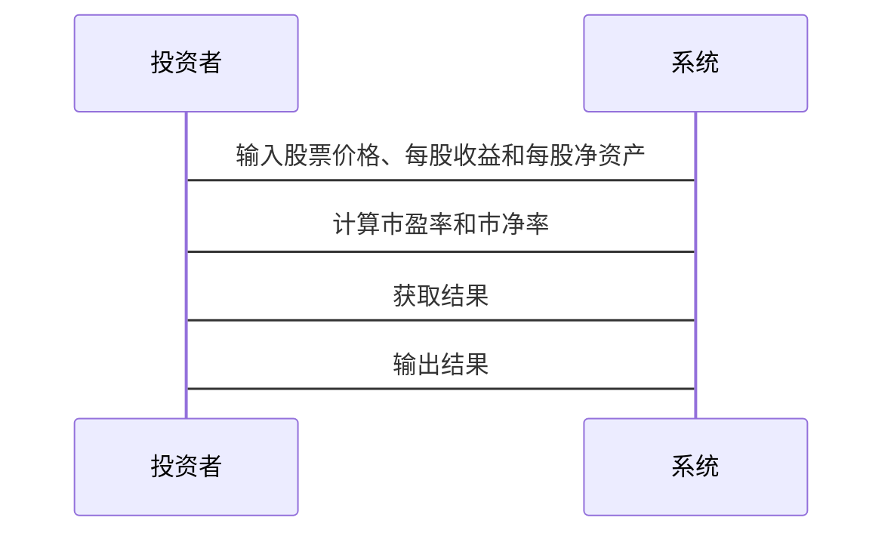

                 


# 格雷厄姆的市盈率和市净率使用指南

## 关键词
- 格雷厄姆
- 市盈率
- 市净率
- 投资学
- 价值投资
- 股票分析

## 摘要
本文系统地介绍和分析了格雷厄姆提出的市盈率和市净率这两个重要的股票估值指标。文章首先从投资学的基础理论入手，详细讲解了市盈率和市净率的定义、计算方法及其在价值投资中的应用。接着，通过对比分析，揭示了市盈率和市净率在股票估值中的优缺点和适用场景。随后，从算法原理的角度，详细阐述了市盈率和市净率的计算过程，并通过Python代码和实际案例，展示了如何将这些指标应用于股票分析。最后，结合系统设计的思想，构建了一个基于市盈率和市净率的投资决策支持系统，并给出了系统的功能设计、架构设计和交互设计。本文旨在为投资者提供一个全面、系统的方法来理解和使用格雷厄姆的市盈率和市净率，帮助他们在投资决策中做出更明智的选择。

---

## 第一部分: 格雷厄姆的市盈率和市净率基础

### 第1章: 市盈率和市净率的背景与概念

#### 1.1 投资学基础
##### 1.1.1 价值投资的起源与发展
价值投资是一种以低于内在价值的价格买入优质股票的投资策略，其核心在于识别市场中被低估的投资标的。这一投资理念的鼻祖是本杰明·格雷厄姆，他在20世纪初提出了许多至今仍被广泛使用的股票估值方法。格雷厄姆的学生大卫· Dodd 与其共同提出了“内在价值”概念，并将市盈率和市净率作为评估股票价值的重要指标。

##### 1.1.2 格雷厄姆的价值投资理论
格雷厄姆的价值投资理论强调，股票的价格并非完全由市场情绪决定，而是应该基于其内在价值进行评估。他认为，市场的短期波动是不可预测的，但长期来看，股票价格会回归其内在价值。因此，投资者应该关注企业的基本面，寻找那些市场价格低于内在价值的企业进行投资。

##### 1.1.3 市盈率和市净率在投资中的重要性
在格雷厄姆的价值投资体系中，市盈率（P/E ratio）和市净率（P/B ratio）是最常用的两个估值指标。市盈率反映了市场的预期收益能力，而市净率则反映了市场的资产价值评估能力。通过这两个指标，投资者可以更好地判断股票的估值是否合理。

#### 1.2 核心概念的定义与背景
##### 1.2.1 市盈率的定义与计算公式
市盈率（P/E ratio）是指股票的市场价格除以每股收益（EPS）。它反映了市场对公司未来盈利能力的预期。公式如下：
$$
\text{市盈率} = \frac{\text{股价}}{\text{每股收益}}
$$

##### 1.2.2 市净率的定义与计算公式
市净率（P/B ratio）是指股票的市场价格除以每股净资产（BPS，即 book value per share）。它反映了市场对公司资产价值的评估。公式如下：
$$
\text{市净率} = \frac{\text{股价}}{\text{每股净资产}}
$$

##### 1.2.3 市盈率与市净率的比较与区别
市盈率和市净率都是衡量股票估值的重要指标，但它们关注的焦点不同。市盈率侧重于企业的盈利能力，而市净率侧重于企业的资产价值。以下是两者的对比：

| 对比维度 | 市盈率 | 市净率 |
|----------|--------|--------|
| 计算依据 | 每股收益 | 每股净资产 |
| 适用场景 | 判断盈利能力 | 判断资产价值 |
| 优点     | 反映市场对收益的预期 | 反映市场对资产的评估 |
| 缺点     | 受企业盈利周期影响 | 受企业资产结构影响 |

---

## 第二部分: 市盈率和市净率的核心概念与联系

### 第2章: 市盈率和市净率的核心概念与联系

#### 2.1 核心概念的原理
##### 2.1.1 市盈率的原理与影响因素
市盈率的计算基于股票价格和每股收益。每股收益是衡量企业盈利能力的重要指标，而股票价格则反映了市场对企业的整体估值。市盈率的高低反映了市场对企业的未来盈利能力的预期。一般来说，市盈率较低的股票可能意味着市场对其未来盈利能力的预期较低，或者企业的盈利能力较为稳定。

##### 2.1.2 市净率的原理与影响因素
市净率的计算基于股票价格和每股净资产。每股净资产是衡量企业资产价值的重要指标，而股票价格则反映了市场对企业的整体估值。市净率的高低反映了市场对企业资产价值的评估。一般来说，市净率较低的股票可能意味着企业资产被市场低估，或者企业的资产质量较差。

##### 2.1.3 市盈率与市净率的综合分析
市盈率和市净率的综合分析可以帮助投资者更全面地评估企业的价值。例如，市盈率较低但市净率较高的股票可能意味着企业资产价值被高估，而市盈率较高但市净率较低的股票可能意味着企业盈利能力被高估。

#### 2.2 概念属性特征对比
市盈率和市净率在属性特征上有显著的不同，以下是具体对比：

| 比较维度 | 市盈率 | 市净率 |
|----------|--------|--------|
| 计算基础 | 每股收益 | 每股净资产 |
| 适用行业 | 高增长行业 | 低增长行业 |
| 优点     | 反映市场对收益的预期 | 反映市场对资产的评估 |
| 缺点     | 受企业盈利周期影响 | 受企业资产结构影响 |

#### 2.3 ER实体关系图
以下是市盈率和市净率的实体关系图：



---

## 第三部分: 市盈率和市净率的算法原理

### 第3章: 市盈率和市净率的算法原理

#### 3.1 市盈率的计算与分析
##### 3.1.1 市盈率计算公式
$$
\text{市盈率} = \frac{\text{股价}}{\text{每股收益}}
$$

##### 3.1.2 市盈率的算法流程图


##### 3.1.3 市盈率的Python实现
以下是一个计算市盈率的Python代码示例：

```python
def calculate_pe(stock_price, eps):
    return stock_price / eps

# 示例
stock_price = 100
eps = 2.5
pe = calculate_pe(stock_price, eps)
print(f"市盈率: {pe}")
```

##### 3.1.4 市盈率的实际案例分析
假设某公司的股价为100元，每股收益为2.5元，则市盈率为：
$$
\text{市盈率} = \frac{100}{2.5} = 40
$$
这意味着市场对公司未来每股收益的预期为40倍。

#### 3.2 市净率的计算与分析
##### 3.2.1 市净率计算公式
$$
\text{市净率} = \frac{\text{股价}}{\text{每股净资产}}
$$

##### 3.2.2 市净率的算法流程图


##### 3.2.3 市净率的Python实现
以下是一个计算市净率的Python代码示例：

```python
def calculate_pb(stock_price, bps):
    return stock_price / bps

# 示例
stock_price = 100
bps = 5
pb = calculate_pb(stock_price, bps)
print(f"市净率: {pb}")
```

##### 3.2.4 市净率的实际案例分析
假设某公司的股价为100元，每股净资产为5元，则市净率为：
$$
\text{市净率} = \frac{100}{5} = 20
$$
这意味着市场对公司每股净资产的估值为20倍。

---

## 第四部分: 市盈率和市净率的系统分析与架构设计

### 第4章: 市盈率和市净率的系统分析与架构设计

#### 4.1 问题场景介绍
在股票分析中，投资者需要同时考虑市盈率和市净率，以全面评估股票的内在价值。为了方便投资者进行分析，我们可以构建一个基于市盈率和市净率的投资决策支持系统。

#### 4.2 系统功能设计
##### 4.2.1 领域模型
以下是一个简单的领域模型：


##### 4.2.2 系统架构设计
以下是系统的架构设计图：



#### 4.3 系统接口设计
系统接口设计包括以下几个步骤：
1. 输入股票价格、每股收益和每股净资产。
2. 计算市盈率和市净率。
3. 输出结果。

#### 4.4 系统交互设计
以下是系统的交互设计图：



---

## 第五部分: 市盈率和市净率的项目实战

### 第5章: 市盈率和市净率的项目实战

#### 5.1 环境安装
为了进行市盈率和市净率的计算，我们需要安装以下工具：
- Python编程语言
- 数据分析库（如Pandas）
- 可视化库（如Matplotlib）

#### 5.2 系统核心实现源代码
以下是市盈率和市净率计算的Python代码：

```python
def calculate_pe(stock_price, eps):
    return stock_price / eps

def calculate_pb(stock_price, bps):
    return stock_price / bps

# 示例数据
stock_price = 100
eps = 2.5
bps = 5

pe = calculate_pe(stock_price, eps)
pb = calculate_pb(stock_price, bps)

print(f"市盈率: {pe}")
print(f"市净率: {pb}")
```

#### 5.3 代码应用解读与分析
通过上述代码，我们可以计算出股票的市盈率和市净率。例如，假设某公司的股价为100元，每股收益为2.5元，每股净资产为5元，则市盈率为40倍，市净率为20倍。这意味着市场对公司的盈利能力和资产价值的估值较高。

#### 5.4 实际案例分析
以苹果公司为例，假设其股价为100元，每股收益为5元，每股净资产为10元，则市盈率为20倍，市净率为10倍。根据格雷厄姆的价值投资理论，市盈率和市净率均低于行业平均水平的股票可能具有投资价值。

#### 5.5 项目小结
通过本项目的实战，我们掌握了市盈率和市净率的计算方法，并能够将其应用于实际的股票分析中。这为我们进一步学习和应用格雷厄姆的价值投资理论奠定了基础。

---

## 第六部分: 市盈率和市净率的最佳实践

### 第6章: 市盈率和市净率的最佳实践

#### 6.1 投资策略
在实际投资中，市盈率和市净率的结合使用可以帮助投资者更全面地评估股票的内在价值。例如，投资者可以将市盈率和市净率的比率结合起来，寻找那些市盈率和市净率均低于行业平均水平的股票。

#### 6.2 实践技巧
##### 6.2.1 定期更新数据
股票的市盈率和市净率会随着股价的变化而变化，因此需要定期更新数据。

##### 6.2.2 结合其他指标
市盈率和市净率是股票分析的重要指标，但不是唯一的指标。投资者还应结合其他指标（如市销率、股息率等）进行综合分析。

#### 6.3 注意事项
##### 6.3.1 行业差异
不同行业的市盈率和市净率的平均水平差异较大。因此，在进行股票分析时，需要参考同行业公司的市盈率和市净率。

##### 6.3.2 市场环境
市盈率和市净率的分析需要结合市场环境。例如，在市场低迷时期，市盈率和市净率可能较低，但在市场繁荣时期，市盈率和市净率可能较高。

#### 6.4 拓展阅读
##### 6.4.1 格雷厄姆的《证券分析》
##### 6.4.2 价值投资经典书籍推荐

---

## 第七部分: 总结

### 第7章: 总结

#### 7.1 小结
本文系统地介绍了格雷厄姆提出的市盈率和市净率的使用方法。通过理论分析、算法实现和项目实战，我们掌握了如何利用这两个指标进行股票估值。市盈率和市净率是价值投资的重要工具，但需要结合市场环境和行业特点进行综合分析。

#### 7.2 注意事项
在实际投资中，市盈率和市净率的分析需要结合其他指标和市场环境。投资者应保持理性，避免盲目跟风。

#### 7.3 拓展阅读
##### 7.3.1 格雷厄姆的价值投资理论
##### 7.3.2 其他股票估值指标

---

通过本文的学习，读者可以全面掌握格雷厄姆的市盈率和市净率的使用方法，并能够在实际投资中灵活运用这些指标。希望本文能够为投资者提供有价值的参考，帮助他们在复杂多变的市场中做出更明智的投资决策。

